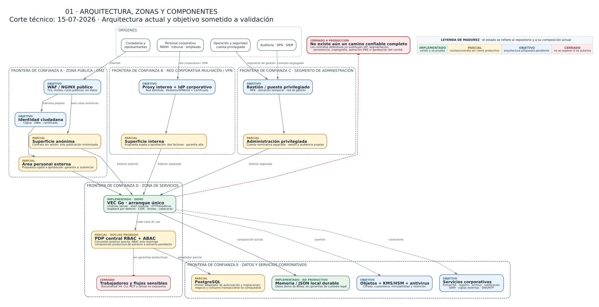
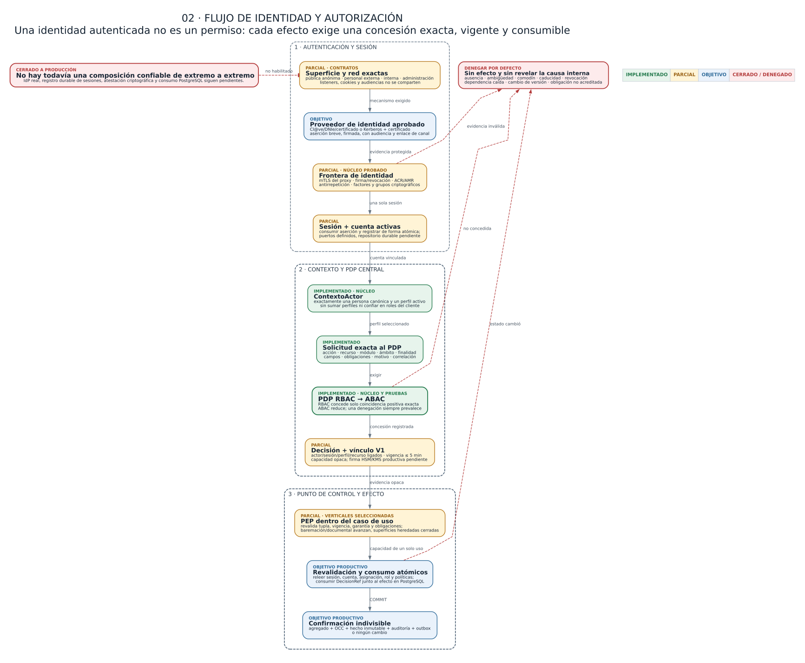
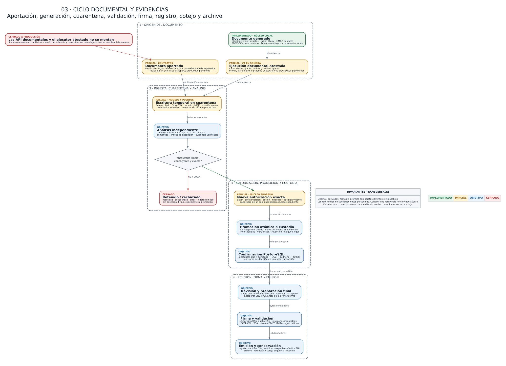
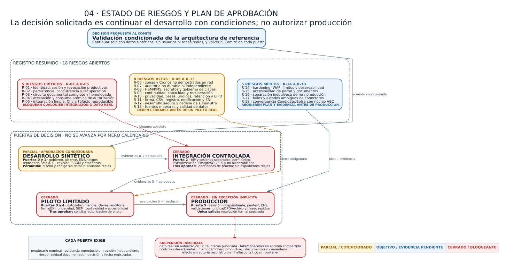

# Informe para la validación de la arquitectura y del enfoque de seguridad del Portal VEC

**Organización:** Diputación de Granada<br>
**Sistema:** Portal VEC — Ventanilla Electrónica del Empleado Público<br>
**Versión del informe:** 0.1 — borrador para revisión<br>
**Fecha de corte:** 15 de julio de 2026<br>
**Clasificación propuesta:** uso interno / información de proyecto<br>
**Estado del sistema evaluado:** prototipo y desarrollo activo; no apto para producción ni para datos personales reales

## Control del documento

| Campo | Valor |
| --- | --- |
| Finalidad | Facilitar una decisión temprana del Comité de Seguridad sobre la arquitectura prevista y las condiciones para continuar el desarrollo. |
| Decisión solicitada | Validación condicionada de la dirección arquitectónica, no autorización de puesta en producción. |
| Elaboración | Borrador técnico preparado a partir de evidencias del repositorio; autoría institucional pendiente de asignación. |
| Revisión y aprobación | Pendientes de los responsables de Seguridad, Protección de Datos, Arquitectura/Sistemas y del Comité de Seguridad. |
| Base técnica observada | Repositorio `VEC_Diputacion_app`, rama `vec-orquesta-20260619`; revisión iniciada en `68854c0` y último *checkpoint* de código anterior a esta emisión: `c1b42bc`, más un árbol de trabajo amplio y en desarrollo. |
| Evidencia principal | Código fuente Go, configuración, migraciones y documentación técnica del repositorio. |
| Exclusiones | Auditoría ENS, análisis jurídico, EIPD, pentest, revisión criptográfica independiente, auditoría de accesibilidad, homologación de productos y validación de infraestructura real. |
| Próxima revisión | Al cerrar los bloqueantes P0 y antes de conectar una identidad, red, base de datos o documento real. |

## 1. Resumen ejecutivo

El Portal VEC se está diseñando como una plataforma modular para servicios de personal, nóminas, control horario, dietas y procesos de Bolsa. La dirección técnica es razonable para continuar: núcleo común, módulos desacoplados, arquitectura hexagonal, autorización central con denegación por defecto, separación prevista de superficies, contratos de auditoría y puertos intercambiables para persistencia e integraciones.

La implementación actual no constituye, sin embargo, un sistema desplegable con información real. Conviven componentes funcionales de demostración, repositorios en memoria o fichero, contratos de seguridad avanzados todavía no conectados y especificaciones de infraestructura pendientes de implantación. La autenticación disponible es exclusivamente de laboratorio; el adaptador PostgreSQL existente cubre una primera barrera de autorización, no la persistencia integral del negocio; y los flujos productivos de almacenamiento, antivirus, firma, registro, notificación, archivo y continuidad siguen cerrados.

Además, ejecuciones puntuales de `go test ./...` sobre el árbol de trabajo activo del 15 de julio de 2026 no terminaron correctamente mientras avanzaban cambios concurrentes: se observaron una entrada de `go.sum` pendiente para una dependencia transitiva y símbolos V4 aún incompletos. El *checkpoint* limpio `c1b42bc` sí superó la suite Go completa. Por ello, el hallazgo se acota al trabajo no consolidado, que no puede integrarse ni usarse como evidencia de entrega hasta recuperar esa línea verde.

Se propone que el Comité adopte la siguiente decisión:

> **Aprobar de forma condicionada la continuidad del desarrollo y la arquitectura de referencia, exclusivamente con datos sintéticos y sin exposición productiva, sujeta al cierre verificable de los riesgos críticos y altos de este informe.**

Esta decisión no significaría:

- conformidad con el Esquema Nacional de Seguridad (ENS) ni asignación de categoría;
- aprobación jurídica, de protección de datos o de interoperabilidad;
- permiso para usar datos personales reales;
- autorización para exponer el portal en Internet, Mulhacén/VPN o un segmento de administración;
- homologación de PostgreSQL, almacenamiento, criptografía, AutoFirma, antivirus o conectores externos;
- aceptación del sistema para pruebas piloto con personas usuarias reales.

## 2. Objeto y decisión solicitada

### 2.1 Objeto

El objetivo es revisar de forma temprana si la estructura del sistema permite implantar controles de seguridad suficientes sin rehacer el producto y señalar qué garantías faltan antes de ampliar funcionalidad o incorporar datos reales.

La revisión se centra en:

- límites de confianza y separación de zonas;
- estructura hexagonal y aislamiento de módulos;
- identidad, sesión y autorización;
- tratamiento de documentos y expedientes;
- persistencia, transacciones y conectores;
- auditoría, evidencias y trazabilidad;
- operación, continuidad y cadena de suministro;
- brechas, responsables propuestos y puertas de aprobación.

### 2.2 Decisión que se pide al Comité

Se solicita pronunciamiento sobre cuatro puntos:

1. aceptar o corregir la arquitectura de referencia antes de que se convierta en una dependencia costosa;
2. aprobar la separación entre portal exterior, portal interno y administración privilegiada;
3. confirmar que la plataforma transversal P0 debe completarse antes de ampliar módulos de negocio;
4. fijar responsables y evidencias obligatorias para levantar cada bloqueo.

La opción recomendada es una **aprobación condicionada para continuar el desarrollo**, con revisión de seguridad en cada puerta indicada en la sección 15.

## 3. Alcance, método y limitaciones

### 3.1 Alcance técnico revisado

- ejecutables `cmd/vec-server` y el centinela retirado `cmd/bolsa-server`;
- composición y servidor en `internal/app`;
- núcleo VEC en `internal/vec`;
- vertical heredada de candidatos y Bolsa en `internal/candidate`;
- módulos `personal`, `cronos`, `dietas`, `bolsa` y `administracion`;
- frontend estático en `web/static`;
- configuración y despliegue local con Go y contenedores;
- primer adaptador y migraciones PostgreSQL de autorización;
- documentación de arquitectura, permisos, autenticación, persistencia, documentos, firma y brechas.

### 3.2 Método

La valoración se basa en inspección de código y documentación, listado de paquetes, estado Git y una ejecución local de la suite Go. Se ha contrastado el marco general con las fuentes oficiales del [ENS](https://www.boe.es/eli/es/rd/2022/05/03/311/con), el [ENI](https://www.boe.es/eli/es/rd/2010/01/08/4/con) y las [orientaciones de la AEPD para Administraciones públicas](https://www.aepd.es/areas-de-actuacion/administraciones-publicas/guias-informes-y-documentos).

### 3.3 Limitaciones de esta revisión

No se ha dispuesto de:

- inventario de activos aprobado ni categorización ENS;
- arquitectura de red real, reglas de cortafuegos o configuración de proxies;
- proveedor corporativo de identidad, HSM/KMS, gestor de secretos o PKI;
- sistemas corporativos de registro, archivo, notificación, firma o antivirus;
- datos, contratos, SLAs, RTO/RPO o procedimientos de operación aprobados;
- un artefacto de versión cerrado, reproducible y desplegado en un entorno representativo;
- pruebas independientes de penetración, rendimiento, accesibilidad o recuperación.

Por tanto, este documento evalúa una **dirección arquitectónica y su grado de implementación**, no la seguridad efectiva de un servicio desplegado.

## 4. Alcance funcional y tipos de información previstos

VEC aspira a reunir servicios con niveles de sensibilidad distintos:

| Área | Funciones previstas | Información potencial |
| --- | --- | --- |
| Bolsa | convocatorias, solicitudes, méritos, baremación, alegaciones, listados y llamamientos | identificación, contacto, méritos, documentación acreditativa, resultados y actuaciones administrativas |
| Personal y nóminas | expediente del empleado, puesto, situaciones, antigüedad, certificados y recibos | datos laborales, económicos, fiscales y administrativos |
| Cronos | fichajes, jornada, permisos, ausencias, saldos, cuadrantes y, en su caso, geolocalización | hábitos, presencia, relaciones jerárquicas y posibles categorías de especial riesgo |
| Dietas | comisiones, kilometraje, justificantes, aprobación y liquidación | desplazamientos, importes, cuentas y evidencias de gasto |
| Administración | roles, catálogos, integraciones, operación y auditoría | configuración sensible, evidencias técnicas y referencias de seguridad |

Esta diversidad impide tratar VEC como una única zona homogénea. Cronos y las funciones privilegiadas requieren una segregación más fuerte que la zona pública. La categorización final y las medidas aplicables deberán determinarse formalmente; este informe no presume categoría ENS alguna.

## 5. Estado actual frente a arquitectura objetivo

Para evitar equiparar documentación con garantía efectiva, el informe usa estas categorías:

- **diseñado:** existe una decisión o especificación revisable;
- **implementado:** existe código, configuración o migración, aunque pueda no estar conectado;
- **verificado:** existe una prueba reproducible sobre una versión cerrada y un entorno definido;
- **operativo:** está desplegado, monitorizado, gobernado y sujeto a procedimientos aprobados.

Una capacidad puede estar diseñada e implementada sin estar verificada ni operativa. Ninguna de las capacidades críticas se considera operativa en producción en este informe.

| Capacidad | Estado observado | Arquitectura objetivo | Valoración |
| --- | --- | --- | --- |
| Shell modular | Existe registro de módulos, menús, API y frontend estático. | Carcasa común con identidad, contexto autenticado, navegación, i18n, documentos, notificaciones y auditoría. | Base útil; falta cerrar contrato productivo y despliegue. |
| Dominio y casos de uso | Amplio modelo Go con pruebas unitarias en múltiples paquetes. | Reglas puras e independientes de HTTP, base de datos y proveedores. | Dirección adecuada; el árbol activo no es una versión estable. |
| Autenticación | `disabled` por defecto; `fake` y `trusted_headers` limitados a laboratorio. | Certificado/Cl@ve para exterior; AD/Kerberos y autenticación reforzada para interior; cuentas separadas para privilegio. | Bloqueante productivo. |
| Contexto de actor | Existen modelo y resolución canónica en memoria, con denegación ante ambigüedad. | Fuente corporativa durable que enlace cuenta, persona, perfil y representaciones. | Parcial; no conectado a una fuente autoritativa real. |
| Autorización | Núcleo RBAC+ABAC de lista positiva y pruebas adversarias. | PDP central, decisión exacta y atestada, revalidada y consumida atómicamente con el efecto. | Diseño fuerte; atestación y consumo productivo incompletos. |
| Persistencia | Memoria por defecto, fichero durable opt-in para Bolsa y primer adaptador PostgreSQL de autorización aislado. | PostgreSQL por módulo/superficie, RLS, transacciones, migraciones, outbox, copias y restauración. | No existe persistencia productiva completa. |
| Documentos | Puertos, dominio, generación PDF/DOCX y adaptadores de prueba en memoria. | Almacén cifrado, cuarentena, antivirus, metadatos ENI, firma, sello, CSV, registro, archivo y recuperación. | Contratos avanzados; flujo productivo cerrado. |
| Auditoría | Modelos encadenados y confirmaciones atómicas en adaptadores de memoria. | Registro durable, append-only, firma/sello, exportación, retención y copia en dominio separado. | No probatoria en el despliegue actual. |
| Integraciones | Puertos y stubs; OSRM opcional bajo lista positiva. | Conectores corporativos homologados, identidades técnicas separadas, mTLS, outbox y reconciliación. | Pendiente. |
| Zonas de red | Especificadas documentalmente; escucha local por defecto. | Entradas, audiencias, credenciales, datos y operación segregados. | No demostrada en infraestructura. |
| Operación | Docker local, health y configuración inicial. | observabilidad, SIEM, secretos, hardening, vulnerabilidades, capacidad, continuidad y respuesta. | Bloqueante antes de piloto real. |
| Calidad | Existe una suite extensa; `c1b42bc` supera `go test ./...` en limpio. | CI obligatoria, artefacto reproducible, revisión, SAST/SCA, pruebas de integración y gates. | El árbol activo no está verde y aún no existe CI ni artefacto reproducible. |

## 6. Arquitectura lógica: núcleo hexagonal y módulos

La aplicación sigue un patrón de puertos y adaptadores. La intención es que las reglas administrativas no dependan de HTTP, PostgreSQL, S3, AutoFirma o un proveedor de identidad concreto.

### 6.1 Capas

| Capa | Responsabilidad | Restricción de seguridad |
| --- | --- | --- |
| Dominio | entidades, invariantes, estados, baremos, documentos, decisiones y validaciones | no confiar en cabeceras, rutas, variables de entorno ni datos de proveedor |
| Aplicación/casos de uso | coordinar operaciones y solicitar autorización, repositorios, auditoría y eventos | una superficie nueva no puede eludir el mismo caso de uso protegido |
| Puertos | contratos mínimos para identidad, autorización, persistencia, documentos, firma, reloj, auditoría y conectores | expresar capacidades, no productos; fallo o capacidad ausente debe cerrar la operación |
| Adaptadores | HTTP, memoria, fichero, PostgreSQL, PDF/DOCX y futuros proveedores | validar transporte y traducir errores sin ampliar autoridad ni filtrar información |
| Composición | seleccionar configuración y conectar implementaciones | ningún modo de demostración debe activarse accidentalmente en un perfil productivo |

### 6.2 Componentes principales observados

- `internal/vec/domain`: tipos y reglas transversales del portal.
- `internal/vec/application`: autorización, contexto de actor, documentos, cargas, catálogos, flujos, cotejo y otros casos de uso.
- `internal/vec/ports`: contratos de repositorio, auditoría, almacenamiento, atestación y conectores.
- `internal/vec/adapters/httpapi` y `httpseguridad`: superficie HTTP y controles de frontera.
- `internal/vec/adapters/memory`: adaptadores de demostración y pruebas.
- `internal/vec/adapters/postgres`: primera barrera durable de autorización, todavía no montada como persistencia de producto.
- `internal/candidate`: vertical heredada de candidatos/Bolsa que debe converger con el núcleo común.
- `internal/modules/*`: módulos funcionales conectados mediante manifiestos y puertos.
- `internal/app/bootstrap`: composición; punto crítico para impedir conexiones inseguras.
- `web/static`: interfaz estática; no debe ser fuente de autoridad ni almacenar datos reales como sistema de registro.

### 6.3 Modelo modular

El shell VEC pretende ser dueño de identidad, sesión, navegación, i18n y capacidades transversales. Cada módulo es dueño de su dominio y casos de uso, pero no de un login, un sistema de permisos o un almacenamiento documental alternativos.

La separación evita duplicar controles, aunque introduce un riesgo de concentración: un fallo en el núcleo transversal afectaría a todos los módulos. Por ello, el contrato de módulo debe exigir como mínimo pruebas de autorización, auditoría, salud, documentos, eventos y aislamiento de datos.

> **Figura 1 — Arquitectura, zonas y componentes.** La leyenda diferencia
> capacidades implementadas, parciales, objetivo y cerradas a producción.



## 7. Zonas de confianza y separación exterior/interior

La arquitectura objetivo contempla superficies distintas que comparten código y casos de uso, pero no confianza implícita.

### 7.1 Zona exterior

Se divide en:

- zona anónima, solo para información expresamente publicable;
- área personal autenticada para el titular o representante acreditado;
- entrada pública mediante WAF/proxy y proveedor de identidad admitido;
- API exterior con audiencia, credencial explícita por petición, límites y
  credenciales técnicas propias.

Una persona empleada que acceda como aspirante no obtiene por ello funciones internas. La titularidad y representación deben resolverse en el servidor.

### 7.2 Zona interna de empleado y gestión

Se prevé para Mulhacén o VPN corporativa autorizada mediante aplicación de
escritorio, con pasarela interna, mTLS del dispositivo, AD/Kerberos y
autenticación reforzada. Debe disponer de listener, DNS, certificado, audiencia,
API y pool de base de datos distintos de la superficie exterior. No usa cookies
de sesión: la aserción breve se presenta explícitamente en cada petición y no se
persiste en almacenamiento web.

La aplicación interna de escritorio no se ejecuta en un contexto web entre
sitios. Los clientes web autorizados usan `Authorization` explícita y
`credentials: "omit"`; bajo ese contrato el navegador no adjunta credenciales
ambientales susceptibles de CSRF. CORS y la validación de origen se mantienen
como defensa en profundidad; XSS continúa siendo una amenaza para cualquier
cliente web exterior. Si un futuro navegador negocia Kerberos/SPNEGO o presenta
mTLS automáticamente, esas credenciales pueden ser ambientales y deberán
reevaluarse CSRF y origen antes de habilitar la superficie.

La red interna autentica el origen técnico, pero no concede un expediente ni una acción. Cada operación sigue necesitando autorización por perfil, unidad, relación, recurso, finalidad, campos y vigencia.

### 7.3 Administración privilegiada

Debe quedar fuera del contexto autenticado ordinario de RRHH. Requiere cuenta
nominativa distinta, puesto o bastión administrado, elevación temporal,
reautenticación, doble control cuando proceda y auditoría en un destino que el
administrador no pueda alterar.

No se prevé un superadministrador funcional universal. Operar despliegues, base de datos o claves no concede acceso ordinario a expedientes.

### 7.4 Enclave Cronos

La especificación propone para Cronos una segregación reforzada: sin rutas desde Internet, con base, almacenamiento, copias, secretos, audiencia, telemetría y servicios cartográficos propios. Esa topología es todavía una decisión de diseño, no una infraestructura demostrada.

### 7.5 Regla de interconexión

Todo flujo entre zonas deberá estar inventariado con origen, destino, protocolo, identidad técnica, datos, finalidad, cifrado, autenticación, límites, registro y responsable. La ausencia de un flujo aprobado debe equivaler a ausencia de ruta.

## 8. Flujo de identidad, sesión y autorización

### 8.1 Flujo objetivo

1. La persona entra por una superficie concreta.
2. El proveedor de identidad autentica mediante el mecanismo aprobado para esa superficie.
3. La aplicación valida una aserción de vida corta, audiencia exacta y protección antirrepetición, o un certificado de cliente verificado directamente.
4. Se resuelve una única persona canónica y una cuenta concreta; no se usa el DNI como clave técnica.
5. Se selecciona un único perfil activo. Los perfiles no suman permisos.
6. Se resuelven vínculos vigentes con empleado, aspirante, representante, unidad o nombramiento.
7. El caso de uso formula una solicitud de autorización completa.
8. El PDP central devuelve denegación o una concesión positiva, exacta, breve y vinculada al contexto.
9. Antes de un efecto administrativo, la decisión se revalida y consume en la misma transacción que negocio, auditoría y outbox.
10. El resultado y las denegaciones relevantes se registran con datos minimizados.

### 8.2 Estado actual

- El modo normal parte con autenticación deshabilitada.
- `fake` exige loopback, fichero local restrictivo y token opaco; es solo una herramienta de desarrollo.
- `trusted_headers` no debe considerarse autenticación productiva sin una aserción criptográfica y un canal confiable.
- Existe modelo de contexto de actor, pero no una fuente corporativa durable conectada.
- No están integrados Cl@ve, certificado/DNIe, AD/Kerberos, MFA, representación ni revocación corporativa.

> **Figura 2 — Flujo de identidad y autorización.** Una identidad autenticada
> no concede por sí sola un permiso: cada efecto requiere una decisión exacta.



## 9. Modelo de autorización RBAC + ABAC

### 9.1 Principio rector

La autoridad crece de menos a más. La ausencia, ambigüedad, caducidad, error, dependencia no disponible o valor desconocido deniega. No hay comodines positivos, herencia de autoridad, suma de perfiles ni permiso implícito por estar en un menú o grupo de Active Directory.

### 9.2 Tupla mínima de decisión

Cada caso de uso debe comprobar, según proceda:

- superficie y sesión;
- identidad efectiva y persona representada;
- perfil activo y versión de rol;
- módulo y acción exacta;
- tipo, referencia y huella del recurso;
- ámbito: organismo, unidad, convocatoria, fase, lote, expediente, periodo o relación;
- finalidad;
- garantía y antigüedad de autenticación;
- campos permitidos;
- obligaciones: firma, motivación, doble control, registro o reautenticación;
- vigencia de asignación, políticas y catálogos.

RBAC es una condición necesaria. ABAC solo puede reducir la concesión, no crearla. Las restricciones concurrentes se combinan de forma restrictiva.

### 9.3 Defensa en profundidad PostgreSQL

El diseño prevé:

- identidades técnicas separadas por módulo y superficie;
- revocación de privilegios generales;
- cuentas de ejecución sin propiedad, `SUPERUSER` ni `BYPASSRLS`;
- seguridad por filas y control de columnas;
- contexto local por transacción, nunca estado residual del pool;
- auditoría y hechos probatorios de solo adición;
- consumo único e idempotencia.

PostgreSQL no sustituye al PDP. Su función es limitar el impacto de un fallo posterior y conservar atomicidad, concurrencia e invariantes.

### 9.4 Brecha principal

El adaptador durable actual puede comprobar la coherencia de asignación, rol y catálogo, pero la atestación criptográfica completa de la decisión y su consumo dentro de cada repositorio de negocio no están terminados ni aprobados. En consecuencia, el adaptador permanece correctamente aislado de la composición productiva.

## 10. Flujo documental, firma y expediente

### 10.1 Documentos aportados

El flujo objetivo para una carga es:

```text
reserva -> preparación -> recepción en cuarentena -> análisis
                                                |
                                                +-> error/sospechoso: retenido
                                                +-> limpio: nueva autorización
                                                            -> promoción
                                                            -> incorporación
```

Las operaciones de preparar, confirmar, analizar y promover son capacidades diferentes. Un documento no analizado no debe descargarse, firmarse ni incorporarse al expediente. Original, derivados, firmas y evidencias son objetos distintos e inmutables.

### 10.2 Documentos generados

La generación prevista parte de una plantilla versionada y publicada, fusiona datos de forma estricta, genera una o varias representaciones, valida estructura y contenido, calcula huellas y almacena referencias opacas. Firma, sello de tiempo, registro, CSV y archivo son pasos posteriores y separados.

La implementación actual incluye dominio, puertos y salidas funcionales PDF/DOCX para pruebas. No acredita PDF/A, PDF/UA, preservación, firma válida, registro ni expediente ENI.

### 10.3 Firma, CSV y cotejo

La arquitectura reserva el CSV antes de renderizar la versión que se firma; el código solo se activa después de completar firma, validación y registro. El QR sería únicamente una vía de acceso al cotejo, no una prueba de autenticidad. La posesión de un CSV tampoco debe convertir automáticamente un documento protegido en público.

AutoFirma se prevé como adaptador, no como archivo central ni fuente de autorización. Cada revisión firmada debe validarse y custodiarse antes de habilitar la siguiente.

### 10.4 Estado productivo

El único adaptador de almacenamiento conectado es de memoria y declara que no cifra ni ofrece un perfil productivo. No existen todavía un almacén persistente homologado, cifrado por objeto, KMS/HSM, antivirus corporativo, reconciliación, firma, sello, registro, notificación o archivo conectados.

> **Figura 3 — Ciclo documental y evidencias.** El diagrama diferencia los
> contratos existentes de los servicios productivos que continúan pendientes.



## 11. Persistencia, datos y conectores

### 11.1 Persistencia observada

- memoria como opción predeterminada del prototipo;
- persistencia local por fichero disponible para determinadas funciones de Bolsa;
- adaptadores de memoria para capacidades transversales;
- migraciones y adaptador PostgreSQL limitados a autorización;
- ausencia de una base de datos integral y productiva para personas, expedientes, documentos, auditoría y módulos.

La memoria y los ficheros locales son adecuados para pruebas acotadas, no para concurrencia, recuperación, integridad jurídica o explotación con datos reales.

### 11.2 Arquitectura de datos objetivo

Se propone que cada operación relevante confirme de forma atómica:

```text
agregado + control optimista de versión + hecho inmutable + auditoría + outbox
```

Las llamadas remotas no deben ejecutarse dentro de una transacción SQL abierta. Se registra primero una intención durable; un trabajador con identidad propia procesa la operación de forma idempotente y reconcilia respuestas ambiguas.

Los binarios documentales no se guardarían en PostgreSQL. La base conservaría metadatos, referencias opacas, huellas, estados, versiones y evidencias; el contenido residiría en un almacén cifrado y gobernado.

### 11.3 Conectores previstos

| Conector | Uso | Estado |
| --- | --- | --- |
| Identidad exterior | Cl@ve, DNIe/certificado y representación | no conectado |
| Identidad interior | AD/Kerberos, certificado/MFA y ciclo de cuentas | no conectado |
| PostgreSQL | negocio, autorización, RLS, auditoría y outbox | autorización parcial y aislada |
| Almacenamiento de objetos | cuarentena, contenido admitido, retención y recuperación | puerto y memoria de pruebas |
| Antivirus/análisis | detección o desarme de contenido | puerto; sin proveedor productivo |
| Firma/validación/TSA | firma de personas, sello de órgano y tiempo | especificado; sin integración productiva |
| Registro/archivo/ENI | asiento, expediente, conservación e intercambio | pendiente |
| Notificaciones | puesta a disposición, acceso, rechazo y vencimiento | pendiente |
| OSRM/cartografía | cálculo de rutas para Dietas | opcional y restringido; no habilitado por defecto |
| Sistemas de personal/nómina | fuentes maestras corporativas | pendientes de decisión |
| SIEM/SOC | vigilancia, correlación y conservación | pendiente |

Cada conector deberá declarar versión, capacidades, identidad técnica, red, cifrado, límites, errores, salud, auditoría, idempotencia y procedimiento de sustitución.

## 12. Auditoría, evidencias y observabilidad

Se deben mantener separadas tres trazabilidades relacionadas:

1. **Expediente administrativo:** actuaciones, documentos, firmas, registros, notificaciones y resoluciones.
2. **Auditoría funcional y de seguridad:** actor, perfil, autorización, finalidad, recurso, acción, resultado, motivo y huellas.
3. **Telemetría técnica:** métricas, trazas, errores y rendimiento, con datos personales minimizados.

El código contiene modelos de auditoría encadenada y contratos que unen cambio, auditoría y evento en adaptadores de memoria. Estas medidas son una base de diseño, pero no equivalen a una evidencia durable frente a un operador que controle el almacenamiento.

Antes de producción se requiere:

- repositorio append-only y acceso segregado;
- fecha confiable y política de retención;
- firma, sello o anclaje de integridad aprobado;
- envío a un dominio de auditoría distinto;
- consultas justificadas y auditadas;
- exportación con manifiesto y cadena de custodia;
- registro de denegaciones sin convertirlas en capacidades ejecutables;
- alertas sobre accesos masivos, cambios de permisos, exportaciones, elevaciones y fallos de integridad;
- pruebas de restauración de negocio, objetos, claves y auditoría como un conjunto coherente.

## 13. Amenazas relevantes

La validación debe considerar, al menos:

- suplantación mediante cabeceras, tokens de demostración o certificados no verificados;
- acceso horizontal a expedientes de otra persona y acceso vertical por rol amplio;
- mezcla de audiencias, credenciales o perfiles exterior, interior y
  privilegiado;
- revocación concurrente entre autorización y escritura;
- alteración o repetición de una decisión de autorización;
- inyección SQL, de plantillas, documentos activos o contenido hostil;
- malware en documentos y bypass de cuarentena;
- manipulación de baremos, listados, firmas, CSV o historial;
- extracción masiva, exportaciones no justificadas y abuso interno;
- fuga de datos a logs, navegador, correo, telemetría o conectores;
- compromiso de cuenta técnica, secreto, clave de firma o cadena de suministro;
- pérdida, corrupción o indisponibilidad en periodos de plazo administrativo;
- respuesta ambigua de conectores que produzca duplicados o estados falsos;
- dependencia de un proveedor sin capacidad equivalente o recuperación ensayada;
- exposición accidental de Cronos o de rutas internas en la entrada pública.

El modelo de amenazas formal deberá asociar cada escenario con activo, atacante, probabilidad, impacto, control, riesgo residual y responsable.

## 14. Registro de riesgos y brechas

### 14.1 Escala utilizada

- **Crítica:** impide conectar datos o usuarios reales; un fallo podría comprometer autoridad, confidencialidad o integridad administrativa.
- **Alta:** debe cerrarse antes de un piloto real o de conectar una zona corporativa.
- **Media:** no invalida el diseño, pero requiere plan y evidencia antes de producción.
- **Baja:** mejora de defensa, operación o mantenibilidad a programar y verificar.

Los propietarios indicados son una propuesta; el Comité deberá asignar personas o unidades nominales y fechas.

| ID | Severidad | Riesgo/brecha | Control o decisión existente | Acción/evidencia de cierre | Propietario propuesto | Evidencia de origen |
| --- | --- | --- | --- | --- | --- | --- |
| R-01 | Crítica | No existe autenticación productiva ni ciclo de sesión/revocación corporativo. | `disabled` por defecto y `fake` restringido a loopback. | Diseño aprobado, integración real, MFA según riesgo, revocación, pruebas de suplantación y separación de superficies. | Sistemas + Seguridad + Identidad corporativa | `config/config.go`; `docs/portal_vec/autenticacion_fake_local_segura.md` |
| R-02 | Crítica | La persistencia principal sigue en memoria/fichero y no soporta garantía integral, concurrencia ni recuperación. | Puertos de repositorio y primer adaptador PostgreSQL de autorización. | Esquema productivo, migraciones, privilegios, RLS, transacciones, backup/PITR y restauración ensayada. | Arquitectura + DBA + Operación | `internal/vec/adapters/memory`; `internal/candidate/adapters/repository`; `deploy/postgresql/autorizacion` |
| R-03 | Crítica | El circuito documental productivo no está conectado: cifrado, cuarentena, antivirus, firma, registro, archivo y recuperación. | Puertos, estados cerrados y adaptador de memoria que declara capacidades limitadas. | Adaptadores homologados, pruebas de contrato, malware, caída, reconciliación, retención y restauración completa. | Sistemas + Seguridad + Archivo + Secretaría | `docs/portal_vec/almacen_documental_seguro.md`; `internal/vec/ports/almacen_objetos.go` |
| R-04 | Crítica | Una decisión de autorización todavía no está atestada y consumida atómicamente con cada efecto productivo. | PDP de lista positiva, CAS PostgreSQL y diseño de atestación. | Aprobar perfil criptográfico, HSM/KMS, verificación independiente, vectores Go/SQL, consumo único y pruebas de mutación/replay. | Seguridad + Arquitectura + DBA + Custodia de claves | `docs/portal_vec/atestacion_criptografica_decisiones.md` |
| R-05 | Crítica | El *checkpoint* limpio compila y supera pruebas, pero el árbol activo no es integrable y no existe una línea de CI ni un artefacto reproducible. | Suite extensa y `go test ./...` verde en `c1b42bc`. | Integrar por lotes los cambios activos, resolver dependencia y símbolos V4 antes de incorporarlos, exigir CI verde, artefacto por digest, revisión y etiqueta de versión. | Desarrollo + Responsable de entrega | Ejecuciones `go test ./...` del 15-07-2026 sobre `c1b42bc` y el árbol activo |
| R-06 | Alta | Separación exterior, interior, privilegiada y Cronos definida, pero no demostrada en red o despliegue. | Escucha local por defecto y documentos de zonificación. | Diagramas aprobados, reglas de flujo, listeners, gateways, audiencias, pruebas de no alcanzabilidad y revisión de configuración. | Redes + Sistemas + Seguridad | `docs/estudio_requisitos/acceso_interno_tecnicos_administracion.md`; `docs/estudio_requisitos/seguridad_y_despliegue_cronos.md` |
| R-07 | Alta | Auditoría funcional no durable ni independiente; no es todavía evidencia probatoria. | Modelos encadenados y contratos atómicos en memoria. | Repositorio append-only, sello/anclaje, SIEM, retención, exportación, accesos segregados y restauración. | Seguridad + Operación + Secretaría | `internal/candidate/domain/audit.go`; `internal/vec/ports` |
| R-08 | Alta | No hay HSM/KMS, gestor de secretos ni gobierno de claves implantado. | Separación conceptual de claves, referencias y puertos. | Selección aprobada, inventario, custodia, rotación, revocación, doble control, backup y recuperación. | Custodio de claves + Seguridad + Sistemas | `docs/portal_vec/atestacion_criptografica_decisiones.md`; `docs/portal_vec/almacen_documental_seguro.md` |
| R-09 | Alta | No se ha demostrado continuidad, capacidad ni recuperación en último día de plazo o ante ransomware. | Diseño de outbox e idempotencia; requisitos documentados. | BIA, RTO/RPO, pruebas de carga, copias inmutables, segundo dominio y simulacros completos. | Continuidad + Operación + Responsables del servicio | `docs/estudio_requisitos/brechas_para_producto_profesional.md` |
| R-10 | Alta | Tratamientos, bases jurídicas, minimización, retención, derechos y EIPD no están aprobados. | Privacidad por diseño en referencias opacas y minimización de logs. | RAT, análisis de riesgos de privacidad, EIPD cuando proceda, política de conservación y validación del DPD. | Responsable del tratamiento + DPD + RRHH | `docs/portal_vec/cumplimiento_y_seguridad.md` |
| R-11 | Alta | Firma, sello, CSV, registro, notificación y expediente ENI son especificaciones, no integraciones validadas. | Modelos y flujos inmutables definidos. | Conectores reales, política de firma, metadatos, validación, cotejo, exportación y pruebas jurídicas/técnicas. | Secretaría + Archivo + Sistemas + Asesoría | `docs/portal_vec/firma_csv_qr_y_cotejo.md`; `docs/portal_vec/capacidad_documental.md` |
| R-12 | Alta | Falta un proceso demostrable de desarrollo seguro y cadena de suministro. | Versiones y digests previstos; pruebas unitarias existentes. | Ramas protegidas, revisión, SAST/SCA, secretos, SBOM, firma de artefactos, parcheo, política de vulnerabilidades y pentest. | Desarrollo + Seguridad | `Dockerfile`; `go.mod`; `docs/estudio_requisitos/brechas_para_producto_profesional.md` |
| R-13 | Alta | Fuentes maestras de persona, puesto, nómina, jornada y representación no están acordadas ni conectadas. | Contexto de actor canónico y referencias opacas. | Decisión de autoridad de datos, reconciliación, calidad, deduplicación, rectificación y trazabilidad. | RRHH + Sistemas + DPD | `internal/vec/domain/contexto_actor.go`; `docs/portal_vec/registro_decisiones.md` |
| R-14 | Media | Observabilidad, límites, cabeceras, CORS/origen, defensa XSS, rate limiting y hardening productivo incompletos. | Timeouts y restricciones locales iniciales. | Perfil de despliegue endurecido, WAF, límites por operación, métricas, alertas y pruebas de abuso. | Operación + Seguridad + Desarrollo | `internal/app/server`; `config`; `docs/estudio_requisitos/brechas_para_producto_profesional.md` |
| R-15 | Media | Accesibilidad del portal y de documentos no está auditada. | Requisitos UI y generación funcional PDF/DOCX. | Auditoría EN 301 549/WCAG aplicable, pruebas con ayudas técnicas y corrección; perfil documental accesible. | Producto + Desarrollo + Unidad de accesibilidad | `docs/portal_vec/cumplimiento_y_seguridad.md`; `web/static` |
| R-16 | Media | Datos y comportamientos de demostración podrían confundirse con fuentes productivas. | Modos explícitos y documentación de límites. | Artefactos/configuraciones separados, prohibición de datos reales, banner de entorno y pruebas que impidan activar demos. | Desarrollo + Operación | `README.md`; `docs/portal_vec/autenticacion_fake_local_segura.md` |
| R-17 | Media | Conectores externos son stubs o decisiones pendientes; un error remoto puede dejar estado ambiguo. | Puertos, outbox e idempotencia previstos. | Contrato por conector, identidades técnicas, reintento seguro, reconciliación, circuit breaker, salud y simulación de fallos. | Arquitectura + Sistemas + Propietario de cada integración | `internal/vec/ports`; `docs/estudio_requisitos/brechas_para_producto_profesional.md` |
| R-18 | Media | El módulo heredado de candidatos/Bolsa y el núcleo VEC pueden mantener modelos o controles divergentes. | Integración gradual y contratos comunes. | Plan de convergencia, eliminación de rutas alternativas y pruebas comunes de autorización/auditoría. | Arquitectura + Desarrollo | `internal/candidate`; `internal/vec`; `cmd/bolsa-server` |

> **Figura 4 — Riesgos y plan de aprobación.** El avance depende de evidencias
> aprobadas en cada puerta, no del calendario ni de un porcentaje de desarrollo.



## 15. Plan de aseguramiento y puertas de decisión

### Puerta 0 — Gobierno y alcance

**Objetivo:** convertir el proyecto en un sistema delimitado y gobernado.

Evidencias mínimas:

- responsables de información, servicio, seguridad, sistema, tratamiento y módulos;
- inventario de activos, datos, servicios, dependencias y terceros;
- categorización ENS y valoración por dimensiones;
- análisis de riesgos inicial y plan de tratamiento;
- tratamientos, bases jurídicas, participación del DPD y decisión sobre EIPD;
- alcance exacto de zonas exterior, interior, privilegiada y Cronos;
- RTO, RPO, disponibilidad y periodos críticos.

**Resultado permitido:** continuar diseño y desarrollo con datos sintéticos.

### Puerta 1 — Línea base de desarrollo seguro

**Objetivo:** disponer de un artefacto reproducible y evaluable.

Evidencias mínimas:

- repositorio limpio y cambios divididos en commits revisables;
- CI obligatoria con `go test ./...`, carrera, análisis estático y de dependencias;
- SBOM, escaneo de secretos e imágenes por digest;
- ramas protegidas y revisión por otra persona;
- separación inequívoca de perfiles demo, prueba y producción;
- modelo de amenazas inicial y casos negativos automatizados.

**Resultado permitido:** construir una versión candidata de integración sin datos reales.

### Puerta 2 — Identidad, zonas y autorización

**Objetivo:** demostrar que toda operación parte de una identidad y una concesión válidas.

Evidencias mínimas:

- IdP exterior e interior aprobados, con audiencias y credenciales separadas y
  sin cookies de sesión;
- perfil único, representación, ciclo de alta/baja y cuentas privilegiadas;
- PDP central con matriz validada por propietarios funcionales;
- atestación de decisiones y consumo transaccional de un primer efecto;
- pruebas de acceso horizontal/vertical, replay, revocación concurrente y fallo de dependencias;
- PostgreSQL con identidades técnicas, privilegios y RLS verificados;
- pruebas de que Internet no alcanza APIs internas ni Cronos.

**Resultado permitido:** integración controlada con identidades de prueba; aún sin expedientes reales.

### Puerta 3 — Datos, documentos y expediente

**Objetivo:** custodiar y reproducir cada actuación sin confiar en memoria o ficheros de aplicación.

Evidencias mínimas:

- persistencia de negocio con migraciones y transacciones;
- almacén cifrado, claves gobernadas, cuarentena y antivirus;
- firma/validación/sello de tiempo, registro, CSV y expediente ENI según política aprobada;
- auditoría durable y outbox en la misma transacción;
- conservación, bloqueo, expurgo y archivo definidos;
- pruebas de caída, duplicado, respuesta ambigua, malware, integridad y restauración.

**Resultado permitido:** evaluación prepiloto con datos sintéticos representativos.

### Puerta 4 — Operación, privacidad y resiliencia

**Objetivo:** demostrar capacidad sostenida de operar y responder.

Evidencias mínimas:

- SGSI/procedimientos aplicables, configuración endurecida y gestor de secretos;
- SIEM/SOC, alertas, respuesta a incidentes y gestión de brechas;
- BIA, capacidad, pruebas de carga, continuidad y restauración en segundo dominio;
- RAT, información por capas, derechos, retención y EIPD aprobada cuando proceda;
- auditoría de accesibilidad de portal y documentos;
- formación de operación, soporte, RRHH y administradores.

**Resultado permitido:** solicitar autorización de piloto limitado.

### Puerta 5 — Evaluación independiente y autorización

**Objetivo:** decidir si el riesgo residual es aceptable.

Evidencias mínimas:

- revisión independiente de arquitectura y código crítico;
- pentest y corrección de hallazgos;
- auditoría ENS o mecanismo de conformidad que corresponda a la categoría;
- validación jurídica, DPD, Secretaría, Archivo, RRHH, Sistemas y Seguridad;
- inventario de excepciones con riesgo aceptado, responsable y caducidad;
- plan de despliegue, reversión, soporte y vigilancia inicial.

**Resultado permitido:** solo una resolución formal separada puede autorizar producción.

## 16. Criterios propuestos para la aprobación condicionada actual

El Comité podría validar la continuación del proyecto si se incorporan al acuerdo estas condiciones:

1. El sistema se mantiene en desarrollo, sin datos personales reales y sin exposición a usuarios reales.
2. La validación se limita a la dirección arquitectónica; no declara conformidad normativa.
3. Los riesgos R-01 a R-05 permanecen como bloqueantes absolutos de cualquier integración real.
4. La plataforma transversal P0 —identidad, autorización, persona, persistencia, documentos, auditoría, operación y continuidad— tiene prioridad sobre nuevos módulos.
5. Toda rama integrable debe tener CI verde, revisión y trazabilidad; `c1b42bc` es la referencia limpia mínima y el estado puntual fallido del árbol activo no puede sustituirla.
6. Exterior, interior, administración y Cronos se diseñan y despliegan como superficies separadas; compartir código no implica compartir red, sesión, credencial o datos.
7. No se conectará un proveedor o sistema corporativo sin contrato de capacidades, análisis de riesgos y propietario.
8. Seguridad, DPD, Secretaría/Archivo y RRHH participarán en las decisiones que les correspondan antes de programar garantías irreversibles.
9. Cada excepción tendrá alcance, riesgo, responsable, control compensatorio y fecha de retirada.
10. El proyecto volverá al Comité al finalizar cada puerta y siempre antes de un piloto o cambio de superficie.

### Causas de suspensión inmediata

- introducción de datos reales sin autorización;
- exposición de una ruta interna o administrativa en la entrada pública;
- activación de autenticación `fake` o confianza en cabeceras en un entorno compartido;
- desactivación de controles para recuperar disponibilidad;
- uso de memoria/fichero como fuente productiva;
- conexión documental sin cuarentena, análisis y recuperación;
- imposibilidad de reconstruir quién autorizó o ejecutó un efecto;
- hallazgo crítico sin contención o dependencia comprometida.

## 17. Decisiones que debe aportar la Diputación

El equipo de desarrollo no puede resolver por código las siguientes cuestiones:

1. alcance, responsables y categoría ENS;
2. fuentes maestras de persona, puesto, unidad, jornada, nómina y representación;
3. IdP, MFA y política de cuentas privilegiadas;
4. arquitectura de red y condiciones de VPN/acceso remoto;
5. HSM/KMS, gestor de secretos, PKI, sello y TSA;
6. plataformas corporativas de registro, archivo, notificación, firma y antivirus;
7. política documental, series, conservación, bloqueo y expurgo;
8. base jurídica, información, derechos y necesidad de EIPD por tratamiento;
9. RTO, RPO, capacidad, segundo emplazamiento y cobertura SOC;
10. reglas de publicación y minimización de listados;
11. alcance permitido de API, CLI, automatización, MCP e inteligencia artificial;
12. presupuesto y calendario para auditoría, accesibilidad, pentest y operación.

## 18. Conclusión y propuesta de acuerdo

La arquitectura contiene decisiones favorables para seguridad: denegación por defecto, separación de dominio y tecnología, perfiles no acumulables, autorización exacta, referencias opacas, módulos sin login propio, persistencia como defensa adicional, documentos inmutables y conectores detrás de puertos.

Su valor actual es el de una **base de diseño y prototipo técnico**, no el de una plataforma autorizable. Las garantías más importantes permanecen en especificación, en memoria o aisladas de la composición. Continuar sin una decisión temprana de gobierno podría consolidar integraciones incompatibles; detener todo desarrollo tampoco es necesario si se mantienen límites estrictos y se prioriza la plataforma P0.

Se propone el siguiente texto de acuerdo:

> El Comité de Seguridad valida de forma condicionada la arquitectura de referencia del Portal VEC para continuar su desarrollo con datos sintéticos y en entornos no productivos. La validación no constituye conformidad ENS, aprobación jurídica, autorización de tratamiento ni permiso de puesta en servicio. El proyecto deberá cerrar los riesgos críticos, presentar las evidencias de las puertas de aseguramiento y solicitar una nueva decisión antes de conectar identidades, datos, redes o servicios corporativos reales y antes de cualquier piloto o producción.

## Anexo A. Mapa de responsabilidades propuesto

| Materia | Responsable primario propuesto | Participantes necesarios |
| --- | --- | --- |
| Información y servicio | RRHH / unidad promotora | Secretaría, Archivo, Sistemas, DPD |
| Seguridad | Responsable de Seguridad | Sistemas, SOC, Arquitectura, DPD |
| Sistema y operación | Sistemas | Redes, DBA, soporte, continuidad |
| Protección de datos | Responsable del tratamiento + DPD | RRHH, Seguridad, Asesoría |
| Arquitectura y desarrollo | Arquitectura/Desarrollo | Seguridad, Sistemas, propietarios de módulos |
| Expediente y firma | Secretaría + Archivo | Sistemas, RRHH, Asesoría |
| Identidad y acceso | Identidad corporativa + Seguridad | RRHH, Sistemas, propietarios funcionales |
| Claves | Custodio de claves | Seguridad, Sistemas, auditoría |
| Riesgo residual | Órgano competente | responsables de información, servicio, seguridad y sistema |

## Anexo B. Evidencias técnicas del repositorio

| Área | Evidencia principal |
| --- | --- |
| Arquitectura | `docs/portal_vec/arquitectura_tecnica.md` |
| Contrato modular | `docs/portal_vec/contrato_modulos_vec.md` |
| Cumplimiento y expediente | `docs/portal_vec/cumplimiento_y_seguridad.md` |
| Roles y ámbitos | `docs/portal_vec/matriz_roles_y_ambitos.md` |
| Autenticación local | `docs/portal_vec/autenticacion_fake_local_segura.md` |
| PostgreSQL | `docs/portal_vec/seguridad_persistencia_postgresql.md`; `deploy/postgresql/autorizacion` |
| Atestación de decisiones | `docs/portal_vec/atestacion_criptografica_decisiones.md` |
| Almacén documental | `docs/portal_vec/almacen_documental_seguro.md` |
| Generación documental | `docs/portal_vec/capacidad_documental.md` |
| Firma y cotejo | `docs/portal_vec/firma_csv_qr_y_cotejo.md` |
| Brechas generales | `docs/estudio_requisitos/brechas_para_producto_profesional.md` |
| Acceso interno | `docs/estudio_requisitos/acceso_interno_tecnicos_administracion.md` |
| Cronos | `docs/estudio_requisitos/seguridad_y_despliegue_cronos.md` |
| Código del núcleo | `internal/vec/domain`, `internal/vec/application`, `internal/vec/ports` |
| Adaptadores | `internal/vec/adapters`, `internal/candidate/adapters` |
| Composición | `internal/app/bootstrap`, `cmd/vec-server`, `config` |

## Anexo C. Marco de referencia

Estas referencias orientan las evidencias a preparar, pero su mención no acredita cumplimiento:

- [Real Decreto 311/2022, Esquema Nacional de Seguridad — texto consolidado](https://www.boe.es/buscar/act.php?id=BOE-A-2022-7191).
- [Serie CCN-STIC 800, guías del Esquema Nacional de Seguridad](https://www.ccn-cert.cni.es/es/series-ccn-stic/guias/series-ccn-stic/800-guia-esquema-nacional-de-seguridad.html).
- [Real Decreto 4/2010, Esquema Nacional de Interoperabilidad — texto consolidado](https://www.boe.es/buscar/act.php?id=BOE-A-2010-1331).
- [Ley 39/2015, Procedimiento Administrativo Común](https://www.boe.es/eli/es/l/2015/10/01/39/con).
- [Ley 40/2015, Régimen Jurídico del Sector Público](https://www.boe.es/eli/es/l/2015/10/01/40/con).
- [Real Decreto 203/2021, actuación y funcionamiento electrónico del sector público](https://www.boe.es/eli/es/rd/2021/03/30/203/con).
- [Reglamento (UE) 2016/679, RGPD](https://eur-lex.europa.eu/eli/reg/2016/679/oj/spa).
- [Ley Orgánica 3/2018, LOPDGDD — texto consolidado](https://www.boe.es/buscar/act.php?id=BOE-A-2018-16673).
- [Reglamento (UE) 2024/1183, marco europeo de identidad digital](https://eur-lex.europa.eu/eli/reg/2024/1183/oj/spa).
- [Real Decreto 1112/2018, accesibilidad de sitios web y aplicaciones móviles del sector público](https://www.boe.es/eli/es/rd/2018/09/07/1112/con).
- [Guías e informes de la AEPD para Administraciones públicas](https://www.aepd.es/areas-de-actuacion/administraciones-publicas/guias-informes-y-documentos).
- [AEPD, protección de datos desde el diseño](https://www.aepd.es/derechos-y-deberes/cumple-tus-deberes/medidas-de-cumplimiento/proteccion-de-datos-desde-el-diseno).

## Anexo D. Glosario

| Término | Significado en este informe |
| --- | --- |
| ABAC | autorización basada en atributos como unidad, relación, finalidad, periodo o clasificación |
| CAS | actualización condicional que solo confirma si versiones y huellas siguen coincidiendo |
| CSV | código seguro de verificación de una versión documental emitida |
| DPD | delegado de protección de datos |
| EIPD | evaluación de impacto relativa a la protección de datos |
| ENI | Esquema Nacional de Interoperabilidad |
| ENS | Esquema Nacional de Seguridad |
| HSM/KMS | sistema protegido para custodia/uso de claves y servicio de gestión de claves |
| IdP | proveedor de identidad |
| MCP | protocolo de herramientas para agentes/modelos; no debe abrir acceso directo a datos |
| OCC | control optimista de concurrencia |
| Outbox | bandeja transaccional de eventos/intenciones para procesar efectos externos con recuperación |
| PDP | punto central que evalúa la política y emite una decisión de autorización |
| RBAC | autorización basada en rol; en VEC es necesaria, pero no suficiente |
| RAT | registro de actividades de tratamiento |
| RLS | seguridad por filas de PostgreSQL |
| RPO/RTO | pérdida máxima de datos admisible y tiempo objetivo de recuperación |
| SIEM/SOC | plataforma de correlación de seguridad y capacidad operativa de vigilancia/respuesta |
| TSA | autoridad de sellado de tiempo |
