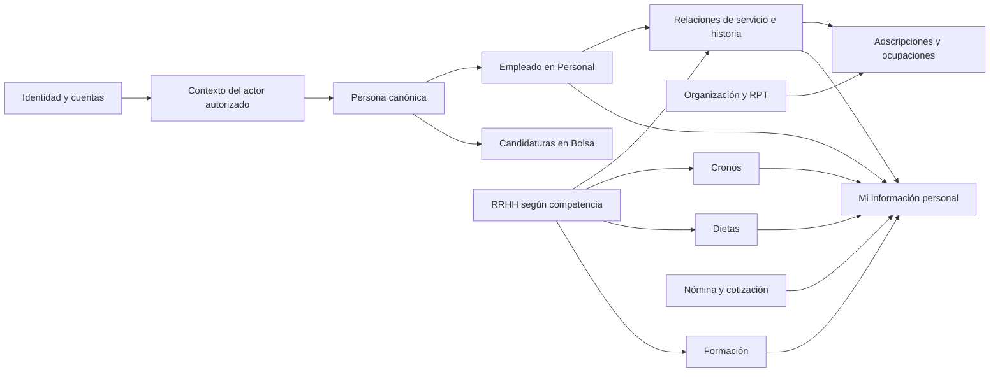

# Análisis integral del portal de Recursos Humanos

Base del estudio: **16 de julio de 2026**. Revisión de relaciones y ampliabilidad:
**19 de septiembre de 2026**, sobre código canónico `da708d6385201231548943b87e187e3320aac575`.

Lectura de continuidad para agentes: [síntesis vigente](#15-síntesis-vigente-para-los-agentes),
[ficha personal integral](#17-ficha-personal-integral-del-empleado) y
[contrato modular vigente](../portal_vec/contrato_modulos_vec.md#criterio-vigente-de-ampliación--19-de-septiembre-de-2026).
Esta revisión es un **estudio**, no implementación ni nueva validación normativa.
Las observaciones legales fechadas en julio se conservan como antecedentes pendientes
de contraste institucional, no como afirmaciones revalidadas en septiembre.

Estado: **especificación de referencia en elaboración y NO-GO productivo** hasta
que RRHH, Secretaría/Asesoría Jurídica, Intervención, Archivo, DPD, Seguridad y
Sistemas validen las materias de su competencia.

## 1. Decisión ejecutiva

El producto será una plataforma integral de Recursos Humanos de la Diputación,
no una aplicación monolítica de nómina ni una suma de formularios aislados.
Compartirá identidad, persona, autorización, auditoría, documentos, firma,
calendarios, comunicaciones y procedencia de los datos, pero cada materia
conservará su propio dominio, reglas, permisos y ciclo de vida.

Esta separación permite cumplir simultáneamente cuatro necesidades:

1. que los datos acreditados de una persona se reutilicen sin volver a pedirlos;
2. que Bolsa, Personal, RPT, Cronos, Nómina o Prevención no reinterpreten el
   mismo hecho de formas contradictorias;
3. que un permiso sobre una finalidad no abra datos de otra;
4. que una nueva norma, convenio, base o módulo se incorpore sin reescribir las
   reglas del núcleo ni alterar expedientes cerrados. Añadir código Go puede
   requerir compilar y desplegar el ensamblaje; cambiar una política declarativa
   admitida no requiere introducir código ejecutable.

La aplicación no decidirá derechos por semejanza, por una constante de código
o por una práctica observada en otra Administración. Toda decisión funcional
deberá poder responder:

- qué norma, convenio, acuerdo, base o resolución estaba vigente;
- a qué clase de personal, organismo, puesto, centro y periodo se aplicaba;
- qué hechos oficiales y documentos se utilizaron;
- qué regla versionada produjo el resultado;
- quién lo revisó, aprobó o firmó;
- cómo se rectificó sin borrar el resultado anterior.

## 2. Por qué el análisis completo es necesario ahora

No es necesario desarrollar ahora Nómina, Prevención, Acción Social o la
totalidad de Cronos. Sí es necesario fijar sus fronteras y los hechos que
intercambiarán antes de seguir ampliando el núcleo y Bolsa.

Hay reglas futuras que afectan ya a Bolsa. Por ejemplo, la disponibilidad tras
un cese temporal se aplica a la persona en todas las bolsas, no solo a una
participación concreta. Personal debe acreditar el nombramiento, contrato y
cese; Bolsa aplica la política de llamamiento vigente. Si el núcleo guardase
una constante de cinco o nueve meses, o si se copiase la restricción en cada
bolsa, sería necesario refactorizar y reconciliar múltiples historiales.

En cambio, el cálculo de una gratificación por turnicidad, la consolidación de
grado o una ayuda social no forman parte de Bolsa. Ahora solo se documentan sus
propietarios, contratos y requisitos de trazabilidad. Sus reglas se implantarán
cuando se aborde el módulo correspondiente y después de validar toda la cadena
normativa provincial aplicable.

## 3. Jerarquía de fuentes y puerta previa al código

El orden de trabajo obligatorio es:

1. norma de la Unión Europea y legislación estatal aplicable;
2. legislación de Andalucía y normativa local supletoria o de desarrollo;
3. BOP, acuerdos, convenio, reglamentos, resoluciones, circulares, RPT,
   plantilla, bases y procedimientos de la Diputación;
4. instrucciones operativas y funcionamiento real contrastado con la unidad;
5. prácticas de otras Administraciones y productos existentes, únicamente
   como referencia para mejorar el diseño.

Una fuente posterior no se presume texto consolidado de todas las anteriores.
Cada ficha de regla conservará fuente, versión, fecha de publicación, vigencia,
fecha de efectos, ámbito, órgano competente, modificaciones y estado de
validación. Una contradicción produce una incidencia jurídica o un resultado
`no determinable`; nunca se resuelve eligiendo silenciosamente el texto más
conveniente.

Las prácticas de otra Administración pueden aportar mejores pantallas,
explicaciones, estados o automatización, pero no crear requisitos, derechos,
baremos, plazos, importes ni consecuencias disciplinarias en la Diputación.

## 4. Mandato institucional de la Diputación

### 4.1 Estrategia de modernización de 2025

La Estrategia integral aprobada por la Junta de Gobierno el 18 de febrero de
2025 constituye una fuente institucional prioritaria. Su diagnóstico identifica
más de 175 categorías o especialidades, solapamientos, bolsas insuficientes,
certificados de servicios como cuello de botella, gestión reactiva de las
necesidades y comunicaciones informales.

La plataforma debe dar soporte comprobable a sus objetivos:

- inventariar escalas, subescalas, categorías, especialidades, personal activo,
  vacantes, funciones y competencias;
- conservar la correspondencia histórica cuando se agrupen o extingan
  categorías;
- normalizar protocolos, impresos, responsables, canales y plazos;
- automatizar certificados sin perder revisión, firma y expediente;
- planificar necesidades y crédito antes de que aparezca la urgencia;
- medir tiempos de procesos selectivos y solicitudes de personal;
- medir cobertura de categorías mediante bolsas;
- ampliar y flexibilizar bolsas conforme al reglamento vigente.

Fuente oficial: [Estrategia integral de modernización, simplificación y
optimización de la gestión del personal](https://www.dipgra.es/export/sites/diputaciongranada/diputacion/delegaciones/transparencia-recursos-humanos-y-administracion-electronica/.galleries/DIPUTACION-Delegaciones-Galerias-Normativa-RRHH/2025_19_2_CERTIFICADO_NA_4_JUNTA_GOBIERNO_18_02_2025.pdf).

### 4.2 Registro de Actividades de Tratamiento

El apartado 2.17 del Registro de Actividades de Tratamiento provincial incluye
en la finalidad de Recursos Humanos:

- toma de posesión, contratos, altas y bajas;
- gestión económica, nóminas, trienios, dietas y anticipos;
- permisos, vacaciones, incompatibilidades y régimen disciplinario;
- órganos de representación;
- selección y provisión;
- control horario, geolocalización y eventual verificación biométrica;
- formación, planes de pensiones y acción social;
- prevención de riesgos y vigilancia de la salud.

También declara datos identificativos, académicos, laborales, económicos,
geolocalización, afiliación sindical y salud, además de comunicaciones a
entidades tributarias, financieras, aseguradoras, Seguridad Social y órganos
judiciales.

Esto acredita el alcance institucional, pero **no autoriza un acceso común e
indiferenciado**. El nuevo sistema deberá revisar y actualizar el RAT, las bases
jurídicas, destinatarios, conservación y medidas de seguridad de cada finalidad.
La biometría, la geolocalización, la vigilancia de la salud, las denuncias y la
afiliación sindical requieren compartimentos, perfiles y registros de acceso
específicos, además de la evaluación jurídica y de impacto que corresponda.

Fuente oficial: [Registro de Actividades de Tratamiento de la Diputación](https://www.dipgra.es/servicios/areas/transparencia/portal-de-transparencia/g-actividades-de-tratamiento-de-datos-personales/registro-de-actividades-de-tratamiento/).

### 4.3 Sistemas actuales que hay que inventariar, no duplicar

La información pública y la documentación local acreditan al menos:

- GINPIX 7/SAVIA y CONVOCA para personal, selección y bolsas;
- WCRONOS para control de presencia;
- Portale y el anterior Nominae como portales del personal;
- MOAD, sede electrónica, registro, firma y verificación mediante CSV;
- Active Directory/Kerberos para identidad corporativa;
- correo corporativo y los canales de comunicación existentes.

Antes de integrar datos reales se elaborará para cada sistema una ficha con:

- propietario funcional y técnico;
- dato maestro y datos derivados;
- interfaz disponible, límites, versión y soporte;
- identificadores y reglas de reconciliación;
- latencia, horario de actualización y comportamiento ante fallo;
- base jurídica y finalidad de cada intercambio;
- contrato de servicio, auditoría y plan de retirada.

Ningún módulo leerá directamente tablas ajenas ni escribirá en GINPIX, Nómina,
WCRONOS o Active Directory. Todo intercambio pasará por un puerto y un adaptador
aprobado, con instantánea, procedencia, idempotencia y conciliación.

### 4.4 Alertas de vigencia y consolidación detectadas

| Materia | Hallazgo | Tratamiento |
| --- | --- | --- |
| Nivel, grado y promoción | no existe una regla universal de examen cada tres años; promoción funcionarial, grado y progresión laboral son figuras distintas | modelos y políticas separadas; acto e inscripción obligatorios |
| Centros Sociales | el Reglamento común remite jornada, festivos y vacaciones a normas propias no localizadas públicamente | no activar multiplicadores ni ciclos hasta recibir calendarios y acuerdos de centro |
| Vacaciones al cese | en febrero de 2026 se inició la revisión de oficio del art. 17.4 del Reglamento de tiempo por posible infracción del TREBEP | estado `en_revision`; obtener resolución y efectos antes de calcular |
| Plan de Igualdad | el plan aprobado el 27-01-2022 declaró cuatro años y no se ha localizado sustitución pública | acreditar plan vigente, evaluación, negociación y remisión registral |
| Protocolo de acoso | el acuerdo de 2020 declara vigencia indefinida, pero es anterior a las leyes de 2022-2024 | conservar garantías válidas y solicitar actualización negociada/versionada |
| Disciplina | el Convenio de 2006 menciona seis meses y normativa derogada; la Ley andaluza 5/2023 contempla hasta doce meses | **NO-GO** hasta criterio jurídico por vínculo y procedimiento |
| Acción Social | el texto refundido de 2021 es informativo y contiene referencias a la Ley 30/1992 | usar actos auténticos, Ley 39/2015 para procedimiento y convocatoria anual vigente |
| Crédito sindical | el acuerdo de 2020 liga cifras y liberaciones a aquel mandato | obtener acuerdo postelectoral; no codificar personas u horas históricas |

Una alerta no se resuelve eligiendo la fuente más nueva por fecha ni la más
favorable. Se registra la cadena, se solicita criterio al órgano competente y
se bloquea únicamente la regla afectada.

## 5. Modelo conceptual que no se puede simplificar

### 5.1 Persona, cuenta y relación de servicio

Se separarán:

- persona física canónica;
- identificadores legales y corporativos protegidos;
- cuentas e identidades de acceso;
- representación de otra persona;
- perfil de aspirante;
- relación de servicio;
- régimen jurídico;
- vínculo y causa temporal;
- situación administrativa o laboral;
- cargo, mandato o función directiva;
- adscripción y ocupación de plaza o puesto.

La plantilla provincial de 2026 distingue personal funcionario, laboral y
eventual, además de personal procedente de otras Administraciones. Esa
procedencia no es una cuarta clase de empleo. La aplicación deberá representar,
como mínimo, funcionario de carrera e interino; laboral fijo, indefinido y
temporal; eventual; y las condiciones separadas de personal directivo, alto
cargo o cargo electo.

No se usará un único campo `tipo_personal`. El vínculo real no se deduce de la
columna de adscripción de la RPT: se acredita mediante Registro de Personal,
nombramiento, contrato y, solo como reconciliación, nómina.

### 5.2 Categoría, plaza, puesto y ocupación

Son conceptos diferentes:

- **categoría, cuerpo, escala, subescala o especialidad:** clasificación
  profesional de la persona o de la plaza;
- **plaza:** dotación de plantilla con cobertura presupuestaria;
- **puesto tipo:** definición común de funciones y requisitos;
- **puesto individual:** unidad organizativa identificada en la RPT;
- **dotación:** número o unidad presupuestada;
- **ocupación:** relación temporal entre una persona y una plaza o puesto;
- **reserva:** derecho o condición que impide tratar una ausencia como vacante
  libremente cubrible.

La historia de plantilla, RPT, modificaciones, ocupaciones y reservas será
bitemporal: fecha de efectos administrativos y fecha en que el sistema conoció
el hecho. Una vacante presupuestaria, un puesto sin ocupante y una necesidad
cubrible son proyecciones diferentes.

### 5.3 Nivel del puesto, grado y categoría laboral

Se separarán siempre:

- nivel de complemento de destino del puesto;
- grado personal consolidado de una persona funcionaria;
- grado o nivel laboral reconocido conforme al convenio y sus modificaciones;
- grupo/subgrupo funcionarial;
- grupo profesional laboral;
- nivel o categoría económica y efectos retributivos.

No existe un examen periódico universal de «subida de nivel». La consolidación
por desempeño y la vía mediante curso y prueba tienen requisitos, límites,
incompatibilidades y actos de reconocimiento propios. El sistema podrá detectar
personas potencialmente elegibles y preparar un expediente, pero el grado solo
cambiará por resolución competente e inscripción en el Registro de Personal.

El análisis provincial completo se mantiene en
[modelo histórico de RPT, plazas, puestos y vacantes](modelo_historico_rpt_plazas_puestos_y_vacantes.md).

## 6. Contextos funcionales propuestos

| Contexto | Es dueño de | No puede hacer |
| --- | --- | --- |
| Identidad y acceso | cuentas, autenticación, sesiones, perfiles activos, capacidades y delegaciones de acceso | convertir un grupo de AD o un menú en permiso funcional |
| Personas y representación | identidad canónica, contacto, preferencias, representación y procedencia | declarar una relación laboral o una plaza por observación de una cuenta |
| Organización, plantilla y RPT | organismos, unidades, centros, categorías, plazas, puestos, dotaciones y sus versiones | decidir por sí solo quién ocupa o puede cubrir un puesto |
| Registro de Personal | relaciones de servicio, nombramientos, contratos, ceses, situaciones, ocupaciones, antigüedad y grados reconocidos | calcular nómina o imponer reglas de Bolsa |
| Planificación de efectivos | necesidades, escenarios, coste estimado, crédito, plantilla, OEP y cobertura | crear una contratación o alterar presupuesto sin expediente |
| Selección y OPE | convocatorias, solicitudes, admisión, pruebas, tribunales, listados, alegaciones y nombramiento propuesto | gestionar la disponibilidad ordinaria de una bolsa ya constituida |
| Bolsa | constitución, orden, disponibilidad, preferencias, llamamientos, renuncias, carencias y propuesta de incorporación | inventar contratos, ceses o servicios prestados |
| Registro Único de Méritos | hechos académicos y profesionales, evidencias, verificaciones, vigencia y reutilización | trasladar puntos de una convocatoria a otra |
| Baremación | reglas publicadas, cálculos, revisión, rectificación, firma y explicación | admitir código, SQL o fórmulas libres introducidas por RRHH |
| Provisión y movilidad | concursos, libre designación, movilidad provisional o por salud, preferencias y adjudicación | reutilizar sin más el ranking de Bolsa |
| Carrera y desempeño | grado, carrera horizontal/vertical, promoción interna, objetivos y evaluación | modificar un grado o retribución sin resolución y registro |
| Calendarios | días naturales, hábiles, festivos, apertura de centro y versiones de calendario | decidir la jornada individual de una persona |
| Cronos | cuadrantes, jornada prevista, fichajes, teletrabajo, ausencias, permisos y saldos de tiempo | valorar importes de nómina o revelar causas médicas a una jefatura |
| Nómina y retribuciones | conceptos, tablas, incidencias, cálculo, atrasos, cierre, cotización, IRPF, pagos y recibos | reabrir o sobrescribir una nómina cerrada |
| Dietas y gastos | comisión de servicio, itinerario, anticipo, justificantes, liquidación y aprobación | usar la posición GPS de Cronos como justificación automática del gasto |
| Formación | planes, necesidades, acciones, plazas, selección, asistencia, evaluación y certificación | reconocer un grado o mérito fuera del procedimiento aplicable |
| Acción social y pensiones | convocatorias, modalidades, requisitos, presupuesto, comisión, ayudas, anticipos y aportaciones | exponer datos familiares o de salud a módulos no autorizados |
| Prevención y salud laboral | riesgos, aptitud, vigilancia, accidentes, adaptación y medidas preventivas | entregar diagnósticos clínicos a RRHH o responsables de unidad |
| Igualdad y protocolos reservados | planes, indicadores, impacto, medidas y procedimientos confidenciales | mezclar denuncias o víctimas con el expediente ordinario accesible |
| Relaciones laborales | negociación, órganos de representación, crédito sindical, incompatibilidades y disciplina | convertir afiliación sindical o una denuncia en atributo general del empleado |
| Expediente y archivo | documentos, expedientes, índices, series, acceso, conservación y transferencia | conceder acceso por compartir almacenamiento físico |
| Comunicaciones y notificaciones | plantillas, destinatarios, canales, entrega, comparecencia y recibos | considerar Telegram o correo una notificación administrativa por defecto |
| Analítica y transparencia | indicadores, cuadros de mando y publicaciones minimizadas | consultar tablas operativas sin una proyección y finalidad aprobadas |

## 7. Principios para las reglas configurables

La variabilidad ordinaria se resolverá con políticas declarativas, tipadas,
versionadas y publicadas desde la aplicación. Esto no significa aceptar
cualquier fórmula escrita por un operador.

Una política deberá declarar:

- identificador, versión, estado y ámbito;
- fuentes jurídicas y fecha de efectos;
- colectivos, puestos, centros y situaciones incluidos o excluidos;
- hechos de entrada y autoridad de cada hecho;
- operadores permitidos, unidades, redondeos, topes y prioridades;
- calendario y tratamiento de intervalos;
- documentos y revisiones requeridos;
- casos de prueba aprobados;
- impacto de igualdad y privacidad cuando proceda;
- quién prepara, revisa, publica, suspende o sustituye la política.

El ciclo será:

```text
borrador → simulada → revisada funcionalmente → revisada jurídicamente
→ aprobada/firmada → publicada → vigente → sustituida o anulada
```

Los expedientes conservarán la versión exacta que utilizaron. Corregir una
regla no recalcula silenciosamente actos firmes; genera un análisis de impacto,
una rectificación o el procedimiento que determine la unidad competente.

## 8. Intercambio de hechos entre módulos

Los módulos no compartirán entidades internas. Intercambiarán hechos mínimos,
opacos y firmados o atestados cuando produzcan efectos. Ejemplos:

- Personal publica un periodo de servicios, su régimen, jornada y fuente;
- Bolsa consume el cese y la clase de nombramiento para evaluar una restricción
  global de llamamiento;
- Cronos publica una incidencia de tiempo ya aprobada, sin diagnóstico;
- Nómina consume la incidencia y devuelve referencia de liquidación, no todos
  los conceptos al resto del sistema;
- Formación publica asistencia y superación; Carrera decide si esa evidencia
  cumple su convocatoria;
- Prevención comunica `apto`, `apto_con_limitaciones` o `no_apto` y las medidas
  funcionales necesarias, no la historia clínica;
- RPT publica los requisitos versionados de un puesto; Provisión evalúa la
  convocatoria exacta;
- Calendarios devuelve un cálculo reproducible con sus fuentes; Cronos aplica
  además el cuadrante de la persona.

Todo mensaje con efectos contendrá identificador, versión de esquema,
correlación, instante efectivo, instante de emisión, productor, finalidad,
referencias de fuente, idempotencia e integridad. Un fallo de integración no se
interpreta como cero, ausencia, vacante, permiso o cumplimiento.

## 9. Superficies de acceso

El despliegue concreto de esta sección es el diseño histórico. La orden del
operador de septiembre exige poder elegir exposición por módulo; prevalece
la matriz del apartado 19 para el estudio futuro. No cambia hoy ninguna red
ni habilita acceso externo a datos internos.

Se mantienen físicamente y lógicamente separadas:

1. portal público sin identidad para información publicada;
2. área personal exterior de aspirantes y representantes;
3. autoservicio interno del personal;
4. espacio interno de responsables de unidad;
5. tramitación interna especializada de RRHH;
6. administración funcional;
7. administración técnica, seguridad y auditoría privilegiada.

Una persona empleada que participa en una bolsa entra en el perfil de aspirante.
Un técnico de RRHH que consulta su propia nómina entra en el perfil de empleado.
Los privilegios no se suman en una misma sesión. Las superficies internas usan
red corporativa o VPN autorizada, audiencia y sesión propias, Kerberos/AD y la
autenticación reforzada aprobada; administración privilegiada usa además cuenta
nominativa separada, elevación temporal y puesto o bastión gestionado.

La pertenencia a una unidad no permite consultar todo su expediente. Una
jefatura obtiene únicamente los datos necesarios para organizar el servicio y
resolver la tarea: disponibilidad, saldo suficiente y efecto operativo, no
diagnósticos, afiliación, nómina, méritos de Bolsa o denuncias.

## 10. Clasificación inicial de la información

| Clase | Ejemplos | Frontera mínima |
| --- | --- | --- |
| Pública aprobada | convocatorias, bases, RPT publicada, calendarios generales, resultados autorizados | proyección específica, retirada y conservación aprobadas |
| Personal ordinaria | contacto, puesto, solicitudes propias, formación, servicios | titular o competencia y finalidad exactas |
| Económica reservada | nóminas, cuentas, retenciones, embargos, anticipos, ayudas | enclave interno, cifrado, acceso nominativo y exportación controlada |
| Laboral especialmente sensible | fichajes, ausencias, geolocalización, productividad, disciplina | red interna, ámbito organizativo y registro reforzado |
| Categoría especial o equivalente por riesgo | salud, discapacidad, afiliación sindical, violencia, adaptación | compartimento independiente y revelación mínima |
| Confidencial de investigación | acoso, denuncia, testigos, medidas cautelares | equipo autorizado ad hoc, seudónimos y barrera frente al expediente ordinario |
| Seguridad y privilegio | roles, claves, sesiones, auditoría, incidencias | plano de administración separado y registros inmutables |

La clasificación exacta y la categorización ENS se aprobarán formalmente. El
objetivo de diseño sigue siendo soportar ENS categoría ALTA; no se declarará
conformidad hasta disponer de categorización, análisis de riesgos, implantación,
auditoría y evidencias.

## 11. Hallazgos históricos sobre el código — julio de 2026

Esta tabla no describe el runtime de septiembre. La revisión actual del
apartado 16 separa código canónico, demostración y ampliación pendiente.

Los paquetes actuales de Personal, Cronos y Dietas son demostraciones útiles
para descubrir necesidades, pero no son autoridad funcional ni están listos
para datos reales.

| Hallazgo | Riesgo | Decisión |
| --- | --- | --- |
| `DefaultLeavePolicies` fija cupos y límites en Go | una modificación legal exige compilar y puede aplicar reglas obsoletas | sustituir por políticas publicadas y conservar solo casos sintéticos de prueba |
| `DailyReductionForAge` fija 63/64 años y una/dos horas | ignora régimen, vigencia, situación y posible modificación normativa | retirar del cálculo productivo; consumir una política y hechos efectivos |
| `Workday` recibe la edad | dato derivado mutable y no evidencia la fecha de nacimiento ni la regla | usar referencia de elegibilidad emitida por Personal, minimizada y fechada |
| `EmploymentRegime` mezcla relación, vínculo y cargo | decisiones erróneas para fijo, indefinido, temporal, eventual o directivo | reemplazo aditivo por el modelo separado del apartado 5.1 |
| `RPTPosition` mezcla fila, dotación, puesto, categoría y estado | no puede reconstruir historia ni vacantes | migración aditiva al modelo bitemporal ya especificado |
| `CategoryRule.PointsPerMonth` usa `float64` | resultados no exactos ni reproducibles | usar valores exactos compartidos y reglas versionadas |
| `PayrollDraft` solo suma conceptos y deducciones | no resuelve devengo, cotización, IRPF, atrasos, cierre o conciliación | conservar como demostración; diseñar el libro de nómina antes de ampliarlo |
| Dietas usa `float64` para kilómetros e importes | redondeos y ausencia de procedencia de ruta/tarifa | decimal exacto para dinero y distancia gobernada con fuente/versiones |
| permisos de manifiesto son demasiado amplios | `manage` no expresa acción, persona, unidad, finalidad o estado | mantener manifiestos, descomponer capacidades por caso de uso y añadir ABAC contextual |

Las pruebas actuales acreditan coherencia interna del prototipo, no corrección
jurídica. Estos paquetes quedan en **NO-GO productivo**. No se borran mientras
se diseñe la migración y no se conectarán a datos personales reales.

## 12. Qué se conserva sin obligar a refactorizar Bolsa

Se conservan:

- arquitectura hexagonal y composición externa;
- identificadores opacos y persona canónica;
- puertos pequeños e intercambiables;
- autorización positiva y denegación por defecto;
- auditoría, documentos, firma y calendarios transversales;
- aritmética exacta y periodos civiles;
- catálogos y políticas con versiones;
- bandeja y sistema de diseño comunes;
- eventos y proyecciones minimizadas.

Bolsa no importará tipos internos de Nómina, Cronos o Personal. Solo consumirá
contratos neutrales de hechos necesarios. La futura regla de carencia global se
representará una sola vez por persona y periodo, con causa y fuente, y será
evaluada por la política de llamamiento; no se copiará como estado mutable a
cada bolsa.

El desarrollo inmediato de núcleo y Bolsa puede continuar cuando respete estas
fronteras. Los módulos completos de RRHH se incorporarán de forma aditiva. El
núcleo no necesitará conocer sus menús, tablas, reglas o proveedores.

## 13. Validaciones institucionales pendientes

Antes de programar cada bloque se solicitará, como mínimo:

- texto consolidado o cadena completa del Acuerdo de funcionarios y Convenio
  laboral, con criterio sobre vigencia de cada modificación;
- inventario y diccionario del Registro de Personal, GINPIX, WCRONOS, Portale,
  Nómina, MOAD, AD y contabilidad;
- responsables y autoridad de persona, relación, plaza, puesto, ocupación,
  jornada, servicios, grado y concepto retributivo;
- reglamentos específicos de turnos y centros sociales;
- resolución y efectos de la revisión de oficio del artículo 17.4 del
  Reglamento de tiempo de trabajo iniciada en febrero de 2026;
- catálogo actual de permisos, justificantes, efectos, plazos y aprobadores;
- reglas de permanencia, provisión, promoción y carencias por proceso;
- circuito real de altas, nombramientos, contratos, ceses y toma de posesión;
- tablas, interfaces y controles del cálculo de nómina;
- políticas de conservación y tablas de valoración documental;
- RAT actualizado, análisis de riesgos, EIPD y criterio del DPD sobre datos de
  alto riesgo;
- categorización ENS, red y sistemas donde vivirá cada compartimento;
- vigencia o sustitución del Plan de Igualdad aprobado en 2022, cuyo plazo
  declarado de cuatro años aparenta haber finalizado en enero de 2026;
- catálogo de órganos, puestos competentes, delegaciones, suplencias y firmas.

## 14. Especificaciones relacionadas

- [Matriz normativa de Recursos Humanos](matriz_normativa_rrhh_2026.md)
- [Catálogo funcional y hoja de ruta](catalogo_funcional_rrhh_y_hoja_ruta.md)
- [Petición del Servicio de Selección Externa](peticion_rrhh_transcripcion_y_lectura.md)
- [Baremación configurable y datos de oficio](baremacion_configurable_jornada_y_datos_de_oficio.md)
- [RPT, plazas, puestos y vacantes](modelo_historico_rpt_plazas_puestos_y_vacantes.md)
- [Calendario hábil y laboral histórico](calendario_habil_laboral_historico.md)
- [Turnos, festivos y compensaciones](turnos_festivos_y_compensaciones.md)
- [Materias económicas, reservadas y relaciones laborales](materias_reservadas_economicas_y_relaciones_laborales.md)
- [Archivo documental relacionado](archivo_documental_rrhh_relacionado.md)
- [Seguridad y despliegue de Cronos](seguridad_y_despliegue_cronos.md)
- [Acceso interno de técnicos y administración](acceso_interno_tecnicos_administracion.md)
- [Comparativa de portales públicos](../referencias_portales_aapp/comparativa_y_composicion_recomendada.md)
- [Comparativa de sistemas integrales de RRHH](../referencias_portales_aapp/comparativa_sistemas_integrales_rrhh.md)
- [Informe para el Comité de Seguridad](../comite_seguridad/informe_validacion_arquitectura_seguridad.md)

La matriz normativa detallada y la comparación ampliada de aplicaciones forman
parte de esta memoria. Las especificaciones por módulo seguirán completándola
sin convertirla en una norma jurídica. La aprobación final corresponde a los
órganos y unidades competentes.

## 15. Síntesis vigente para los agentes

El fin de VEC es un portal integral de personas y procedimientos de Diputación.
El empleado consultará desde su apartado personal la información que Diputación
mantiene sobre él y los trámites relacionados; RRHH trabajará sobre los mismos
hechos, con vistas y competencias diferentes. El alcance funcional completo
continúa en el catálogo del apartado 14: no se reduce a Contratación.

Decisiones del operador que guían esta ampliación:

- Terminar primero Contratación en sus partes independientes de RRHH; después
  Bolsa y apoyo a Dietas/Cronos. Mantener las integraciones útiles ya construidas.
- Estudiar ahora la ficha integral y Formación, sin empezar a programarlas.
- Añadir módulos como extensiones registradas, con datos y lógica propios, sin
  rehacer el portal ni introducir otra identidad o autoridad de permisos.
- Mantener hexagonalidad, i18n, diseño común, auditoría y separación de red.
- Entregar funciones completas y pequeñas: pantalla, caso de uso y resultado
  recuperable cuando corresponda; no contratos sin consumidor ni pruebas masivas.
- Elaborar manuales definitivos cuando RRHH valide los recorridos.

Este estudio define fronteras y dependencias; no ordena construir todos los
módulos a la vez. La lista de contextos del apartado 6 sigue siendo el catálogo
funcional general; un contexto no exige un contenedor ni un paquete nuevo hoy.

## 16. Qué existe y qué no debe darse por conectado

La inspección de septiembre encuentra siete directorios en `internal/modules`:
`administracion`, `bolsa`, `contrataciontemporal`, `cronos`, `dietas`, `personal`
y `usuarios`. El resto de capacidades puede estar en el núcleo, prototipos o
especificaciones: no debe deducirse su terminación de una carpeta o un menú.

| Área | Base aprovechable | Límite y siguiente conexión útil |
| --- | --- | --- |
| Contratación temporal | Expedientes, análisis/rectificación, formularios, incorporación, descarga GINPIX, seguimiento e historia recuperados en desarrollo | 16/19 pantallas de desarrollo según seguimiento; Llamamiento/Resultado parciales y Firma pendiente de circuito. No es producción |
| Bolsa y selección | Dominio, servicios, convocatorias, candidaturas, baremación y enlace con CT existentes | Auditar cada recorrido y el trabajo rescatado antes de ampliar; no afirmar Bolsa completa por su manifiesto |
| Personal | Dominio y aplicación existentes; incorporación de ejercicio y lectura acotada para CT | Una incorporación sintética no acredita empleo eficaz ni proporciona por sí sola el vínculo del empleado autenticado para todos los módulos |
| Dietas | `vista.js`, `presentador.js`, `contrato.js`, mapa y cálculo de ruta; gastos de manutención, alojamiento, otros y total | `adaptador-presentacion.js` conserva datos en memoria. Conectar la vista completa a persistencia/autorización; el mapa aislado no la sustituye |
| Cronos | Dominio, aplicación, vistas y prototipos de tiempo | Persistencia, vínculo empleado y composición nominal deben acreditarse en la entrega; un constructor aislado no es un fichaje operativo |
| Usuarios, identidad y administración | Contratos centrales de identidad/contexto, autorización y módulos existentes | El perfil o certificado no acredita vínculo laboral ni concede permisos; no declarar terminada la administración de toda VEC |
| Formación, nómina integral y demás materias | Catálogo y estudios funcionales existentes; algunas piezas o demostraciones repartidas | Formación no tiene módulo propio en la canónica inspeccionada. El estudio de estas áreas no acredita interfaces corporativas ni funciones disponibles |

La ficha/directorio histórico de `web/static/app.js` genera personas, servicios,
trienios, nóminas y dietas sintéticos. Incluye almacenamiento web de demostración:
no satisface E07 ni se reutiliza como maestro o persistencia del portal real.
`personal/domain/payroll.go` es un cálculo preliminar, no un libro completo de
nómina/cotización. Que un importe o curso se vea en esa demo no lo hace oficial.

Referencias de implementación para retomar sin reconstruir:

- `internal/modules/personal/manifest.go` y `personal/domain/{catalog,organizacion}.go`:
  navegación y piezas de catálogo/organización, no ficha integral productiva.
- `internal/modules/contrataciontemporal/ports/integracion_personal.go` y
  `personal/adapters/{contrataciontemporal,postgres,lecturaincorporacion}`:
  incorporación y lector con finalidad CT; no prestar su permiso a autoservicio.
- `internal/vec/domain/contexto_actor.go` y `internal/vec/ports/contexto_actor.go`:
  vínculo tipado y resolución central; la relación de empleo exige su autoridad.
- `internal/vec/adapters/httpapi/cronos.go`: rutas canónicas cerradas mientras
  falta composición. La candidata del segundo equipo se valora por separado.
- `web/static/portal-empleado/modulos/dietas/{vista,presentador,contrato,adaptador-presentacion}.js`:
  preservar ruta, gastos y desglose al reemplazar el adaptador volátil.

El WIP del segundo equipo sobre Dietas/Cronos está separado de esta base;
se integra solo después de revisión y comprobación. No se copia su estado
"candidato" como capacidad de la rama canónica. Las cifras vivas y evidencia
permanecen en `ESTADO_PROYECTO.md`; este estudio no crea otro contador.

## 17. Ficha personal integral del empleado

### Identidad y relaciones

Una persona canónica puede tener varias cuentas, candidaturas y relaciones de
servicio a lo largo del tiempo. La referencia de empleado enlaza con esa persona;
no se crea un empleado distinto para Dietas, Cronos o Formación. Una relación
puede tener diferentes adscripciones y ocupaciones con fechas de efectos.



Las flechas representan relaciones o consultas autorizadas, nunca acceso directo
al SQL ajeno. El contexto central vincula actor con referencias acreditadas;
Personal acredita la relación de servicio. Organización aporta unidad, jerarquía y
asignaciones competentes; un nombre de cargo no otorga facultad para aprobar.
RRHH es un espacio de gestión por competencias, no otra ficha maestra duplicada.

### Bloques que debe poder consultar la persona

La siguiente matriz es alcance futuro, no una lista de pantallas terminadas.
En todos los bloques, la consulta depende de autorización, procedencia y
clasificación; "toda mi información" no abre datos de terceros ni compartimentos
reservados mediante una consulta general. Debe existir un cauce para consultar
información restringida o solicitar corrección, según el procedimiento aplicable.

| Bloque personal | Autoridad del dato | Información y actuación prevista |
| --- | --- | --- |
| Identificación y contacto | Personas y representación; fuente maestra corporativa pendiente | Identificadores protegidos, contacto y correo obligatorio del alta VEC; proponer corrección, verificar cambios que lo requieran |
| Vínculos de acceso y representación | Identidad/representación central | Cuentas y representación admitidas; no mostrar claves ni convertir el titular en administrador |
| Situación y relación de servicio | Personal | Contratos, nombramientos, régimen, altas, ceses y situaciones; lectura de actos, solicitud de rectificación |
| Unidad, centro, plaza y puesto | Organización/RPT y ocupaciones de Personal | Adscripción actual e histórica con fechas; no confundir puesto vacío con vacante cubrible |
| Servicios prestados | Personal y fuentes externas acreditadas | Periodos, jornada, interrupciones, procedencia y certificados; separar declarado, comprobado y reconocido |
| Antigüedad y trienios | Personal para reconocimiento; Nómina para efecto económico | Periodos computables, resolución y fecha de efectos; previsión etiquetada si existe política validada |
| Grado, carrera y evaluación | Carrera/Desempeño; Personal registra actos eficaces | Reconocimientos y expedientes, no ascensos automáticos por antigüedad |
| Jornada y tiempo trabajado | Cronos | Cuadrantes, fichajes, incidencias, saldos aprobados y su periodo; pedir corrección con evidencia |
| Permisos, vacaciones y teletrabajo | Cronos/capacidad competente de tiempo | Solicitudes, autorización, consumo y saldos; causas reservadas separadas |
| Titulaciones y méritos | Registro Único de Méritos y fuente acreditante | Hechos, documentos y validaciones; la puntuación pertenece a cada baremo/convocatoria |
| Cursos y formación | Formación | Inscripciones, asistencia, superación, horas y certificados; cursos externos sujetos a comprobación |
| Nóminas y retribuciones | Nómina o sistema corporativo que se confirme | Recibos por periodo, conceptos, deducciones, atrasos y versiones; datos económicos de acceso específico |
| Bases de cotización | Nómina/Seguridad Social mediante fuente acordada | Base y tipo por periodo, rectificaciones, fuente y fecha de actualización; no derivar del salario visible |
| Fiscalidad y certificados económicos | Nómina/fuente fiscal competente | Retenciones y certificados permitidos; no reconstruir declaraciones oficiales con sumas orientativas |
| Dietas y desplazamientos | Dietas; contabilidad/Tesorería acredita pago | Rutas, kilómetros, gastos, justificantes, anticipos, liquidaciones y pagos conciliados |
| Ayudas, anticipos y pensiones | Acción Social/Nómina según materia | Solicitud, concesión, abono y saldo según fuente, con datos familiares compartimentados |
| Selección, bolsa y movilidad | Bolsa/Selección/Provisión | Solicitudes propias, posición, resoluciones y méritos aplicados; acceder con perfil y finalidad correspondientes |
| Prevención y adaptación | PRL; datos clínicos en su autoridad propia | Documentación accesible al titular y conclusiones funcionales admitidas; sin copia de historia clínica al expediente ordinario |
| Incompatibilidades y relaciones laborales | Unidad competente y expediente específico | Declaraciones, solicitudes y actos autorizados; disciplina, afiliación y denuncias con acceso segregado |
| Documentos y certificados | Módulo productor + archivo documental común | Original, versión, estado de firma y expediente de origen; misma referencia documental sin duplicar ficheros |
| Solicitudes, avisos y notificaciones | Módulo del trámite + comunicaciones | Estado, responsable competente, recibo y siguiente acción; un aviso no acredita notificación oficial |
| Correcciones y trazabilidad consultable | Autoridad del dato + auditoría común | Solicitudes de corrección, resultado y procedencia accesibles; los logs técnicos completos no son una ficha personal |

### Presentación y consulta federada

- Una cabecera común identifica persona y relación seleccionada; pestañas
  agrupan Empleo, Tiempo, Formación, Economía, Trámites y Documentos. Las vistas
  de jefatura y RRHH muestran solo las tareas y campos de su competencia.
- Cada bloque consulta una proyección mínima del módulo dueño, por puerto/API
  versionado. No se envía toda la ficha al navegador para ocultar campos con CSS.
- No cargar todos los módulos al abrir Personal. Cargar el bloque necesario;
  consultas paginadas y periodos acotados, con cancelación al salir de la vista.
- Mostrar fuente, fecha de efectos, fecha de actualización y carácter declarado,
  provisional o confirmado. Un dato ausente o servicio caído no significa cero.
- Fallar un bloque de Nómina no oculta contratos o cursos disponibles. Respetar
  denegación sin revelar existencia de datos; diferenciar indisponibilidad.
- Un dato oficial se corrige en su módulo mediante solicitud/acto y versión
  nueva. Una corrección de contacto no reescribe recibos ni documentos históricos.
- Las proyecciones o cachés de servidor, si se necesitan, conservan procedencia,
  vigencia, autorización y reconciliación. No son otra fuente maestra ni abren
  paso de datos desde intranet a Internet. Se mantiene la prohibición vigente
  de almacenamiento persistente del navegador.

## 18. Relaciones que deben conservarse al ampliar

| Origen → destino | Hecho mínimo intercambiado | Separación obligatoria |
| --- | --- | --- |
| Contratación → Personal | Acto/incorporación admitida, persona, relación, fechas y evidencia | Propuesta o ejercicio sintético no equivale a nombramiento eficaz |
| Personal → Bolsa | Servicios, relación/cese, jornada y fecha de efectos acreditados | Bolsa decide disponibilidad con su regla; CT no cambia el orden por su cuenta |
| Personal/RUM → área personal de Bolsa | Atributos declarados o acreditados necesarios para evaluar requisitos estructurados de convocatorias abiertas, con fuente, estado y vigencia | El evaluador separa acceso de puntuación y devuelve cumple/no cumple/pendiente por requisito; no sustituye la admisión ni copia titulaciones o méritos a Bolsa |
| Personal/Organización → Cronos y Dietas | Empleado, relación/adscripción vigente y autoridad competente acreditada | No derivar empleado del DNI o crear un aprobador por etiqueta de jefatura |
| Cronos → Personal/Nómina | Incidencia de tiempo aprobada y periodo, cuando el caso lo requiera | Horas fichadas no son servicios reconocidos ni devengo económico por sí solas |
| Personal → antigüedad/Nómina | Servicios reconocidos, regla/resolución y efectos | No calcular trienios sumando contratos o dividiendo días por una constante; solapes y servicios previos requieren política |
| Formación → méritos/Carrera | Curso acreditado, horas, resultado y certificado | Inscrito ≠ asistente ≠ superado; curso acreditado ≠ puntuación o grado concedido |
| Dietas → circuito económico → Dietas/Personal | Liquidación aprobada, identificador externo y confirmación del pago | Solicitado ≠ aprobado ≠ liquidado ≠ pagado; soportar abonos parciales, anticipos y rectificaciones sin doble suma |
| PRL → Personal/Cronos | Conclusión o medida funcional estrictamente necesaria | No transportar diagnóstico ni expediente clínico |
| Todos → archivo/auditoría | Referencias, metadatos y actuación según contrato | El almacenamiento común no concede acceso a documentos de otra finalidad |
| Módulos → analítica | Proyección autorizada con definición y periodo | Un indicador no consulta libremente tablas ni filtra datos personales en exportaciones |

Una consulta actual utiliza puerto síncrono cuando necesita respuesta inmediata.
Un cambio ya confirmado puede notificarse mediante la bandeja de salida existente
si hay un consumidor real. No crear un bus nuevo para cada módulo. Toda entrega
con efecto se identifica y puede reconciliarse; duplicados y mensajes fuera de
orden no sobrescriben una versión posterior. La transacción local conserva sus
garantías; un intercambio entre módulos no se finge atómico con un JOIN ajeno.

La fuente maestra por atributo debe acordarse con RRHH/Sistemas: por ejemplo,
Personal en VEC puede consultar servicios de un registro corporativo sin
reemplazarlo. GINPIX, WCRONOS, nómina, contabilidad, directorio, portafirmas y
sistema formativo son conectores que deben inventariarse. No se presupone que
sus APIs existan o estén habilitadas. Evitar sincronización bidireccional libre:
definir quién escribe, quién confirma, conflicto, versión y estado pendiente.

## 19. Módulos instalables y exposición por red

El [contrato modular](../portal_vec/contrato_modulos_vec.md#criterio-vigente-de-ampliación--19-de-septiembre-de-2026)
fija el diseño tipo plugin. Se registra cada módulo y se inyectan puertos;
no hace falta conocer su lógica dentro del shell. Un despliegue puede agrupar
módulos compatibles, sin convertirlos en dependencias obligatorias entre sí.

| Superficie | Configuración objetivo solicitada | Efecto sobre datos y módulos relacionados |
| --- | --- | --- |
| Público y aspirante | Internet; publicación pública separada del área autenticada | Proyecciones públicas aprobadas, sin recursos privados del empleado |
| Cronos | Poder habilitar acceso autenticado por Internet, además de la variante interna | Capacidad exterior delimitada; no publicar por arrastre Personal, GPS u otros datos internos |
| Dietas y Personal | Poder mantenerlos exclusivamente en Mulhacén | Rutas, estáticos privados, API, trabajos, cartografía, credenciales y datos respetan esa frontera |
| RRHH y jefaturas | Zona y ámbito admitidos para cada procedimiento | Una sesión de empleado no acumula facultades de su puesto de RRHH |
| Administración | Intranet en producción; pruebas conforme a E05 | Certificado y concesión nominal; configuración privada fuera de Git |

Esto modifica el objetivo histórico de Cronos exclusivamente interno: documenta
la solicitud de configurabilidad, **no un cambio de despliegue realizado**.
Antes de habilitarlo debe resolverse su política de canal y los proveedores
admitidos. Un menú externo no consulta desde el navegador endpoints internos
ni usa el agregador como túnel para eludir la política de red.

## 20. Secuencia de ampliación sin rehacer la aplicación

Estos cortes son un plan de reutilización, no encargos de programación abiertos:

| Corte futuro | Resultado visible y acotado | Dependencia / ámbito exclusivo |
| --- | --- | --- |
| Concluir CT independiente | Formularios, historial y recuperación claros; límites de firma y comunicación fieles | CT y su composición; conservar todas las operaciones persistidas |
| Revisar y completar Bolsa | Recorrido de convocatoria/candidatura y gestión real usando piezas existentes | Bolsa; consultar hechos Personal por contrato admitido |
| Vínculo Personal para autoservicio | La sesión consulta su empleado y relación acreditados | Autoridad central/contexto y proyección Personal; revisión sensible antes de integrar |
| Dietas completa existente | Ruta + gastos + total + guardar/recuperar sin perder desglose | Vista/presentador existentes, adaptador HTTP y autoridad Dietas; no sustituir por mapa aislado |
| Cronos propio | Consultar/registrar tiempo propio con recibo recuperable | Fuente empleado y jornada, canal/configuración y persistencia de Cronos |
| Mi información laboral | Consulta de relaciones, periodos y documentos existentes | Personal; sin incorporar a la vez nómina y formación completas |
| Formación inicial | Curso, inscripción y consulta propia; después asistencia/certificado | Módulo Formación, autoridad empleado y documentos; sin motor de baremación nuevo |
| Servicios reconocidos | Periodos y acto de reconocimiento consultables | Personal; cómputo orientativo solo con política aceptada y explicación |
| Información económica | Primera consulta de recibo/base por periodo de fuente confirmada | Adaptador de lectura Nómina; no construir nómina integral para mostrar un documento |
| Dietas cobradas | Consulta del pago confirmado y conciliación por liquidación | Fuente económica admitida; no etiquetar aprobación como pago |
| Extensión modular repetible | Registrar una segunda capacidad sin añadir condicionales de negocio al shell | Evolucionar registro existente al añadir un consumidor real, sin framework anticipado |

Para cada corte, dirección asigna productor de código Terra/medium, revisión
proporcionada y comprobación focal. Documentación Sol/medium, mecánica Luna/low;
SQL/identidad/criptografía y fronteras de datos personales requieren dos revisiones independientes y el
modelo adecuado. Compartir interfaces antes de repartir archivos. El contrato
nuevo debe llegar junto a su primer consumidor útil; no abrir ramas por cada
puerto o crear capas que solo renombren la misma llamada.

## 21. Decisiones pendientes que este estudio deja preparadas

Se tramitan en el seguimiento de dudas existente al abordar su capacidad;
no bloquean la finalización de las partes independientes de Contratación:

1. Fuente maestra y diccionario por dato: persona, empleado, servicio, nómina,
   cotización, pago, formación y responsable de unidad; correspondencias y API.
2. Quién reconoce servicios y qué reglas/versiones deben usarse para antigüedad;
   servicios de otras administraciones, solapes, jornadas y rectificaciones.
3. Catálogo de formación, validez de cursos externos, aprobadores y relación con
   méritos; no convertir automáticamente un curso en puntos o derecho económico.
4. Circuitos Dietas y Cronos: solicitante, jefatura competente, suplencia,
   RRHH/gestión, control económico, aprobaciones y devolución según trámite.
5. Qué información puede consultar, descargar o corregir cada perfil, por campo;
   procedimiento de acceso a reservados y derechos de terceros.
6. Exposición concreta por módulo/capacidad y garantías del acceso exterior de
   Cronos; sin ampliar la exposición de la ficha integral por defecto.
7. Actualización/conciliación de fuentes, históricos migrables, conservación y
   formato de documentos; importaciones y correcciones con revisión previa.

El estudio queda cerrado como base de diseño para agentes; estas decisiones
funcionales y las integraciones pendientes permanecen abiertas. No acredita
que toda VEC esté implementada ni que RRHH haya dado conformidad.
