# Manual de usuario · Contratación Temporal (VEC)

**Ventanilla Electrónica del Empleado Público · Diputación de Granada**
*Guía de uso para el personal tramitador de Recursos Humanos y el personal de Intervención.*

---

## 1. Introducción y acceso al portal

La tramitación de contrataciones temporales en la Diputación de Granada se realiza de forma centralizada y unificada a través del Portal del Empleado (VEC). El sistema ofrece un entorno visual y guiado que acompaña a los tramitadores paso a paso a lo largo de las ocho fases del procedimiento: desde que el centro gestor solicita la cobertura de una vacante o sustitución, hasta el cese o cierre del expediente tras la incorporación de la persona seleccionada.

El acceso se realiza mediante navegador web institucional. En la pantalla inicial de bienvenida se muestran los accesos directos a los módulos operativos, la ayuda y el estado de los servicios.

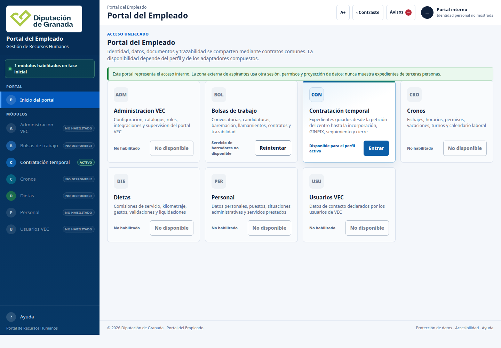

### Quién lo hace
Cualquier persona autorizada de la Diputación (responsable de centro solicitante, tramitador de Recursos Humanos o personal de Intervención) accede con su identidad corporativa habitual.

### Cómo se hace clic a clic
1. Abra el navegador web y acceda a la dirección del Portal del Empleado.
2. En el menú de navegación lateral o en la tarjeta central, pulse sobre **Contratación temporal**.
3. El sistema carga automáticamente el módulo situándole en la vista del **Cuadro de mando**.

---

## 2. Cuadro de mando de expedientes

El cuadro de mando es el panel principal de control del tramitador. Ofrece una panorámica completa de todas las peticiones y expedientes en curso dentro de la Diputación, permitiendo consultar su estado administrativo, la fase actual en la que se encuentran y localizar rápidamente cualquier asunto mediante filtros combinados.

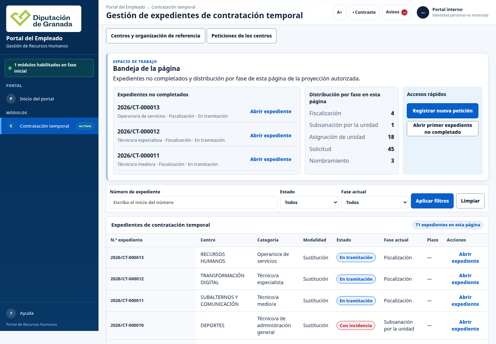

### Qué es y para qué sirve
Permite monitorizar el conjunto de la contratación temporal de la corporación. Cada fila de la tabla representa un expediente administrativo único, identificado por su referencia anual canónica (por ejemplo, `2026/CT-000005`), el centro solicitante, la categoría profesional, la modalidad de contratación solicitada, el estado de tramitación y la fase del procedimiento.

### Quién lo utiliza
El personal técnico y administrativo del Servicio de Personal y Recursos Humanos, así como los responsables de los centros gestores para consultar sus propias solicitudes.

### Cómo se hace clic a clic
1. En la parte superior del cuadro de mando dispone de tres filtros de búsqueda:
   - **Buscar en el cuadro:** escriba palabras clave como el nombre del centro (por ejemplo, `PARQUE MÓVIL` o `DEPORTES`), la categoría profesional o el número de referencia.
   - **Estado:** filtre por estado global (`En tramitación`, `Con incidencia`, `Completado`).
   - **Fase del procedimiento:** filtre por la etapa exacta en la que se halla el expediente (`Solicitud`, `Asignación de unidad`, `Fiscalización`, `Nombramiento`, etc.).
2. La tabla actualiza sus resultados de forma instantánea al modificar cualquier criterio.
3. Para consultar el detalle completo de un expediente, haga clic sobre su número de referencia o pulse el botón **Abrir detalle** situado en la fila correspondiente.
4. Para limpiar los filtros y volver a la lista general, seleccione la opción «Todos» o borre el texto introducido.

### Qué significa cada campo del listado
- **Expediente:** código oficial y correlativo asignado por registro al crearse la solicitud (ej. `2026/CT-000009`).
- **Centro:** unidad orgánica o servicio provincial solicitante (ej. `PATRIMONIO`, `RECURSOS HUMANOS`).
- **Categoría:** puesto o denominación funcional de la plaza a cubrir de acuerdo con el catálogo de la corporación.
- **Modalidad:** tipo legal de cobertura temporal (`Sustitución`, `Acumulación de tareas`, `Ejecución de programas`, etc.).
- **Estado:** situación administrativa operativa (`En tramitación` para expedientes activos ordinarios; `Con incidencia` cuando existe un reparo o paralización que exige subsanación).
- **Fase actual:** etapa procedural concreta en la que se encuentra la actuación (`Solicitud`, `Asignación de unidad`, `Fiscalización`, `Obtención de candidato`, etc.).

---

## 3. Paso 1 — Solicitud de contratación temporal

El procedimiento comienza cuando un centro directivo, servicio o área provincial detecta una necesidad urgente de personal temporal y cumplimenta la solicitud formal a través del portal.

### 3.1. Formulario inicial en blanco

Para registrar una nueva petición, el usuario pulsa en la pestaña superior **Nueva petición** o en el botón destacado **Registrar nueva petición** del cuadro de mando.

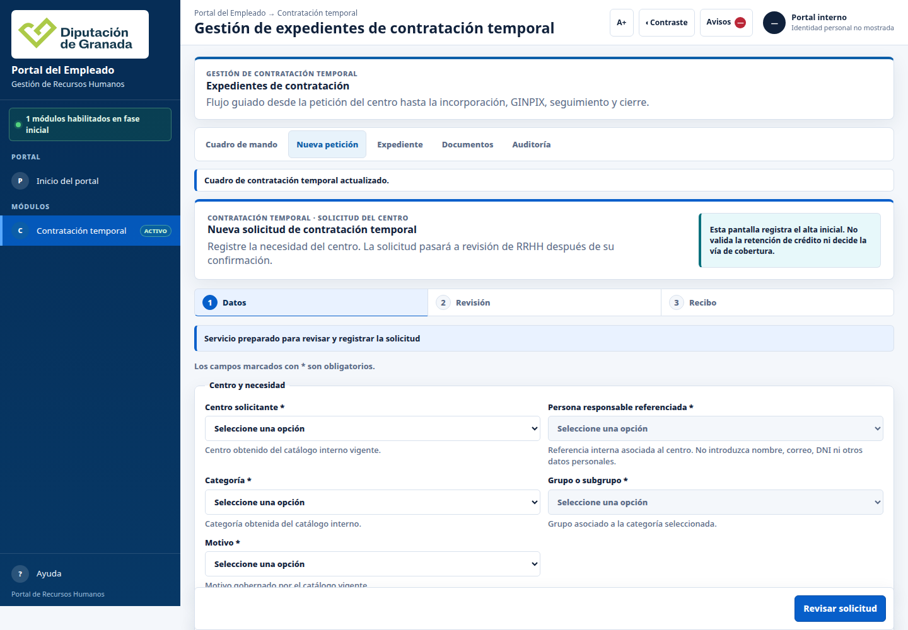

### 3.2. Cumplimentación de datos y retención de crédito

El formulario solicita exclusivamente la información indispensable para justificar la necesidad funcional y presupuestaria.

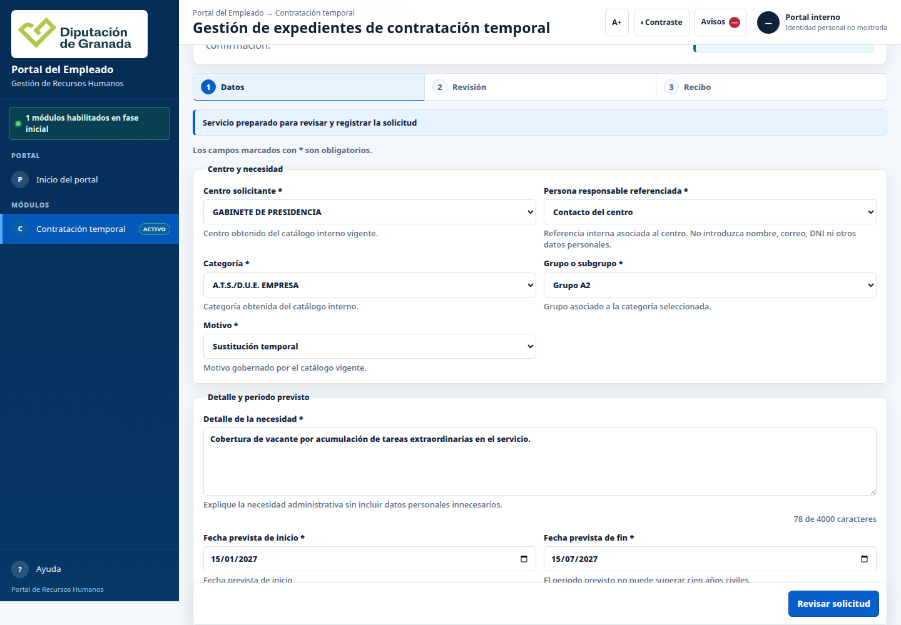

#### Significado de los campos:
- **Centro solicitante:** área o servicio provincial donde se prestará el servicio (ej. `Parque Móvil`).
- **Persona de contacto:** nombre, apellidos y extensión telefónica o correo de la persona de referencia para resolver dudas funcionales.
- **Categoría profesional:** categoría laboral o escala funcionarial solicitada, seleccionada del catálogo oficial.
- **Grupo / Subgrupo:** subgrupo de clasificación profesional (`A1`, `A2`, `C1`, `C2`, `Agrupaciones profesionales`).
- **Motivo de la contratación:** causa legal de cobertura temporal establecida en el Texto Refundido del Estatuto Básico del Empleado Público.
- **Memoria justificativa (Detalle):** explicación circunstanciada de la necesidad inaplazable que motiva el llamamiento.
- **Período previsto (Inicio y Fin):** fechas estimadas de comienzo y término de la prestación temporal del servicio.
- **Observaciones:** aclaraciones adicionales, jornada aplicable o turnos requeridos.
- **Retención de crédito (RC):** declaración sobre la existencia de dotación presupuestaria. Si se marca afirmativamente, se indican el número de documento contable, fecha e importe reservado.

### 3.3. Revisión previa y confirmación sin registro inadvertido

Para prevenir registros erróneos o duplicados accidentales, el sistema incorpora un paso de revisión obligatoria. Al pulsar **Revisar solicitud**, el formulario pasa a modo de comprobación: muestra un resumen ordenado de todos los datos introducidos y ofrece dos opciones explícitas: **Volver a editar** (para subsanar cualquier errata) y **Confirmar y registrar**.

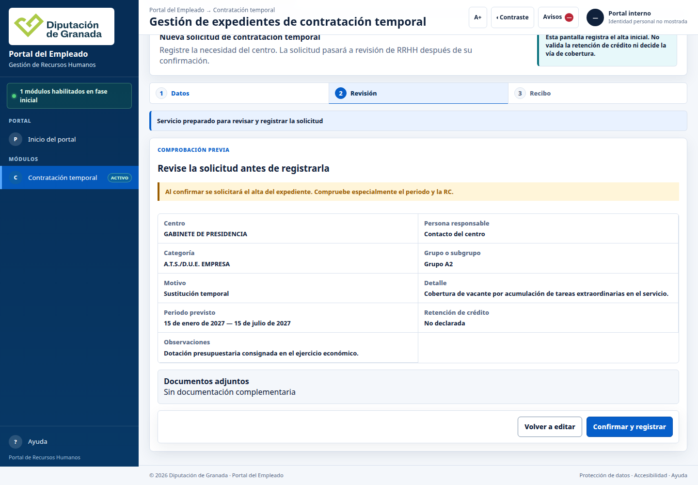

### Qué pasa después
Al confirmar, el sistema genera de forma irrevocable el número de expediente oficial, genera el recibo de registro y sitúa el expediente en fase de **Solicitud registrada**, visible de inmediato en el cuadro de mando y listo para el análisis técnico de RRHH.

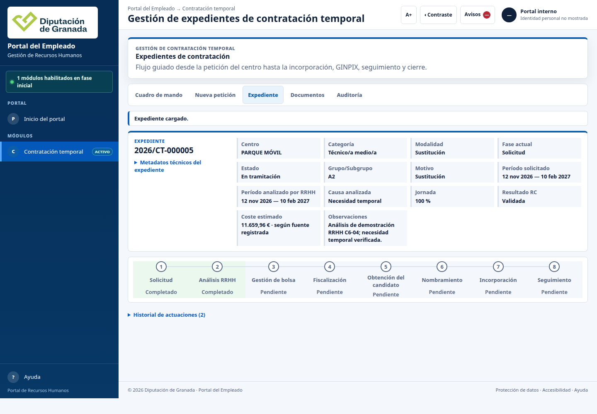

---

## 4. Paso 2 — Análisis de RRHH y propuesta de cobertura

Una vez registrada la solicitud, los técnicos de Recursos Humanos examinan la adecuación formal, la causa justificativa alegada y calculan la estimación económica de la contratación.

### Quién lo hace
Personal técnico asignado del Servicio de Recursos Humanos.

### Cómo se hace clic a clic
1. Abra el expediente desde el cuadro de mando.
2. Compruebe en la cabecera los datos de la solicitud y en el raíl superior que la fase actual marca `Solicitud`.
3. Revise la causa de contratación temporal analizada conforme a la normativa vigente.
4. Introduzca las fechas definitivas validadas por RRHH, el porcentaje de jornada y el importe del coste estimado de personal (desglosando retribuciones básicas, complementarias y cotizaciones sociales estimadas).
5. Indique si existe retención de crédito suficiente y añada las observaciones técnicas de la valoración.
6. Guarde el análisis para cerrar la propuesta técnica de cobertura.

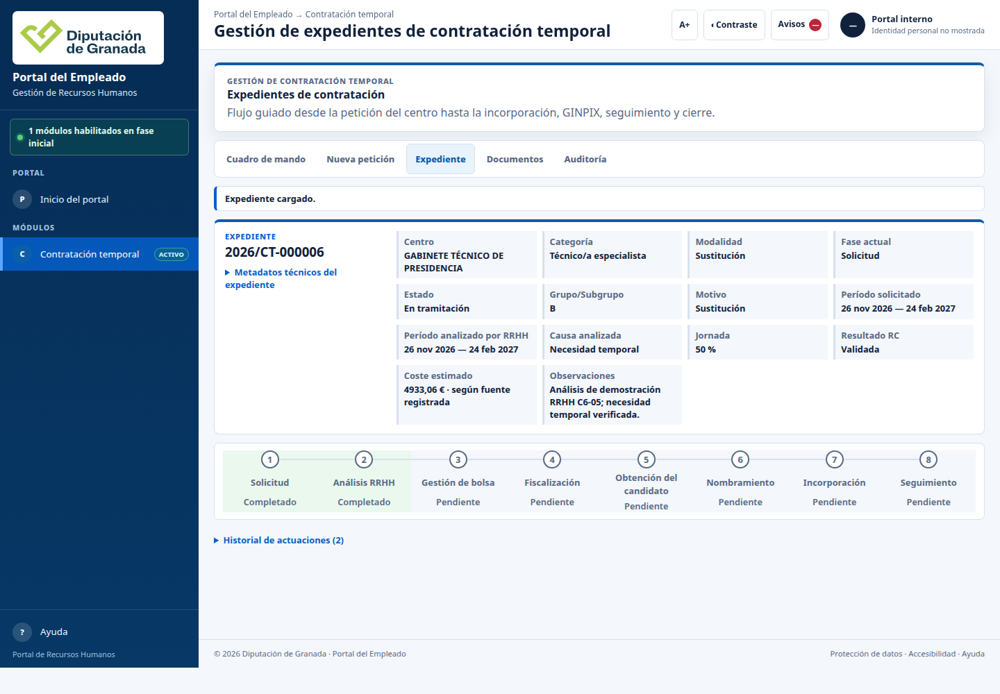

### Qué pasa después
El expediente avanza en el raíl de seguimiento, quedando acreditado el coste presupuestario y la justificación de la necesidad para decidir la vía de cobertura.

---

## 5. Paso 3 — Gestión de bolsa y vía de cobertura

Recursos Humanos comprueba la existencia de instrumentos de provisión vigentes y determina la vía jurídica por la que se seleccionará a la persona candidata.

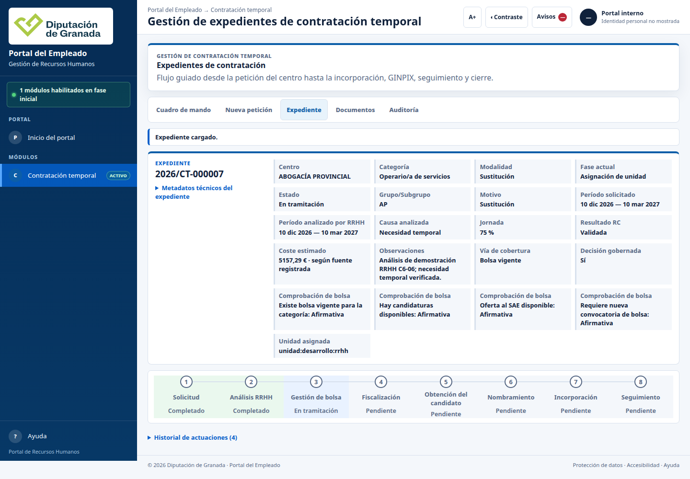

### Quién lo hace
Técnicos de selección y gestión de bolsas de trabajo de Recursos Humanos.

### Cómo se hace clic a clic
1. En el expediente, consulte el bloque de **Gestión de bolsa**.
2. El sistema realiza y documenta cuatro comprobaciones objetivas:
   - *¿Existe bolsa de trabajo vigente para la categoría solicitada?*
   - *¿Hay candidaturas disponibles y activas en dicha bolsa?*
   - *¿Procede realizar oferta genérica a los Servicios Públicos de Empleo (SAE)?*
   - *¿Requiere tramitar una nueva convocatoria pública de selección?*
3. Seleccione la vía de cobertura adoptada (`Bolsa vigente`, `Oferta SAE`, `Nueva convocatoria`, etc.).
4. Confirme la decisión de cobertura.

---

## 6. Asignación a unidad gestora

Determinada la vía de cobertura, la Jefatura o responsable de tramitación asigna formalmente el expediente a la unidad administrativa competente para instruir las actuaciones sucesivas.

### Qué significa y qué pasa después
La unidad gestora (por ejemplo, `Servicio de Personal y Selección`) asume la responsabilidad del expediente. A partir de este momento, los avisos y notificaciones de tramitación se canalizan directamente al equipo instructor responsable de la confección del informe jurídico previo a la fiscalización.

---

## 7. Documentos del expediente e informe jurídico

Antes de remitir el expediente al órgano de control interno, la unidad instructora incorpora al expediente el informe jurídico justificativo y el índice documental preceptivo.

### Quién lo hace
La unidad instructora designada de Recursos Humanos.

### Cómo se hace clic a clic
1. En el detalle del expediente, pulse sobre la pestaña **Documentos**.
2. La vista muestra el índice cronológico y estructurado de los documentos generados e incorporados:
   - Memoria justificativa del centro solicitante.
   - Documento contable de retención de crédito (RC).
   - Informe técnico de valoración y coste emitido por Recursos Humanos.
   - Propuesta motivada de incoación y cobertura.
3. Se genera el borrador de informe jurídico para someter a la firma de la jefatura competente antes de su elevación a Intervención.

---

## 8. Paso 4 — Fiscalización previa por Intervención

El Servicio de Intervención General ejerce la función interventora previa sobre la propuesta de contratación temporal, comprobando la legalidad del gasto y la existencia de crédito adecuado y suficiente.

### 8.1. Acceso y revisión desde Intervención (8083)

El personal de Intervención accede con su perfil de fiscalización exclusivo al entorno de control.

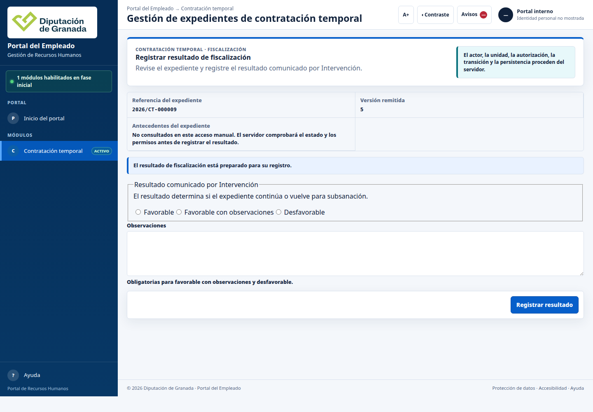

#### Cómo se hace clic a clic:
1. El interventor o interventora accede al portal en la vista de Intervención.
2. Introduce la referencia del expediente remitido (ej. `2026/CT-000009`) y la versión documental remitida por RRHH.
3. Pulsa **Abrir fiscalización**.
4. Examina la documentación contable y jurídica adjunta.
5. Selecciona el resultado de la función interventora:
   - **Favorable:** el expediente continúa su curso ordinario hacia la selección del candidato.
   - **Favorable con observaciones:** el expediente continúa pero con advertencias a subsanar antes del pago.
   - **Desfavorable (con reparo):** suspende la tramitación del expediente hasta que el centro o RRHH subsanen los defectos observados.
6. Redacta las observaciones o motivos del reparo y pulsa **Registrar resultado**.

### 8.2. Tratamiento de reparos y subsanación en RRHH

Cuando Intervención formula un reparo, el raíl de seguimiento del expediente pasa automáticamente al estado destacado **«Con incidencia»** en color ámbar.

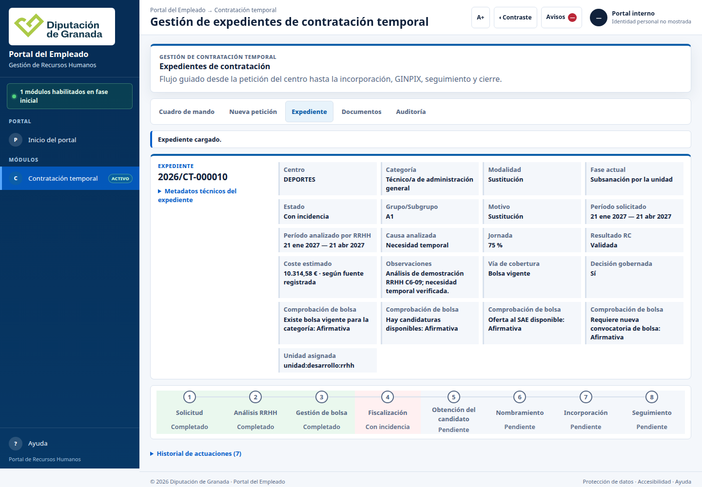

#### Cómo se subsana:
1. El tramitador de RRHH abre el expediente con incidencia.
2. En la cabecera se visualiza el motivo exacto del reparo emitido por Intervención.
3. Se abre el bloque de subsanación de reparos, donde se aporta la aclaración técnica, corrección presupuestaria o documentación requerida.
4. Se registra la subsanación, lo que devuelve el expediente a Intervención para su nueva fiscalización sin necesidad de reiniciar la solicitud desde el principio.

---

## 9. Paso 5 — Obtención del candidato y llamamiento

Superada favorablemente la fiscalización, se inicia el llamamiento de la persona candidata según el orden riguroso de prelación de la bolsa de trabajo vigente.

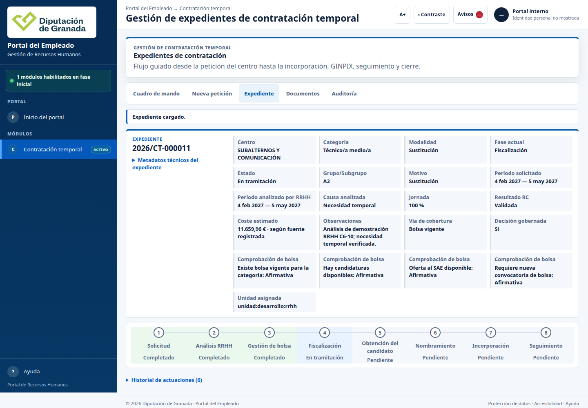

### Qué es y quién lo hace
Gestión del llamamiento ejecutada por el Servicio de Personal de RRHH. El sistema presenta la candidatura que ocupa el primer puesto disponible según baremo.

### Cómo se hace clic a clic
1. El tramitador accede al bloque **Llamamiento y comunicación**.
2. El sistema muestra los datos de la persona candidata en turno (nombre, orden en bolsa, teléfono y correo electrónico de contacto).
3. Se pulsa **Emitir llamamiento**: el sistema prepara la notificación oficial con las condiciones de la plaza (categoría, centro de trabajo, duración estimada y jornada).
4. Se registra el plazo legal de contestación.
5. Al recibir la respuesta del candidato se selecciona la opción correspondiente:
   - **Aceptación:** habilita de inmediato el paso siguiente de nombramiento.
   - **Renuncia justificada:** el candidato mantiene su situación en bolsa y se convoca automáticamente a la siguiente persona candidata.
   - **Renuncia no justificada / Falta de respuesta:** se aplica la penalización que fijen las bases y corre el turno al siguiente aspirante.

---

## 10. Paso 6 — Nombramiento y formalización

Con la aceptación firme de la persona candidata, se redacta la resolución de nombramiento (para personal funcionario interino) o contrato laboral de duración determinada.

### Qué es y cómo se tramita
1. Se genera la propuesta formal de resolución de Presidencia o Delegación de Recursos Humanos.
2. El borrador recopila los antecedentes íntegros del expediente (solicitud, fiscalización favorable, aceptación de bolsa).
3. El documento se remite al circuito del portafirmas oficial para la rúbrica de la autoridad competente.

---

## 11. Paso 7 — Incorporación y alta en GINPIX

Una vez firmada la resolución, la persona nombrada comparece para tomar posesión del puesto o suscribir su contrato.

### Qué es y cómo se tramita
1. Recursos Humanos comprueba la aportación de la documentación de alta (declaración jurada de incompatibilidades, certificado médico, datos bancarios).
2. Se registra la fecha efectiva de toma de posesión / inicio del servicio.
3. Se genera la **Ficha de personal y alta en GINPIX** con todos los datos preceptivos para la confección de la nómina y el alta en el régimen correspondiente de la Seguridad Social.

---

## 12. Paso 8 — Seguimiento y control de la contratación

Durante toda la vigencia del contrato, el sistema permite realizar el seguimiento de incidencias, prórrogas legales autorizadas, sustituciones sobrevenidas y el cese final.

### Qué es y cómo se tramita
1. Se monitoriza la fecha límite del contrato para evitar que se superen los plazos legales máximos previstos por la normativa básica estatal.
2. Si concurre causa legal de fin de contrato (reincorporación del titular sustituido, amortización, fin del programa), se tramita la notificación de cese con la antelación debida y se registra el cierre administrativo del expediente.

---

## 13. Trazabilidad, historial de actuaciones y auditoría

El principio de transparencia y seguridad jurídica exige que cada clic, cambio de estado y decisión quede registrado de forma inalterable.

### 13.1. Historial de actuaciones del expediente

En cualquier momento, desplegando el bloque **Historial de actuaciones**, se puede consultar la cronología completa de las actuaciones practicadas sobre el expediente.

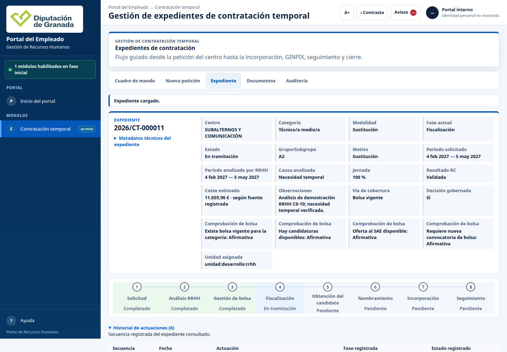

Cada fila del historial recoge:
- **Secuencia:** número correlativo de la actuación.
- **Fecha y hora:** marca temporal exacta del evento.
- **Actuación practicada:** acción administrativa realizada (ej. `Alta`, `Análisis de RRHH registrado`, `Decisión de cobertura`, `Fiscalización registrada`).
- **Fase y Estado resultantes:** situación en la que quedó el expediente tras la actuación.

### 13.2. Pestaña de Auditoría técnica

Para labores de control interno, inspección de servicios o soporte informático, la pestaña **Auditoría** muestra las referencias criptográficas de cada evento, los actores involucrados y las huellas de verificación de los datos persistidos.

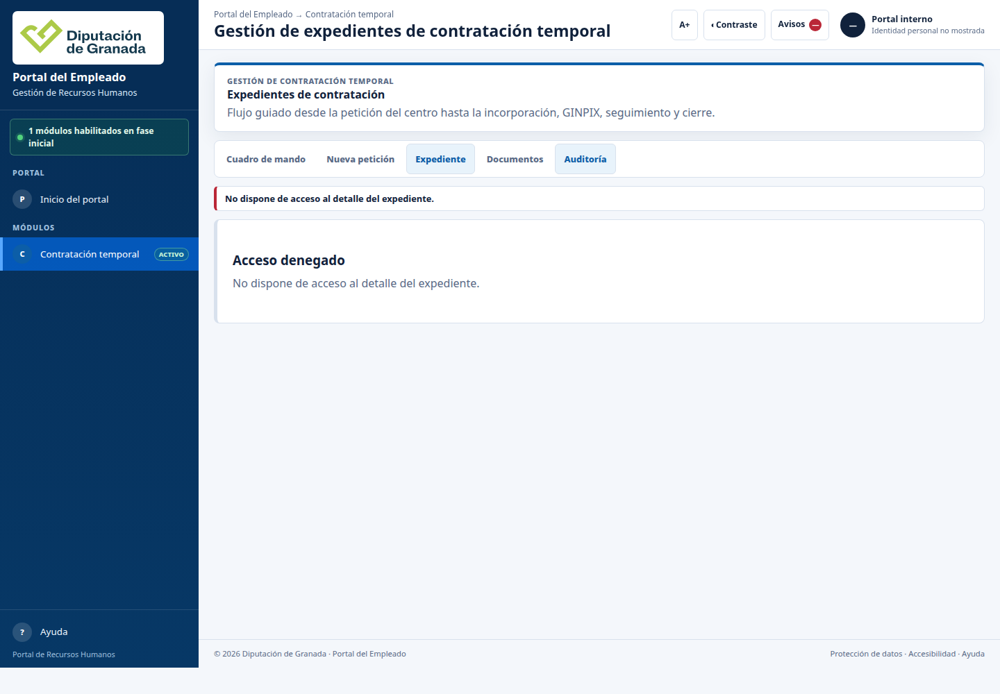

---

## 14. Ayuda contextual integrada y soporte

En cualquier pantalla del portal, el usuario dispone en la barra superior del botón **Ayuda (?)**. Al pulsarlo se despliega un panel lateral interactivo con explicaciones adaptadas a la vista y fase en la que se encuentre en ese instante.

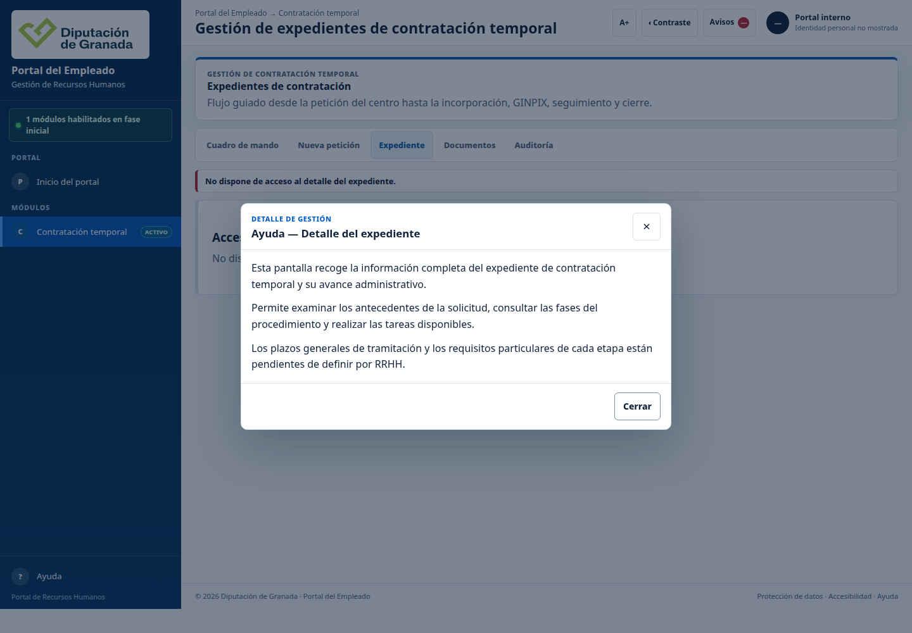

La ayuda aclara la normativa aplicable a cada paso, el significado de los términos administrativos y los teléfonos o correos de soporte de la Unidad de Selección y Provisión de Puestos.

---

## 15. Adaptabilidad móvil y diseño accesible

El módulo de contratación temporal cumple con las directrices de diseño accesible (WCAG 2.1 AA) y es completamente funcional en pantallas reducidas o dispositivos móviles (viewport de 390 px de anchura).

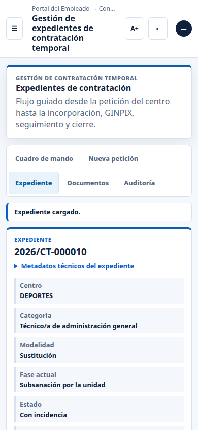

El raíl de seguimiento se adapta verticalmente mostrando cada fase conectada por líneas claras sin solapamientos, los campos de cabecera se apilan ordenadamente de arriba abajo facilitando la lectura natural, y las tablas permiten desplazamiento horizontal sin alterar el ancho de la página ni cortar información crítica.

---

## 16. Lo que todavía no está y dependencias de integración

Para garantizar la máxima claridad con los servicios gestores, este manual refleja el estado operativo actual de la aplicación. Existen determinados trámites que actualmente se simulan de forma sintética en el entorno de pruebas y cuya integración definitiva está condicionada a las respuestas de la corporación recogidas en el documento institucional `dudas.md`:

1. **Circuito de portafirmas oficial:**
   La aplicación genera los borradores documentales de resoluciones e informes, pero la firma digital efectiva con certificado de cargo se conectará con el portafirmas corporativo de la Diputación en cuanto se definan los circuitos de firma de cada servicio.

2. **Conexión en tiempo real con la Bolsa de Trabajo:**
   Actualmente el sistema utiliza las bolsas precargadas del entorno demo. La sustitución de CONVOCA y la sincronización en vivo con el motor de baremación se activará tras la importación masiva de aspirantes.

3. **Envío de correos y notificaciones reales:**
   Los llamamientos actuales registran el envío y generan la traza en base de datos sin despachar correos electrónicos reales hacia candidatos. El servidor SMTP corporativo entrará en funcionamiento en la fase de despliegue productivo.

4. **Sincronización bidireccional con GINPIX:**
   La ficha de personal recopila todos los códigos y campos exigidos por GINPIX, pero la transferencia automática mediante servicio web entre bases de datos se encuentra pendiente del protocolo técnico de nóminas.

5. **Reglas de cómputo de plazos de llamamiento y penalizaciones:**
   El plazo exacto de respuesta (horas/días hábiles), las causas tasadas de renuncia justificada y las sanciones por falta de respuesta están a la espera de confirmación por la Jefatura de Recursos Humanos (ver apartados 1 a 5 de `dudas.md`).

*Para cualquier consulta técnica o propuesta de mejora sobre este manual, contacte con el equipo de implantación de la VEC.*
