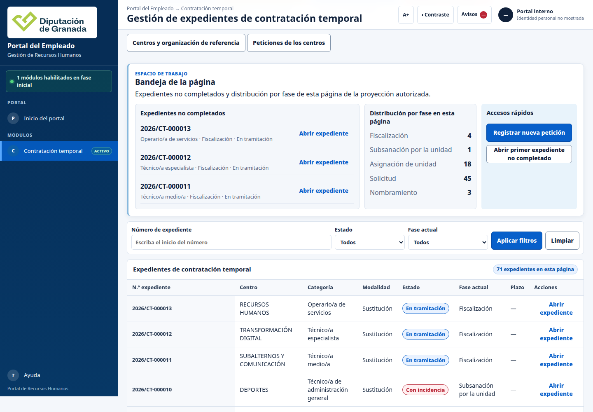
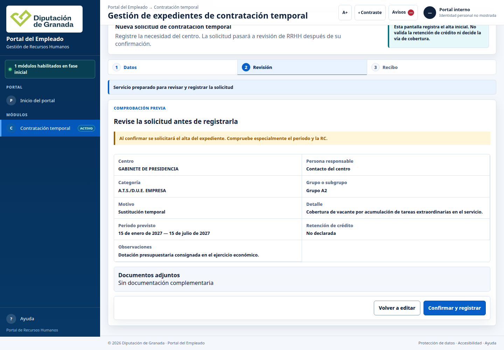
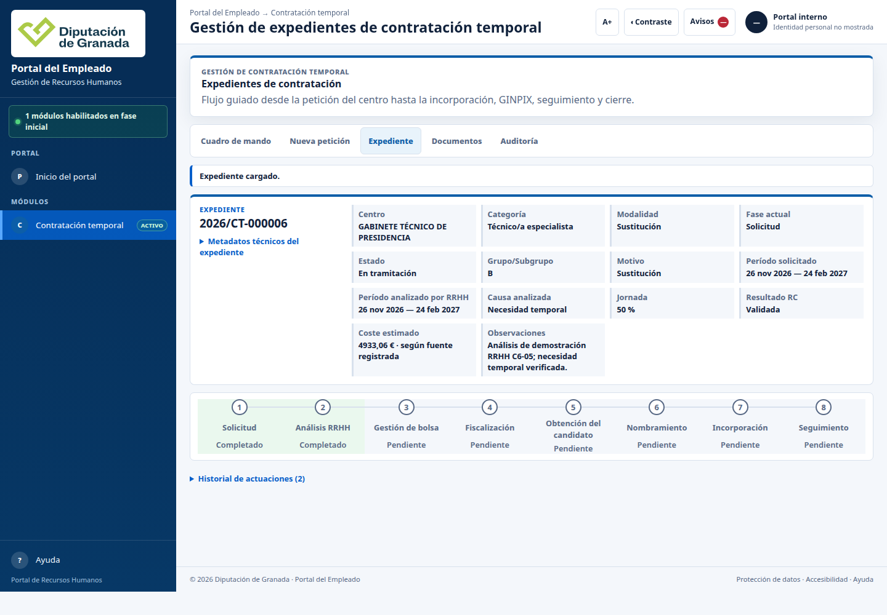
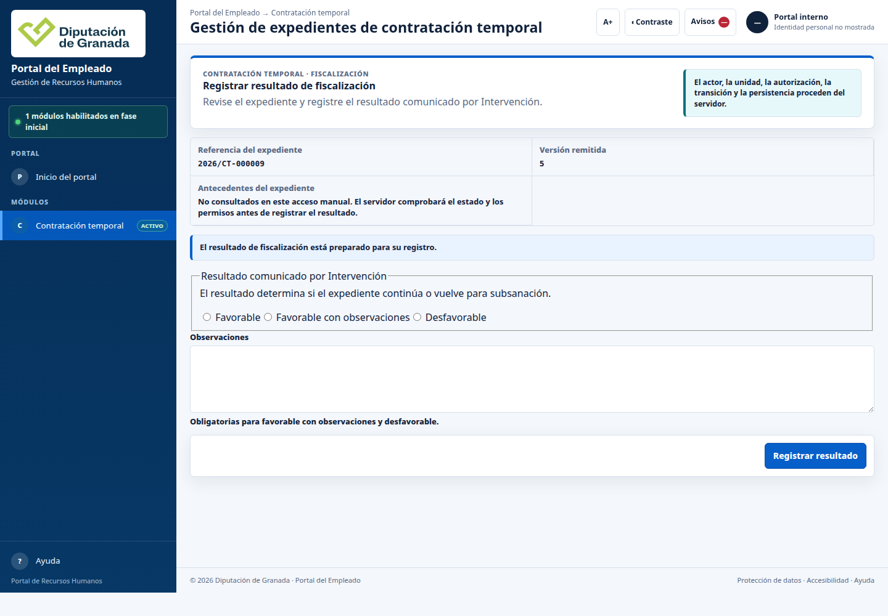
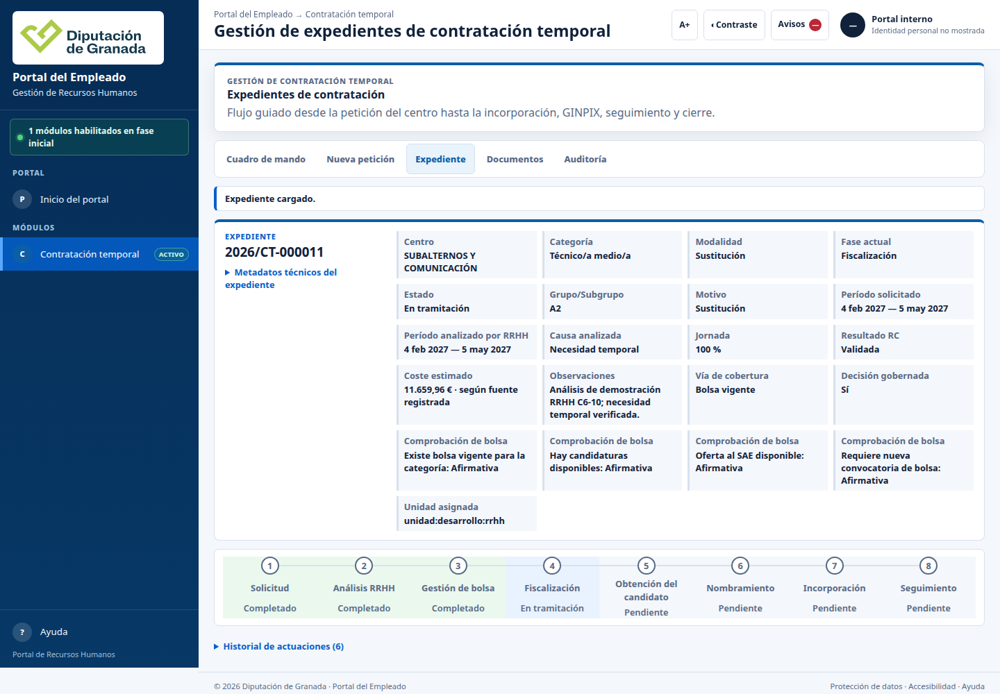
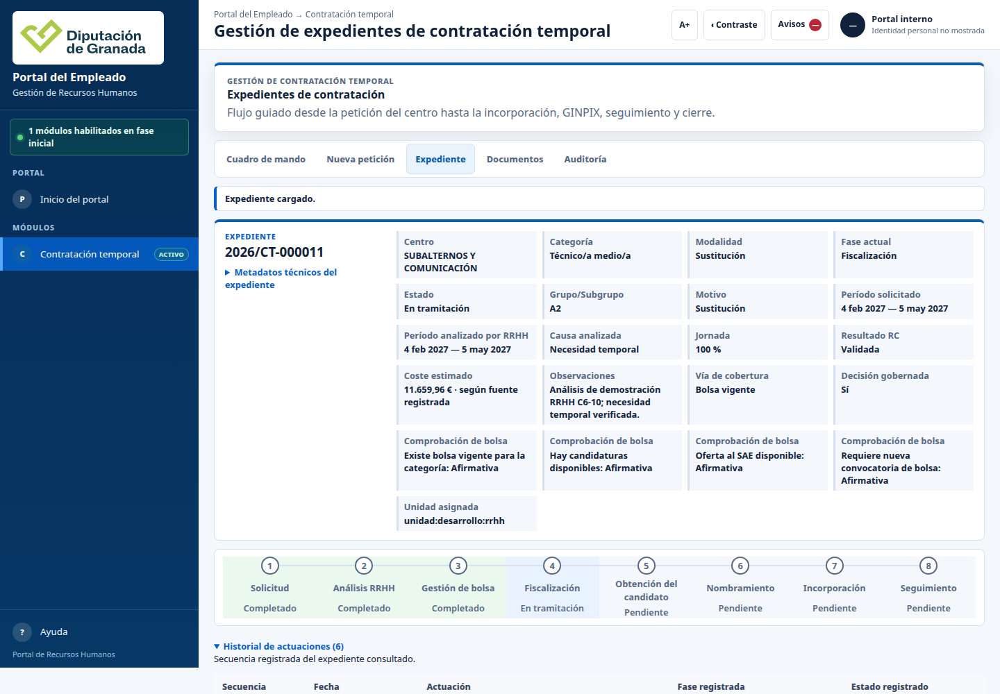

# Manual de usuario · Peticiones de personal temporal

**Ventanilla Electrónica del Empleado Público (VEC) · Guía para RRHH**
**Alcance:** funciones presentes en main a 28 de septiembre de 2026, con datos sintéticos.

Esta guía acompaña un expediente desde la petición del centro hasta su seguimiento y cierre. Algunas actuaciones corresponden al centro o a Intervención: RRHH ve su resultado y continúa cuando su perfil y el estado del expediente lo permiten. Las capturas proceden de recorridos de ensayo; los rótulos y datos pueden variar según el catálogo vigente.

> **Antes de empezar:** acceda con el certificado digital admitido y el perfil autorizado para su actuación. El certificado identifica a la persona; cada operación comprueba además sus permisos. Identificarse no firma un documento. Este recorrido no utiliza «DNI y clave».

## 1. Encontrar y abrir un expediente

1. Abra el portal y entre en **Peticiones de personal temporal**. Si el módulo o una acción no aparecen, solicite la concesión correspondiente por el cauce interno; el menú no concede permisos.
2. En el **cuadro de mando**, use los filtros disponibles para localizar el expediente por referencia, estado o fase. Los indicadores resumen los expedientes de la página mostrada, no necesariamente todos los de la Diputación.
3. Abra el detalle. Revise fase, versión, unidad y actuaciones anteriores antes de registrar un cambio. La disponibilidad de cada formulario procede del servidor y del estado actual.

Si una consulta falla, use **Reintentar** o actualice el detalle. Si ya obtuvo un recibo, consérvelo: abrir un expediente o consultar el recibo no repite la operación.

## 2. Petición del centro y alta en RRHH

El centro inicia una petición con la necesidad de cobertura, categoría, causa, fechas previstas y datos de retención de crédito (RC) cuando correspondan.

Otra identidad autorizada la ratifica. Después, la petición ratificada se entrega al alta de RRHH. Son actuaciones separadas, cada una con su recibo.

En RRHH, abra la petición entregada, compruebe sus datos y registre el alta desde la acción ofrecida. El alta crea **un expediente** con referencia y versión; el recibo identifica la operación. Si la respuesta se pierde, recupere esa petición y consulte el resultado antes de intentar otra alta. La repetición exacta enlaza con el expediente creado sin duplicarlo.

La ratificación y el alta acreditan actuaciones registradas en VEC. Ninguna constituye una firma legal de la petición.

## 3. Análisis de RRHH y decisión de cobertura

1. Desde el detalle, abra **Análisis de RRHH**. Revise categoría, grupo, modalidad y causa del catálogo, fechas, jornada, coste obtenido de la fuente configurada y resultado de RC. La jornada se presenta en horas y minutos de media semanal; la referencia del ejercicio es provisional.
2. Confirme el análisis y espere su recibo. Si necesita corregirlo, use **Rectificar análisis**: el sistema precarga los datos previos y exige el motivo y la identidad distinta que corresponda. La rectificación añade historia; no borra la anterior.
3. En **Gestión de bolsa / vía de cobertura**, revise las comprobaciones y la propuesta disponibles, seleccione la vía admitida y confirme. Bolsa conserva candidaturas, disponibilidad, orden y llamamientos; Contratación recibe referencias y resultados.
4. Registre la **asignación a unidad**. La unidad asignada prepara el **informe jurídico** para fiscalización. Compruebe el recibo de cada decisión antes de avanzar.

Una decisión de cobertura o un informe preparado no acredita por sí solo selección de persona, fiscalización favorable ni firma.

## 4. Fiscalización y subsanación

Intervención accede con su perfil propio, abre el expediente remitido y registra el resultado de la fiscalización. RRHH consulta el resultado y su recibo desde el expediente.

- Si es **favorable** o **favorable con observaciones**, revise lo indicado y continúe por las acciones que el servidor habilite.
- Si hay **reparo**, abra la incidencia y registre la subsanación que proceda. El expediente vuelve a Intervención para una nueva decisión; subsanar no convierte el reparo en favorable.

Intervención y RRHH tienen permisos y responsabilidades distintos. Una pantalla compartida no permite asumir el perfil de la otra persona.

## 5. Llamamiento desde Bolsa

Tras la fiscalización que habilita la continuación, RRHH abre **Llamamiento y comunicación**. Siga el orden que devuelva Bolsa y espere el recibo de cada operación:

1. **Iniciar llamamiento:** revise la propuesta y confirme. El recibo contiene referencias protegidas, sin exponer aquí identidad ni datos de contacto de la candidatura.
2. **Registrar comunicación:** confirme el aviso local vinculado al llamamiento. El registro no prueba que un correo haya salido o llegado.
3. **Registrar respuesta:** si llegó por un canal externo, indique aceptación o renuncia, referencia y fecha, y seleccione el archivo de correo del ensayo para calcular su huella. VEC conserva referencia y huella; no custodia el mensaje.
4. **Solicitar resolución:** revise la declaración, haga las comprobaciones expresas exigidas y confirme. Declarar una respuesta no equivale a resolverla.
5. Con aceptación resuelta, continúe hacia la propuesta de nombramiento. Con renuncia resuelta, revise y abra expresamente el siguiente llamamiento; registre también su aviso local. El siguiente candidato no recibe una comunicación automática por esta acción.

La selección se rige por Bolsa, con su propio orden y disponibilidad. Los recibos del ejercicio no acreditan envío corporativo, entrega, plazo legal, penalización ni custodia del correo.

## 6. Propuesta, documentos y formalización

Con la aceptación registrada, consulte la **propuesta de nombramiento** y el índice documental. Puede descargar los seis borradores previstos para el ejercicio: informe definitivo, resolución, diligencia, toma de posesión, notificación y comunicación al centro. Compruebe nombre y contenido antes de usarlos.

El panel de **circuito de firma** muestra los pasos y estados que proporciona el servidor. Para un paso pendiente y autorizado ofrece **Firmar** mediante AutoFirma o **Devolver** con motivo. El servicio verifica y registra la firma de prueba y da un recibo; si la verificación falla o el servicio no está disponible, no la acepta. El certificado usado para acceder sigue siendo distinto del acto de firmar.

**Las firmas de este entorno son de prueba y carecen de eficacia administrativa.** La formalización real depende del portafirmas corporativo y de las decisiones y documentos que este valide. Un borrador descargado o una firma técnica registrada no acredita nombramiento eficaz, notificación ni entrega.

## 7. Incorporación y ficha manual de GINPIX

El centro confirma la incorporación desde sus peticiones, con el tipo de documento que exija el catálogo (toma de posesión o contrato firmado). RRHH consulta esa confirmación y el seguimiento. No deduzca la incorporación de una aceptación o propuesta: espere su recibo específico.

La **ficha de GINPIX** se descarga para carga manual. No hay transmisión ni confirmación automática de alta externa. Cuando GINPIX devuelve el número de alta, RRHH puede registrar **Confirmar la ficha de GINPIX** con número y fecha, si la acción está disponible. La confirmación queda ligada a la incorporación y el cierre la utiliza cuando el catálogo la exige.

Si la persona aceptada no llega a incorporarse, el panel ofrece **No incorporación** según la regla vigente. Registre motivo y referencia de resolución. Si se exige segunda persona, la primera solo propone y otra identidad autorizada confirma o rechaza. Al confirmarse, el expediente vuelve a la fase indicada por el catálogo y el nuevo llamamiento se hace expresamente; la propuesta anterior permanece en la historia.

## 8. Seguimiento, cese y cierre

En **Seguimiento del nombramiento**, consulte incorporación, recibos y opciones vigentes. Una anotación administrativa conserva una observación y su recibo sin iniciar un cese. Modificar fechas o jornada crea una nueva versión del análisis, recalcula el coste y devuelve el expediente a la fase configurada; revise la nueva RC y el estado antes de continuar.

Para registrar un **cese**, debe constar la incorporación acreditada. Seleccione causa del catálogo y fecha de efecto, indique la referencia del justificante y elija el archivo para calcular su huella. Revise y confirme: recibo e historial reflejan el cese, y Bolsa recibe el fin del contrato para reponer la disponibilidad conforme a su propia regla.

Después del cese, use **Cerrar el expediente** cuando el panel lo habilite. Si la regla exige confirmación de la ficha de GINPIX, regístrela antes: el cierre toma el número ya confirmado y no admite sustituirlo por otro. El cierre tiene su propio recibo. Existe además un **cierre administrativo sin cese** para su supuesto específico; no lo confunda con el cierre posterior al cese.

La referencia y la huella de un justificante no equivalen a custodiar el archivo o a obtener una confirmación técnica de GINPIX.

## 9. Recibos, historial y recuperación

Cada confirmación muestra un **recibo**. Consérvelo junto a la referencia del expediente y revise la versión resultante. En el detalle puede consultar la cronología de actuaciones y los recibos disponibles; una rectificación o sustitución añade historia en lugar de borrar la actuación anterior.

Si aparece «resultado incierto» o se interrumpe la conexión, **no cree una operación distinta para probar**. Consulte el expediente o el recibo y reintente la misma operación con los mismos datos cuando la pantalla lo permita. Una versión en conflicto exige actualizar el detalle y decidir de nuevo. Un mensaje de carga, borrador o declaración no es una confirmación.

La auditoría de acceso y efectos se conserva con permisos propios. El historial visible ayuda a seguir el trámite, pero no muestra todos los datos de la auditoría técnica.

## 10. Ayuda y ventajas de VEC

Pulse el botón **«?»** de la barra o del apartado para abrir la ayuda contextual. Allí se explican el paso, sus límites y qué hacer ante un error. La pantalla de trabajo muestra acciones y datos necesarios; la explicación extensa está en la ayuda.

VEC reúne petición, decisiones, recibos e historia en el expediente para que RRHH pueda retomar el trabajo y distinguir qué actuación quedó confirmada. Las reglas y opciones proceden de catálogos versionados, por lo que cada decisión conserva su contexto.

El sistema separa responsabilidades: **Peticiones de personal temporal** coordina el expediente, **Bolsa** decide sobre candidaturas y llamamientos, y **Personal** conserva las relaciones e incorporaciones que le pertenecen. Los módulos comparten identidad, permisos, auditoría y presentación. Su arquitectura separa reglas de negocio, conexiones con otros servicios y pantallas; esto permite evolucionar un módulo y conectar otros clientes a los mismos casos de uso. El recorrido acreditado aquí es el del navegador: esta guía no afirma que exista un cliente de escritorio o CLI operativo para este trámite.

## 11. Alcance del ejercicio

El corte de main y los recorridos documentados usan **datos sintéticos**. La presentación de septiembre incluyó lectura en la principal y escritura, cese, recuperación tras reiniciar aplicación y PostgreSQL y casos negativos en una copia de ensayo. Esto no autoriza datos reales ni uso productivo.

Siguen pendientes la firma con validez legal mediante el portafirmas corporativo, la acreditación de envío y entrega del correo, las reglas legales aún no aprobadas por RRHH y la transmisión automática a GINPIX. Una ficha manual o un número confirmado en VEC no son una confirmación del sistema externo obtenida por integración. Consulte la ayuda «?» y el estado del expediente antes de interpretar cualquier recibo.

**Fuentes del alcance:** [estado del proyecto](../../ESTADO_PROYECTO.md), [flujo solicitado por RRHH](../portal_vec/expediente_contratacion_temporal_rrhh.md) y [contrato modular vigente](../portal_vec/contrato_modulos_vec.md#criterio-vigente-de-ampliación--19-de-septiembre-de-2026).
