# Manual de usuario · Portal del Empleado — Gestión de Bolsas de Trabajo

**Diputación de Granada · Ventanilla Electrónica del Empleado Público (VEC)**

Versión del manual: 17 de julio de 2026.

---

## 1. Qué es el Portal del Empleado

El Portal del Empleado es la aplicación web unificada de la Diputación de
Granada para la gestión interna de Recursos Humanos. Los distintos ámbitos
funcionales (Bolsas de trabajo, Personal, Nóminas, Cronos, Dietas,
Solicitudes y certificados) se presentan como módulos de un mismo portal:
comparten identidad, datos, documentos y criterios de seguridad, y se van
habilitando por fases.

En la fase inicial está habilitado el módulo **Bolsas de trabajo**, que cubre
el ciclo completo de una bolsa de empleo temporal: elaboración y publicación,
llamamientos conforme a las bases y al Reglamento, contratos y ceses, motor de
reglas, consulta para candidatos, estadísticas, generación documental,
comunicaciones y auditoría.

Este manual describe cada pantalla del módulo y la forma correcta de operar
con él. Las imágenes proceden del modo de demostración del portal. Los títulos,
categorías, fechas de publicación y referencias BOP de las convocatorias son
datos públicos reales; las personas, expedientes y actuaciones privadas son
sintéticos. La franja superior amarilla identifica este alcance. En la
operación real esa franja no existe y la información procede de las API
autorizadas.

> **Vigencia visual:** las capturas corresponden al corte del 17 de julio de
> 2026. La web ha cambiado desde entonces y las imágenes se conservan como
> referencia histórica, no como evidencia del corte vigente. Se regenerarán
> desde la composición real, sin datos personales, cuando se cierre la web,
> conforme al
> [inventario de capturas pendientes](../portal_vec/inventario_capturas_pendientes_cierre_web_2026-07-30.md).

## 2. Acceso y estructura de la pantalla

El portal se abre desde el navegador corporativo, en la dirección interna
`/portal-empleado/`. La sesión se resuelve en el servidor: la cabecera
muestra en todo momento el nombre y el perfil efectivo de la persona
conectada (en las imágenes, «María Pérez · Perfil de presentación RRHH»).

Todas las pantallas comparten la misma estructura:

- **Menú lateral izquierdo**: acceso a la portada del portal, a los módulos
  y, dentro de Bolsas de trabajo, a los diez bloques de gestión numerados.
  El bloque activo queda resaltado.
- **Cabecera**: migas de navegación (por ejemplo «Portal del Empleado →
  Bolsas de trabajo → Llamamientos»), título de la vista y los controles
  **A+** (aumento de texto), **Contraste** (alto contraste), **Avisos** (con
  el número de pendientes) y la identidad de la sesión.
- **Zona de contenido**: paneles, tablas e indicadores propios de cada vista.
- **Pie**: enlaces permanentes a Protección de datos, Accesibilidad y Ayuda.

La navegación funciona con ratón y con teclado; existe un salto directo al
contenido para lectores de pantalla y las tablas anchas se desplazan dentro
de su propio marco sin romper la página.

## 3. Portada del portal

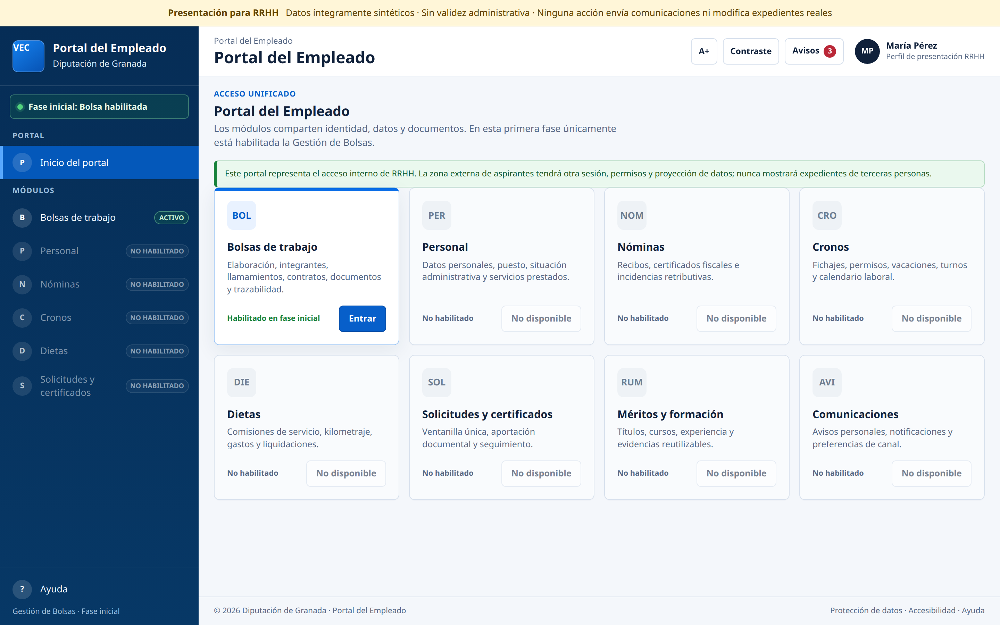

La portada presenta los módulos del portal como tarjetas. En la fase inicial
solo **Bolsas de trabajo** aparece habilitado, con el botón **Entrar**; el
resto (Personal, Nóminas, Cronos, Dietas, Solicitudes y certificados,
Méritos y formación, Comunicaciones) se muestran como «No habilitado» hasta
sus fases correspondientes.

La franja informativa recuerda el carácter del acceso: este portal es la
zona interna de RRHH. La zona externa de aspirantes tendrá su propia sesión,
permisos y proyección de datos, y nunca mostrará expedientes de terceras
personas.

## 4. Cuadro de mando

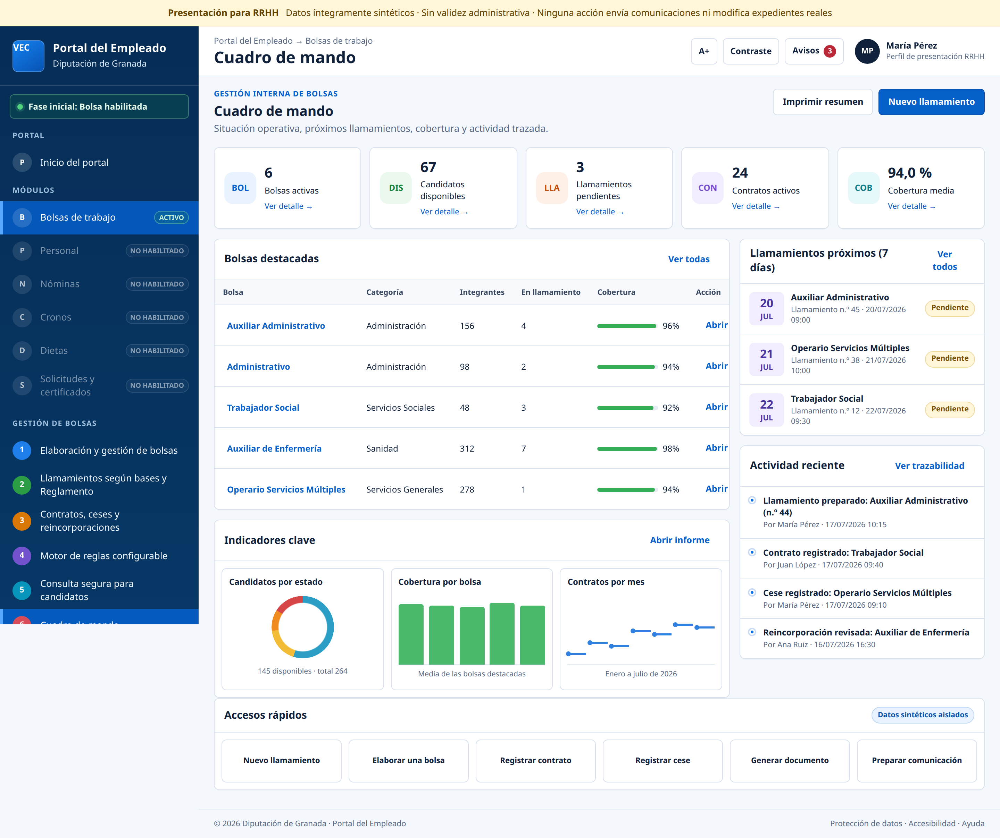

Es la vista de situación del módulo y la primera que conviene abrir cada
mañana. Ofrece, de arriba abajo:

- **Cinco indicadores principales**: bolsas activas, candidatos disponibles,
  llamamientos pendientes, contratos activos y cobertura media. Cada tarjeta
  enlaza con su detalle.
- **Bolsas destacadas**: tabla con categoría, número de integrantes,
  candidaturas en llamamiento y barra de cobertura de cada bolsa, con acceso
  directo a cada expediente mediante **Abrir**.
- **Llamamientos próximos (7 días)**: agenda con fecha, bolsa, número de
  llamamiento y estado.
- **Actividad reciente**: últimos actos registrados (llamamientos
  preparados, contratos, ceses, reincorporaciones) con autor, fecha y hora,
  enlazados con la trazabilidad completa.
- **Indicadores clave**: distribución de candidatos por estado, cobertura
  por bolsa y evolución mensual de contratos.
- **Accesos rápidos**: nuevo llamamiento, elaborar una bolsa, registrar
  contrato, registrar cese, generar documento y preparar comunicación.

Los botones **Imprimir resumen** y **Nuevo llamamiento** de la cabecera
permiten, respectivamente, obtener una copia imprimible del cuadro y lanzar
el asistente de llamamientos que se describe en el apartado 6.

## 5. Elaboración y gestión de bolsas

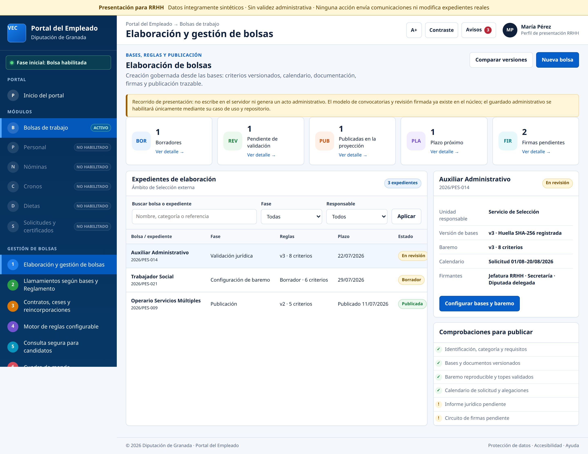

Este bloque gobierna el ciclo de vida de cada bolsa desde su expediente de
elaboración hasta su publicación. La vista principal lista los **expedientes
de elaboración** con su fase (configuración de baremo, validación jurídica,
publicación), la versión de reglas aplicable, el plazo, la unidad
responsable y el estado.

Al seleccionar un expediente se abre su detalle con los **campos
gobernados** (versión de bases con huella criptográfica registrada,
calendario de solicitudes, circuito de firmantes) y las **comprobaciones
para publicar**: la aplicación no permite publicar una bolsa hasta que las
bases están aprobadas y firmadas, el baremo configurado y validado, y el
calendario definido.

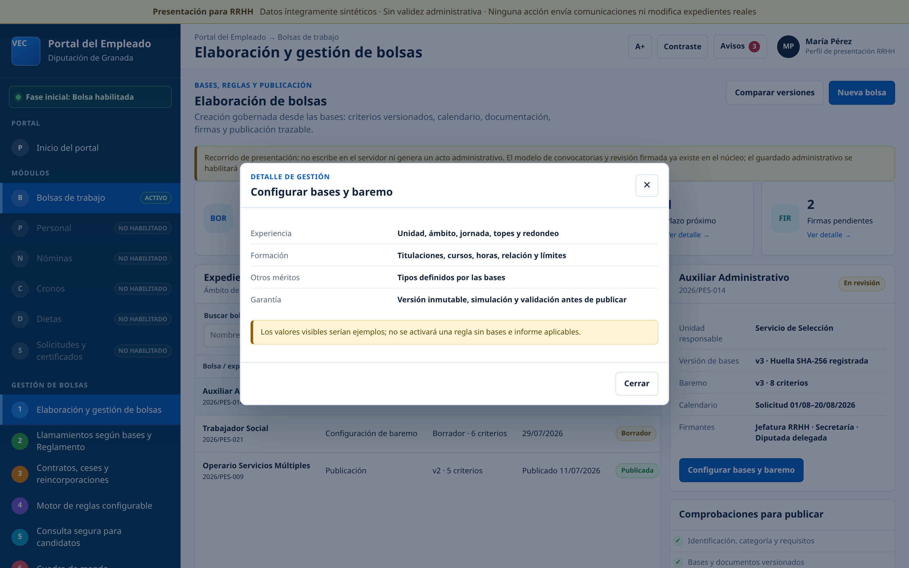

El botón **Configurar bases** muestra las familias de configuración del
baremo: criterios, puntuaciones, requisitos y versiones. Cada versión de
bases publicada queda sellada con su huella y no puede alterarse sin dejar
constancia; las convocatorias posteriores citan siempre la versión exacta
con la que se resolvieron.

## 6. Nuevo llamamiento: asistente en cuatro pasos

El llamamiento es el acto más delicado de la gestión de bolsas y el portal lo
conduce mediante un asistente que impide saltarse comprobaciones. Los cuatro
pasos aparecen siempre visibles en la parte superior y puede volverse a un
paso anterior sin perder lo introducido.

### Paso 1 · Elegir necesidad de cobertura

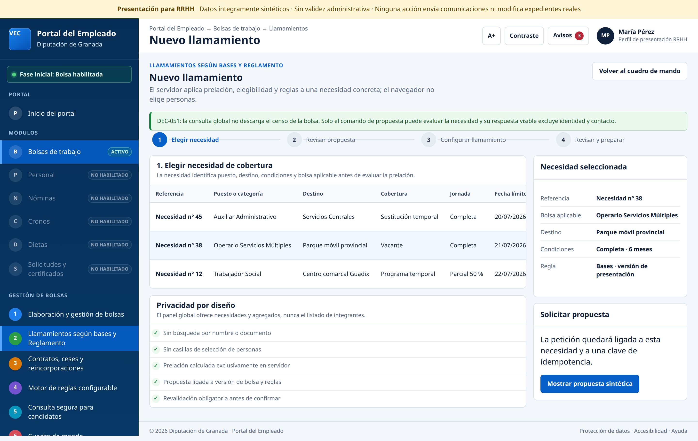

Se parte de una **necesidad de cobertura** ya registrada (referencia, bolsa,
destino, jornada, duración y tipo de cobertura). Basta con pulsar
**Seleccionar** en la necesidad que se va a atender. La regla aplicable
(Reglamento y bases vigentes) queda asociada desde este momento.

### Paso 2 · Propuesta calculada por el servidor

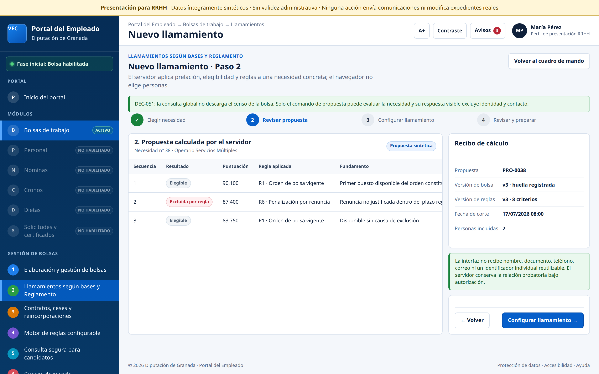

Es el corazón del sistema. **El servidor** aplica la prelación, la
elegibilidad y las reglas de la bolsa a la necesidad concreta y devuelve una
propuesta ordenada; el navegador no elige personas ni puede alterar el orden.

Cada fila de la propuesta muestra la secuencia, el resultado (*Elegible*,
*No disponible*, *Excluida por regla*), la puntuación, la regla aplicada y su
fundamento. El panel **Recibo de cálculo** deja constancia de la propuesta:
identificador, versión de bolsa (con huella registrada), versión de reglas,
fecha de corte y número de personas incluidas.

Protección de datos: la interfaz no recibe nombre, documento, teléfono,
correo ni ningún identificador individual reutilizable; el servidor conserva
la relación probatoria completa bajo autorización. De este modo puede
revisarse la legalidad del orden sin exponer identidades en pantalla.

### Paso 3 · Configurar llamamiento

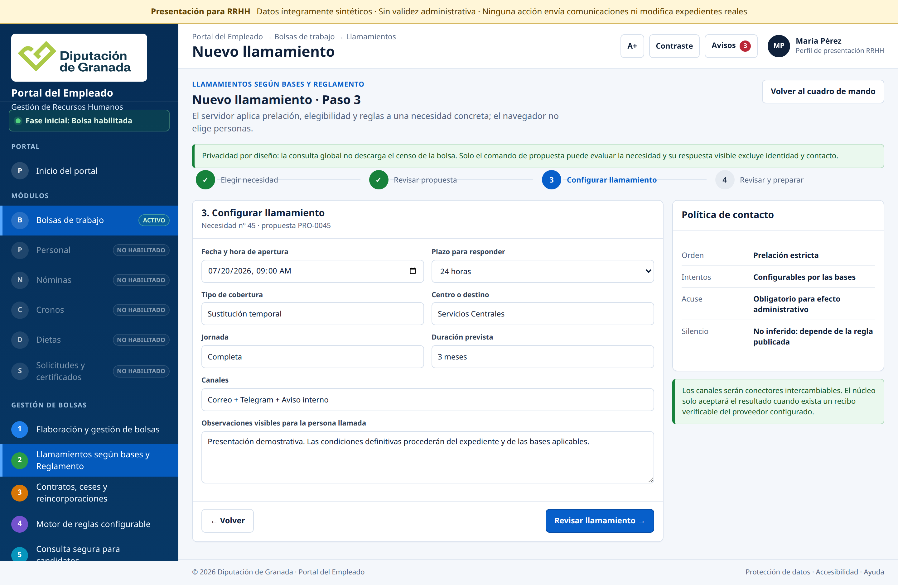

Se establecen las condiciones del llamamiento: apertura, plazo de respuesta
(24, 48 o 72 horas desde la recepción fehaciente), tipo de cobertura,
destino, jornada, duración y canales de comunicación previstos (correo,
mensajería, aviso interno). Los valores proceden de catálogos gobernados,
de modo que no pueden introducirse condiciones fuera de las previstas.

### Paso 4 · Revisar y preparar

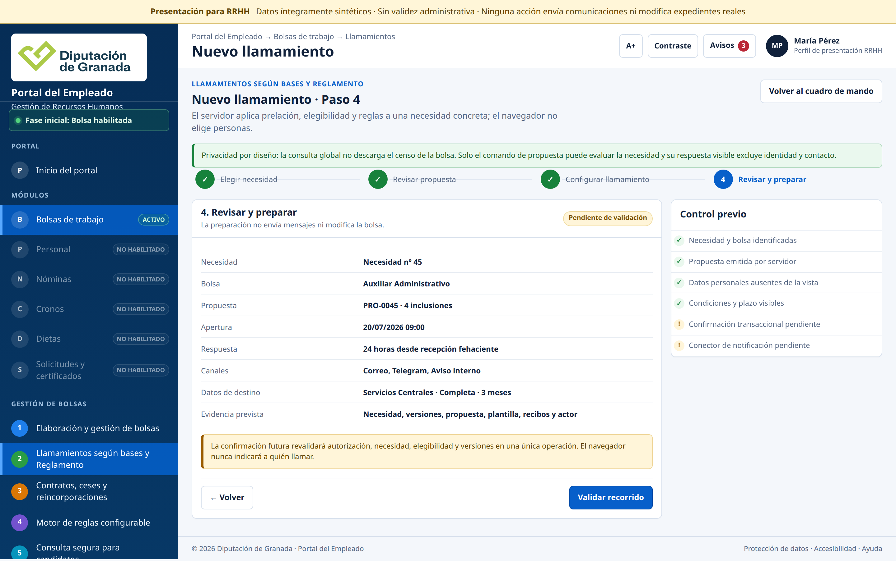

Resumen completo antes de preparar el acto: bolsa, personas seleccionadas
según el orden visible, apertura, plazo de respuesta, canales, datos de
destino y las **evidencias previstas** que quedarán registradas (identidad y
rol de quien actúa, autorización sobre el expediente, versión de bolsa y de
reglas, selección y orden aplicados, plantillas y firmas, recibos de
entrega). El acto administrativo se genera después por el circuito de firma
y notificación correspondiente.

## 7. Contratos, ceses y reincorporaciones

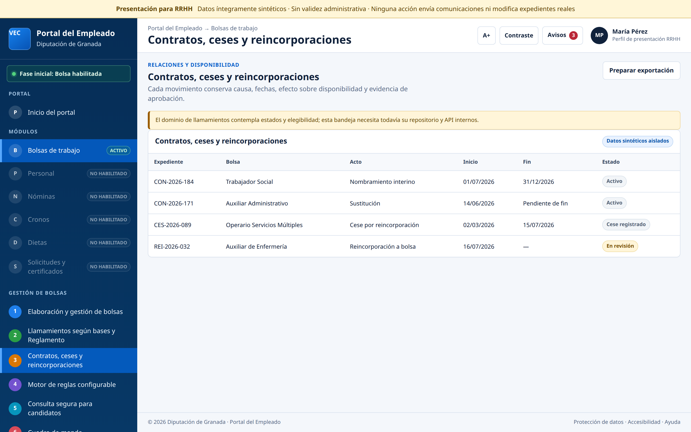

Bandeja de **relaciones y disponibilidad**: cada movimiento (contrato, cese,
reincorporación) conserva su causa, las fechas de inicio y fin, el efecto
sobre la disponibilidad de la persona en la bolsa y la evidencia de su
aprobación. Así, la disponibilidad que usa el motor de llamamientos deriva
siempre de actos registrados y no de anotaciones manuales.

## 8. Motor de reglas configurable

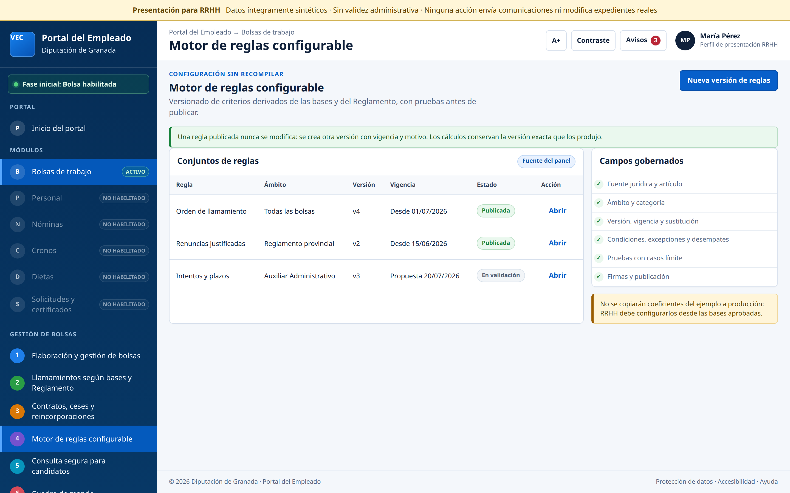

Las reglas de funcionamiento de cada bolsa (orden de prelación, causas de
indisponibilidad, penalizaciones, desempates) se administran como
**conjuntos de reglas versionados**. La vista lista cada conjunto con su
versión, número de criterios y estado.

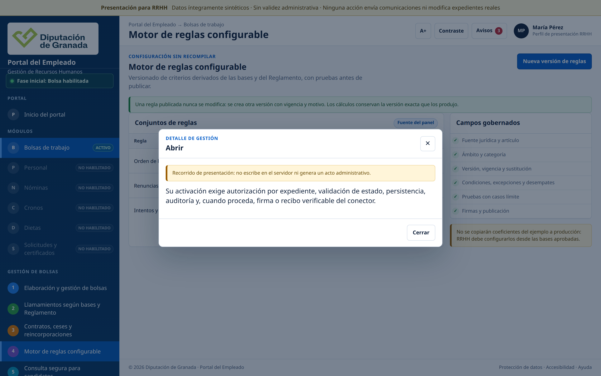

El detalle de una regla muestra su definición y su fundamento normativo. Las
versiones publicadas son inmutables: un cambio de reglas produce una versión
nueva, y cada llamamiento cita la versión exacta con la que se calculó, lo
que permite comparar versiones y justificar cualquier resultado pasado.

## 9. Consulta segura para candidatos

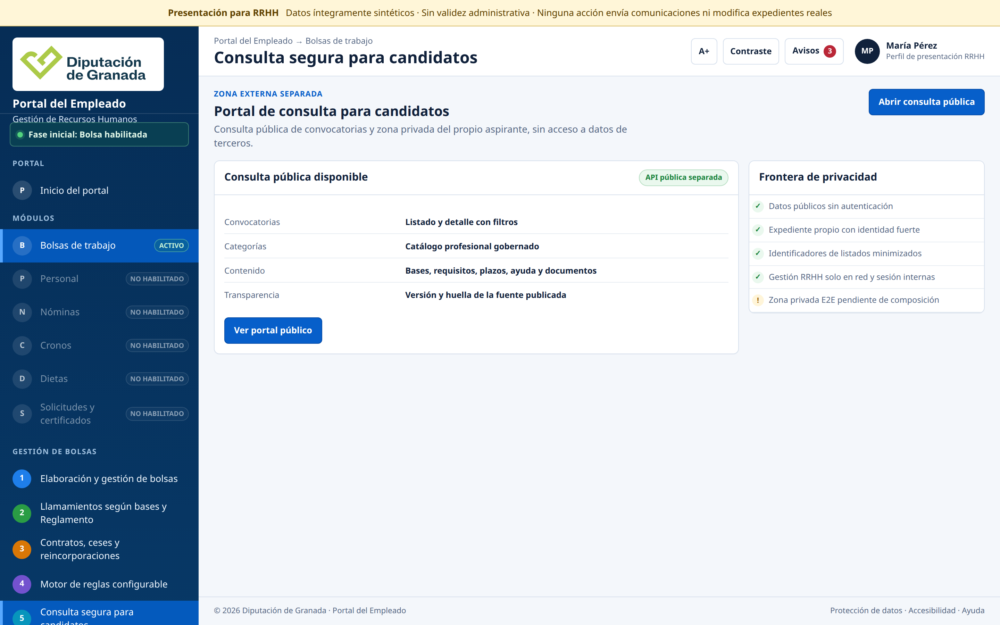

Define lo que la **zona pública** puede mostrar a cada aspirante: su propia
posición y estado, nunca el censo completo ni datos de terceros. La vista
interna muestra la **frontera de privacidad** (qué campos se proyectan al
exterior) y la **política de contacto**. La consulta pública queda así
gobernada desde dentro, con los mismos catálogos y versiones.

## 10. Estadísticas y explotación de datos

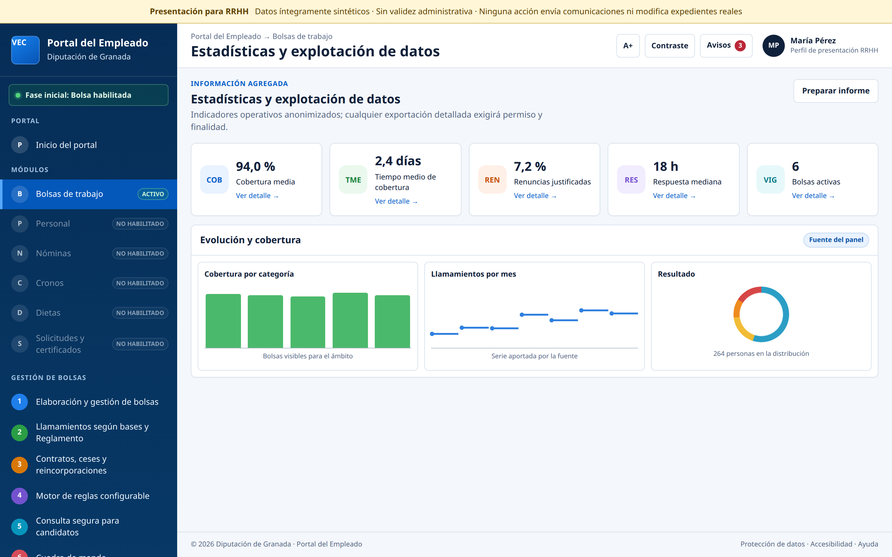

Indicadores agregados del módulo: evolución y cobertura, distribución por
categorías y series temporales. Los agregados se calculan en el servidor con
fecha de corte y ámbito; la explotación de datos con fines de informe se
apoya en estos indicadores y no en descargas de datos personales.

## 11. Generación y firma de documentos

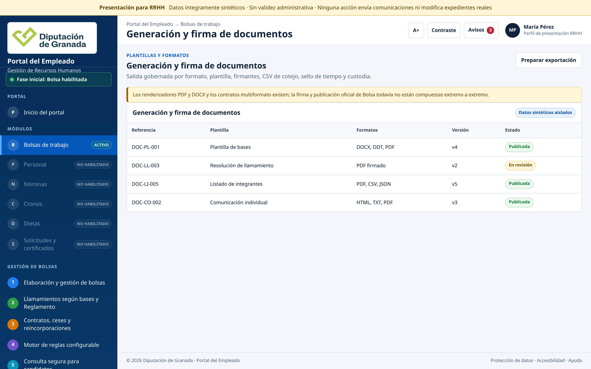

Catálogo de **plantillas y formatos** para la salida documental del módulo
(resoluciones, comunicaciones, certificados). Cada generación queda
gobernada por su plantilla, formatos disponibles, versión, firmantes, CSV de
cotejo, sello de tiempo y custodia, de modo que todo documento emitido es
verificable posteriormente.

## 12. Correo y mensajería

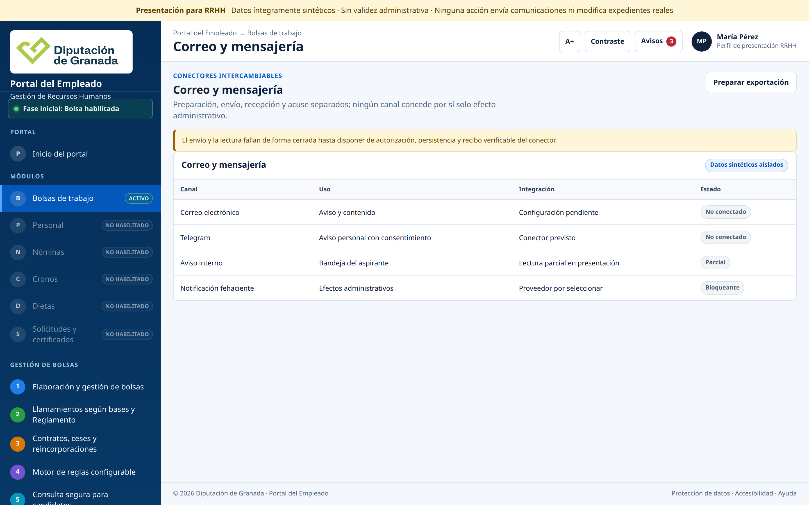

Canales de comunicación con las personas candidatas, presentados como
**conectores intercambiables** (correo, mensajería, aviso interno) con su
uso, integración y estado. La preparación, el envío, la recepción y el acuse
se registran por separado; ningún canal concede por sí solo efecto
administrativo — el efecto lo dan los recibos y su incorporación al
expediente.

## 13. Auditoría y trazabilidad

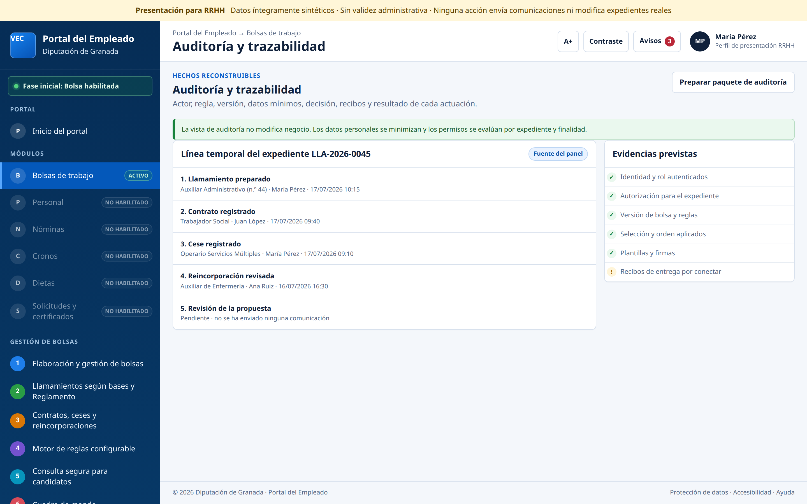

Línea temporal completa del expediente: cada acto (preparación de un
llamamiento, registro de un contrato, cese, comunicación) aparece con su
autor, fecha, hora y evidencias asociadas. La trazabilidad es de solo
lectura y permite reconstruir cualquier decisión con las versiones de bolsa
y reglas que estaban vigentes en ese momento.

## 14. Avisos y ayuda

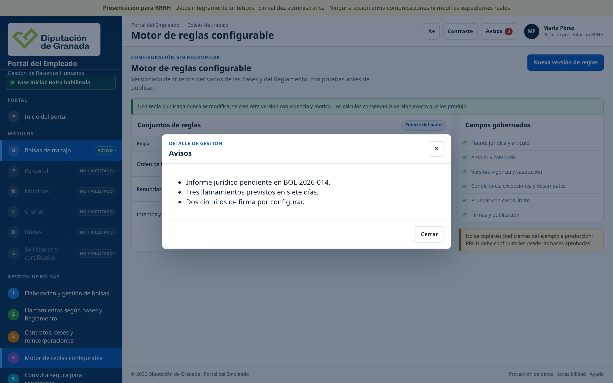

El botón **Avisos** de la cabecera muestra las notificaciones internas
pendientes (llamamientos por preparar, plazos próximos, tareas de revisión).

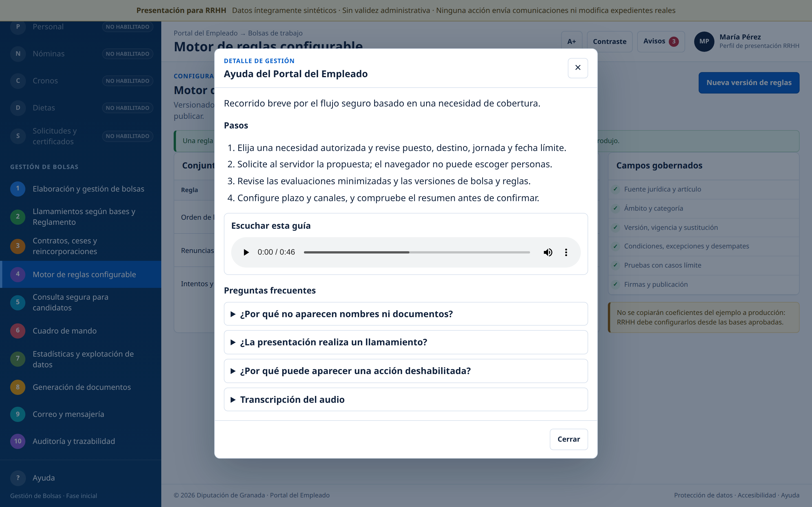

El enlace **Ayuda**, disponible en el menú lateral y en el pie, ofrece la
guía de uso contextual del módulo. El ejemplo incluye un recorrido de cuatro
pasos, preguntas frecuentes, un audio local y su transcripción completa; puede
usarse con teclado y no envía ningún contenido a servicios externos.

## 15. Accesibilidad

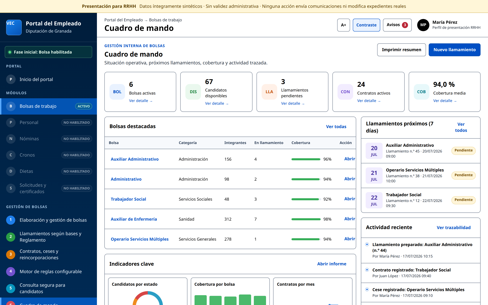

El portal cumple criterios de accesibilidad de uso diario:

- **A+**: aumento del tamaño de texto, persistente entre sesiones.
- **Contraste**: modo de alto contraste para entornos de baja visibilidad,
  también persistente.
- Navegación completa por teclado, foco visible, salto al contenido y
  región de anuncios para lectores de pantalla.
- Tablas desplazables y composición adaptable a pantallas pequeñas.

Estas dos preferencias visuales son la única información que el navegador
almacena localmente: el portal no guarda en el equipo datos de bolsas,
candidatos ni expedientes.

## 16. Protección de datos

El módulo aplica minimización de datos por diseño:

- Los identificadores personales aparecen enmascarados en las vistas de
  gestión y no salen del servidor cuando no son imprescindibles.
- Las propuestas de llamamiento se revisan por secuencia, puntuación y
  regla, sin nombres ni documentos en pantalla; la relación probatoria
  completa queda custodiada en el servidor bajo autorización.
- La zona pública de candidatos solo proyecta a cada persona su propia
  información.
- Todos los actos quedan auditados con autor, momento y versión de las
  reglas aplicadas.

---

Portal del Empleado · Diputación de Granada. Las pantallas de este manual
proceden del modo de demostración. Sus referencias BOP son públicas y reales;
las personas, expedientes, operaciones y resultados privados son sintéticos y
no corresponden a expedientes reales.
