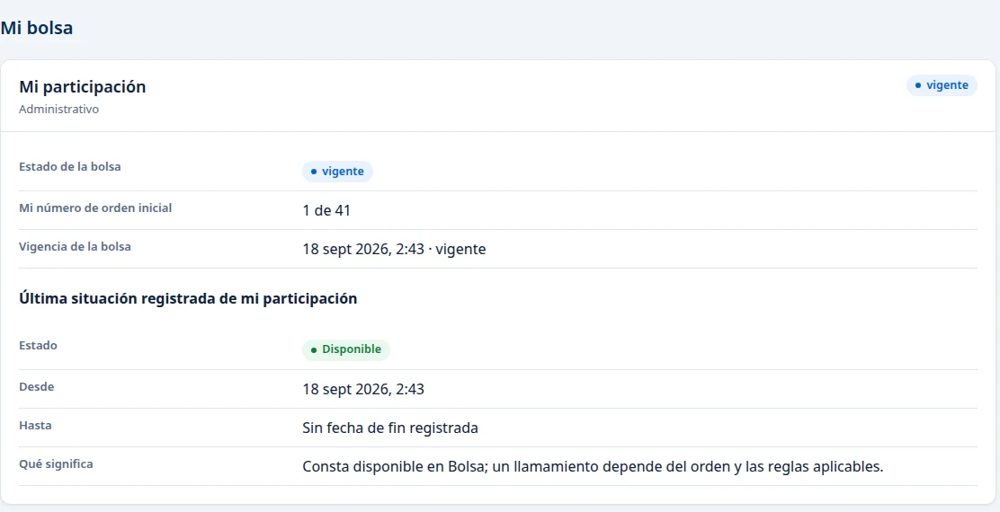
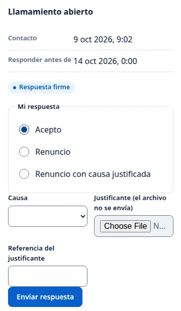
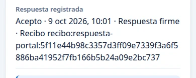

# Mi bolsa: consultar la situación y aceptar un llamamiento

**Comprobado el 9 de octubre de 2026.** Las imágenes muestran un ejemplo. Su bolsa, número de orden y fechas pueden ser distintos.

## Ver su situación

Entre en [Mi área personal](https://vec.cidonia.cloud/area-personal/?lang=es) con su acceso y pulse **Mi bolsa** en el menú. La pantalla se titula «Disponibilidad y llamamientos». En **Mi participación** verá la bolsa, su número de orden inicial y la última situación registrada. **Disponible** significa que consta como disponible en esa bolsa. Recibir un llamamiento depende del orden y de las reglas que se apliquen.

## Responder cuando RRHH registre el contacto

Espere a que aparezca **Llamamiento abierto**. Revise la fecha de **Contacto** y la de **Responder antes de**. La etiqueta **Respuesta firme** que aparece debajo indica que su respuesta será definitiva en cuanto la envíe: se registra directamente en la bolsa, sin que RRHH tenga que confirmarla. Si en su lugar aparece «RRHH confirmará la respuesta», su respuesta quedará pendiente hasta que RRHH la confirme. Un correo con resultado **Enviado** no confirma que le haya llegado ni que haya una respuesta registrada.

Para aceptar el llamamiento:

1. En **Mi respuesta**, marque **Acepto**.
2. Pulse **Enviar respuesta** una sola vez.
3. Espere a que aparezca **Respuesta registrada**.

Para aceptar no hace falta rellenar **Causa**, **Justificante** ni **Referencia del justificante**. Esos campos son para renunciar con causa justificada.

La confirmación muestra **Acepto**, la fecha, **Respuesta firme** y un recibo. Conserve ese recibo para consultar su respuesta. Después de actualizar la página, debe ver la misma confirmación y el mismo recibo.

Que la respuesta quede registrada no cambia en ese momento su situación en la bolsa: puede seguir viendo **Disponible** mientras RRHH continúa el trámite.

## Si algo sale mal

Si aparece «No se ha podido confirmar el resultado. Consulte Mi bolsa antes de volver a enviar la petición», vuelva a **Mi bolsa** y compruebe si figura **Respuesta registrada** con un recibo. Si no aparece, comunique a RRHH el mensaje que vio antes de intentar otro envío.

Si todavía no aparece **Llamamiento abierto**, espere a que RRHH registre el contacto. La indicación **Enviado** del correo, por sí sola, no abre una respuesta en esta pantalla.
