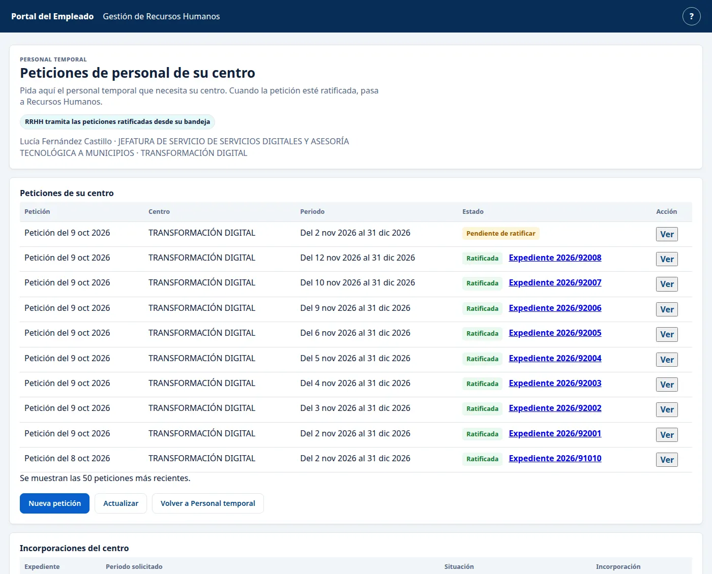
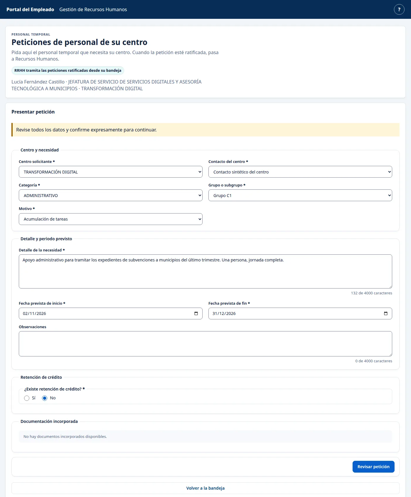
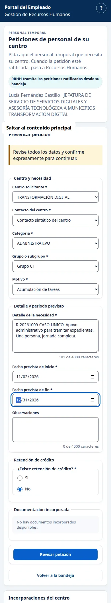
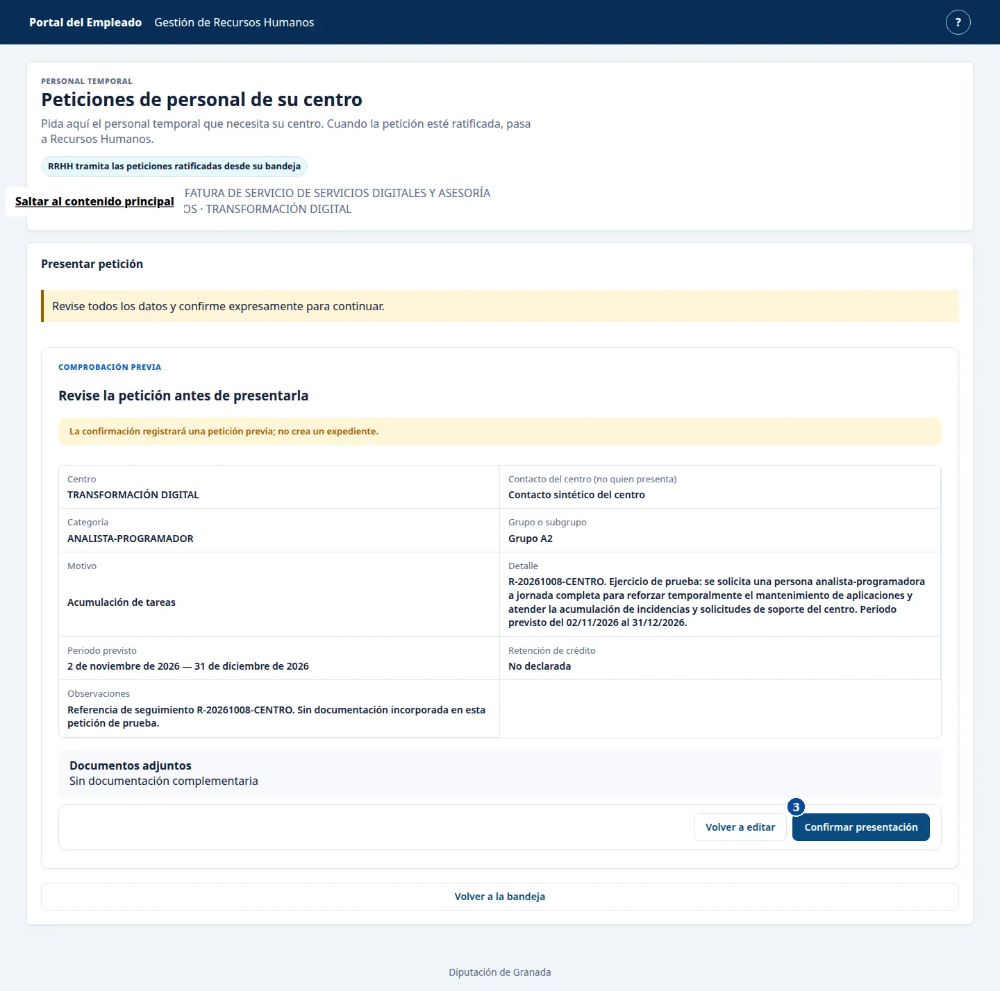
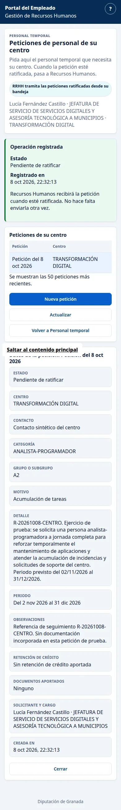
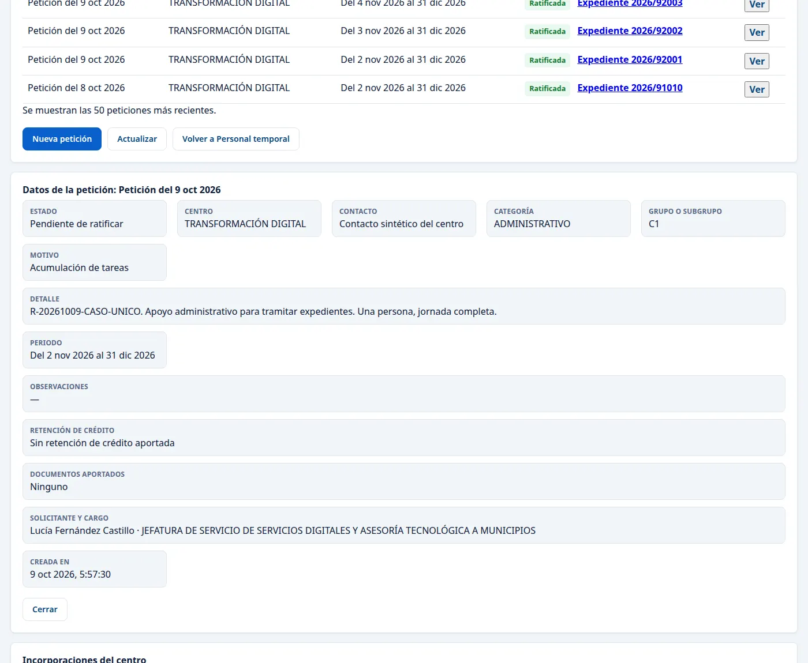

# Centro: presentar una petición de personal temporal

**Recorrido comprobado el 9 de octubre de 2026.** Esta guía explica cómo presentar una petición previa y consultarla después. Las imágenes son encuadres de capturas reales; dejan fuera otras peticiones que aparecían en la misma pantalla. Los datos y las fechas del ejemplo pueden cambiar.

## 1. Entrar en las peticiones del centro

Abra [Peticiones de personal de su centro](https://vec.cidonia.cloud/portal-empleado/peticiones-centro/?lang=es) con su acceso de Centro. Compruebe su nombre, cargo y centro en la parte superior. En el recorrido figura Lucía Fernández Castillo, de TRANSFORMACIÓN DIGITAL. Si esos datos no le corresponden, deténgase y avise a Informática.

En «Peticiones de su centro» pulse «Nueva petición».

## 2. Completar la petición

En «Centro y necesidad», elija su centro, el contacto, la categoría, el grupo o subgrupo y el motivo. El ejemplo usa **ADMINISTRATIVO**, **Grupo C1** y **Acumulación de tareas**. Escriba en «Detalle de la necesidad» qué apoyo necesita y para qué. El ejemplo pidió apoyo administrativo para tramitar expedientes durante el periodo indicado.

Indique las fechas previstas de inicio y fin. Complete «¿Existe retención de crédito?» de acuerdo con los datos de su centro; en el recorrido no se aportó una retención. Revise las observaciones y el apartado de documentación. Pulse «Revisar petición».

En una pantalla estrecha, los campos se colocan uno debajo de otro:

## 3. Revisar y presentar

Compruebe centro, contacto, categoría, motivo, detalle, fechas, retención y documentos. La pantalla avisa: **«La confirmación registrará una petición previa; no crea un expediente»**. Cuando los datos sean correctos, pulse **«Confirmar presentación» una sola vez**.

La pantalla muestra **«Operación registrada»**, **«Pendiente de ratificar»** y la fecha de registro. También dice que no hace falta enviarla otra vez. La imagen siguiente corresponde a la confirmación vista en móvil:

## 4. Consultar la misma petición

Vuelva a «Peticiones de su centro» y localice la fila por fecha, centro, periodo y estado. Pulse **«Ver»** para consultar el detalle. En el recorrido, la misma petición seguía visible después de actualizar la página y al entrar de nuevo; conservaba sus datos y el estado «Pendiente de ratificar».

**«Pendiente de ratificar»** significa que otra persona debe revisar la petición. Recursos Humanos la recibe cuando queda ratificada. La petición previa todavía no es un expediente.

## Si algo sale mal

Si la bandeja muestra **«Todavía no hay peticiones de su centro»** y esperaba encontrar una petición ya presentada, compruebe que aparece su nombre y centro. Si sigue sin verla, avise a Informática antes de presentar otra.

Si ve **«Operación registrada»** y **«No hace falta enviarla otra vez»**, consulte la petición desde «Ver» o vuelva a cargar la bandeja. No pulse de nuevo «Confirmar presentación».
