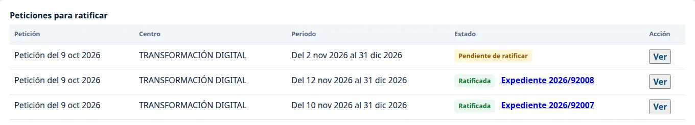
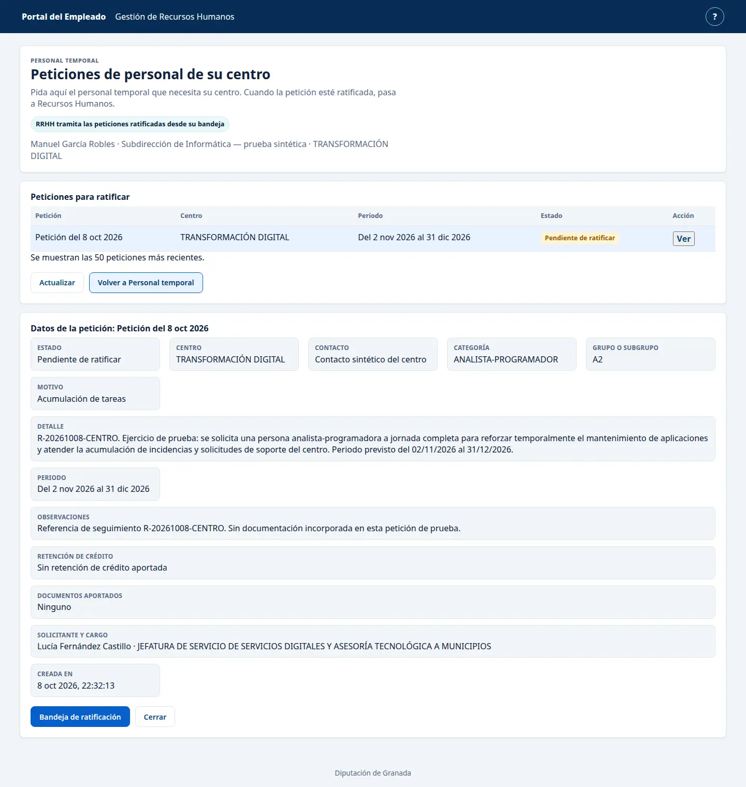
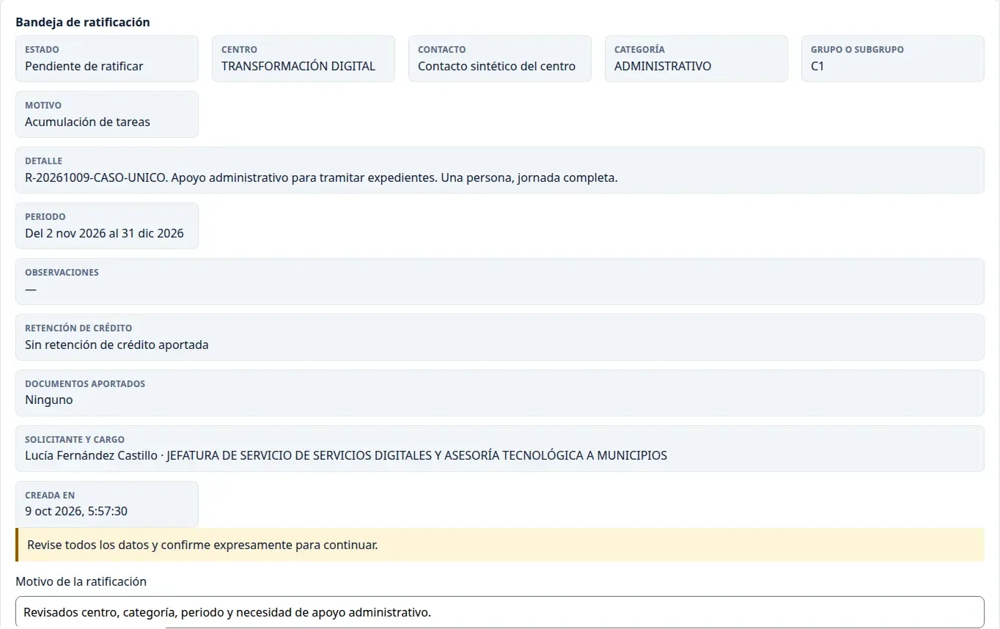
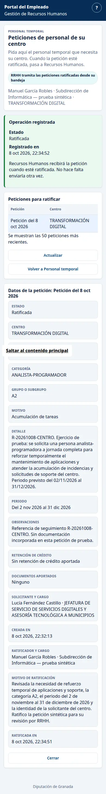
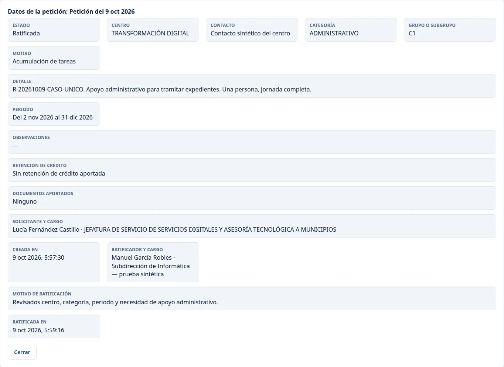

# Ratificar una petición de personal del centro

Este recorrido se comprobó el 9 de octubre de 2026 con el perfil de ratificador. Las imágenes son recortes de los paneles que se usaron ese día; conservan sus datos y controles. Identificarse en el portal no firma ningún documento.

## Encontrar la petición

1. Abra [Peticiones de personal de su centro](https://vec.cidonia.cloud/portal-empleado/peticiones-centro/?lang=es) con su acceso de ratificador. Compruebe el nombre y el centro que aparecen bajo el título.
2. En **Peticiones para ratificar**, busque la fila por centro, periodo y estado **Pendiente de ratificar**. Pulse **Ver** en esa fila. Puede haber varias peticiones con la misma fecha; compruebe el detalle antes de continuar.

## Revisar los datos

En **Datos de la petición**, compruebe el centro, la persona solicitante y su cargo, la categoría y el grupo, el motivo, la necesidad descrita y el periodo. Revise las observaciones, la retención de crédito y los documentos aportados. La persona que ratifica debe ser distinta de quien solicitó. Si algún dato no corresponde a la petición que debe tramitar, pulse **Cerrar** y consulte la diferencia antes de ratificar.

En el recorrido mostrado, la pantalla decía **Sin retención de crédito aportada** y **Ninguno** en documentos. Esos mensajes describen lo que constaba en la petición; no acreditan una retención ni un documento.

## Confirmar una sola vez

Si los datos coinciden, pulse **Bandeja de ratificación**. Escriba en **Motivo de la ratificación** qué ha revisado. Marque **Confirmo expresamente esta operación** y pulse **Confirmar ratificación de esta petición** una sola vez.

La pantalla muestra **Operación registrada** y el estado **Ratificada**. Recursos Humanos continúa desde su bandeja; el centro no tiene que enviar la petición otra vez.

Para comprobar el resultado, actualice la página con F5 y pulse **Ver** en la misma petición. El detalle debe conservar **Ratificada**, la persona que ratificó, su motivo y la fecha.

## Si algo sale mal

Si aparece **«Todavía no hay peticiones de su centro»**, pulse **Actualizar**. Si sigue vacío, pida a quien solicitó la petición que compruebe si quedó presentada y si corresponde al centro que muestra su sesión.

Si tras confirmar no aparece **«Operación registrada»**, actualice la bandeja y abra la misma petición con **Ver**. Si figura **Ratificada**, consulte el detalle y no confirme otra vez. Si sigue pendiente o no puede consultar el resultado, conserve el mensaje visible y la hora, y comuníquelo a Informática por el cauce habitual.
