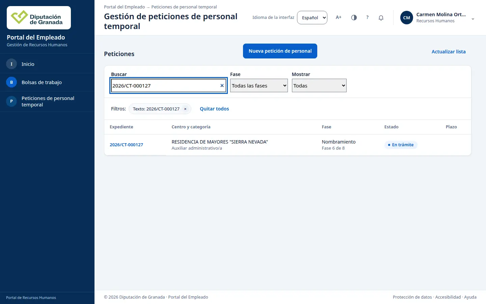
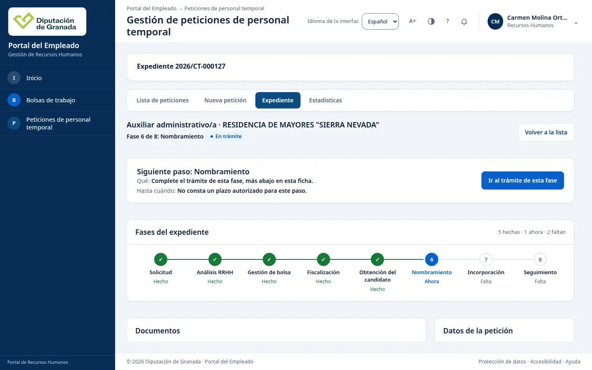
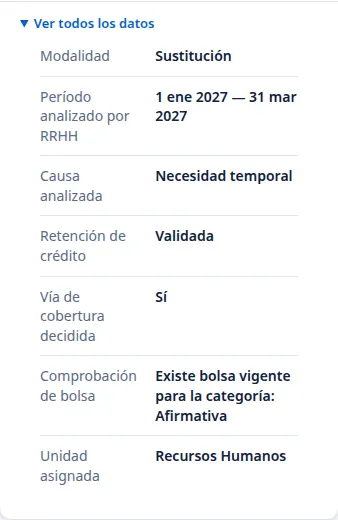
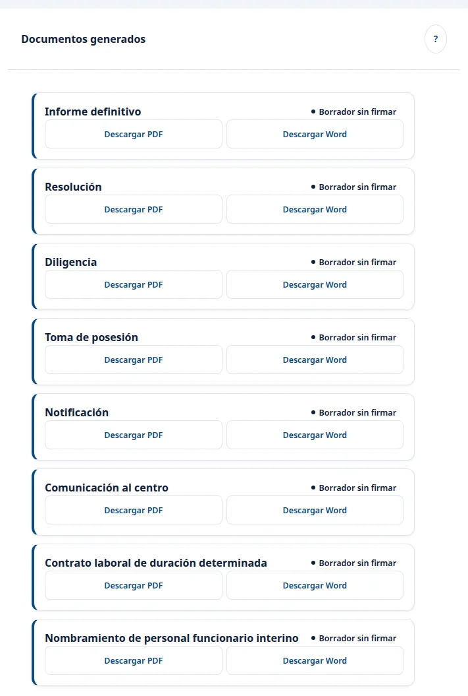

# RRHH: consultar una petición, su historial y sus documentos

Esta guía recoge consultas comprobadas en el Portal del Empleado el 9 de octubre de 2026. Con el acceso de RRHH se puede localizar un expediente, leer su fase, sus datos y las actuaciones registradas, y descargar sus documentos en PDF y Word cuando el expediente está en la fase de nombramiento. Las imágenes muestran un ejemplo; su número y sus datos pueden cambiar.

## Abrir la ficha

1. Entre en **Peticiones de personal temporal** desde Inicio.
2. Escriba el número en **Buscar** y pulse la referencia de la fila. En el ejemplo se abrió `2026/93001`.
3. Revise la fase, el estado y **Siguiente paso**. La línea de fases indica lo hecho, la fase actual y lo que falta.

En **Datos de la petición**, compruebe centro, categoría, grupo, motivo, período y jornada. Pulse **Ver todos los datos** cuando necesite el análisis y la vía de cobertura. El coste mostrado es la estimación registrada en el análisis.

## Leer las actuaciones registradas

Baje a **Historial**. Cada entrada muestra la actuación y cuándo se registró. Pulse **Ver detalle técnico** si necesita comprobar la versión y la secuencia completa. En el ejemplo se leen el alta, el análisis, la decisión de cobertura, la asignación y el informe jurídico generado. La ficha se recuperó después de abrirla de nuevo desde la lista.

Para regresar, pulse **Volver a la lista**. Si actualiza la página y aparece la lista, busque de nuevo el mismo número antes de seguir.

## Descargar los documentos del expediente

Baje hasta el panel **Documentos generados**, dentro de la misma ficha. Cada documento aparece en su tarjeta con la marca **Borrador sin firmar** y dos botones: **Descargar PDF** y **Descargar Word**. Los archivos llevan el logotipo de la Diputación. El PDF del informe del ejemplo indica en su primera página que es un borrador no firmado ni validado.

La descarga solo funciona cuando el expediente está en la fase **Nombramiento**. En el ejemplo se usó `2026/CT-000127`, que está en esa fase:

1. En **Peticiones de personal temporal**, escriba la referencia en **Buscar** y abra la ficha.

   

2. Compruebe en la cabecera que la fase actual es **Nombramiento**.

   

3. Si quiere revisar antes el análisis, pulse **Ver todos los datos** en **Datos de la petición**. En el ejemplo, la retención de crédito figura como **Validada**.

   

4. En **Documentos generados**, pulse **Descargar PDF** o **Descargar Word** en la tarjeta que necesite. El navegador guarda el archivo según su configuración.

   

En el ejemplo aparecen ocho documentos: informe definitivo, resolución, diligencia, toma de posesión, notificación, comunicación al centro, contrato laboral de duración determinada y nombramiento de personal funcionario interino.

En un expediente que todavía no ha llegado a **Nombramiento** también se ve la lista, pero la descarga no se completa: la ficha avisa de que no se ha guardado ningún documento. Los documentos de **cese** y de **modificación del nombramiento** solo se pueden descargar después de registrar esa actuación en el expediente.

## Alcance de este acceso

Este recorrido comprobó la **consulta** de la ficha, del historial y de los documentos. No comprobó una acción propia para **resolver** ni para **firmar** con este acceso. Un documento descargado sigue siendo un borrador: no está firmado ni produce efectos.

Si el panel de documentos muestra «No se pudieron consultar los borradores publicados», pulse **Reintentar consulta**. Si el mensaje continúa, conserve el número del expediente y comunique el mensaje a Informática.
