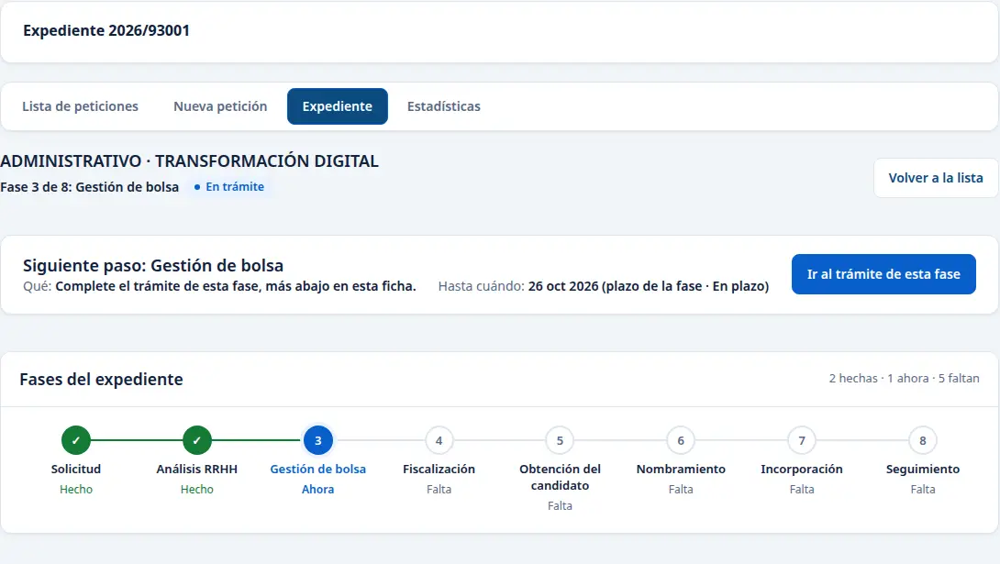
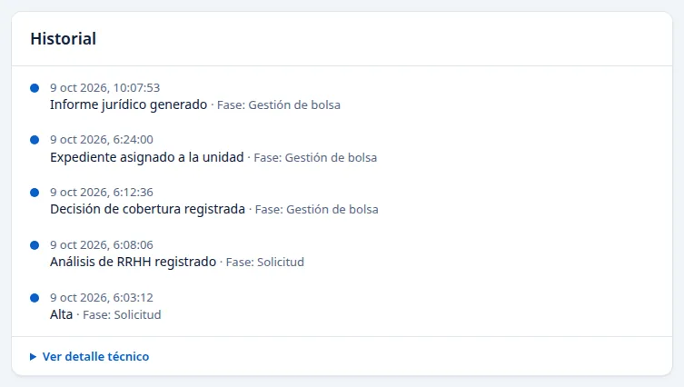

# RRHH: consultar una petición y su historial

Esta guía recoge consultas comprobadas en el Portal del Empleado el 9 de octubre de 2026. Con el acceso de RRHH utilizado en el recorrido se pudo localizar un expediente, leer su fase, sus datos y las actuaciones registradas. Las imágenes muestran un ejemplo; su número y sus datos pueden cambiar.

## Abrir la ficha

1. Entre en **Peticiones de personal temporal** desde Inicio.
2. Escriba el número en **Buscar** y pulse la referencia de la fila. En el ejemplo se abrió `2026/93001`.
3. Revise la fase, el estado y **Siguiente paso**. La línea de fases indica lo hecho, la fase actual y lo que falta.

En **Datos de la petición**, compruebe centro, categoría, grupo, motivo, período y jornada. Pulse **Ver todos los datos** cuando necesite el análisis y la vía de cobertura. El coste mostrado procede de la fuente registrada; leerlo no autoriza un gasto.

## Leer las actuaciones registradas

Baje a **Historial**. Cada entrada muestra la actuación y cuándo se registró. Pulse **Ver detalle técnico** si necesita comprobar la versión y la secuencia completa. En el ejemplo se leen el alta, el análisis, la decisión de cobertura, la asignación y la preparación del informe. La ficha se recuperó después de abrirla de nuevo desde la lista.

Para regresar, pulse **Volver a la lista**. Si actualiza la página y aparece la lista, busque de nuevo el mismo número antes de seguir.

## Alcance de este acceso

Este recorrido comprobó la **consulta** de la ficha y del historial. No comprobó una acción propia para **resolver** ni para **firmar** con este acceso. El informe que figuraba en el expediente seguía pendiente de revisión y firma; verlo en la ficha no acredita una firma.

Si aparece «La consulta de documentos generados no está disponible», conserve el número del expediente y comunique el mensaje a Informática. Esta guía no indica descargas PDF o Word: no se ofrecieron en la ficha comprobada.
