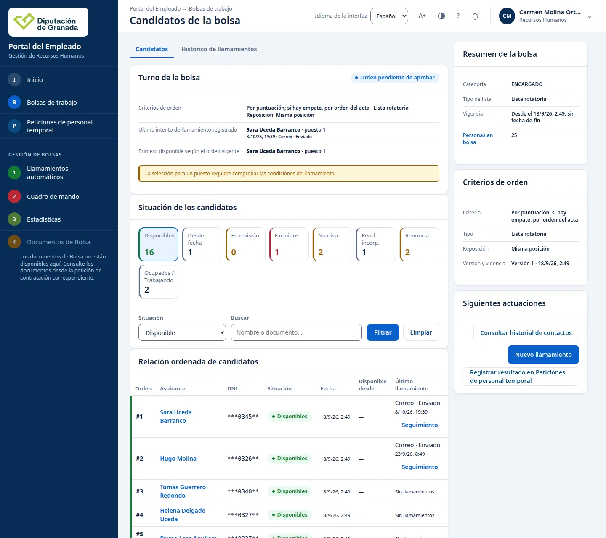
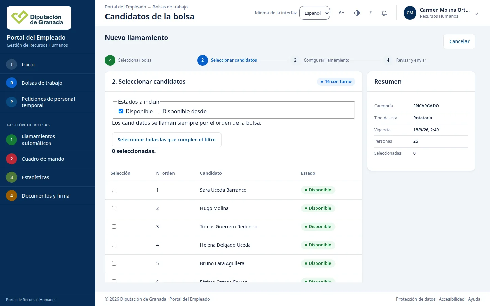
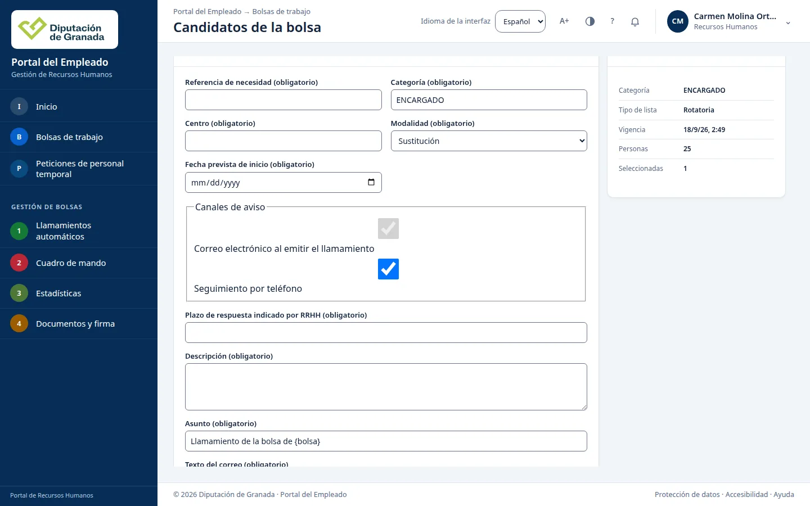
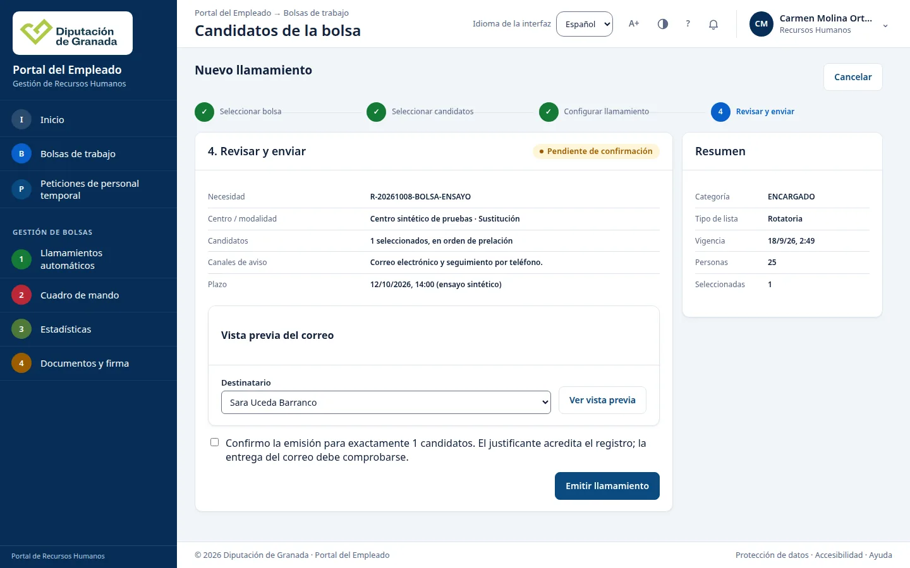
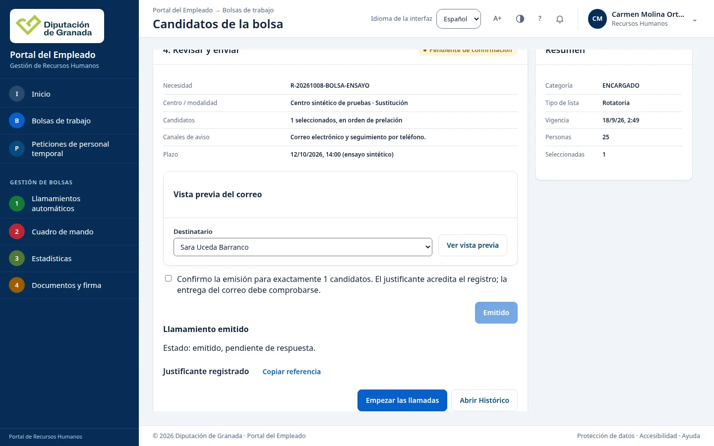

# RRHH: consultar y localizar información

**Comprobado el 8 de octubre de 2026.** Este manual explica cómo entrar en el portal, cambiar el idioma y localizar peticiones, categorías, bolsas y la carpeta personal. Las cifras de las imágenes corresponden a ese día y pueden cambiar.

## Entrar en Inicio

Abra [el portal de Recursos Humanos](https://vec.cidonia.cloud/portal-empleado/?lang=es#portal) con su acceso de RRHH. La primera pantalla se titula «Inicio». En «Lo pendiente» verá los plazos y las incidencias. Más abajo aparecen las peticiones por fase y un resumen de bolsas de trabajo.

En una pantalla estrecha, los mismos apartados se colocan uno debajo de otro:

## Cambiar el idioma · 1

Abra «Idioma de la interfaz» **(1)** y elija «English» o «Español». El título y los nombres de los controles cambian al idioma elegido. Puede volver a elegir español desde el mismo selector.

## Localizar una petición con incidencia · 4

En «Lo pendiente», pulse «Ver lista» bajo «Con una incidencia abierta» **(4)**. Se abre «Gestión de peticiones de personal temporal» con el filtro «Con una incidencia abierta» visible. La lista indica cuántas peticiones cumplen el filtro; el día de la comprobación mostraba «1 de 1 peticiones».

En la fila puede leer el número de expediente, la fase, el estado y el plazo. El caso mostrado estaba en «Fiscalización», «Fase 4 de 8», con estado «Con incidencia» y plazo «Vencido». Pulse «Inicio» en el menú lateral para volver a la portada.

Para abrir la lista general, pulse «Ver todas las peticiones» **(6)** en la cabecera de «Lo pendiente». En esa pantalla aparecen la búsqueda y los filtros «Fase» y «Mostrar». El día de la comprobación mostraba 71 peticiones.

## Consultar las categorías de los puestos · 2

Desde Inicio, pulse «Categorías de la RPT» **(2)**. RPT es la relación de puestos de trabajo. Se abre el «Listado de categorías», con un campo «Buscar categoría o grupo», otro de «Grupo o subgrupo» y el número de categorías encontradas. El día de la comprobación se mostraban 151.

## Abrir Mi carpeta personal · 3

En «Mi espacio», pulse «Mi carpeta personal» **(3)**. Se abre «Personal · consulta informativa», con «Mi ficha integral» y las pestañas «Ficha», «Contacto» y «Catálogos». En la pestaña «Catálogos» aparece el aviso «Catálogo pendiente de validación por RRHH; no es una RPT aprobada».

## Consultar el resumen de bolsas · 5

Pulse «Bolsas de trabajo» **(5)** en el menú lateral de Inicio. Se abre «Bolsas de trabajo activas». Sus indicadores muestran bolsas visibles, aspirantes, disponibles y personas en renuncia; la tabla desglosa las cifras por bolsa. El día de la comprobación mostraba 12 bolsas, 390 aspirantes y 252 disponibles. Es un resumen de bolsas, no una lista de personas filtrada.

Para volver a Inicio, pulse «Inicio» en el menú lateral o use el botón Atrás del navegador.

## Ver los integrantes de una bolsa

En el resumen de bolsas, pulse la cifra de la columna «Disponibles» de la bolsa que necesita. Se abre «Candidatos de la bolsa» con esa situación seleccionada. En el ejemplo, ENCARGADO muestra 16 personas disponibles.

Use «Buscar» para localizar a una persona y «Situación» para cambiar el estado que consulta. Pulse «Filtrar» para aplicar los cambios. «Limpiar» los retira. Cuando hay varias páginas, «Siguiente» muestra las siguientes personas.

## Emitir un llamamiento

1. En la lista de candidatos, pulse «Nuevo llamamiento» y seleccione la bolsa.
2. Marque las personas siguiendo el orden que muestra la lista. Revise quiénes ha seleccionado antes de avanzar.

3. En «Configurar llamamiento», indique la necesidad, el centro y los canales de aviso. Complete el asunto y el texto del correo.

4. En «Revisar y enviar», compruebe las personas, los canales y el contenido del aviso. Marque la confirmación expresa y pulse «Emitir llamamiento» una sola vez.

5. La pantalla muestra «Llamamiento emitido» y «pendiente de respuesta». Vuelva a la lista y consulte «Histórico de llamamientos» para ver la nueva actuación.

«Pendiente de respuesta» significa que todavía debe comprobarse la respuesta de la persona. La emisión del llamamiento y la llegada del correo son comprobaciones distintas.

## Si algo sale mal

Mientras aparece «Comprobando», espere a que termine la carga. Si el mensaje permanece y no aparecen los datos, recargue la página. Si sigue igual, indique a Informática qué pantalla abrió y el mensaje que ve.

Cuando una petición muestra «Con incidencia», abra su ficha antes de seguir con el trámite. El estado avisa de que hay un asunto pendiente; por sí solo no indica qué debe corregir.

Para consultar y descargar los borradores de una petición, siga la [guía de fichas y documentos](responsable_rrhh.md).
