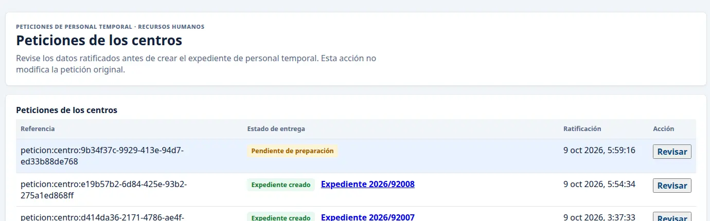
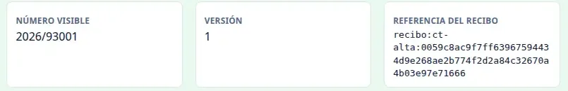
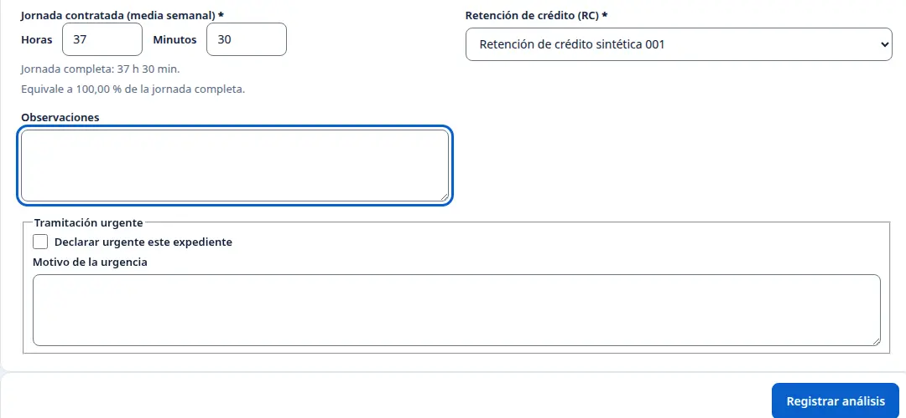
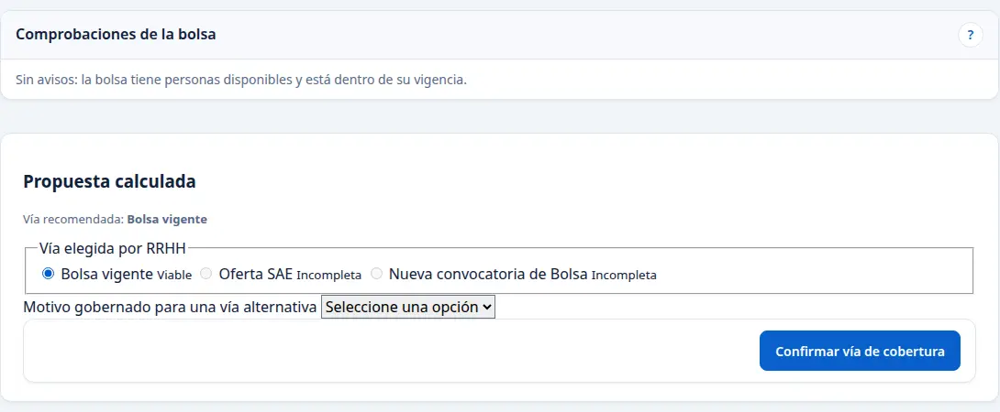
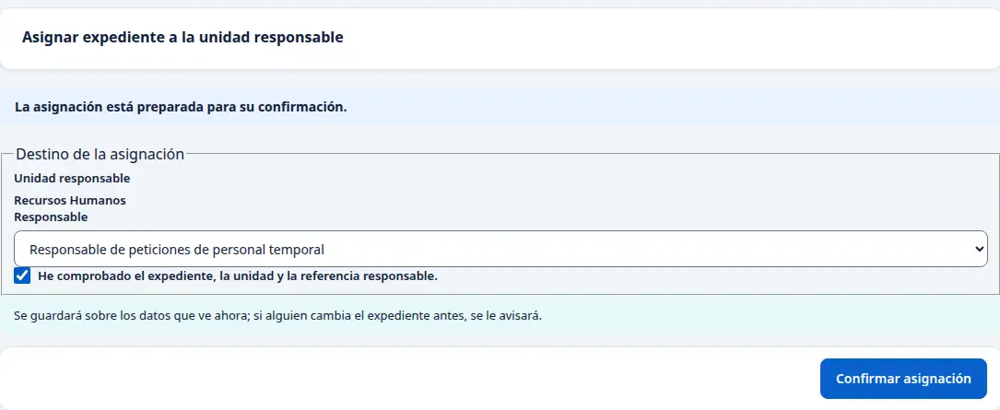
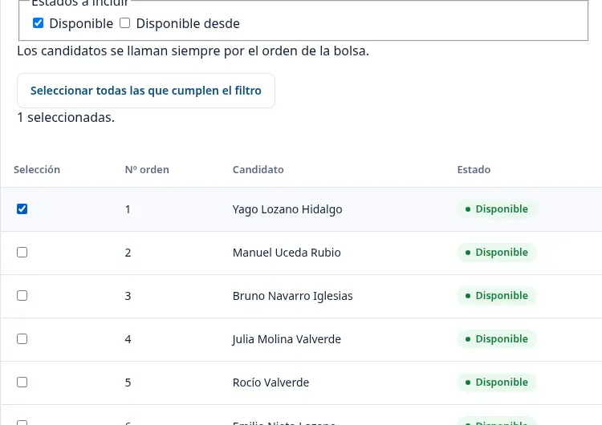
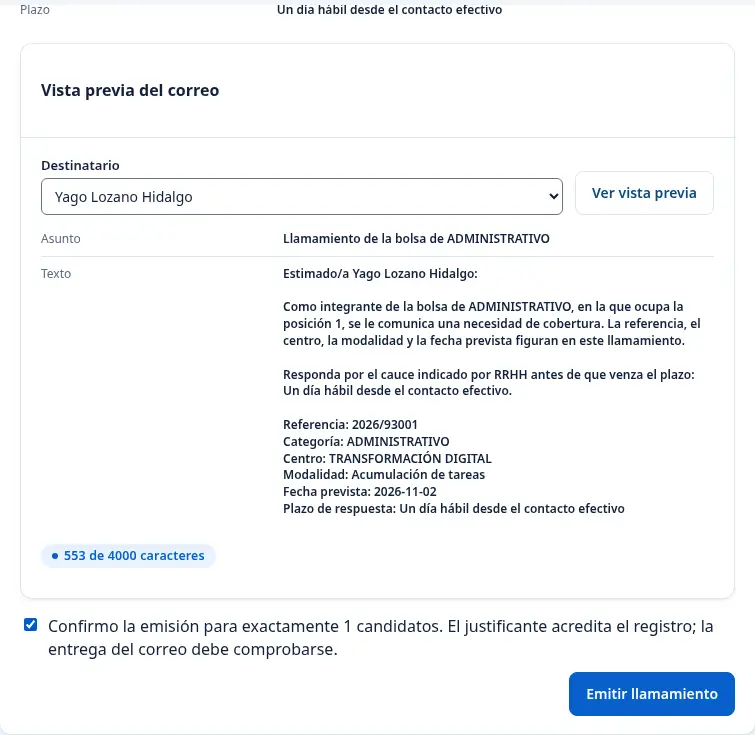
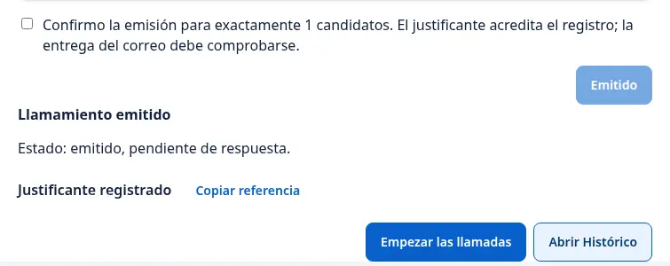
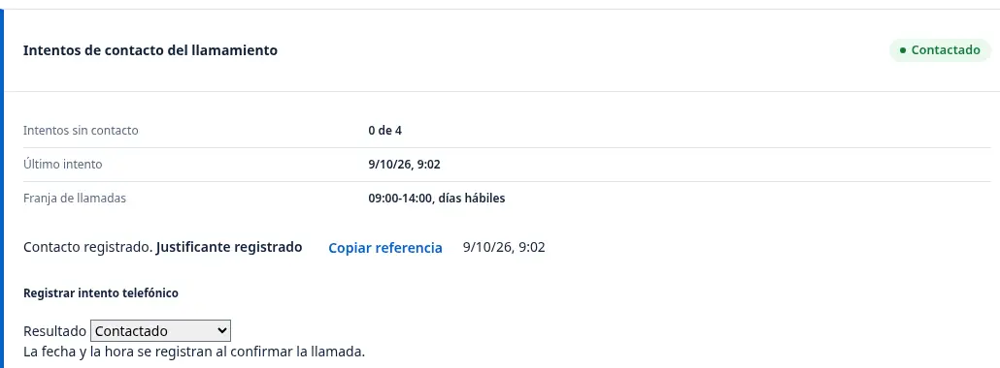

# RRHH: de la petición del centro al primer contacto

La navegación se comprobó el 8 de octubre de 2026. El recorrido desde una petición ratificada hasta el primer contacto se comprobó el 9 de octubre. Las cifras y personas de las imágenes pertenecen a esos ejemplos y pueden cambiar.

## Entrar en Inicio

Abra [el portal de Recursos Humanos](https://vec.cidonia.cloud/portal-empleado/?lang=es#portal) con su acceso de RRHH. La primera pantalla se titula «Inicio». En «Lo pendiente» verá los plazos y las incidencias. Más abajo aparecen las peticiones por fase y un resumen de bolsas de trabajo.

En una pantalla estrecha, los mismos apartados se colocan uno debajo de otro:

## Cambiar el idioma · 1

Abra «Idioma de la interfaz» **(1)** y elija «English» o «Español». El título y los nombres de los controles cambian al idioma elegido. Puede volver a elegir español desde el mismo selector.

## Consultar las categorías de los puestos · 2

Desde Inicio, pulse «Categorías de la RPT» **(2)**. RPT es la relación de puestos de trabajo. Se abre el «Listado de categorías», con un campo «Buscar categoría o grupo», otro de «Grupo o subgrupo» y el número de categorías encontradas. El día de la comprobación se mostraban 151.

## Localizar una petición con incidencia · 3

En «Lo pendiente», pulse «Ver lista» bajo «Con una incidencia abierta» **(3)**. Se abre «Gestión de peticiones de personal temporal» con el filtro «Con una incidencia abierta» visible. La lista indica cuántas peticiones cumplen el filtro; el día de la comprobación mostraba «1 de 1 peticiones».

En la fila puede leer el número de expediente, el centro y la categoría, la fase, el estado y el plazo. El caso mostrado estaba en «Fiscalización», «Fase 4 de 8», con estado «Con incidencia» y plazo «Vencido». Pulse «Inicio» en el menú lateral para volver a la portada.

## Consultar el resumen de bolsas · 4

Pulse «Bolsas de trabajo» **(4)** en el menú lateral de Inicio. Se abre «Bolsas de trabajo activas». Sus indicadores muestran bolsas visibles, aspirantes, disponibles y personas en renuncia; la tabla desglosa las cifras por bolsa. El día de la comprobación mostraba 12 bolsas, 390 aspirantes y 252 disponibles. Es un resumen de bolsas, no una lista de personas filtrada.

Para volver a Inicio, pulse «Inicio» en el menú lateral o use el botón Atrás del navegador.

## Ver los integrantes de una bolsa

En «Bolsas de trabajo activas», pulse la cifra de la columna «Disponibles» de la bolsa que necesita. Se abre «Candidatos de la bolsa» con la situación «Disponible» ya elegida y la relación ordenada de esas personas. En el ejemplo, ENCARGADO muestra 16 personas disponibles.

Use «Buscar» para localizar a una persona por nombre o documento y «Situación» para consultar otro estado. Pulse «Filtrar» para aplicar los cambios y «Limpiar» para quitarlos.

## Abrir la lista general de peticiones · 5

En Inicio, pulse «Ver todas las peticiones» **(5)** en la cabecera de «Lo pendiente». Se abre la lista con búsqueda y los filtros «Fase» y «Mostrar». Cada fila muestra el centro y la categoría por su nombre, además de la fase, el estado y el plazo. El día de la comprobación había 72 peticiones, 46 de ellas en «Solicitud».

## Recibir una petición ratificada del centro

1. Abra [Peticiones de los centros](https://vec.cidonia.cloud/portal-empleado/peticiones-centro/?lang=es&vista=rrhh) con el acceso de RRHH. Las peticiones ratificadas que aún no tienen expediente aparecen con el estado de entrega **Pendiente de preparación**. Localice la suya por la fecha y hora de la columna **Ratificación** y pulse **Revisar**. Las que ya tienen expediente muestran **Expediente creado** y su número.
2. Compruebe centro, categoría, grupo, motivo, período, número de personas y jornada. Compruebe también si el centro aportó una retención de crédito o documentos. En el ejemplo, el centro pidió una persona de la categoría Administrativo, a jornada completa, y no aportó retención.
3. Pulse **Crear expediente en RRHH**. En la revisión escriba el número de expediente asignado por el circuito de gestión, marque la confirmación expresa y pulse **Crear expediente en RRHH** una sola vez. Si no dispone de ese número, deténgase.
4. La pantalla muestra el recibo del alta. Anote dos datos: el **Número visible**, que es el número del expediente, y la **Referencia del recibo**, que sirve para comprobar el alta si algo falla. Use **Abrir el expediente** para seguir con el mismo caso. En el ejemplo se creó `2026/93001`.

## Registrar el análisis de RRHH

Abra la ficha desde la lista y revise sus datos. En **Registrar análisis de RRHH**, elija la modalidad, la categoría, el grupo y la causa que correspondan a la petición. Compruebe fechas y jornada. La retención de crédito se elige de la fuente disponible para RRHH: que el centro no la aportara no significa que esté validada. Si no cuenta con una retención respaldada, detenga el análisis.

En el recorrido, RRHH seleccionó **Acumulación de tareas**, **Administrativo**, **C1**, **Necesidad temporal**, el período solicitado y jornada completa. Eligió una retención disponible para ese ejercicio y dejó la urgencia sin marcar. Pulse **Registrar análisis** una sola vez. La pantalla confirma **Análisis guardado** y **Justificante registrado**. Al reabrir la ficha, **Análisis RRHH** aparece como **Hecho**.

## Decidir la cobertura y asignar la unidad

1. En **Decidir la vía de cobertura**, lea las comprobaciones de la bolsa. Si la pantalla propone **Bolsa vigente** como vía viable para la categoría, selecciónela y pulse **Confirmar vía de cobertura**. Revise el aviso de confirmación antes de aceptarlo. La pantalla muestra **Decisión confirmada**.
2. Vuelva a la ficha del mismo expediente. En el ejemplo apareció **Asignar expediente a la unidad responsable**, con **Recursos Humanos** y **Responsable de peticiones de personal temporal**. Compruebe ambos datos, marque la casilla de revisión y pulse **Confirmar asignación** una sola vez. Para comprobar el resultado, vuelva a abrir el mismo expediente y consulte la actuación de asignación en **Historial**.

## Emitir un llamamiento para la persona elegida

Desde la ficha asignada, pulse **Abrir llamamiento en Bolsa**. El asistente conserva la petición de origen; compruebe que muestra la bolsa de la categoría correspondiente. En el ejemplo fue **ADMINISTRATIVO**, con 41 personas.

1. Pulse **Seleccionar esta bolsa**. En **Seleccionar candidatos**, marque solo a la persona que corresponda tras revisar el orden y las condiciones del llamamiento. En el ejemplo se marcó únicamente a **Yago Lozano Hidalgo**, puesto 1. Estar en la primera fila no sustituye esas comprobaciones.
2. En **Configurar llamamiento**, compruebe la referencia, el centro y la fecha que ya trae la pantalla. Elija la modalidad y describa la necesidad con los datos de la petición. Mantenga el contacto ya registrado; no escriba un correo o teléfono nuevo para completar la pantalla.
3. Indique el plazo de respuesta que RRHH haya fijado para esa oferta. En el ejemplo se usó **«Un día hábil desde el contacto efectivo»**. Era la regla disponible para ese ejercicio; este manual no la presenta como plazo legal aprobado para otros casos.
4. En **Revisar y enviar**, compruebe que queda **una persona**, que el aviso nombra a la persona correcta y que los canales son los previstos. En el recorrido aparecieron correo al emitir y seguimiento por teléfono. Abra **Ver vista previa**, marque la confirmación para una persona y pulse **Emitir llamamiento** una sola vez.
5. Compruebe la confirmación **Llamamiento emitido** y **Justificante registrado**. Pulse **Empezar las llamadas** para consultar el seguimiento del mismo llamamiento. **Emitido, pendiente de respuesta** indica que está esperando contestación; consulte después la entrega del correo y la respuesta de la persona.

## Anotar el contacto telefónico

Pulse **Empezar las llamadas** desde el justificante del llamamiento. La lista muestra las personas de ese llamamiento por orden. Abra **Ver ficha y llamar** de la persona correspondiente.

Compruebe la franja que muestra la ficha. En el recorrido era de **09:00 a 14:00, en días hábiles**. Dentro de esa franja, seleccione el resultado que realmente ocurrió y pulse **Registrar resultado** una sola vez. La aplicación registra la fecha y la hora; no las cambie para simular un contacto. En el ejemplo se registró **Contactado**, sin anotación añadida. Al volver a consultar, la ficha conservó una llamada y el justificante.

**Contactado** no significa que la persona haya aceptado o renunciado. Su respuesta se consulta por el cauce que le corresponde.

## Si algo sale mal

Si tras confirmar la cobertura aparece «La cobertura está confirmada, pero la asignación no está disponible. Conserve el recibo y solicite revisión», no confirme la cobertura de nuevo. Vuelva a la lista y abra el mismo expediente. En el recorrido, la ficha recuperada mostró el formulario de asignación. Si no aparece, conserve el número del expediente y el mensaje visible, y comuníquelos a Informática.

Si la ficha telefónica dice «Fuera de la franja», espere al horario indicado. No registre una llamada con otra hora ni abra otro llamamiento. Si una respuesta queda incierta, recupere el expediente o el justificante antes de repetir cualquier acción.
