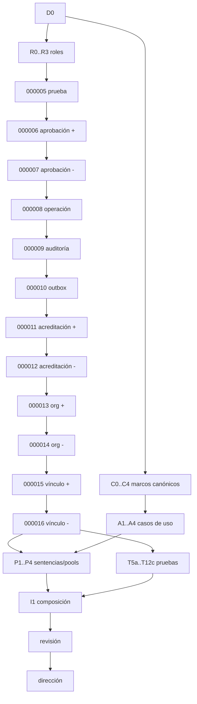

# Coordinación C2.3-D0: publicación y revocación corporativas

Fecha: 31 de julio de 2026.

Estado: **diseño corregido tras NO-GO; implementación pendiente; producción
NO-GO**.

Base inventariada: `51a4390066ab19031fbe4e6ac9696372f3c801b0` de
`integracion/ct-o4-04e-20260726`.

## Resultado y límites

C2.3 aportará cuatro actos exteriores, separados y gobernados:

```text
publicar organización
revocar organización
publicar vínculo corporativo RRHH
revocar vínculo corporativo RRHH
```

Cada acto confirmará en una transacción `SERIALIZABLE READ WRITE` la
acreditación durable del actor, el control optimista, la historia, el puntero,
la operación, la auditoría y el outbox. Replay exacto devuelve el mismo
resultado; colisión, indisponibilidad o `COMMIT` incierto nunca equivalen a
éxito.

C2.3 no selecciona candidatos, no crea el recibo corporativo 1:1, no consulta
el PDP y no expone HTTP, web, CLI o MCP. ContextoActor materializa una fuente
gobernada; no se convierte en fuente maestra.

Fuentes vinculantes:

- [decisión de contexto corporativo](decision_contexto_corporativo_rrhh_ct_000047c2_2026-07-30.md);
- [decisión C2.2](decision_c2_2_organizacion_y_vinculo_corporativo_2026-07-30.md);
- [coordinación C2.2-A](coordinacion_c2_2_a_organizacion_corporativa_2026-07-31.md);
- [coordinación C2.2-B](coordinacion_c2_2_b_vinculo_corporativo_2026-07-31.md);
- [revisión final C2.2-B](revisiones/revision_c2_2_b_vinculo_corporativo_2026-07-31.md);
- [matriz normativa](matriz_normativa_contratacion_temporal_2026-07-23.md).

La base cerrada se reutiliza: `000001` posee procedencias y actores; `000002`,
la generación y serialización comunes; `000003`, organización; `000004`,
vínculo corporativo. El selector conserva solo `CONNECT` y nunca escribe.

## Numeración corregida

La reserva anterior de un único `000005` no permite aislar persistencia,
acreditación y cuatro fachadas bajo el límite de 800 líneas. Se sustituye,
antes de programar, por esta reserva formal:

```text
000005  presentación fuerte del actor C2.3
000006  publicación de aprobación durable C2.3
000007  revocación de aprobación durable C2.3
000008  diario de operaciones C2.3
000009  auditoría C2.3
000010  outbox C2.3
000011  publicación de acreditación C2.3
000012  revocación de acreditación C2.3
000013  publicación de organización C2.3
000014  revocación de organización C2.3
000015  publicación de vínculo C2.3
000016  revocación de vínculo C2.3
000017..000024  reserva cerrada para subdivisión C2.3; no reutilizable
000025  selección y recibo privado C2.4
000026  fachada y reconciliación corporativa C2.5
000027  acreditación nominal de uso C2.8
```

`000008..000010` son puertos internos completos, cada uno con fachada privada
nominal que constituye su consumidor, retirada y runner propios; ningún rol
exterior puede ejecutarla. `000011` compone los tres sin exponerlos. No se usan
`\ir`, SQL generado,
concatenación ni un empaquetador oculto. Cada `up/down` es autónomo, literal,
transaccional y menor de 800 líneas. Cada `down` rechaza si permanece cualquiera
de sus consumidores posteriores; el orden de retirada es estrictamente
`000016→…→000005`.

## Roles y raíz de autoridad

Se crean cuatro grupos `NOLOGIN`, sin atributos administrativos, contraseña,
caducidad, ajustes ni membresías entre ellos:

```text
vec_contexto_actor_gobierno_corporativo_acreditador
vec_contexto_actor_gobierno_corporativo_aprobador
vec_contexto_actor_corporativo_rrhh_publicador
vec_contexto_actor_corporativo_rrhh_revocador
```

Al nacer reciben solo `CONNECT`. `000005` concede a los cuatro grupos solo la
presentación de su propia prueba. `000006/000007` conceden al aprobador una
fachada nominal cada una. `000011/000012` hacen lo mismo con el acreditador.
`000013/000015` conceden al publicador una publicación y `000014/000016`, al
revocador cada retirada. Ninguno obtiene tablas,
columnas, secuencias, funciones privadas, `CREATE`, `TEMPORARY`, `MAINTAIN`,
`TRUNCATE`, DML directo o `SET ROLE`.

Un consumidor debe ser `LOGIN INHERIT`, no administrativo, miembro directo de
un solo grupo mediante `ADMIN=false, INHERIT=true, SET=false`. Se rechazan
membresías directas o transitivas adicionales, incluso selector, propietario,
migrador o runtime. Publicador, revocador, aprobador y acreditador usan identidades y
pools físicos distintos.

La acreditación técnica se comprueba antes de esperar y después de todos los
locks, justo antes del reloj y del efecto. La identidad se deriva solo de
`session_user`; no llega por argumento, JSON, cookie, cabecera o configuración.

Los `LOGIN` y secretos los crea Sistemas fuera de Git. Cualquier cambio de
rol/membresía debe respetar las barreras de este documento. Sin procedimiento
operativo compatible, producción queda cerrada.

## Acreditación durable actor–autoridades

Un rol funcional no basta: permitiría atribuir a otra fuente maestra un dato
presentado por el mismo grupo. `000011` incorpora una acreditación de solo adición,
versionada, revocable y única por `(actor_tecnico_oid, acto)`.

Cada versión compromete:

- `acreditacion_ref`, versión y estado;
- OID y nombre exactos del `LOGIN` objetivo;
- quinteto de prueba fuerte: tipo, principal, referencia, versión y huella;
- OID y nombre del grupo funcional permitido;
- uno de los cuatro actos nominales;
- cuarteto de procedencia permitido;
- cuarteto del generador opaco, obligatorio solo al publicar organización;
- cuarteto de autoridad del catálogo de motivos;
- aprobación: referencia, versión y huella, mediante FK durable;
- ventana `[vigente_desde,vigente_hasta)`;
- `session_user` acreditador por OID/nombre, operación e instante.

OID y nombre se cotejan juntos con `pg_authid`, atributos y membresía exacta.
`000005` impone enrolamiento en dos tiempos: el futuro actor, desde su propio
pool, llama a `presentar_prueba_actor_gobierno_v1`, sin argumentos de
identidad. SQL deriva `session_user`, OID y prueba del backend y guarda una
presentación versionada, de uso único y con caducidad. GSSAPI exige
`pg_stat_gssapi` autenticada y cifrada; mTLS, `pg_stat_ssl` con DN, emisor y
serie más `pg_hba.conf` acreditado con verificación completa. La historia es
inmutable; el uso inserta un consumo único y avanza el puntero por CAS. Otro
método falla.

La firma exacta es
`presentar_prueba_actor_gobierno_v1(p_operacion_ref text,
p_caduca_en timestamptz,p_preimagen_huella_sha256 text)`. Retorna exactamente
`TABLE(presentacion_ref text,version numeric,actor_oid oid,actor_nombre name,
grupo_oid oid,grupo_nombre name,prueba_huella_sha256 text,presentada_en
timestamptz,caduca_en timestamptz,generacion numeric)`. La referencia es
`pra_` más hex completo de SHA-256 de
`VEC-C2.3-ID-PRUEBA-V1\0||UTF8(p_operacion_ref)`; su preimagen usa
`VEC-C2.3-PRESENTACION-V1\0` y ordena argumentos, identidad/prueba derivadas,
grupo y reloj. Replay exacto devuelve la misma fila.

Después, el acreditador aporta solo referencia, versión y huella de esa
presentación. `000011` la bloquea, relee el backend objetivo persistido, exige
que siga vigente/no consumida y la consume en el mismo `COMMIT` que la
acreditación. Así el backend acreditador nunca pretende probar al actor futuro.
Un rol borrado/recreado o renombrado deja de acreditar aunque conserve el
texto. Tras restaurar una base, Sistemas debe reacreditar los actores dentro
del procedimiento de recuperación; no se confía en coincidencias de OID.

La acreditación no acepta fuente, generador, motivo, actor o acto elegidos por
el futuro publicador. Los fija el acreditador nominal bajo una aprobación
externa. La función de negocio exige coincidencia byte a byte con la versión
actual, activa y vigente. Cero, varias, revocada, caducada o adelantada
producen la misma denegación.
Además vuelve a derivar la prueba del backend funcional y exige coincidencia
con el quinteto acreditado; ningún campo de prueba llega en la llamada.

El recibo de fuente aportado a una operación es solo evidencia de correlación:
no concede autoridad y no se considera firma. La autoridad procede de
`session_user` más la acreditación durable. Si RRHH/Sistemas exigen prueba
criptográfica del recibo, se añadirá un verificador nominal y versión nueva;
producción no puede activarse antes de decidirlo.

`000006` crea `aprobacion_gobierno_corporativo_versiones/actual`; `000007`
añade su revocación. Cada versión
inmutable liga referencia, versión, estado, actor OID/nombre, actos, cuartetos
de fuente/generador/motivos, ventana, autoridad aprobadora OID/nombre y huella
canónica. Las fachadas nominales `publicar_aprobacion_gobierno_v1` y
`revocar_aprobacion_gobierno_v1` derivan al aprobador y su prueba fuerte del
backend vivo; no aceptan una autoridad textual. `000011/000012` exigen
FK completa a la versión, puntero actual exacto, estado activo y vigencia
post-lock. El modelo raíz de esa autoridad y su procedimiento de alta requieren
aprobación de RRHH, Seguridad y DPD; hasta entonces producción sigue NO-GO.

Sus firmas escalares exactas son:

```sql
vec_contexto_actor_v1.publicar_aprobacion_gobierno_v1(
  p_operacion_ref text, p_aprobacion_ref text, p_version_esperada numeric,
  p_actor_oid oid, p_actor_nombre name, p_acto text,
  p_procedencia_ref text, p_procedencia_version numeric,
  p_procedencia_huella_sha256 text, p_procedencia_autoridad text,
  p_generador_ref text, p_generador_version numeric,
  p_generador_huella_sha256 text, p_generador_autoridad text,
  p_motivos_ref text, p_motivos_version numeric,
  p_motivos_huella_sha256 text, p_motivos_autoridad text,
  p_motivo_ref text, p_motivo_version numeric,
  p_motivo_huella_sha256 text, p_vigente_hasta timestamptz,
  p_correlacion_ref text,
  p_preimagen_huella_sha256 text)
vec_contexto_actor_v1.revocar_aprobacion_gobierno_v1(
  p_operacion_ref text, p_aprobacion_ref text, p_version_esperada numeric,
  p_motivo_ref text, p_motivo_version numeric,
  p_motivo_huella_sha256 text, p_correlacion_ref text,
  p_preimagen_huella_sha256 text)
```

Ambas retornan doce columnas con los mismos nombres/tipos del resultado de
gobierno, pero proceden íntegramente de la fila de aprobación: sus referencias
de operación/auditoría/evento y huellas están embebidas y restringidas allí.
No leen ni referencian `000008..000010`; el aprobador y su prueba fuerte se
derivan siempre del backend. Por ello `000006/000007` son verticales completas.

Las fachadas administrativas de `000011/000012` son:

```sql
vec_contexto_actor_v1.publicar_acreditacion_gobierno_corporativo_v1(
  p_operacion_ref text, p_acreditacion_ref text,
  p_version_esperada numeric, p_actor_tecnico_oid oid,
  p_actor_tecnico_nombre name, p_prueba_actor_ref text,
  p_prueba_actor_version numeric, p_prueba_actor_huella_sha256 text,
  p_acto text,
  p_procedencia_ref text, p_procedencia_version numeric,
  p_procedencia_huella_sha256 text, p_procedencia_autoridad text,
  p_generador_ref text, p_generador_version numeric,
  p_generador_huella_sha256 text, p_generador_autoridad text,
  p_prueba_generacion_ref text, p_prueba_generacion_huella_sha256 text,
  p_motivos_ref text, p_motivos_version numeric,
  p_motivos_huella_sha256 text, p_motivos_autoridad text,
  p_aprobacion_ref text, p_aprobacion_version numeric,
  p_aprobacion_huella_sha256 text, p_vigente_hasta timestamptz,
  p_motivo_gobierno_ref text, p_motivo_gobierno_version numeric,
  p_motivo_gobierno_huella_sha256 text, p_correlacion_ref text,
  p_preimagen_huella_sha256 text
)

vec_contexto_actor_v1.revocar_acreditacion_gobierno_corporativo_v1(
  p_operacion_ref text, p_acreditacion_ref text,
  p_version_esperada numeric, p_aprobacion_ref text,
  p_aprobacion_version numeric, p_aprobacion_huella_sha256 text,
  p_motivo_gobierno_ref text, p_motivo_gobierno_version numeric,
  p_motivo_gobierno_huella_sha256 text, p_correlacion_ref text,
  p_preimagen_huella_sha256 text
)
```

El grupo funcional se deriva de `p_acto`; no es argumento. Revocar copia el
vínculo acreditado y crea la versión consecutiva `revocado`; nunca lo cambia.
Ambas fachadas retornan la tabla exacta de doce columnas definida más abajo.

## Persistencia exacta

Todas las tablas son permanentes, del propietario ContextoActor, con RLS
activada/forzada, política única del propietario, ACL de tabla/columna/tipo
cerrada. Historias rechazan `UPDATE/DELETE/TRUNCATE`; punteros solo admiten CAS
por fachada y los consumos son filas de solo adición. Versiones nuevas y
generación son `numeric(20,0)` enteras en `1..2^64-1`; solo
`version_esperada` admite `0..2^64-1`; huellas son 64
hexadecimales minúsculos; instantes son `timestamptz(6)` UTC finitos.

### Enrolamiento y aprobación — `000005..000007`

`presentacion_prueba_actor_versiones` contiene exactamente `presentacion_ref`,
`version`, `actor_oid`, `actor_nombre`, `grupo_oid`, `grupo_nombre`,
`prueba_tipo`, `prueba_principal`, `prueba_ref`, `prueba_version`,
`prueba_huella_sha256`, `estado`, `operacion_ref`, `preimagen_esquema`,
`preimagen_canon`, `preimagen_huella_sha256`, `resultado_huella_sha256`,
`generacion`, `presentada_en`, `caduca_en`, `consumida_operacion_ref` y
`consumida_en`. La tabla
`presentacion_prueba_actor_actual` contiene exactamente `actor_oid`,
`grupo_oid`, `presentacion_ref`, `version`. Presentar crea versión 1 `presentada`;
consumir inserta la versión 2 `consumida`, copiando la prueba, y avanza puntero
por CAS. PK/FK, unicidades, ventana, estados y nulidad conjunta del consumo son
nominales e inmediatos; historia nunca se actualiza. Tipos son los ya fijados;
solo los dos campos de consumo son nulos en versión 1.

`aprobacion_gobierno_corporativo_versiones` contiene exactamente
`aprobacion_ref`, `version`, `estado`, `actor_oid`, `actor_nombre`, `acto`,
los doce campos `procedencia_*`/`generador_*`/`motivos_*`,
`vigente_desde`, `vigente_hasta`, `aprobador_oid`, `aprobador_nombre`,
los cinco campos `aprobador_prueba_*`,
`aprobacion_huella_sha256`, `operacion_ref`, `auditoria_ref`, `evento_ref`,
`motivo_ref`, `motivo_version`, `motivo_huella_sha256`, `correlacion_ref`,
`preimagen_esquema`, `preimagen_canon`, `preimagen_huella_sha256`,
`recibo_efecto_ref`, `resultado_huella_sha256`, `auditoria_huella_sha256`,
`evento_payload_canon`, `evento_huella_sha256`, `generacion`, `inscrita_en`.
Su puntero es
`(aprobacion_ref,version)`. PK, FK completas, estado, ventana, nulidad del
generador y alcance son restricciones nominales no diferibles. Una revocación
añade versión; nunca muta historia.
Aplican los mismos tipos por sufijo y todos son `NOT NULL`, salvo el cuarteto
generador cuando ningún acto aprobado publica organización.

### `operacion_gobierno_corporativo_v1` — `000008`

| Columnas exactas | Tipo/condición |
| --- | --- |
| `operacion_ref` | `text PK`, `opc_` + 22..128 ASCII seguros |
| `acto`, `finalidad`, `ambito` | `text NOT NULL`, seis actos y literales exactos |
| `entidad_ref` | `text NOT NULL`, gramática nominal según acto |
| `actor_tecnico_oid`, `actor_tecnico_nombre` | `oid`, `name`, ambos `NOT NULL` |
| `actor_prueba_tipo`, `actor_prueba_principal`, `actor_prueba_ref`, `actor_prueba_version`, `actor_prueba_huella_sha256` | `text,text,text,numeric(20,0),text`, derivado del backend y `NOT NULL` |
| `acreditacion_ref`, `acreditacion_version` | `text`, `numeric(20,0)`, ambos `NOT NULL`; autorizante en negocio y objetivo en acreditación |
| `version_esperada`, `version_nueva`, `estado_resultante` | dos `numeric(20,0)`, `text`; checks CAS/estado |
| `procedencia_ref`, `procedencia_version`, `procedencia_huella_sha256`, `procedencia_autoridad` | `text,numeric(20,0),text,text`, `NOT NULL` en los seis actos |
| `generador_ref`, `generador_version`, `generador_huella_sha256`, `generador_autoridad` | mismos tipos; obligatorio al publicar organización o acreditar ese acto |
| `prueba_generacion_ref`, `prueba_generacion_huella_sha256` | `text`; mismo criterio de nulidad |
| `motivos_ref`, `motivos_version`, `motivos_huella_sha256`, `motivos_autoridad` | `text,numeric(20,0),text,text`, `NOT NULL` en los seis actos |
| `motivo_ref`, `motivo_version`, `motivo_huella_sha256` | `text,numeric(20,0),text`, exacto y `NOT NULL` en los seis actos |
| `recibo_fuente_ref`, `recibo_fuente_huella_sha256`, `recibo_fuente_caduca_en` | `text UNIQUE,text,timestamptz(6)`; nulos solo en acreditación |
| `correlacion_ref` | `text NOT NULL`, `cor_` + 22..128 |
| `preimagen_esquema`, `preimagen_canon`, `preimagen_huella_sha256` | `text,bytea,text`; canon 1..32768 bytes |
| `recibo_efecto_ref`, `resultado_huella_sha256` | `text UNIQUE,text NOT NULL` |
| `auditoria_ref`, `evento_ref` | `text UNIQUE NOT NULL` |
| `confirmada_en`, `generacion` | `timestamptz(6),numeric(20,0) NOT NULL` |

`operacion_ref` y `recibo_fuente_ref` son únicos para los seis actos. Las
restricciones `CHECK` cruzan nulidad, acto, estado, versiones, autoridad,
prefijos, ventanas y huellas; no se delegan a la aplicación.

### `auditoria_gobierno_corporativo_v1` — `000009`

Columnas exactas: `auditoria_ref text PK`, `operacion_ref text UNIQUE FK`,
`acto text`, `finalidad text`, `ambito text`, `entidad_ref text`,
`actor_tecnico_oid oid`, `actor_tecnico_nombre name`, `acreditacion_ref text`,
`acreditacion_version numeric(20,0)`, `version_anterior numeric(20,0)`,
`version_nueva numeric(20,0)`, `huella_antes text`, `huella_despues text`,
`motivo_ref text`, `motivo_version numeric(20,0)`, `motivo_huella_sha256 text`,
`correlacion_ref text`, `ocurrida_en timestamptz(6)` y
`entrada_huella_sha256 text`; todas `NOT NULL`, salvo `huella_antes` en alta.

### `outbox_gobierno_corporativo_v1` — `000010`

Columnas exactas: `evento_ref text PK`, `operacion_ref text UNIQUE FK`,
`auditoria_ref text UNIQUE FK`, `tipo_evento text`, `acto text`,
`finalidad text`, `ambito text`, `entidad_ref text`,
`entidad_version numeric(20,0)`, `estado text`, `payload_canon bytea`,
`payload_huella_sha256 text` y `creado_en timestamptz(6)`, todas `NOT NULL`.
El payload mide 1..32768 bytes y solo contiene referencias opacas.

No hay FK circular: `auditoria` posee unicidad
`(operacion_ref,auditoria_ref)` y FK de `operacion_ref`; `outbox` posee FKs
completas `(operacion_ref,auditoria_ref)` y `operacion_ref`. En la operación,
`auditoria_ref`, `evento_ref` y `recibo_efecto_ref` tienen `CHECK` contra las
derivaciones nominales del canon; auditoría y outbox repiten el check de su
propia referencia. Por tanto una combinación cruzada no puede
satisfacer simultáneamente checks, unicidades y FKs inmediatas `NO ACTION`.

### Acreditación — `000011/000012`

`acreditacion_gobierno_corporativo_versiones` contiene exactamente:
`acreditacion_ref text`, `version numeric(20,0)`, `estado text`,
`actor_tecnico_oid oid`, `actor_tecnico_nombre name`, `grupo_funcional_oid oid`,
`grupo_funcional_nombre name`, `prueba_actor_tipo text`,
`prueba_actor_principal text`, `prueba_actor_ref text`,
`prueba_actor_version numeric(20,0)`, `prueba_actor_huella_sha256 text`,
`presentacion_prueba_ref text`, `presentacion_prueba_version numeric(20,0)`,
`presentacion_prueba_huella_sha256 text`,
`acto text`, `procedencia_ref text`,
`procedencia_version numeric(20,0)`, `procedencia_huella_sha256 text`,
`procedencia_autoridad text`, `generador_ref text`,
`generador_version numeric(20,0)`, `generador_huella_sha256 text`,
`generador_autoridad text`, `prueba_generacion_ref text`,
`prueba_generacion_huella_sha256 text`, `motivos_ref text`,
`motivos_version numeric(20,0)`, `motivos_huella_sha256 text`,
`motivos_autoridad text`, `aprobacion_ref text`,
`aprobacion_version numeric(20,0)`, `aprobacion_huella_sha256 text`,
`vigente_desde timestamptz(6)`, `vigente_hasta timestamptz(6)`,
`acreditador_oid oid`, `acreditador_nombre name`, `operacion_ref text` e
`inscrita_en timestamptz(6)`. Todos son `NOT NULL`, salvo el cuarteto generador
y su prueba en los tres actos que no publican organización. PK
`(acreditacion_ref,version)`, unicidad
`(actor_tecnico_oid,acto,acreditacion_ref,version)`, FK de operación, FK
completa de aprobación y, en el alta, FK a la presentación fuerte consumida.
Los `CHECK` cierran estado, acto, grupo derivado, prueba fuerte, versión,
ventana, referencias, huellas y la nulidad cruzada del generador.

`acreditacion_gobierno_corporativo_actual` contiene exactamente
`actor_tecnico_oid oid`, `acto text`, `acreditacion_ref text`,
`version numeric(20,0)`; PK `(actor_tecnico_oid,acto)` y FK completa a la
historia. Usa los tres triggers de generación de `000002`.

No se usa `MAX(version)`, puntero implícito, borrado lógico mutable ni
restricción diferible. El runner congelará orden, tipos, `attnotnull`, checks,
FK, acciones `NO ACTION`, índices, triggers, ACL, políticas y comentarios.

## Firmas exactas de los cuatro actos

Las fachadas son `SECURITY DEFINER`, propietario exacto,
`search_path=pg_catalog`, sin argumentos por defecto, variádicos, `OUT` ocultos
ni sobre JSON. Exigen transacción `SERIALIZABLE`, escritura y no diferible.

```sql
vec_contexto_actor_v1.publicar_organizacion_corporativa_v1(
  p_operacion_ref text, p_acreditacion_ref text,
  p_acreditacion_version numeric, p_organizacion_ref text,
  p_version_esperada numeric, p_procedencia_ref text,
  p_procedencia_version numeric, p_procedencia_huella_sha256 text,
  p_procedencia_autoridad text, p_generador_ref text,
  p_generador_version numeric, p_generador_huella_sha256 text,
  p_generador_autoridad text, p_prueba_generacion_ref text,
  p_prueba_generacion_huella_sha256 text, p_recibo_fuente_ref text,
  p_recibo_fuente_huella_sha256 text, p_recibo_fuente_caduca_en timestamptz,
  p_motivos_ref text, p_motivos_version numeric,
  p_motivos_huella_sha256 text, p_motivos_autoridad text,
  p_motivo_ref text, p_motivo_version numeric,
  p_motivo_huella_sha256 text, p_correlacion_ref text,
  p_vigente_hasta timestamptz, p_preimagen_huella_sha256 text
)

vec_contexto_actor_v1.revocar_organizacion_corporativa_v1(
  p_operacion_ref text, p_acreditacion_ref text,
  p_acreditacion_version numeric, p_organizacion_ref text,
  p_version_esperada numeric, p_procedencia_ref text,
  p_procedencia_version numeric, p_procedencia_huella_sha256 text,
  p_procedencia_autoridad text, p_recibo_fuente_ref text,
  p_recibo_fuente_huella_sha256 text, p_recibo_fuente_caduca_en timestamptz,
  p_motivos_ref text, p_motivos_version numeric,
  p_motivos_huella_sha256 text, p_motivos_autoridad text,
  p_motivo_ref text, p_motivo_version numeric,
  p_motivo_huella_sha256 text, p_correlacion_ref text,
  p_vigente_hasta timestamptz, p_preimagen_huella_sha256 text
)

vec_contexto_actor_v1.publicar_vinculo_corporativo_rrhh_v1(
  p_operacion_ref text, p_acreditacion_ref text,
  p_acreditacion_version numeric, p_vinculo_corporativo_ref text,
  p_version_esperada numeric, p_cuenta_ref text, p_cuenta_version numeric,
  p_persona_ref text, p_persona_version numeric, p_perfil_ref text,
  p_perfil_version numeric, p_vinculo_contexto_ref text,
  p_vinculo_contexto_version numeric, p_organizacion_ref text,
  p_organizacion_version numeric, p_procedencia_ref text,
  p_procedencia_version numeric, p_procedencia_huella_sha256 text,
  p_procedencia_autoridad text, p_recibo_fuente_ref text,
  p_recibo_fuente_huella_sha256 text, p_recibo_fuente_caduca_en timestamptz,
  p_motivos_ref text, p_motivos_version numeric,
  p_motivos_huella_sha256 text, p_motivos_autoridad text,
  p_motivo_ref text, p_motivo_version numeric,
  p_motivo_huella_sha256 text, p_correlacion_ref text,
  p_vigente_hasta timestamptz, p_preimagen_huella_sha256 text
)

vec_contexto_actor_v1.revocar_vinculo_corporativo_rrhh_v1(
  p_operacion_ref text, p_acreditacion_ref text,
  p_acreditacion_version numeric, p_vinculo_corporativo_ref text,
  p_version_esperada numeric, p_procedencia_ref text,
  p_procedencia_version numeric, p_procedencia_huella_sha256 text,
  p_procedencia_autoridad text, p_recibo_fuente_ref text,
  p_recibo_fuente_huella_sha256 text, p_recibo_fuente_caduca_en timestamptz,
  p_motivos_ref text, p_motivos_version numeric,
  p_motivos_huella_sha256 text, p_motivos_autoridad text,
  p_motivo_ref text, p_motivo_version numeric,
  p_motivo_huella_sha256 text, p_correlacion_ref text,
  p_vigente_hasta timestamptz, p_preimagen_huella_sha256 text
)
```

Todas retornan exactamente:

```sql
TABLE(
  operacion_ref text, acto text, entidad_ref text,
  version_anterior numeric, version_nueva numeric, estado text,
  recibo_efecto_ref text, resultado_huella_sha256 text,
  auditoria_ref text, evento_ref text,
  confirmada_en timestamptz, generacion numeric
)
```

Acción, finalidad y ámbito no son argumentos. Cada fachada deriva estos
literales y los liga a acreditación, recibo, canon, auditoría y outbox:

| Acto | Acción | Finalidad | Ámbito |
| --- | --- | --- | --- |
| publicar organización | `contexto_actor.organizacion.publicar.v1` | `gobierno_contexto_corporativo_rrhh` | `organizacion_corporativa_rrhh` |
| revocar organización | `contexto_actor.organizacion.revocar.v1` | igual | igual |
| publicar vínculo | `contexto_actor.vinculo_corporativo_rrhh.publicar.v1` | igual | `interna_corporativa:consulta_rrhh` |
| revocar vínculo | `contexto_actor.vinculo_corporativo_rrhh.revocar.v1` | igual | igual |

Los dos actos administrativos persistidos son
`contexto_actor.acreditacion_gobierno.publicar.v1` y
`contexto_actor.acreditacion_gobierno.revocar.v1`, con finalidad
`gobierno_acreditacion_corporativa_rrhh` y ámbito
`actor_tecnico:autoridades_corporativas`.

No existe fachada con selector de acto/entidad ni función de reconciliación
genérica. El replay usa la misma fachada nominal.

## Canon binario Go–PostgreSQL

JSON, concatenación textual y orden de mapas quedan prohibidos. Preimagen,
resultado y payload empiezan respectivamente por
`VEC-C2.3-PREIMAGEN-V1\0`, `VEC-C2.3-RESULTADO-V1\0` y
`VEC-C2.3-EVENTO-V1\0`, y usan el marco binario V1:

```text
cabecera ASCII fija + 0x00
por campo, en orden contractual:
  0x00 si es nulo
  0x01 + uint32 big-endian de longitud + bytes si está presente
```

La preimagen ordena: esquema, acción, finalidad, ámbito y, después, todos los
argumentos de la firma en su orden salvo `p_preimagen_huella_sha256`. El
resultado ordena las doce columnas retornadas y omite su propia huella. Cada
tipo se representa así:

El resultado de presentación usa la cabecera distinta
`VEC-C2.3-RESULTADO-PRESENTACION-V1\0` y ordena exactamente sus diez columnas
retornadas, de `presentacion_ref` a `generacion`. La aprobación embebida usa
`VEC-C2.3-AUDITORIA-APROBACION-V1\0` y todas las columnas enumeradas en su
persistencia, en ese orden, salvo `auditoria_huella_sha256` y los campos de
payload/huella `evento_payload_canon` y `evento_huella_sha256`; su evento usa
sin cambios la cabecera y el orden común del payload.

`preimagen_esquema` vale exactamente
`vec_contexto_actor_c2_3_preimagen_v1`. El payload ordena: `evento_ref`,
`operacion_ref`, `auditoria_ref`, `acto`, `finalidad`, `ambito`, `entidad_ref`,
`entidad_version`, `estado`, `recibo_efecto_ref`, `resultado_huella_sha256`,
`creado_en`, `generacion`. Auditoría usa cabecera
`VEC-C2.3-AUDITORIA-V1\0` y todas sus columnas en orden salvo
`entrada_huella_sha256`. `huella_antes/despues` son SHA-256 del marco
`VEC-C2.3-ENTIDAD-V1\0` seguido por las columnas exactas de la versión
histórica anterior/nueva; en alta, la anterior es nula.

| Tipo | Bytes canónicos |
| --- | --- |
| `text`/`name` | UTF-8 exacto; referencias y autoridades limitadas a ASCII |
| `numeric(20,0)`/`oid` | decimal ASCII, sin signo `+`, escala o ceros iniciales |
| `timestamptz(6)` | UTC `YYYY-MM-DDTHH:MM:SS.ffffffZ` |
| `bytea` | bytes sin conversión |

PostgreSQL usa `convert_to` para los valores ASCII, `int4send` solo para la
longitud `uint32` y `encode(pg_catalog.sha256(...),'hex')`; Go usa `[]byte`,
`encoding/binary.BigEndian` y `crypto/sha256`. Ambos limitan cada campo antes
de copiar y el marco completo a 32 KiB. SQL reconstruye la preimagen desde los
escalares, compara la huella aportada y persiste sus bytes. La huella no es un
secreto; la seguridad procede de la acreditación nominal, no del tiempo de esa
comparación.

`recibo_efecto_ref`, `auditoria_ref` y `evento_ref` se derivan de
`operacion_ref` como prefijo más hex minúsculo completo de
`SHA-256(dominio || UTF8(operacion_ref))`. Los dominios exactos son
`VEC-C2.3-ID-RECIBO-V1\0`, `VEC-C2.3-ID-AUDITORIA-V1\0` y
`VEC-C2.3-ID-EVENTO-V1\0`; los prefijos son `rcp_`, `aud_` y `evc_`.
No requieren otro contador ni aleatoriedad. La prueba fuerte usa
`VEC-C2.3-PRUEBA-ACTOR-V1\0` y ordena tipo, principal, referencia, versión,
OID/nombre/grupo y ventana. La aprobación usa
`VEC-C2.3-APROBACION-V1\0` y el orden exacto de sus columnas, pero excluye su
propia huella y `recibo_efecto_ref`, `resultado_huella_sha256`,
`auditoria_ref`, `auditoria_huella_sha256`, `evento_ref`,
`evento_payload_canon`, `evento_huella_sha256`. Incluye
generación e instante ya fijados. El DAG calcula núcleo → resultado → auditoría
→ evento; recibo y referencias se derivan antes solo de operación. Vectores
dorados compartidos prueban vacío/nulo, máximos, Unicode rechazado, uint64
máximo, microsegundos, los ocho actos y la presentación.

## CAS, vigencia y reglas funcionales

- Alta: `version_esperada=0`, ausencia total de puntero/historia y versión 1.
- Avance: puntero exacto, versión actual activa **y vigente** al reloj
  post-lock, nueva versión `esperada+1` sin hueco ni desbordamiento.
- Revocación: puntero exacto y estado activo; puede revocar aunque la ventana o
  una dependencia haya caducado, porque reduce autoridad.
- Reactivación V1: prohibida tras estado revocado o caducidad. Requiere futuro
  acto nominal, catálogo y aprobación; no se disfraza de publicación.
- El reloj se lee una vez después de locks. PostgreSQL fija
  `vigente_desde=clock_timestamp()`; el argumento final y el recibo fijan un
  `vigente_hasta` finito, posterior y dentro del límite aprobado.
- Organización exige `^org_[a-z0-9]{16,80}$` y prueba de generación opaca
  ligada a la referencia/acreditación. La gramática sola no acredita opacidad.
- Vínculo fija `interna_corporativa`/`consulta_rrhh`; exige punteros, versiones,
  estados, vigencias, procedencias y FKs compuestas exactos.
- `vinculo_corporativo_ref` queda ligado históricamente a una sola
  `(cuenta_ref,superficie,uso)` bajo lock por referencia.
- Revocar copia coordenadas de la fila bloqueada; no acepta sustitutos.
- Revocar organización no reescribe vínculos. C2.4/C2.8 deberán denegarlos al
  reacreditar.

Cada uno de los cuatro actos exteriores consume un `recibo_fuente_ref` único.
Replay exacto puede
devolver el resultado tras caducidad posterior; otra operación/actor/preimagen
con el mismo recibo falla.

## Protocolos de bloqueo sin ciclo

Barreras, siempre en sentencias separadas:

```text
O = rol-aprobador-corporativo:v1
Q = rol-acreditador-corporativo:v1
P = rol-publicador-corporativo:v1
R = rol-revocador-corporativo:v1
A = migracion:acreditacion_uso:v2
B = organizacion-corporativa-rrhh:v1
C = vinculo-corporativo-rrhh:v1
D = gobierno-publicacion-revocacion-corporativa:v1
E = mutacion_punteros_actuales:v2
```

Las operaciones toman O→Q→P→R→A→B→C→D compartidas, advisory de operación y
entidad, y **E exclusiva antes de cualquier lock de fila/puntero**. Luego
bloquean procedencia, acreditación, punteros e historias en orden determinista,
leen reloj, reacreditan y escriben. El trigger de `000002` retoma E de forma
reentrante.

`up/down` usan otro tramo para evitar el ciclo
`E → relación` frente a `RowExclusive → trigger → E`. Tras D exclusiva,
adquieren **antes de E** esta matriz invariable; si una relación del componente
aún no existe se omite y se acredita su ausencia:

```text
O→Q→P→R→A→B→C compartidas → D exclusiva
```

```text
1  procedencias, proyeccion_cuenta_versiones, persona_versiones       SHARE
2  perfil_versiones, vinculo_contexto_versiones                       SHARE
3  organizacion_actual, organizacion_versiones                        SHARE
4  vinculo_corporativo_actual, vinculo_corporativo_versiones          SHARE
5  las nueve relaciones C2.3, en el orden exacto inferior             S/AX
6  catálogo exacto heredado de C2.2-B, en su orden                    SHARE
→ E exclusiva
→ inventario/postcondición/DDL
```

El punto 5 ordena `presentacion_prueba_actor_actual`,
`presentacion_prueba_actor_versiones`, `aprobacion_gobierno_corporativo_actual`,
`aprobacion_gobierno_corporativo_versiones`,
`operacion_gobierno_corporativo_v1`,
`auditoria_gobierno_corporativo_v1`, `outbox_gobierno_corporativo_v1`,
`acreditacion_gobierno_corporativo_actual` y
`acreditacion_gobierno_corporativo_versiones`. Usa `SHARE`, salvo que el
`down` retire esa relación: entonces toma directamente `ACCESS EXCLUSIVE` en
su posición, sin ascenso. El punto 6 reutiliza sin omisiones la lista nominal
de catálogos de [C2.2-B](coordinacion_c2_2_b_vinculo_corporativo_2026-07-31.md),
desde `pg_authid` hasta `pg_statistic_ext`. D exclusiva serializa esta matriz.

D exclusiva drena las operaciones C2.3; una DML base que ya posee
`RowExclusive` termina antes de que DDL obtenga la relación, y una posterior
queda esperando la relación sin poseer E. Así DDL nunca posee E mientras
espera una relación retenida por DML.

Alta/down de aprobador toman O exclusiva y el resto compartidas; acreditador,
O compartida→Q exclusiva→P/R compartidas; publicador, O/Q compartidas→P
exclusiva→R compartida; revocador, O/Q/P compartidas→R exclusiva.
Cambios externos de membresía usan el mismo orden y ventana. Las pruebas deben
observar PID, lock, bloqueador y ausencia de interbloqueo; no basta una espera.

Timeouts de lock, sentencia, transacción inactiva y llamada son finitos. Un
timeout, cancelación o deriva catalogal revierte todo.

## Atomicidad, replay y retirada

En los seis actos de `000008..000016`, con E y la fila común bloqueadas, la
función conoce `generacion+1` e inserta operación, historia, auditoría y outbox
antes del CAS. En `000005..000007`, presentación y aprobación persisten esos
datos y sus huellas dentro de sus propias historias autocontenidas. Todo
confirma o revierte junto; no hay estado «preparado» mutable.

Replay de los seis actos compara operación, canon, actor, acreditación, acto y
huellas. Presentación/aprobación comparan los mismos campos durables de sus
filas, incluida generación/resultado. Diferencia implica colisión. Tras `40001`,
`40P01`, cancelación durante `COMMIT` o respuesta perdida, el adaptador repite
la misma fachada/preimagen; solo el resultado íntegro persistido acredita
éxito. La conexión incierta se sanea o destruye.

Cada `down` exige superusuario, instalación exacta, `RESTRICT`, orden inverso y
el GUC:

```text
vec.confirmar_retirada_contexto_actor_c2_3_v1
= RETIRAR_CONTEXTO_ACTOR_C2_3_V1
```

Solo retira su componente vacío y sin consumidores posteriores. Cualquier
operación, auditoría, evento, acreditación o historia conserva evidencia y
deniega. No usa `CASCADE`. `000004 down` sigue bloqueado mientras exista
`000005..000016`.

Una prueba Go ejecuta **todos los bytes** de cada `down` mediante
`pgx.Conn.Exec`, incluida cancelación, `ROLLBACK`, `RESET`, descarte de
conexión insegura y comprobación de GUC vacío. Consumidores dinámicos externos
requieren registro operativo y ventana exclusiva antes de producción.

## Matriz PostgreSQL 18.4 dividida

Cada runner usa contenedor/base/roles únicos, deja cero residuos y se ejecuta
tres veces, con reinicio y reconexión. Ningún runner acumula toda la matriz.

| Runner | Casos obligatorios |
| --- | --- |
| T5 estructura | alta/reentrada/venenos de `000005..000016`; forma, ACL, RLS, FK, funciones privadas, `PUBLIC`, DML directo |
| T6 acreditación | presentación doble/caducada/consumida y DDL; aprobación revocada/cruzada y DDL; alta/replay/CAS; OID/nombre/rol recreado |
| T7 organización funcional | cuatro límites de CAS; opacidad; acreditación exacta; vigencia/caducidad/reactivación; seis fallos atómicos |
| T8 organización concurrente | publicar/publicar, publicar/revocar, revocar/revocar, caducidad durante espera, DML base y DDL `up/down` |
| T9 vínculo funcional | cruces de cuenta/persona/perfil/vínculo/org; referencia en otra coordenada; dependencia caducada; replay/colisión |
| T10 vínculo concurrente | tres carreras de acto, org revocada contra publicación, mutador base, generación y DDL `up/down` |
| T11 canon/pgx/down | vectores Go↔SQL/resultados; bytes literales de los doce `down`; GUC, cancelación, limpieza, preservación |
| T12 privilegios | grupo contrario/selector/runtime/LOGIN ajeno; `SET ROLE`; `GRANT/REVOKE/ALTER/DROP` concurrentes y reacreditación post-lock |

Se inyecta fallo en operación, historia, auditoría, outbox y puntero; cada uno
deja cero efecto y generación idéntica. Se prueban aislamiento no serializable,
solo lectura, sesión hostil, límites antes de asignar, `COMMIT` incierto y
replay tras reinicio.

## Grafo de minitareas y write-sets



| ID | Responsabilidad única | Write-set |
| --- | --- | --- |
| R0..R3 | un rol, retirada y prueba | ficheros de un rol nominal |
| M5..M16 | una capacidad/fachada o puerto interno | un `up/down` literal y runner focal |
| T5a..T12c | máximo seis casos homogéneos | un fichero de prueba, nunca migraciones |
| C0..C4 | un marco: campo, preimagen, resultado, auditoría o evento | un fichero y vectores dorados |
| A1..A4 | un caso de uso nominal | un fichero `application` |
| P1..P4 | una sentencia/pool nominal | un fichero `adapters/postgres` |
| I1 | lanzador, README y prueba conjunta | `probar_integracion.sh`, README |
| RV | reproducir y emitir P0/P1/P2 | nuevo documento `revisiones/` |
| D1 | integrar y sincronizar estado | solo documentación transversal |

Cada productor tiene revisor independiente antes del siguiente nodo. Una
migración no supera 180 líneas productivas ni una fachada; M8/M9/M10 son
puertos privados autocontenidos con consumidor nominal propio y contrato
probado, no simples tablas huérfanas. Sus fachadas solo son ejecutables por el
propietario y después se componen desde M11. Cada runner de la matriz se divide
en sufijos `a/b/c`, máximo seis casos. Dos agentes nunca editan el mismo fichero;
superar dos ficheros productivos, 180 líneas o una responsabilidad obliga a
usar por orden `000017..000024`, reemitir este D0 y revisar el grafo antes de
programar; nunca desplaza otra vez C2.4/C2.5/C2.8 ni ensancha el corte.

## Seguridad, límites posteriores y bloqueos externos

Operación, auditoría y outbox solo conservan referencias opacas, huellas,
versiones y actores técnicos; nunca nombre civil, DNI/NIE, correo, teléfono,
documento o categoría especial. Errores/logs son opacos. No se usan datos
reales hasta EIPD, RAT, ENS, riesgos y conservación aprobados.

C2.3 no enumera/selecciona, registra ContextoActor base, crea recibo 1:1,
expone C2.5, contrato C2.6, pool selector C2.7, acreditación de uso C2.8, PDP,
CT, HTTP o importadores. C2.4 y C2.8 releerán punteros: un recibo previo no
neutraliza revocación.

Producción requiere aprobación formal de:

| Decisión | Responsables mínimos | Mientras falta |
| --- | --- | --- |
| fuente, generador opaco, motivos y prueba/recibo | RRHH, Sistemas | solo sintéticos no promovibles |
| acreditador y `LOGIN` segregados | RRHH, Sistemas, Seguridad | ningún LOGIN productivo |
| vigencia, reactivación, finalidad y competencia | RRHH, Jurídico, DPD | reactivación prohibida; sin efecto jurídico |
| conservación/auditoría/outbox | Archivo, DPD, Seguridad | sin expurgo ni consumidor productivo |
| TLS, secretos, recuperación y operación de roles | Sistemas, DBA, Seguridad | despliegue cerrado |

Se exigen CT-CUM-02..07 y CT-CUM-10. La falta de decisión conserva la opción
más restrictiva y solo configurable mediante catálogo/acreditación versionados;
nunca constante productiva, cookie, cabecera, memoria o DEMO.

## Cierre

C2.3 solo obtiene cierre técnico con `000005..000016`, cuatro roles, ocho actos
de gobierno —cuatro de negocio, dos de acreditación y dos de aprobación— más
la presentación fuerte, canon cruzado, matriz
real tres veces, retirada literal y revisión independiente `P0=P1=P2=0`.
Después dirección integra, documenta y publica CI verde.

No aumenta por sí solo Contratación `24/46`, O4-05 `3/5` ni Bolsa `1/14`; no
habilita producción. Solo desbloquea C2.4 en `000025`.
