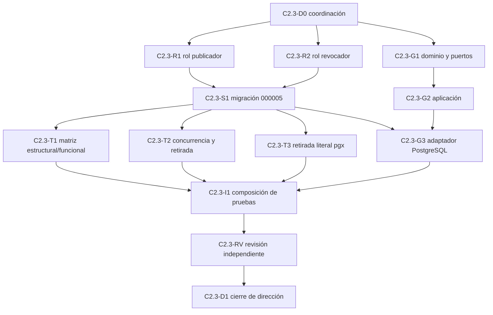

# Coordinación C2.3-D0: publicación y revocación corporativas

Fecha: 31 de julio de 2026.

Estado: **diseño técnico cerrado; implementación pendiente; producción
NO-GO**.

Base inventariada: `51a4390066ab19031fbe4e6ac9696372f3c801b0` de
`integracion/ct-o4-04e-20260726`.

## Resultado único

C2.3 aportará cuatro actos nominales, separados y gobernados, para avanzar las
historias de organización y vínculo corporativo creadas por C2.2:

```text
publicar organización
revocar organización
publicar vínculo corporativo RRHH
revocar vínculo corporativo RRHH
```

Cada acto realizará en una sola transacción `SERIALIZABLE READ WRITE` la
reacreditación del login técnico, el consumo del recibo de fuente, el control
optimista de versión, la inserción histórica, el avance del puntero, la
evidencia de operación, la auditoría y el outbox. La repetición exacta
devolverá el mismo resultado confirmado; una colisión o un resultado incierto
no se convertirán en éxito.

C2.3 no selecciona perfiles u organizaciones, no crea el recibo corporativo
de consulta, no consulta el PDP y no expone HTTP, web, CLI o MCP. Es una
capacidad de gobierno interna de `vec_contexto_actor_v1`, no una nueva fuente
maestra.

## Inventario y dependencias acreditadas

La implementación parte de piezas cerradas y no las duplica:

- `000001` posee procedencias, cuenta, persona, perfil, vínculo base y sus
  punteros;
- `000002` posee la generación y la serialización comunes de punteros;
- `000003` posee `organizacion_versiones` y `organizacion_actual`;
- `000004` posee `vinculo_corporativo_versiones` y
  `vinculo_corporativo_actual`;
- C2.2-A y C2.2-B fijan historia de solo adición, RLS forzada, ACL cerrada,
  procedencias completas y punteros que pueden apuntar a una versión
  revocada;
- el rol `vec_contexto_actor_corporativo_rrhh_selector` conserva solo
  `CONNECT` y no se reutiliza para escribir;
- no existe todavía `000005`, rol publicador, rol revocador, función de estos
  actos, adaptador Go ni composición productiva.

Fuentes de esta coordinación:

- [decisión de contexto corporativo](decision_contexto_corporativo_rrhh_ct_000047c2_2026-07-30.md);
- [decisión C2.2](decision_c2_2_organizacion_y_vinculo_corporativo_2026-07-30.md);
- [coordinación de organización](coordinacion_c2_2_a_organizacion_corporativa_2026-07-31.md);
- [coordinación de vínculo](coordinacion_c2_2_b_vinculo_corporativo_2026-07-31.md);
- [revisión final C2.2-B](revisiones/revision_c2_2_b_vinculo_corporativo_2026-07-31.md);
- [matriz normativa de contratación temporal](matriz_normativa_contratacion_temporal_2026-07-23.md).

La reserva permanece:

```text
000005  publicación y revocación C2.3
000006  selección y recibo privado C2.4
000007  fachada y reconciliación corporativa C2.5
000008  acreditación nominal C2.8
```

No se consume ni se renumera `000006..000008`. Si los documentos autónomos de
`000005` no pueden respetar el tope duro de 800 líneas, la tarea SQL se detiene
y dirección divide formalmente la reserva antes de escribir código. No se
ocultan componentes mediante `\ir`, concatenación, SQL generado o un
empaquetador no existente.

## Autoridad y separación de funciones

Se crean dos grupos técnicos distintos:

```text
vec_contexto_actor_corporativo_rrhh_publicador
vec_contexto_actor_corporativo_rrhh_revocador
```

Ambos son `NOLOGIN`, `NOSUPERUSER`, `NOCREATEDB`, `NOCREATEROLE`,
`NOREPLICATION`, `NOBYPASSRLS`, `NOINHERIT`, sin contraseña, caducidad,
parámetros, membresías o atributos administrativos. Al nacer reciben solo
`CONNECT` a la base actual y ninguna capacidad funcional.

`000005` concede después:

| Grupo | Únicos actos ejecutables |
| --- | --- |
| publicador | publicar organización; publicar vínculo |
| revocador | revocar organización; revocar vínculo |

La concesión exacta comprende solo `USAGE` del esquema y `EXECUTE` de esas dos
fachadas. No concede lectura de tablas o columnas, secuencias, funciones
privadas, tipos ajenos a la firma, `CREATE`, `TEMPORARY`, `MAINTAIN`,
`TRUNCATE`, escritura directa ni `SET ROLE`.

Los grupos publicador, revocador y selector son disjuntos. Una función exige
que `session_user` sea un `LOGIN INHERIT` no administrativo, miembro directo
de un solo grupo funcional mediante `ADMIN OPTION = false`,
`INHERIT OPTION = true` y `SET OPTION = false`. Rechaza membresía directa o
transitiva en el grupo contrario, selector, propietario, migrador, runtime u
otro grupo de ContextoActor. La identidad del actor nunca llega por parámetro,
JSON, cookie, cabecera o configuración libre.

La acreditación se ejecuta dos veces: antes de esperar cualquier bloqueo y de
nuevo después de adquirir todas las barreras y locks, inmediatamente antes del
reloj y del primer efecto. Un `GRANT`, `REVOKE`, `ALTER ROLE` o retirada que
gane la carrera provoca denegación o rollback, nunca continuidad con una
autoridad observada antes de la espera.

Los `LOGIN` concretos, su autenticación, rotación y membresía se crean fuera
de Git por Sistemas. Publicación y revocación deben usar identidades técnicas
distintas. Una cuenta humana, compartida o con ambos grupos mantiene
producción cerrada.

## Cuatro fachadas nominales

Las únicas funciones exteriores de `000005` serán:

```sql
vec_contexto_actor_v1.publicar_organizacion_corporativa_v1(...)
vec_contexto_actor_v1.revocar_organizacion_corporativa_v1(...)
vec_contexto_actor_v1.publicar_vinculo_corporativo_rrhh_v1(...)
vec_contexto_actor_v1.revocar_vinculo_corporativo_rrhh_v1(...)
```

No habrá una fachada genérica con `tipo_entidad`, `accion`, `estado` o nombre
de función aportados por el llamante. Las cuatro firmas usarán argumentos
escalares cerrados; no aceptarán un objeto JSON extensible. Cada una tendrá
`SECURITY DEFINER`, propietario exacto, `search_path=pg_catalog`, ACL cerrada,
límites finitos y mensaje público opaco. Antes de continuar comprueba que la
transacción sea `SERIALIZABLE`, de lectura/escritura y no diferible; invocarla
en autocommit con el aislamiento predeterminado o en solo lectura falla.

Acción, finalidad y ámbito son compromisos técnicos exactos, no parámetros
libres:

| Acto | Acción V1 | Finalidad V1 | Ámbito V1 |
| --- | --- | --- | --- |
| publicar organización | `contexto_actor.organizacion.publicar.v1` | `gobierno_contexto_corporativo_rrhh` | `organizacion_corporativa_rrhh` |
| revocar organización | `contexto_actor.organizacion.revocar.v1` | `gobierno_contexto_corporativo_rrhh` | `organizacion_corporativa_rrhh` |
| publicar vínculo | `contexto_actor.vinculo_corporativo_rrhh.publicar.v1` | `gobierno_contexto_corporativo_rrhh` | `interna_corporativa:consulta_rrhh` |
| revocar vínculo | `contexto_actor.vinculo_corporativo_rrhh.revocar.v1` | `gobierno_contexto_corporativo_rrhh` | `interna_corporativa:consulta_rrhh` |

La fachada deriva su fila, la compromete en recibo de fuente, canon, evidencia,
auditoría y outbox y rechaza cualquier cruce. Otra finalidad o ámbito requiere
catálogo aprobado y una nueva versión nominal; no se acepta por texto libre.

Las cuatro devuelven el mismo sobre técnico mínimo:

- referencia y tipo opacos de la entidad;
- versión anterior y versión nueva;
- estado resultante;
- referencia opaca del recibo de efecto;
- huella SHA-256 del resultado;
- referencia de auditoría y referencia de evento outbox;
- instante autoritativo de confirmación;
- generación común resultante.

No devuelven nombres, documentos, identificadores civiles, contenido de la
fuente, candidatos, perfiles alternativos ni detalles internos del rechazo.

## Fuente gobernada y recibo de entrada

La procedencia exacta ya registrada en `procedencias` es el manifiesto de la
fuente. C2.3 la consume por su cuarteto inseparable:

```text
procedencia_ref
procedencia_version
procedencia_huella_sha256
procedencia_autoridad = autoridad_maestra_acreditada
```

Cada orden añade un recibo opaco de la fuente, una huella SHA-256 de ese
recibo, una correlación opaca y una caducidad. El contenido del recibo no se
guarda en ContextoActor. El cuarteto, recibo y huella quedan comprometidos en
la preimagen de operación y en la evidencia durable.

La publicación de organización añade el cuarteto de versión del generador
opaco y una prueba de generación ligada exactamente a `organizacion_ref`. La
prueba compromete referencia, versión, huella y autoridad del generador,
referencia y huella del acto de generación y la organización resultante. Una
expresión que solo cumple `org_[a-z0-9]{16,80}` no basta: se rechazan prueba
ausente, generador no aprobado, huella divergente o prueba para otra
organización. No se intenta deducir opacidad mediante un clasificador
lingüístico.

El motivo se expresa mediante referencia, versión y huella de un catálogo
gobernado; no mediante texto libre ni una lista compilada. Hasta aprobar dicho
catálogo se usa únicamente una referencia sintética no autoritativa y no se
habilita producción.

En V1 la autoridad efectiva surge conjuntamente de:

1. un `session_user` acreditado y segregado;
2. una procedencia exacta ya registrada y marcada como maestra;
3. un recibo vigente ligado a acto, entidad, versiones, referencias y ventana;
4. la comprobación de todos esos datos dentro de la misma transacción.

El recibo no concede acceso por sí solo ni se acepta desde un cliente final.
En V1 representa la afirmación de la única fuente maestra aprobada porque la
presenta su `LOGIN` técnico exclusivo; C2.3 no atribuye al recibo una prueba
criptográfica independiente que todavía no existe. El conector de la fuente
prepara la orden mediante un puerto intercambiable y el adaptador PostgreSQL
la presenta por el pool nominal del publicador o del revocador. Web,
escritorio, CLI y MCP, si se incorporan, solo podrán invocar un caso de uso
posterior; no tendrán credenciales de estos pools.

Hasta que RRHH y Sistemas aprueben la fuente, la relación entre su identidad
técnica y `procedencia_ref`, y el formato/verificación del recibo, la matriz
usa exclusivamente una autoridad y referencias sintéticas rotuladas como no
reales. Un fixture no se puede promover ni transformar en configuración de
producción.

## Evidencia durable, auditoría y outbox

`000005` añade historia inmutable propia de la operación, no una segunda
historia de organización o vínculo. Cada operación confirmada conserva al
menos:

| Grupo | Compromiso mínimo |
| --- | --- |
| identidad técnica | `session_user` y grupo nominal acreditado |
| intención | operación, acción, finalidad, ámbito, entidad y correlación opacas |
| concurrencia | versión esperada, versión nueva y generación observada |
| fuente | cuarteto de procedencia, recibo, huella y caducidad |
| generación de organización | versión/autoridad del generador y prueba opaca ligada, cuando aplique |
| preimagen | versión de canon y huella SHA-256, sin contenido personal |
| transición | estado anterior/nuevo y huellas anterior/posterior |
| resultado | recibo, huella, instante, auditoría y outbox |

La tabla de operación, la auditoría y el outbox son de solo adición, con RLS
activada y forzada, propietario único y cero ACL de acceso directo. Rechazan
`UPDATE`, `DELETE` y `TRUNCATE`. La auditoría encadena el antes y el después;
el outbox contiene solo el sobre mínimo necesario para consumidores y una
huella de su carga canónica.

Tipos de evento iniciales:

```text
contexto_actor.organizacion.publicada.v1
contexto_actor.organizacion.revocada.v1
contexto_actor.vinculo_corporativo_rrhh.publicado.v1
contexto_actor.vinculo_corporativo_rrhh.revocado.v1
```

No se copian nombre, DNI/NIE, correo, teléfono, categoría especial, documento,
perfil visible ni contenido de la fuente a operación, auditoría, outbox, error
o log. La entrega del outbox es posterior al `COMMIT`; su indisponibilidad no
borra la fila ni autoriza a repetir el efecto con otra operación.

Si el repositorio incorpora antes una autoridad común de auditoría/outbox que
pueda participar en el mismo `COMMIT` sin acceso cruzado a tablas, C2.3 deberá
usar sus fachadas nominales. No se adapta el contrato a una escritura remota o
asíncrona que permita confirmar el estado sin evidencia.

## Canon, referencias e idempotencia

El canon V1 es determinista, versionado y de lista positiva. Incluye acto,
entidad, referencias y versiones, procedencia y recibo, límite de vigencia,
motivo catalogado, correlación, `session_user`, versión esperada y, para
publicación organizativa, el compromiso completo del generador opaco. Acción,
finalidad y ámbito se derivan de la fachada nominal y también forman parte del
canon. No
incluye texto libre ni el instante de base que todavía no existe al preparar
la orden.

Referencias de operación, recibo, auditoría y outbox son opacas, de alta
entropía y generadas mediante el puerto criptográfico común. No contienen
fechas, login, unidad, nombre ni secuencias de negocio. La base valida gramática
y unicidad; no crea otro contador, reloj o generador.

V1 reserva los prefijos `opc_` para operación, `rfc_` para recibo de fuente,
`rcp_` para recibo de efecto, `aud_` para auditoría, `evc_` para outbox y
`cor_` para correlación. Todos reutilizan la gramática técnica existente de
22 a 128 caracteres ASCII `[A-Za-z0-9_-]` después del prefijo. Las huellas son
64 caracteres hexadecimales minúsculos. El canon se rechaza si supera 32 KiB,
antes de copiar, ordenar o calcular SHA-256.

La referencia de operación es única para los cuatro actos:

- si no existe, la función continúa;
- si existe con el mismo canon, actor, acto y huella, devuelve exactamente el
  resultado persistido sin ejecutar DML sobre ningún puntero;
- si cambia cualquier componente, falla como colisión opaca;
- otra operación que pretenda reutilizar una versión histórica ya ocupada
  falla y no se convierte en replay.

La referencia del recibo de fuente también es única para los cuatro actos. Un
recibo ya consumido solo puede reaparecer como parte del replay exacto de su
operación original; otra operación, actor, acto o preimagen lo rechaza.

Un replay exacto devuelve la confirmación histórica aunque el recibo de fuente
haya caducado después del `COMMIT`: primero acredita el login y la coincidencia
íntegra de la operación confirmada y no crea un efecto nuevo. Una operación no
confirmada sí debe superar de nuevo vigencia y todas las demás precondiciones.

La comprobación de replay ocurre antes de cualquier `UPDATE`: un `UPDATE` de
cero filas tampoco es inocuo porque los disparadores de puntero avanzan la
generación común por sentencia.

Tras `40001`, `40P01`, cancelación durante `COMMIT`, corte de transporte o
respuesta perdida, el adaptador no afirma éxito ni repite ciegamente. Repite
la misma fachada con idéntica operación y preimagen. Solo acepta el recibo
persistido si coinciden todas las huellas, referencias y versiones; ausencia
significa resultado no confirmado y divergencia significa conflicto. No se
crea una quinta fachada genérica de reconciliación en C2.3.

## CAS y reglas de versión

Todas las versiones son `numeric(20,0)` enteras en `1..2^64-1`.

Publicación inicial:

- exige `version_esperada = 0` y ausencia de puntero e historia para la
  entidad;
- crea exclusivamente la versión `1` activa;
- cualquier antecedente histórico, incluso sin puntero, deniega el alta.

Publicación posterior:

- bloquea el puntero y exige que su versión sea exactamente la esperada;
- exige que la fila apuntada esté activa y vigente al reloj post-lock;
- crea exclusivamente `version_esperada + 1`;
- rechaza huecos, retroceso, misma versión, desbordamiento y referencia
  histórica divergente.

Revocación:

- exige puntero existente, versión exacta y fila apuntada activa;
- crea exclusivamente la versión consecutiva en estado `revocado`;
- copia de la fila bloqueada las coordenadas de identidad que el acto no puede
  sustituir;
- un segundo revocado, una versión obsoleta o una entidad inexistente fallan
  cerrados salvo replay exacto de la operación confirmada.

El puntero se cambia mediante CAS y su clave foránea completa. Historia,
operación, auditoría, outbox y puntero se confirman juntos. Un fallo en
cualquier inserción, validación, disparador o CAS revierte todo, incluida la
generación.

## Vigencia y reactivación V1

La fuente compromete el límite `vigente_hasta` y la ventana de validez de su
recibo. V1 construye la ventana de la entidad sin permitir activación
retroactiva ni futura. Después de tomar todos los bloqueos, la base obtiene un
único `clock_timestamp()` UTC con precisión de microsegundo y exige:

- recibo de fuente vigente en ese instante;
- `vigente_desde` de la nueva versión igual al instante efectivo fijado por
  la base, sin recibirlo como argumento;
- `vigente_hasta` finito, posterior al instante efectivo y no posterior al
  límite comprometido por el recibo;
- estado inicial o actualizado exclusivamente `activo`.

La aplicación no aporta el instante efectivo: puede comprometer la duración o
el límite del recibo, pero PostgreSQL fija el inicio. La política funcional de
duración máxima será un catálogo versionado aprobado; mientras no exista, no
se habilitan datos reales y las pruebas usan ventanas sintéticas breves.

Una revocación es inmediata. Su versión comienza en el instante de base y
termina en el límite finito del recibo de revocación; el estado `revocado`
deniega cualquier uso con independencia de esa ventana. Así puede revocarse
un vínculo aunque una cuenta, persona, perfil, vínculo base u organización se
hayan vuelto inválidos entre tanto.

No hay reactivación en V1. Si el puntero actual está revocado o su versión
activa ha caducado, ninguna función de publicación puede crear una versión
activa de la misma referencia. Una reactivación futura exigirá decisión
formal, motivo y capacidad nominal separados, catálogo versionado y nueva
versión del contrato; no se simula mediante una publicación ordinaria. La
decisión más restrictiva permite probar C2.3 con datos sintéticos sin anticipar
una política de RRHH. Revocar continúa permitido sobre una versión de estado
`activo` aunque su ventana haya caducado, pues reduce autoridad y preserva el
hecho administrativo.

## Reglas de publicación de organización

`publicar_organizacion_corporativa_v1`:

1. acredita publicador y recibo de fuente;
2. valida `organizacion_ref` con la gramática `org_[a-z0-9]{16,80}`;
3. acredita la prueba de generación opaca ligada a esa referencia;
4. bloquea referencia, historia y puntero;
5. exige el CAS inicial o consecutivo y procedencia maestra exacta;
6. inserta la versión activa, evidencia, auditoría y outbox;
7. inserta o avanza el puntero y devuelve el recibo confirmado.

La referencia es estable y opaca. No acepta denominación, CIF, jerarquía,
unidad, centro, RPT ni equivalencia legada.

`revocar_organizacion_corporativa_v1` toma de la versión actual bloqueada la
referencia y su antecedente, añade la procedencia y motivo de la revocación y
crea una versión revocada consecutiva. No reescribe ni revoca en cascada los
vínculos. C2.4 y C2.8 deberán denegar su uso al reacreditar la organización
actual.

## Reglas de publicación de vínculo

`publicar_vinculo_corporativo_rrhh_v1` solo admite las constantes
`interna_corporativa` y `consulta_rrhh`. Recibe referencias y versiones
exactas, nunca candidatos o preferencias.

Después de bloquear y releer exige conjuntamente:

- punteros actuales exactos de cuenta, persona, perfil, vínculo base y
  organización;
- filas históricas comprometidas por esos punteros;
- estado activo, vigencia actual y autoridad maestra de cada componente;
- claves compuestas de C2.2-B que ligan cuenta, persona, perfil y vínculo;
- organización y versión exactas;
- ausencia de otra coordenada histórica para el mismo
  `vinculo_corporativo_ref`.

La última regla es obligatoria porque C2.2-B no creó una unicidad global sobre
la referencia para no impedir el avance atómico del puntero. Se comprueba bajo
bloqueo por referencia. La referencia nunca puede trasladarse a otra
`(cuenta_ref, superficie, uso)`.

Una versión posterior puede actualizar persona, perfil, vínculo base u
organización únicamente si la fuente los compromete y todas las relaciones
son exactas al confirmar. No permite cambiar la cuenta, superficie o uso de
la referencia existente.

`revocar_vinculo_corporativo_rrhh_v1` no vuelve a seleccionar ni exige que
sus dependencias sigan activas: bloquea la versión actual, copia sus
coordenadas y la revoca. Esto permite retirar una adscripción comprometida
aunque otra autoridad se haya adelantado. Exige todavía versión esperada,
estado actual activo, recibo de revocación y procedencia maestra.

## Barreras y orden de bloqueo

`000005 up`, `000005 down` y las cuatro operaciones comienzan con sentencias
separadas en este orden:

```text
P SHARED = vec_contexto_actor_v1:rol-contexto-corporativo-rrhh-publicador:v1
R SHARED = vec_contexto_actor_v1:rol-contexto-corporativo-rrhh-revocador:v1
A SHARED = vec_contexto_actor_v1:migracion:acreditacion_uso:v2
B SHARED = vec_contexto_actor_v1:organizacion-corporativa-rrhh:v1
C SHARED = vec_contexto_actor_v1:vinculo-corporativo-rrhh:v1
D         = vec_contexto_actor_v1:publicacion-revocacion-corporativa:v1
E EXCLUSIVE = vec_contexto_actor_v1:mutacion_punteros_actuales:v2
```

El orden global es siempre P→R→A→B→C→D→E. La instalación y retirada toman
`D EXCLUSIVE`; las operaciones toman `D SHARED`. Las tres toman después
`E EXCLUSIVE`, antes de cualquier lock de
fila o acceso que pueda mutar un puntero. El trigger de `000002` volverá a
tomar E de forma reentrante durante el CAS. Adelantarla evita el ciclo en el
que un mutador base posee E y espera una fila ya retenida por C2.3, mientras
C2.3 espera E al disparar el trigger. Nunca se agrupan advisory locks en una
misma lista `SELECT`, pues PostgreSQL no garantiza su orden de evaluación.

Dentro de una operación, el orden adicional es:

1. advisory lock global E, ya adquirido tras P→R→A→B→C→D;
2. advisory lock de `operacion_ref`;
3. advisory lock de entidad; para vínculo, primero cuenta/coordenada y después
   `vinculo_corporativo_ref`, con espacios de nombres distintos;
4. filas de procedencia y evidencia previa;
5. punteros base necesarios, ordenados por tipo y referencia;
6. puntero de organización;
7. puntero corporativo;
8. filas históricas exactas;
9. reloj autoritativo y revalidación completa;
10. inserciones de solo adición y CAS del puntero.

Cada lock de fila usa una consulta inequívoca; no se confía en el orden de un
plan, una unión o una lista de expresiones. Publicación de organización,
publicación de vínculo y revocaciones respetan el mismo prefijo de orden para
evitar interbloqueos.

Los timeouts de lock, sentencia, transacción inactiva y llamada son finitos.
Timeout, cancelación, indisponibilidad o estado catalogal no acreditable
fallan cerrados. La lectura de reloj ocurre después de todos los bloqueos y
antes del primer efecto.

Los documentos de alta/retirada del rol publicador toman P exclusiva y R
compartida; los del revocador toman P compartida y R exclusiva, siempre en ese
orden. `000005` y las operaciones toman ambas compartidas. Cualquier gestión
externa de membresía o atributos deberá usar el mismo protocolo dentro de una
transacción y de una ventana operativa exclusiva; si la herramienta de
Sistemas no puede hacerlo, producción permanece en NO-GO.

## Alta, reentrada y retirada seguras

`000005 up` es autónomo, literal y transaccional. Antes de crear nada:

- acredita PostgreSQL 18, UTF-8, UTC, superusuario de migración y roles
  predecesores exactos;
- toma P, R, A, B, C, D y E, bloquea relaciones y catálogos necesarios;
- acredita forma, propietario, ACL, RLS, políticas, restricciones, triggers,
  dependencias, comentarios y ausencia nominal de sus objetos;
- rechaza tablas temporales/no permanentes, homónimos, publicaciones,
  herencias, reglas, estadísticas, ACL predeterminadas, etiquetas o
  dependencias hostiles;
- crea todo bajo `vec_contexto_actor_v1_propietario`, cierra `PUBLIC` y aplica
  únicamente las concesiones nominales.

La reentrada solo acepta la instalación exacta completa y no cambia datos,
ACL, comentarios, generación u objetos. Una instalación parcial o degradada
falla y conserva la huella previa.

`000005 down` exige el GUC de sesión exacto
`vec.confirmar_retirada_publicacion_revocacion_corporativa_v1` con valor
`RETIRAR_PUBLICACION_REVOCACION_CORPORATIVA_V1`, confirmación no secreta,
superusuario, orden P→R→A→B→C→D→E, catálogos inmovilizados, instalación exacta
y `RESTRICT`. Solo
puede retirar una instalación vacía: cero filas en evidencia, auditoría y
outbox, y cero versiones de organización o vínculo creadas por las fachadas.
Si alguna operación llegó a confirmarse, la evidencia y las historias se
preservan y la retirada se deniega.

También deniega ante ACL, membresías, parámetros, propietarios, comentarios,
etiquetas, publicación lógica, estadística, herencia, trigger, regla, objeto,
dependencia o consumidor gobernado no esperado. Los roles se retiran después
de `000005 down`, con sus documentos propios y solo si no conservan membresías,
ACL, ajustes o dependencias.

`000004 down` debe continuar bloqueado mientras exista cualquier componente
de `000005`. Los consumidores dinámicos externos no son enumerables de forma
completa desde catálogos: antes de producción se exige un registro operativo
de consumidores y una ventana de cambio exclusiva. Un consumidor no
registrado mantiene retirada y producción en NO-GO.

## Matriz de aceptación PostgreSQL 18.4

La implementación no obtiene `GO` con pruebas en memoria. El arnés real debe
superar tres ejecuciones limpias e independientes, reinicio y reconexión.

### Estructura y privilegios

1. alta, reentrada exacta, instalación parcial y postcondición adulterada;
2. propietarios, firmas, `prosecdef`, `proconfig`, ACL, RLS forzada, políticas,
   triggers, restricciones, tipos, índices y dependencias exactos;
3. roles publicador/revocador disjuntos, selector intacto y `LOGIN INHERIT`
   con una sola membresía directa `ADMIN=false, INHERIT=true, SET=false`;
4. denegación de `PUBLIC`, runtime, selector, grupo contrario y LOGIN ajeno;
5. intentos de tabla, columna, función privada, función contraria, `SET ROLE`,
   `CREATE`, `TEMP`, `MAINTAIN`, `UPDATE`, `DELETE` y `TRUNCATE`;
6. rechazo de aislamiento distinto de `SERIALIZABLE`, transacción de solo
   lectura, autocommit predeterminado y sesión con parámetros hostiles;
7. retirada/alteración concurrente de roles y `GRANT`/`REVOKE` de membresía,
   con barreras P→R y reacreditación posterior a los locks;
8. estados hostiles de catálogo equivalentes a los acreditados por
   `000003/000004`, incluidos publicación lógica y dependencia dinámica
   gobernada.

### Cuatro actos

9. publicación inicial y consecutiva de organización;
10. revocación de organización y rechazo de segunda revocación/reactivación;
11. publicación inicial y consecutiva de vínculo con todas las combinaciones
   cruzadas de cuenta, persona, perfil, vínculo base y organización;
12. rechazo de reutilizar `vinculo_corporativo_ref` bajo otra coordenada;
13. revocación de vínculo aun con una dependencia ya revocada o caducada;
14. actor derivado de `session_user`, procedencia no maestra, recibo ausente,
    caducado, adulterado o para otro acto;
15. generación de `organizacion_ref` ausente, adulterada, ligada a otra
    organización o emitida por un generador no aprobado;
16. acción, finalidad o ámbito cruzados, adulterados o no nominales;
17. límites exactos de vigencia, caducidad ganada mientras espera, rechazo de
    publicación posterior a un hueco, de cualquier inicio aportado fuera
    de la base y fin no finito;
18. CAS obsoleto, hueco, retroceso, desbordamiento, puntero ausente, historia
    huérfana y FK compuesta adversarial;
19. replay exacto, incluso tras caducidad posterior, sin DML ni aumento de
    generación; colisión de preimagen, recibo reutilizado y versión ya usada
    por otra operación;
20. fallo inyectado en evidencia, historia, auditoría, outbox o puntero con
    rollback total y generación idéntica.

### Concurrencia y recuperación

21. publicar/publicar, revocar/revocar y publicar/revocar sobre la misma
    organización;
22. las mismas tres carreras sobre el mismo vínculo;
23. revocación organizativa concurrente con publicación de vínculo;
24. dos referencias de vínculo intentando la misma coordenada y una referencia
    intentando dos coordenadas;
25. cada acto contra mutación/acreditación de punteros base y contra el trigger
    de generación, acreditando el orden P→R→A→B→C→D→E;
26. locks y bloqueadores exactos, espera acotada, cero interbloqueos y un solo
    ganador observable;
27. `000005 down` contra cada acto, DDL hostil contra `up/down` y preservación
    byte a byte tras rechazo o cancelación;
28. ejecución literal de todos los bytes de `000005 down` mediante
    `pgx.Conn.Exec`, GUC exacto, cancelación, `ROLLBACK`, `RESET` y conexión
    saneada o destruida sin residuo de confirmación;
29. `40001`, `40P01`, timeout antes del efecto, cancelación durante `COMMIT`,
    respuesta perdida y reconciliación por replay exacto;
30. reinicio de PostgreSQL, nuevo pool, sesión hostil saneada y cero residuos
    de contenedores, roles, bases o procesos al terminar.

El runner debe demostrar no solo que una sesión espera: acredita PID, modo de
lock, relación o clave advisory, bloqueador exacto y resultado final.

## Frontera Go y neutralidad de cliente

La frontera Go se divide conforme a arquitectura hexagonal:

- `domain`: actos, referencias opacas, versiones, ventana, estados técnicos y
  validación determinista; sin SQL, HTTP, roles ni proveedor;
- `ports`: cuatro contratos nominales mínimos, generador criptográfico,
  proveedor de recibo de fuente y transacción durable; sin orquestador
  concreto;
- `application`: cuatro casos de uso nominales, canon, límites, cancelación y
  tratamiento de resultado incierto;
- `adapters/postgres`: dos pools físicos exclusivos, sentencias literales,
  reacreditación viva, mapeo estricto y replay reconciliador;
- composición futura: fuente real, secretos y `LOGIN` externos; arranque
  cerrado si falta cualquiera.

El publicador y el revocador no compartirán `pgxpool`, conexión ni credencial.
El adaptador no expone `pgxpool`, no acepta DSN por petición, no reintenta una
mutación con otra operación y sanea o destruye una conexión cuyo estado sea
incierto. Los errores públicos son tipados, localizables y opacos; los textos
visibles futuros usarán i18n.

## Grafo de minitareas y write-sets



| ID | Responsabilidad y criterio único | Write-set exclusivo |
| --- | --- | --- |
| D0 | esta coordinación aprobada | este documento |
| R1 | alta/down y runner del rol publicador, sin función | `roles_*publicador*`, `probar_roles_*publicador*` |
| R2 | alta/down y runner del rol revocador, sin función | `roles_*revocador*`, `probar_roles_*revocador*` |
| G1 | cuatro órdenes/resultados y puertos neutrales con unitarias | nuevos ficheros C2.3 de `domain` y `ports` |
| S1 | `000005 up/down`, cuatro fachadas y persistencia atómica | solo los dos artefactos `000005` |
| T1 | estructura, ACL y casos funcionales 1–20 | runner PostgreSQL focal nuevo |
| T2 | carreras, recuperación y casos 21–27, 29–30 | runner PostgreSQL focal distinto |
| T3 | ejecución literal `pgx` de retirada y caso 28 | prueba Go de integración nueva, sin tocar S1/T1/T2 |
| G2 | cuatro servicios nominales y pruebas de replay/cancelación | nuevos ficheros C2.3 de `application` |
| G3 | pools/adaptadores nominales y prueba `pgx` real | nuevos ficheros C2.3 de `adapters/postgres` |
| I1 | único lanzador de los runners y README local | `probar_integracion.sh` y README del despliegue |
| RV | reproducción completa y veredicto P0/P1/P2 | documento nuevo en `revisiones/` |
| D1 | estado, mapa, tablero, relevo y publicación | solo documentos transversales de dirección |

R1, R2 y G1 pueden ejecutarse en paralelo. T1, T2, T3 y G2 también pueden hacerlo
cuando sus dependencias estén cerradas. S1 tiene un solo productor porque sus
cuatro actos comparten transacción, tablas de evidencia y `down`; dividir el
mismo SQL entre agentes produciría write-sets solapados. Productor, revisor e
integrador serán personas o agentes distintos.

Cada minitarea produce un commit autónomo, compilable y focalmente probado. Si
supera tres ficheros productivos, unas doscientas líneas de producción o dos
responsabilidades observables, se divide antes de programar sin dejar una API
pública incompleta.

## Fuera de alcance C2.4 y posteriores

C2.3 no:

- enumera, ordena, prefiere o selecciona candidatos;
- decide cardinalidad cero/uno/múltiples ni crea recibo corporativo 1:1;
- registra ContextoActor base durante una selección;
- expone `resolver_y_registrar_contexto_corporativo_rrhh_v1`;
- crea la reconciliación pública C2.5 ni el contrato opaco Go C2.6;
- concede el rol selector, construye su pool C2.7 o acredita uso C2.8;
- integra PDP, Contratación temporal, HTTP, web, escritorio, CLI o MCP;
- importa Active Directory, nómina, RPT, documentos o datos reales;
- asigna responsables humanos ni define jerarquía o semántica organizativa.

El outbox informa del hecho, pero ningún consumidor puede tratarlo como una
selección o autorización. C2.4 deberá bloquear y releer los punteros y C2.8
reacreditarlos; un recibo previo nunca neutraliza una revocación posterior.

## Bloqueos externos y conducta restrictiva

La implementación y las pruebas sintéticas no quedan bloqueadas. Producción y
datos reales permanecen en **NO-GO** hasta contar, como mínimo, con:

| Decisión externa | Responsable mínimo | Conducta mientras falta |
| --- | --- | --- |
| fuente maestra, generador opaco, formato y verificación de sus pruebas/recibos | RRHH + Sistemas | solo fixtures sintéticos no promovibles |
| responsables y `LOGIN` separados de publicación/revocación | RRHH + Sistemas + Seguridad | ningún LOGIN productivo ni membresía |
| motivos, vigencia, duración y eventual reactivación | RRHH + Jurídico + DPD | motivo opaco; ventana breve de prueba; reactivación prohibida |
| finalidad, base jurídica, campos y conservación | responsable del tratamiento + DPD + Archivo | minimización y sin expurgo/borrado |
| categorización, riesgos, claves, TLS y operación | Seguridad + Sistemas + DBA | hipótesis ENS alta y despliegue cerrado |
| auditoría, outbox, monitorización y respuesta | Seguridad + Sistemas | sin consumidor productivo |
| competencia y automatización del acto | Secretaría/Jurídico + RRHH | solo propuesta técnica, sin efecto jurídico |

Se requieren además CT-CUM-02 a CT-CUM-07 y CT-CUM-10, EIPD, registro de
actividades, categorización/adecuación ENS, política de conservación y actas de
aceptación. C2.3 no autocertifica RGPD, LOPDGDD, ENS, ENI ni procedimiento
administrativo.

Cuando falte una elección funcional, se conserva la opción técnica más
restrictiva, configurable únicamente mediante fuente o catálogo versionado y
sujeta a aprobación externa. Nunca se desbloquea con una constante de
producción, una cabecera, una cookie, un doble en memoria o un dato DEMO.

## Criterio de cierre

C2.3 solo podrá declararse técnicamente cerrada cuando:

1. los cuatro actos nominales y los dos roles disjuntos estén implementados;
2. operación, historia, puntero, auditoría y outbox sean atómicos;
3. las matrices Go y PostgreSQL 18.4 hayan pasado tres veces limpias;
4. replay, incertidumbre de `COMMIT`, concurrencia y retirada segura estén
   probados;
5. no haya datos reales, secretos, cookies, autoridad de cliente ni residuos;
6. un revisor independiente emita `GO` con P0=P1=P2=0;
7. dirección integre, sincronice documentación y publique un CI verde.

El cierre técnico no modifica por sí solo Contratación `24/46`, O4-05 `3/5`
ni Bolsa productiva `1/14`, y no habilita producción. Solo desbloquea C2.4.
