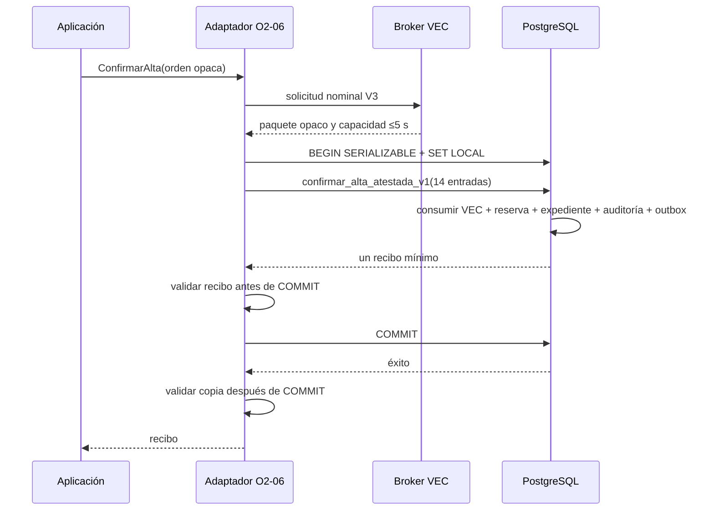
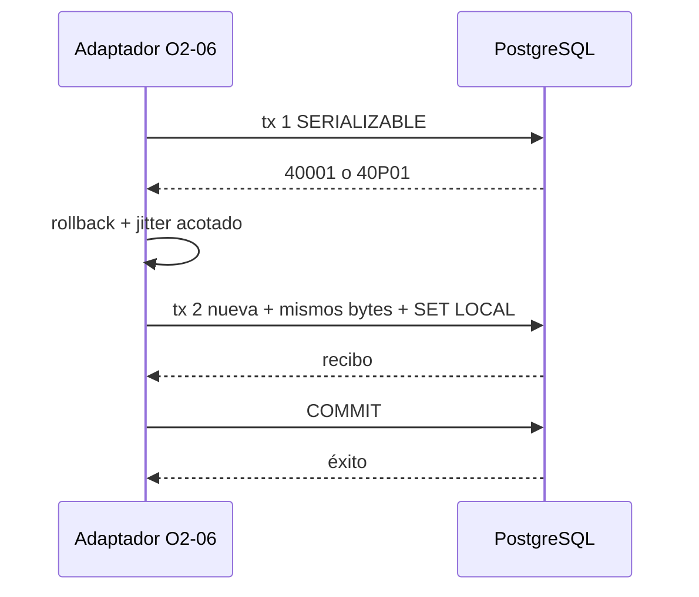
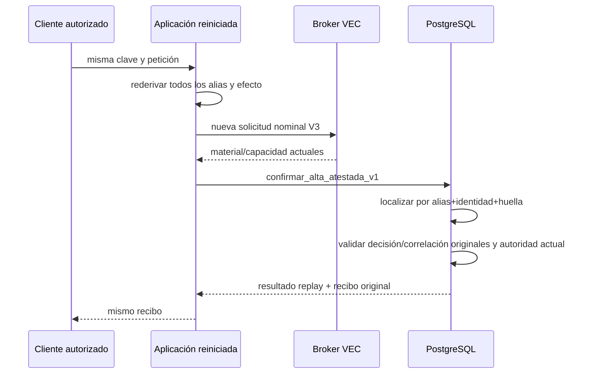

# Diseño del adaptador y la reconciliación O2-06

Fecha: 23 de julio de 2026.

Estado: diseño ejecutable condicionado. `NO-GO` para implementar hasta que
Dirección comunique un SHA estable de O2-05 y se supere la puerta de
acoplamiento descrita aquí.

## Alcance y base examinada

Este documento cierra el diseño de O2-06A. No añade código Go, SQL,
configuración ni composición. La base examinada es
`feature/contratacion-temporal` en `54027d0`; contiene O2-03 hasta `6e007c8` y
la confianza/capacidad VEC-AD-3 integrada en `8461aee`. El tablero declara
todavía pendiente el consumidor SQL de O2-05. Dirección no ha comunicado un
SHA estable de ese consumidor y no se ha leído ningún worktree de su
productor.

Fuentes principales:

- `internal/modules/contrataciontemporal/ports/alta.go`;
- `internal/modules/contrataciontemporal/application/registro_solicitud.go`;
- `internal/modules/contrataciontemporal/adapters/postgres/preparacion_alta.go`;
- `internal/vec/ports/atestacion_autorizacion_v3.go`;
- `internal/vec/ports/capacidad_atestacion_autorizacion_v3.go`;
- `internal/vec/adapters/seguridad/confianzaatestacion/capacidad_v3_*`;
- migraciones `000001_preparacion_altas` y `000002_rotacion_hmac`;
- patrón VEC-AD-2 de consumo y reconciliación;
- DEC-101, que exige `READ COMMITTED`, la misma barrera y consulta posterior
  al final de una escritura incierta.

La firma SQL de este documento es **prevista**, no congelada. Es el contrato
que O2-05 debe satisfacer o sustituir expresamente en su SHA estable. O2-06 no
se programa por anticipado.

## Decisiones cerradas

| Asunto | Decisión |
| --- | --- |
| Adaptador | `TransaccionAltasPostgreSQL`, en `adapters/postgres`, implementa únicamente `ports.TransaccionAltas`. |
| Dependencias | Pool `pgxpool` exclusivo, proveedor nominal VEC-AD-3 y política privada de reintentos. Aplicación no importa pgx ni confianza concreta. |
| Preparación | La ruta real deja de ejecutar `preparar_alta_v1/v2`. Genera candidatos sin persistir; la función O2-05 resuelve alias, reserva y efecto en el único `COMMIT`. |
| Emisor | VEC común posee un broker segregado. El emisor no posee DSN ni credencial SQL; el adaptador no posee clave HMAC emisora. |
| Transporte | mTLS 1.3 sobre socket Unix, identidad de carga en lista positiva y audiencia fija. Sin HTTP, navegador, fallback local ni emisor en proceso. |
| Capacidad | Es opaca. Solo cruza la exportación cerrada para el consumidor SQL; nunca un DTO reconstruido ni un códec general. |
| Transacción | `SERIALIZABLE READ WRITE`; tres intentos totales solo por `40001`/`40P01`; transacción nueva en cada intento. |
| Resultado incierto | Nunca se repite la confirmación. Se reconcilia en conexión y transacción nuevas tras esperar la misma barrera. |
| Reinicio | El replay normal rederiva todos los alias y recupera el recibo durable. No usa memoria, txid, WAL/LSN ni reloj cliente. |
| Recibo | Diez campos públicos, incluidos tres SHA-256. Se valida antes y después del `COMMIT`; el replay devuelve exactamente el original. |
| Errores | Catálogo estable, redactado e i18n. Ningún SQLSTATE, mensaje pgx, identidad, clave, HMAC o dato personal cruza la frontera. |
| O2-07 | Compone broker real y pool exclusivo; falla cerrado si falta cualquier dependencia. |

## Frontera actual y brechas

`OrdenConfirmarAlta.Datos()` entrega hoy una copia de:

| Dato disponible | Procedencia y comprobación actual |
| --- | --- |
| `Expediente` | Agregado versión 1, clonado; referencia, número y primer recibo coinciden con la preparación. |
| `SolicitudAutorizacionV3` | Creada por aplicación con acción/finalidad/recurso cerrados. |
| `DecisionAutorizacionV3` | Devuelta por el autorizador VEC y validada para la solicitud. |
| `ConfirmacionRegistroV3` | Handle nominal durable, decisión/huella/ventana cotejadas. |
| Ámbitos y huellas HMAC | Una generación activa y hasta tres retenidas, alineadas y ordenadas. |
| `Preparacion` | Reserva, referencias, identidad opaca y un par HMAC; hoy presupone preparación SQL previa. |
| `CorrelacionV3Ref` | Derivada de la solicitud V3, nunca de texto aportado. |

No están disponibles:

| Falta | Incorporación cerrada |
| --- | --- |
| Contexto V2 durable | Añadir a la orden `ResultadoContextoActorRegistradoV2`, clonado y validado contra el vínculo de la solicitud. |
| Motivo | No añadir un texto ni una segunda entrada. Se deriva exclusivamente de `SolicitudAutorizacionV3.Datos().ReferenciaMotivo`. |
| Candidatos no persistidos | Sustituir `PreparacionAlta` por `CandidaturaAlta`: reserva, referencias, identidad y par activo generados criptográficamente, pero sin afirmar durabilidad. |
| VEC-AD-3, COSE, prueba y raíz SPKI | Los produce el proveedor nominal mediante el broker VEC y los entrega como paquete opaco de consumo. |
| Capacidad breve | El paquete contiene únicamente `ExportadorCapacidadAtestacionAutorizacionV3`; el adaptador invoca su única exportación autorizada. |
| Efecto canónico | Codificación cerrada V1 creada desde la orden ya validada, nunca desde JSON de canal. |
| Huellas del recibo | Ampliar `ReciboAlta` con huellas de recibo, auditoría y evento. |

La aplicación deja de depender de `PreparadorAltaIdempotente` y pasa a usar el
`GeneradorReferenciasAlta` existente para crear candidatos. No existe un
retorno temprano por `PreparacionConfirmada`: éxito y replay pasan siempre por
la única puerta O2-05. El adaptador PostgreSQL de preparación queda fuera de
la composición O2-07 y O2-05 revoca su `EXECUTE` al runtime.

## Contratos nominales futuros

No se crea un fichero nuevo en `*/ports`. Las ampliaciones viven en
`ports/alta.go` y en el fichero VEC de capacidad existente.

El puerto VEC previsto es conceptualmente:

```go
type ProveedorMaterialConsumoAtestadoV3 interface {
    ObtenerMaterialConsumoAtestadoV3(
        context.Context,
        SolicitudMaterialConsumoAtestadoV3,
    ) (MaterialConsumoAtestadoV3, error)
}
```

`SolicitudMaterialConsumoAtestadoV3` solo se puede construir desde la
solicitud, decisión y contexto de una `OrdenConfirmarAlta` válida. El motivo,
operación, referencia y huella del efecto se derivan de la solicitud. No
acepta bytes libres, audiencia, suite, clave, actor ni efecto por campos
laterales.

`MaterialConsumoAtestadoV3` es opaco, bloquea JSON/texto/binario/gob/CBOR/YAML/
XML, redacta `fmt`/`slog` y expone una sola copia defensiva para el consumidor:

```text
decision_canonica
motivo_canonico
contexto_actor_canonico
manifiesto_procedencia_canonico
persona_version
perfil_version
payload_vec_ad_3
sobre_cose_sign1
evidencia_verificacion_v3
raiz_publica_spki_der
ExportadorCapacidadAtestacionAutorizacionV3
```

Ni `OrdenConfirmarAlta`, `SolicitudMaterialConsumoAtestadoV3`,
`MaterialConsumoAtestadoV3`, la raíz SPKI presentada ni sus bytes canónicos
conceden autoridad. La función interna VEC bloquea y relee el gobierno durable
de clave HMAC, confianza, raíz, contexto, decisión y vigencia; verifica MAC y
COSE y coteja todas las ligaduras. Una implementación falsa del puerto solo
puede producir denegación.

La prueba concreta `PruebaConfianzaAtestacionAutorizacionV3` permanece dentro
del broker/adaptador de confianza. Contratación temporal no la importa ni la
reconstruye. El payload y el sobre proceden de
`AtestacionAutorizacionV3.Solicitud().Mensaje()` y
`AtestacionAutorizacionV3.Resultado().Firma()`, que ya copian defensivamente.
La raíz pública es la DER SPKI Ed25519 exacta, de 44 bytes, cuya huella aparece
en prueba y capacidad.

El broker realiza, en orden:

1. atestación VEC-AD-3 con cabecera gobernada;
2. verificación COSE con lista positiva, revisión, secuencia, raíz y ventana;
3. emisión HMAC de capacidad con vigencia máxima de cinco segundos;
4. exportación cerrada del paquete, ligada al mismo payload/sobre/prueba/raíz.

El broker posee la clave HMAC no exportable y cero credenciales PostgreSQL. El
runtime posee la credencial SQL y una credencial mTLS breve de llamada, pero
ninguna clave emisora. La configuración productiva rechaza cualquier emisor
local o en memoria. HSM/KMS y custodia aprobada siguen siendo puerta externa
de producción.

## Efecto e identidades canónicas

Los dos documentos de entrada creados por el adaptador usan JSON canónico
cerrado solo como formato de intercambio Go↔PostgreSQL; se transportan como
`bytea` y PostgreSQL exige recodificación byte a byte antes de convertirlos a
`jsonb`.

`vec.contratacion-temporal.identidades-alta.v1` contiene:

```text
esquema
activo: {generacion, ambito_hmac, huella_peticion_hmac}
retenidos: [{generacion, ambito_hmac, huella_peticion_hmac}]
```

Hay entre uno y cuatro pares. Generaciones, orden, dominio, ámbito y huella
deben coincidir con la política durable. No se admiten alias sueltos,
generaciones duplicadas ni mezcla ámbito/huella.

`vec.contratacion-temporal.efecto-alta.v1` contiene, en orden cerrado:

```text
esquema
reserva_ref
expediente_ref
numero_visible
organizacion_ref
version_expediente
flujo_ref
flujo_version
flujo_huella_sha256
fase_actual
estado_actual
solicitud
creado_en
actualizado_en
actuacion_inicial
```

`solicitud` y `actuacion_inicial` usan sus campos de dominio en orden
explícito, sin `omitempty`, claves desconocidas ni mapas. Instantes son UTC a
microsegundo; documentos conservan el orden canónico ya validado. El SHA-256
de esos bytes es `huella_alta_canonica_sha256`. Es una ligadura de integridad
adicional: no sustituye `huella_efecto_sha256` de VEC-AD-3, que compromete el
contexto autorizable y el HMAC activo.

Antes de SQL, el adaptador vuelve a comprobar que organización, centro,
categoría, flujo, HMAC activo, referencia y huella de contexto coinciden con
solicitud, decisión, capacidad, candidatos y efecto canónico.

## Firma SQL prevista y mapeo

La firma que debe congelar O2-05 es:

```sql
vec_contratacion_temporal.confirmar_alta_atestada_v1(
    p_decision_canonica bytea,
    p_motivo_canonico bytea,
    p_contexto_actor_canonico bytea,
    p_manifiesto_procedencia_canonico bytea,
    p_persona_version numeric,
    p_perfil_version numeric,
    p_payload_vec_ad_3 bytea,
    p_sobre_cose_sign1 bytea,
    p_evidencia_verificacion bytea,
    p_raiz_publica_spki bytea,
    p_capacidad_canonica bytea,
    p_identidades_hmac_canonicas bytea,
    p_efecto_canonico bytea,
    p_huella_alta_canonica_sha256 text
)
RETURNS TABLE (
    resultado text,
    expediente_ref text,
    numero_visible text,
    version_expediente numeric(20,0),
    recibo_ref text,
    auditoria_ref text,
    evento_ref text,
    confirmada_en timestamptz(6),
    huella_recibo_sha256 text,
    huella_auditoria_sha256 text,
    huella_evento_sha256 text
)
```

La representación de contexto V2 y el manifiesto de procedencia son los dos
arrays exactos y separados de `ResultadoContextoActorRegistradoV2`.
`p_persona_version` y `p_perfil_version` proceden de
`Contexto.Instantanea`, viajan como decimales sin pérdida y se cruzan con
ambos documentos antes de llamar a
`registrar_decision_contexto_actor_v3(bytea, bytea, numeric, numeric)`.

La función devuelve exactamente una fila para todo resultado de dominio.
`resultado` solo admite:

| `resultado` | Nulabilidad y efecto |
| --- | --- |
| `confirmada` | Los diez campos del recibo son no nulos; se creó un único efecto. |
| `replay` | Los diez campos son no nulos e idénticos al recibo original. |
| `denegada` | Los diez campos son nulos; la transacción se revierte sin efecto. |
| `idempotencia_conflictiva` | Los diez campos son nulos; la transacción se revierte sin efecto. |

Cero filas, más de una, un valor desconocido o nulabilidad mixta son
`ErrResultadoRegistroNoConfiable`. Solo los dos últimos valores de resultado
se traducen a los errores de dominio correspondientes; un `23505`, otro
SQLSTATE o texto de excepción nunca se interpreta como conflicto de
idempotencia. Ante `denegada` o `idempotencia_conflictiva`, el adaptador valida
los diez nulos, ejecuta `ROLLBACK` acotado y solo después devuelve el error;
nunca llama a `Commit`. Así se revierten también verificaciones o consumos VEC
efectuados antes de descubrir el conflicto. La función exterior llama a la
función interna propiedad de VEC que verifica y consume VEC-AD-3; no lee ni
escribe tablas VEC. Después resuelve alias y escribe reserva, expediente,
actuación, auditoría y outbox en la misma transacción.

La reconciliación prevista es:

```sql
vec_contratacion_temporal.reconciliar_alta_v1(
    p_consulta_canonica bytea
) RETURNS TABLE (...las mismas once columnas...)
```

Es `VOLATILE SECURITY DEFINER`, `search_path=pg_catalog`. La consulta cerrada
usa el esquema literal `vec.contratacion-temporal.reconciliar-alta.v1` y, en
este orden, contiene:

```text
esquema
identidades_hmac: {activo, retenidos}
reserva_ref_candidata
expediente_ref_candidata
numero_visible_candidato
recibo_ref_candidato
organizacion_ref
actor_ref
perfil_ref
decision_ref
huella_decision_sha256
correlacion_v3_ref
efecto_ref
huella_efecto_sha256
huella_alta_canonica_sha256
```

`identidades_hmac` reutiliza exactamente el esquema, los pares alineados y el
orden del canon de identidades. El documento no admite campos desconocidos,
duplicados, nulos ni valores vacíos; referencias, huellas y número conservan
los límites de sus tipos nominales. Su JSON canónico ocupa como máximo 64 KiB,
se recodifica y compara byte a byte antes de usarlo, se copia defensivamente y
se borra después. La función no consume capacidad ni realiza DML, auditoría,
outbox u otro efecto. Espera la misma barrera de confirmación en una sentencia
SQL/SPI y ejecuta la consulta durable en otra posterior, para que
`READ COMMITTED` adquiera una instantánea nueva después de la espera.

| Go | PostgreSQL | Regla |
| --- | --- | --- |
| contexto V2 canónico | `bytea` | Array exacto de `RepresentacionCanonica`; máximo 2 MiB. |
| manifiesto de procedencia | `bytea` | Array exacto separado; máximo 64 KiB. |
| `[]byte` canónico restante | `bytea` | Copia defensiva; límite previo; borrado tras uso. No DTO intermedio. |
| capacidad exportada | `bytea` | Máximo 32 KiB; SQL valida JSON plano de 37 campos, canonicidad y MAC. |
| `string` opaca | `text` | ASCII/UTF-8 y longitud cerradas; nunca texto personal. |
| SHA-256 | `text` | Exactamente 64 hex minúsculas, no cero. |
| `uint32` generación | `integer` | Rango `1..999999999`. |
| `uint64` | `numeric(20,0)` | Go envía decimal; retorno se escanea como texto y usa `ParseUint`. |
| `time.Time` | `timestamptz(6)` | UTC, año válido y precisión exacta de microsegundo. |

Límites previstos: decisión y payload 512 KiB; motivo 64 KiB; contexto 2 MiB;
manifiesto 64 KiB; COSE entre 16 bytes y 528 KiB; evidencia 2 MiB; SPKI 44
bytes; capacidad 32 KiB; identidades 8 KiB; efecto 512 KiB. O2-05 puede
reducirlos, nunca ampliarlos sin revisión.

## Sesión, pool y privilegios

O2-05 crea el rol NOLOGIN exclusivo
`vec_contratacion_temporal_confirmador_alta`. Cada LOGIN de runtime:

- tiene exactamente una membresía directa, ese rol;
- es `INHERIT`, no superusuario, creador, replicador ni `BYPASSRLS`;
- no pertenece a propietario, migrador, emisor ni roles VEC internos;
- no puede `SET ROLE`;
- recibe solo `CONNECT`, `USAGE` del esquema y `EXECUTE` de confirmar,
  reconciliar y la acreditación estrecha;
- no recibe DML, `SELECT` de tablas, `CREATE`, `TEMP` sobre la base ni ejecución
  de preparación.

El adaptador usa un `pgxpool.Pool` dedicado, nunca compartido con migración,
lecturas generales ni broker. `AfterConnect` invoca la acreditación cerrada y
descarta la conexión si falla. Valores previstos: mínimo cero, predeterminado
cuatro y máximo configurable de 1 a 16 conexiones.

Cada intento abre `SERIALIZABLE READ WRITE` y ejecuta en la misma transacción:

```text
search_path = pg_catalog
row_security = on
timezone = UTC
lock_timeout = 2s
statement_timeout = 4s
idle_in_transaction_session_timeout = 5s
```

Todo se fija con `set_config(..., true)`/`SET LOCAL`; nunca `SET ROLE`. La
función comprueba los límites antes de leer entradas. No se usa
`BeginTxFunc`, porque el adaptador necesita distinguir el punto exacto en que
se intentó `COMMIT`.

## Reintentos y cancelación

El proveedor exporta un paquete justo antes del primer intento. El presupuesto
de mutación es cuatro segundos desde esa exportación, además del plazo menor
del contexto llamador. Hay tres intentos totales y se reutilizan exactamente
los mismos bytes dentro de ese presupuesto.

Solo un `*pgconn.PgError` con `40001` o `40P01`, antes o durante `COMMIT`,
autoriza otro intento. Siempre se descarta la transacción, se abre otra y se
reinstalan los límites. Los dos retrocesos usan *full jitter* criptográfico:
`0..25 ms` y `0..75 ms`. Si no cabe el siguiente intento en el presupuesto,
se devuelve no disponibilidad sin abrirlo.

Antes de llamar a `Commit`, una cancelación causa `ROLLBACK` acotado y se
devuelve `context.Canceled`/`DeadlineExceeded`. Después de llamar a `Commit`
no se vuelve a consultar contexto ni reloj para reinterpretar un éxito:

| Resultado de `Commit` | Decisión |
| --- | --- |
| `nil` | Éxito durable. |
| `40001`/`40P01` | Rollback concluyente; posible intento nuevo. |
| `pgx.ErrTxCommitRollback` | Rollback concluyente; no reintentar ni reconciliar. |
| Cualquier otro error | Resultado indeterminado; reconciliar, nunca repetir confirmación. |

No se registran argumentos, material ni texto de error. Telemetría admite
solo clase saneada, número de intento y los dos SQLSTATE reintentables.

## Recibo mínimo y validación

`ReciboAlta` queda compuesto por:

```text
expediente_ref
numero_visible
version
recibo_ref
auditoria_ref
evento_ref
confirmada_en
huella_recibo_sha256
huella_auditoria_sha256
huella_evento_sha256
```

No devuelve organización, actor, perfil, decisión, correlación, HMAC, nonce,
capacidad, claves, políticas ni datos personales.

`huella_recibo_sha256` es SHA-256 del canon
`vec.contratacion-temporal.recibo-alta.v1`. Excluida la propia huella, el orden
cerrado de valores es: esquema literal, `expediente_ref`, `numero_visible`,
`version` decimal base diez sin ceros iniciales, `recibo_ref`,
`auditoria_ref`, `evento_ref`, `confirmada_en` UTC con el formato fijo
`YYYY-MM-DDTHH:MM:SS.ffffffZ`, `huella_auditoria_sha256` y
`huella_evento_sha256`. Cada valor se encuadra como longitud decimal de sus
bytes UTF-8, sin ceros iniciales, seguida de `:`, los bytes exactos y `\n`.
La huella de recibo incluye así las huellas de auditoría y evento. SQL las
calcula desde las filas y cadenas persistidas; replay y reconciliación
devuelven los mismos diez valores.

El adaptador usa `Query`, no `QueryRow`, para exigir exactamente una fila.
Antes del `COMMIT` valida forma, UTC, versión, referencias y número contra el
efecto esperado y recalcula la huella de recibo. Después de `COMMIT` repite la
validación sobre una copia por valor. Si la respuesta cambia o falla, devuelve
resultado no confiable; no transforma un `COMMIT` confirmado en repetible.

En resultado indeterminado se descarta la respuesta previa como autoridad. La
fila reconciliada debe coincidir campo a campo con ella, si estaba disponible,
y volver a superar el canon. Una adulteración, segunda fila o cruce se cierra
sin filtrar cuál fue el campo.

## Algoritmo de reconciliación

1. Marcar que `Commit` fue invocado; bloquear para siempre la ruta de
   reintento de confirmación.
2. Crear `context.WithTimeout(context.WithoutCancel(ctx), 5*time.Second)`.
   Conserva valores, pero no hereda cancelación, deadline ni el presupuesto de
   mutación ya consumido.
3. Adquirir otra conexión del pool y abrir `READ COMMITTED READ ONLY`.
4. Fijar los mismos parámetros de sesión.
5. Invocar `reconciliar_alta_v1` con copia de la consulta canónica; la función
   espera la barrera y consulta en dos sentencias distintas.
6. La función toma la misma barrera/advisory lock que confirmación, valida la
   política completa de generaciones y busca una única raíz.
7. Coteja decisión+huella, correlación, organización, actor, perfil,
   efecto+huellas, referencias candidatas, consumo de capacidad y cadenas.
8. Leer, cerrar todas las filas y validar el resultado completo.
9. Cerrar la transacción de solo lectura mediante `ROLLBACK` con un contexto
   interno nuevo de un segundo. Si la lectura ya quedó completa, un fallo de
   limpieza descarta la conexión y genera alerta, pero no invalida la prueba
   durable obtenida.
10. Interpretar:

| Resultado | Salida |
| --- | --- |
| Una fila exacta y recibo válido | Éxito con el recibo durable. |
| Ausencia confirmada tras la barrera | `ErrPersistenciaNoDisponible`; no hubo efecto probado y no hay reintento interno. |
| Timeout/error de reconciliación, varias filas o divergencia | `ErrResultadoAltaIndeterminado` y alerta saneada. |

La capacidad puede estar expirada al reconciliar. La función valida la
evidencia durable ya consumida, no vuelve a conceder autoridad ni crea otro
efecto.

Tras reinicio no existe la orden anterior en memoria. El cliente repite la
misma petición y clave; aplicación rederiva todos los alias gobernados y crea
una autorización actual. `confirmar_alta_atestada_v1` entra por su rama de
`replay`, localiza el efecto por alias+identidad+huella, verifica internamente
la decisión y correlación originales durables y exige una concesión V3 nueva,
vigente y ligada al mismo efecto. Consume esa concesión exactamente una vez y,
si procede por rotación, añade únicamente el alias activo al efecto ganador.
El replay no crea otra reserva, expediente, actuación, auditoría/outbox de
contratación, evento ni recibo; tampoco sustituye la decisión o correlación
históricas del efecto. Repetir la misma concesión converge en su mismo consumo
VEC; una concesión ausente, cruzada o ya ligada a otro efecto deniega. No
necesita txid, WAL/LSN, nonce anterior, caché ni reloj del cliente.

## Secuencias

### Éxito



### `40001`/`40P01`



### `COMMIT` indeterminado

```mermaid
sequenceDiagram
    participant T as Adaptador O2-06
    participant P1 as Conexión original
    participant P2 as Conexión nueva
    T->>P1: confirmar + recibo validado
    T->>P1: COMMIT
    P1--xT: EOF/timeout/respuesta perdida
    Note over T: prohibido repetir confirmar
    T->>P2: BEGIN READ COMMITTED READ ONLY
    T->>P2: barrera; después consulta
    T->>P2: reconciliar_alta_v1(consulta exacta)
    P2-->>T: recibo / ausencia / inconclusión
```

### Reconciliación tras reinicio



## Catálogo público de errores

| Sentinela interna | Código público | Clave i18n futura | Reintento |
| --- | --- | --- | --- |
| `ErrOrdenAltaInvalida` | `alta_orden_invalida` | `contratacion_temporal.alta.error.orden_invalida` | No. |
| `ErrAutorizacionDenegada` | `alta_denegada` | `contratacion_temporal.alta.error.autorizacion_denegada` | Solo nueva evaluación completa. |
| `ErrClaveIdempotenciaUsada` | `alta_idempotencia_conflictiva` | `contratacion_temporal.alta.error.idempotencia_conflictiva` | No con esa clave. |
| `ErrPersistenciaNoDisponible` | `alta_no_disponible` | `contratacion_temporal.alta.error.no_disponible` | Sí, invocación futura idempotente. |
| `ErrResultadoAltaIndeterminado` | `alta_resultado_indeterminado` | `contratacion_temporal.alta.error.resultado_indeterminado` | Solo consulta/replay idempotente; nunca repetición interna. |
| `ErrResultadoRegistroNoConfiable` | `alta_no_disponible` | `contratacion_temporal.alta.error.no_disponible` | Solo consulta/replay idempotente y alerta; nunca repetición interna. |
| cancelación anterior a `COMMIT` | `alta_cancelada` | `contratacion_temporal.alta.error.cancelada` | Nueva invocación completa. |

Capacidad inválida, expirada o revocada, sesión, rol, política, COSE o
confianza fallidos se clasifican siempre como denegación. Errores SQL,
transporte y dependencias se envuelven en tipos redactados sin incorporar
`Error()` de la causa. O2-08 mapeará este catálogo sin reinterpretarlo.

## Matriz de pruebas de la implementación

| Grupo | Casos obligatorios | Evidencia |
| --- | --- | --- |
| Orden y frontera | Nulos tipados; contexto/motivo/decisión cruzados; efecto, correlación o generaciones alterados; copias defensivas; codecs y logs redactados. | Unitarias `ports`/aplicación. |
| Broker | mTLS/identidad/audiencia; límites antes de reservar; COSE, prueba, raíz y capacidad cruzados; broker ausente; sin fallback/emisor local. | Unitarias y contrato de transporte. |
| Mapeo | Cada tipo, límite y nulabilidad; contexto/manifiesto separados; `uint64` máximo; UTC/microsegundo; bytes no canónicos; 0/1/>1 filas; cuatro resultados y combinaciones nulas. | Unitarias del adaptador. |
| Recibo | Cada campo y cada huella alterados antes/después de `COMMIT`; replay exacto; segunda fila; copia por valor. | Unitarias y PostgreSQL. |
| Reintentos | `40001` y `40P01` en consulta y `COMMIT`; tx nueva; máximo tres; jitter/presupuesto; `55P03`, `23505`, `57014` y errores no aprobados sin retry. | Dobles pgx y PostgreSQL real. |
| Cancelación | Antes de begin, SET, consulta, scan y pre-commit; carrera posterior a `COMMIT`; rollback acotado. | Unitarias deterministas. |
| Indeterminado | EOF, timeout y respuesta perdida tras `COMMIT`; reconciliación exacta, ausente, múltiple, cruzada y timeout; `ErrTxCommitRollback`. | Proxy de fallo y PostgreSQL real. |
| Reinicio | Proceso y pool nuevos; replay por todos los alias; reinicio PostgreSQL; cero dependencia de memoria/txid/WAL/reloj cliente. | Integración real. |
| Idempotencia | Éxito, replay, dos o más sesiones, alias convergentes/divergentes, mezcla de generación, conflicto semántico, concesión nueva consumida una vez y cero segundo efecto. | PostgreSQL efímero. |
| Gobierno | Rotación HMAC; clave retenida/revocada/retirada; capacidad y COSE expiradas/revocadas antes y durante lock; snapshot obsoleto. | PostgreSQL efímero concurrente. |
| Atomicidad | Fallo inyectado en cada escritura, cadena y outbox; ninguna reserva/decisión/expediente parcial. | PostgreSQL efímero. |
| ACL/sesión | `PUBLIC`, runtime, migrador, propietario, emisor y consumidor; privilegios efectivos; sin DML, `SELECT`, `SET ROLE` ni preparación; parámetros y timeouts. | SQL negativo. |
| Neutralidad | El mismo `Registrar` con dobles de dos canales; ninguna cookie, almacenamiento o cabecera libre de identidad. | Contrato de aplicación. |
| Saneado | Errores, trazas y recibos sin PII, claves, HMAC, capacidad, SQL, DSN ni rutas privadas. | Barrido y pruebas adversariales. |
| Migración | Ascendente, inventario, `down` protegido, reinstalación limpia y tres ejecuciones repetidas. | Runner O2-05/O2-06. |

Pruebas Go mínimas: paquetes focales, `-race`, `go vet`, suite global compatible
y calidad. Persistencia exige PostgreSQL real; mocks no cierran O2-06.

## Composición O2-07

O2-07 registra:

1. generador criptográfico de candidatos, sin escritura SQL;
2. autorizador V3 común;
3. cliente mTLS del broker VEC;
4. pool PostgreSQL exclusivo acreditado;
5. `TransaccionAltasPostgreSQL`;
6. `ServicioRegistroSolicitud` neutral al canal.

El arranque falla si falta identidad de carga, broker, confianza, HMAC/KMS,
generador, pool, acreditación de rol o funciones con firma exacta. No se
compone `PreparadorAltaPostgreSQL`, emisor HMAC en proceso, adaptador de
memoria ni fallback DEMO.

## Archivos futuros y write-set disjunto

| Propietario futuro | Archivos | Cambio |
| --- | --- | --- |
| O2-05 SQL | `deploy/postgresql/contratacion_temporal/**` y funciones internas VEC de su migración | Congelar confirmación, reconciliación, roles, ACL, pruebas y reversión. |
| VEC común, antes de O2-06 | `internal/vec/ports/capacidad_atestacion_autorizacion_v3.go`; adaptador/broker VEC y pruebas | Paquete opaco de material; transporte segregado. No crear otro fichero `ports`. |
| O2-06 Go | `internal/modules/contrataciontemporal/ports/alta.go`; `application/registro_solicitud.go`; `adapters/postgres/confirmacion_alta*.go` y pruebas | Candidatos, recibo, adaptador, reintentos, errores y reconciliación. |
| O2-06 retirada de ruta | `adapters/postgres/preparacion_alta.go` y sus pruebas | Dejar fuera o retirar la preparación runtime sin cambiar historia SQL. |
| O2-07 composición | ficheros de bootstrap/configuración que Dirección asigne | Inyectar broker/pool reales y fallo cerrado. |
| O2-08 | API, OpenAPI e i18n | Mapear catálogo público; sin decisiones de persistencia. |

Los write-set no se solapan. O2-06 no toca migraciones O2-05, composición,
tablero, README, API ni web.

## Puerta de acoplamiento y bloqueos reales

Al recibir el SHA estable de O2-05, el implementador compara mecánicamente:

1. nombre, esquema, orden, tipos, nulabilidad y límites de las catorce entradas;
2. once columnas, tipos y significado de ambos retornos;
3. canones, huellas, los cuatro resultados `confirmada`, `replay`, `denegada`
   e `idempotencia_conflictiva` y su nulabilidad total; confirmar exige
   exactamente una fila, mientras reconciliar distingue cero como ausencia,
   una como éxito y más de una como resultado no confiable;
4. barrera común de confirmación/reconciliación;
5. rol exclusivo, acreditación y ACL efectivas;
6. revocación de `preparar_alta_v1/v2`;
7. función interna VEC, atomicidad y matriz de pruebas.

Cualquier diferencia mantiene O2-06 en `NO-GO` y reabre solo este mapeo. No se
adapta código a una firma supuesta.

Bloqueos:

- falta SHA estable y revisión GO de O2-05;
- falta el paquete opaco/broker productivo de VEC;
- HSM/KMS, ancla anti-restauración y conformidades formales siguen bloqueando
  producción, aunque no impiden probar la futura implementación en entorno
  efímero autorizado.

Dictámenes independientes:

- PostgreSQL/pgx: `GO condicionado` para el diseño; `NO-GO` para implementar
  antes del SHA estable;
- seguridad/hexagonal: `GO condicionado` para el diseño; `NO-GO` para
  implementar/componer hasta cerrar las fronteras indicadas.

**O2-06A es diseño; no implementa, integra ni habilita producción.**
