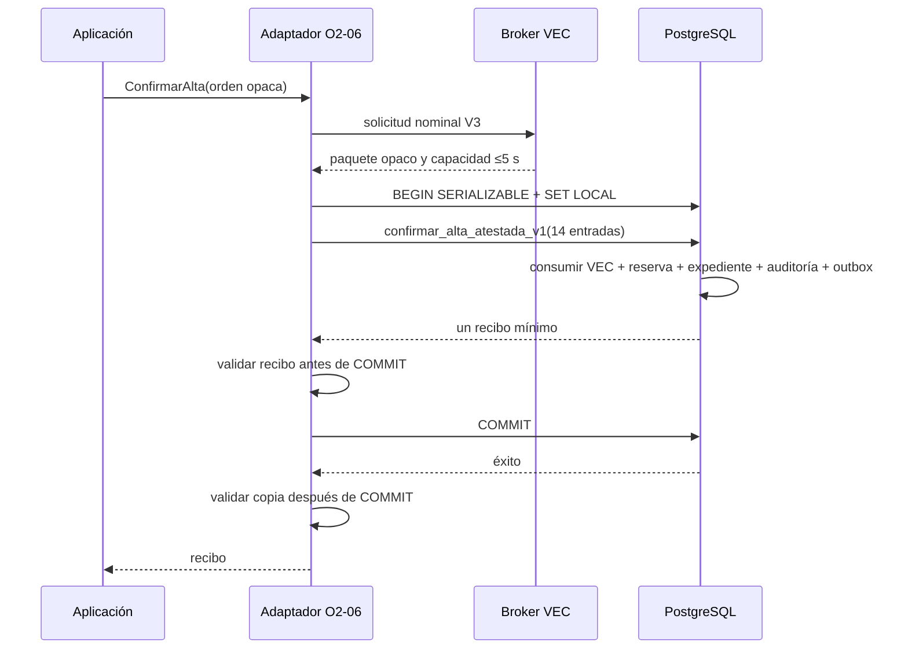
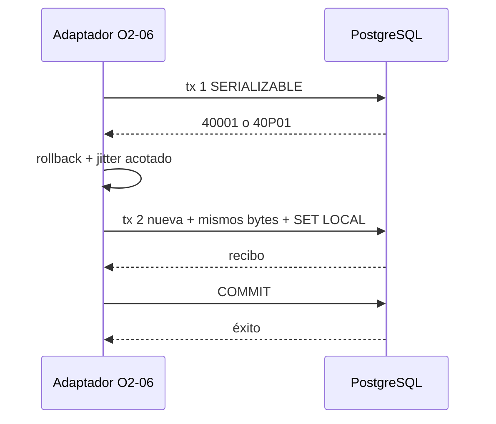
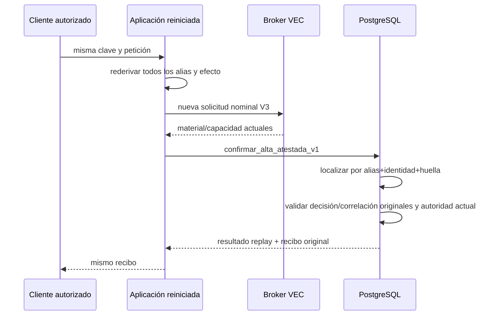

# Diseño del adaptador y la reconciliación O2-06

Fecha: 23 de julio de 2026.

Estado: diseño ejecutable condicionado. `NO-GO` para implementar hasta que
Dirección comunique un SHA estable de O2-05 y se supere la puerta de
acoplamiento descrita aquí.

## Alcance y base examinada

Este documento cierra el diseño de O2-06A. No añade código Go, SQL,
configuración ni composición. La base examinada es
`feature/contratacion-temporal` en `54027d0`; contiene O2-03 hasta `6e007c8` y
la confianza/capacidad VEC-AD-3 integrada en `8461aee`. El tablero declara
todavía pendiente el consumidor SQL de O2-05. Dirección no ha comunicado un
SHA estable de ese consumidor y no se ha leído ningún worktree de su
productor.

Fuentes principales:

- `internal/modules/contrataciontemporal/ports/alta.go`;
- `internal/modules/contrataciontemporal/application/registro_solicitud.go`;
- `internal/modules/contrataciontemporal/adapters/postgres/preparacion_alta.go`;
- `internal/vec/ports/atestacion_autorizacion_v3.go`;
- `internal/vec/ports/capacidad_atestacion_autorizacion_v3.go`;
- `internal/vec/adapters/seguridad/confianzaatestacion/capacidad_v3_*`;
- migraciones `000001_preparacion_altas` y `000002_rotacion_hmac`;
- patrón VEC-AD-2 de consumo y reconciliación;
- DEC-101, que exige `READ COMMITTED`, la misma barrera y consulta posterior
  al final de una escritura incierta.

La firma SQL de este documento es **prevista**, no congelada. Es el contrato
que O2-05 debe satisfacer o sustituir expresamente en su SHA estable. O2-06 no
se programa por anticipado.

## Decisiones cerradas

| Asunto | Decisión |
| --- | --- |
| Adaptador | `TransaccionAltasPostgreSQL`, en `adapters/postgres`, implementa únicamente `ports.TransaccionAltas`. |
| Dependencias | Pool `pgxpool` exclusivo, proveedor nominal VEC-AD-3 y política privada de reintentos. Aplicación no importa pgx ni confianza concreta. |
| Preparación | La ruta real deja de ejecutar `preparar_alta_v1/v2`. Genera candidatos sin persistir; la función O2-05 resuelve alias, reserva y efecto en el único `COMMIT`. |
| Emisor | VEC común posee un broker segregado. El emisor no posee DSN ni credencial SQL; el adaptador no posee clave HMAC emisora. |
| Transporte | mTLS 1.3 sobre socket Unix, identidad de carga en lista positiva y audiencia fija. Sin HTTP, navegador, fallback local ni emisor en proceso. |
| Capacidad | Es opaca. Solo cruza la exportación cerrada para el consumidor SQL; nunca un DTO reconstruido ni un códec general. |
| Transacción | `SERIALIZABLE READ WRITE`; tres intentos totales solo por `40001`/`40P01`; transacción nueva en cada intento. |
| Resultado incierto | Nunca se repite la confirmación. Se reconcilia en conexión y transacción nuevas tras esperar la misma barrera. |
| Reinicio | El replay normal rederiva todos los alias y recupera el recibo durable. No usa memoria, txid, WAL/LSN ni reloj cliente. |
| Recibo | Once campos mínimos, incluida la procedencia canónica y tres SHA-256. Se valida antes y después del `COMMIT`; el replay devuelve exactamente el original. |
| Errores | Catálogo estable, redactado e i18n. Ningún SQLSTATE, mensaje pgx, identidad, clave, HMAC o dato personal cruza la frontera. |
| O2-07 | Compone broker real y pool exclusivo; falla cerrado si falta cualquier dependencia. |

## Frontera actual y brechas

`OrdenConfirmarAlta.Datos()` entrega hoy una copia de:

| Dato disponible | Procedencia y comprobación actual |
| --- | --- |
| `Expediente` | Agregado versión 1, clonado; referencia, número y primer recibo coinciden con la preparación. |
| `SolicitudAutorizacionV3` | Creada por aplicación con acción/finalidad/recurso cerrados. |
| `DecisionAutorizacionV3` | Devuelta por el autorizador VEC y validada para la solicitud. |
| `ConfirmacionRegistroV3` | Handle nominal durable, decisión/huella/ventana cotejadas. |
| Ámbitos y huellas HMAC | Una generación activa y hasta tres retenidas, alineadas y ordenadas. |
| `Preparacion` | Reserva, referencias, identidad opaca y un par HMAC; hoy presupone preparación SQL previa. |
| `CorrelacionV3Ref` | Derivada de la solicitud V3, nunca de texto aportado. |

No están disponibles:

| Falta | Incorporación cerrada |
| --- | --- |
| Contexto V2 durable | Añadir a la orden `ResultadoContextoActorRegistradoV2`, clonado y validado contra el vínculo de la solicitud. |
| Motivo | No añadir un texto ni una segunda entrada. Se deriva exclusivamente de `SolicitudAutorizacionV3.Datos().ReferenciaMotivo`. |
| Candidatos no persistidos | Sustituir `PreparacionAlta` por `CandidaturaAlta`: reserva, referencias, identidad y par activo generados criptográficamente, pero sin afirmar durabilidad. |
| VEC-AD-3, COSE, prueba y raíz SPKI | Los produce el proveedor nominal mediante el broker VEC y los entrega como paquete opaco de consumo. |
| Capacidad breve | El paquete contiene únicamente `ExportadorCapacidadAtestacionAutorizacionV3`; el adaptador invoca su única exportación autorizada. |
| Efecto canónico | Codificación cerrada V1 creada desde la orden ya validada, nunca desde JSON de canal. |
| Huellas del recibo | Ampliar `ReciboAlta` con huellas de recibo, auditoría y evento. |

La aplicación deja de depender de `PreparadorAltaIdempotente` y pasa a usar el
`GeneradorReferenciasAlta` existente para crear candidatos. No existe un
retorno temprano por `PreparacionConfirmada`: éxito y replay pasan siempre por
la única puerta O2-05. El adaptador PostgreSQL de preparación queda fuera de
la composición O2-07 y O2-05 revoca su `EXECUTE` al runtime.

## Contratos nominales futuros

No se crea un fichero nuevo en `*/ports`. Las ampliaciones viven en
`ports/alta.go` y en el fichero VEC de capacidad existente.

El puerto VEC previsto es conceptualmente:

```go
type ProveedorMaterialConsumoAtestadoV3 interface {
    ObtenerMaterialConsumoAtestadoV3(
        context.Context,
        SolicitudMaterialConsumoAtestadoV3,
    ) (MaterialConsumoAtestadoV3, error)
}
```

`TransaccionAltas.ConfirmarAlta` deja de devolver solo `ReciboAlta` y entrega
un `ResultadoConfirmacionAlta` nominal con estado cerrado `confirmada` o
`replay` y una copia del recibo. Aplicación bifurca: en `confirmada` usa
`ReciboAlta.ValidarPara(expedienteCandidato)`; en `replay` exige estructura,
canon, huellas y procedencia del recibo acreditado por el adaptador, pero no
lo compara con candidatos nuevos. Así el resultado SQL no se pierde entre
adaptador y caso de uso.

`SolicitudMaterialConsumoAtestadoV3` solo se puede construir desde la
solicitud, decisión y contexto de una `OrdenConfirmarAlta` válida. El motivo,
operación, referencia y huella del efecto se derivan de la solicitud. No
acepta bytes libres, audiencia, suite, clave, actor ni efecto por campos
laterales.

`MaterialConsumoAtestadoV3` es opaco, bloquea JSON/texto/binario/gob/CBOR/YAML/
XML, redacta `fmt`/`slog` y expone una sola copia defensiva para el consumidor:

```text
decision_canonica
motivo_canonico
contexto_actor_canonico
manifiesto_procedencia_canonico
persona_version
perfil_version
payload_vec_ad_3
sobre_cose_sign1
evidencia_verificacion_v3
raiz_publica_spki_der
ExportadorCapacidadAtestacionAutorizacionV3
```

La interfaz Go del último campo no viaja entre procesos. La respuesta del
broker transporta los bytes canónicos de la capacidad; el cliente VEC los
valida y los encierra localmente en una implementación privada de
`ExportadorCapacidadAtestacionAutorizacionV3` cuya única operación devuelve
una copia. Ningún constructor acepta una implementación aportada por el canal.

Ni `OrdenConfirmarAlta`, `SolicitudMaterialConsumoAtestadoV3`,
`MaterialConsumoAtestadoV3`, la raíz SPKI presentada ni sus bytes canónicos
conceden autoridad. La función interna VEC bloquea y relee el gobierno durable
de clave HMAC, confianza, raíz, contexto, decisión y vigencia; verifica MAC y
COSE y coteja todas las ligaduras. Una implementación falsa del puerto solo
puede producir denegación.

La prueba concreta `PruebaConfianzaAtestacionAutorizacionV3` permanece dentro
del broker/adaptador de confianza. Contratación temporal no la importa ni la
reconstruye. El payload y el sobre proceden de
`AtestacionAutorizacionV3.Solicitud().Mensaje()` y
`AtestacionAutorizacionV3.Resultado().Firma()`, que ya copian defensivamente.
La raíz pública es la DER SPKI Ed25519 exacta, de 44 bytes, cuya huella aparece
en prueba y capacidad.

El broker realiza, en orden:

1. atestación VEC-AD-3 con cabecera gobernada;
2. verificación COSE con lista positiva, revisión, secuencia, raíz y ventana;
3. emisión HMAC de capacidad con vigencia máxima de cinco segundos;
4. exportación cerrada del paquete, ligada al mismo payload/sobre/prueba/raíz.

El broker posee la clave HMAC no exportable y cero credenciales PostgreSQL. El
runtime posee la credencial SQL y una credencial mTLS breve de llamada, pero
ninguna clave emisora. La configuración productiva rechaza cualquier emisor
local o en memoria. HSM/KMS y custodia aprobada siguen siendo puerta externa
de producción.

### Protocolo cerrado del broker

El transporte no usa un códec genérico. Cada conexión TLS 1.3 sobre el socket
Unix admite una sola petición y una sola respuesta, sin multiplexación. Ambas
usan esta envoltura binaria, con enteros sin signo en orden de red:

```text
magic[8] = "VECBMV3\x00"
version uint16 = 1
tipo uint8
reservado uint8 = 0
numero_campos uint16
longitud_cuerpo uint32
repetido numero_campos veces: longitud_campo uint32 + bytes exactos
```

`longitud_cuerpo` es exactamente `Σ(4+longitud_campo)`. Las huellas del
protocolo son siempre 32 bytes binarios; las huellas de los canones de dominio
siguen siendo 64 caracteres hex minúsculos donde su contrato ya lo exige.
No se toleran bytes posteriores, campos ausentes, longitud cero donde esté
prohibida, valor reservado distinto de cero, versión desconocida ni suma de
longitudes distinta de `longitud_cuerpo`. Se validan número de campos,
longitudes individuales y total antes de reservar, leyendo primero la
cabecera y acotando el cuerpo. No hay HTTP, gRPC, redirección, compresión,
streaming de aplicación ni negociación de formato. La petición (`tipo=1`,
siete campos) contiene, en este orden:

```text
decision_canonica
motivo_canonico
contexto_actor_canonico
manifiesto_procedencia_canonico
persona_version_decimal
perfil_version_decimal
huella_sha256_de_los_seis_campos_anteriores
```

Versiones son ASCII decimal sin signo ni ceros iniciales, en
`1..18446744073709551615`. La séptima entrada es SHA-256 de
`"vec.material-consumo-atestado-v3.peticion.v1\x00"` seguido de los seis
campos, cada uno como `uint32_be(longitud)||bytes`. El broker reconstruye tipos
nominales mediante parsers estrictos propios de VEC, coteja la huella y vuelve
a validar contexto, motivo, decisión, operación, efecto, versiones, cabecera
gobernada y audiencia. El cliente no envía suite, clave, audiencia, nonce,
capacidad ni una decisión de autoridad lateral.

La respuesta de éxito (`tipo=2`, seis campos) contiene:

```text
huella_sha256_de_la_peticion_completa
payload_vec_ad_3
sobre_cose_sign1
evidencia_verificacion_v3_canonica
raiz_publica_spki_der
capacidad_v3_canonica
```

La primera entrada es SHA-256 de los bytes exactos de cabecera y cuerpo
transmitidos en la petición, incluido su séptimo campo. El cliente exige
igualdad constante, valida forma, canonicidad y ligaduras públicas de los
otros cinco campos —no la MAC HMAC que no posee—, crea el exportador privado
redactado también en `String`, `Format` y `LogValue`, y solo entonces forma
`MaterialConsumoAtestadoV3` recomponiendo los seis bloques originales de su
solicitud local. MAC, gobierno y consumo se validan exclusivamente en SQL.

La respuesta de denegación (`tipo=3`) solo admite código
`1=solicitud_invalida` o `2=autoridad_denegada`; la de indisponibilidad
(`tipo=4`), solo `3=dependencia_no_disponible`. En ambos casos
`numero_campos=1`, `longitud_campo=2` y el código es `uint16` big-endian. No
incluyen texto, identidad ni causa. Cualquier combinación o código desconocido
es frame inválido/no disponibilidad.

`evidencia_verificacion_v3_canonica` es la exportación dedicada
`vec.prueba-confianza-atestacion-autorizacion.v3`; no serializa
`PruebaConfianzaAtestacionAutorizacionV3`. Encuadra cada campo como
`uint64_be(numero_de_bytes)||valor`, en el mismo orden que
`calcularHuellaPruebaConfianzaAtestacionV3`, los campos siguientes:

```text
esquema
referencia_decision
huella_decision_sha256
huella_motivo_sha256
referencia_contexto
huella_contexto_sha256
huella_mensaje_sha256
huella_sobre_sha256
clave_id
huella_clave_spki_sha256
raiz_version
algoritmo_cose
suite
audiencia_despliegue
estado_clave
verificada_en
raiz_valida_desde
raiz_valida_hasta
revision_configuracion
secuencia_configuracion
huella_configuracion_sha256
configuracion_publicada_en
configuracion_expira_en
huella_prueba_sha256
```

Versiones y secuencias son decimales sin signo ni ceros iniciales. Los
instantes usan exactamente `time.RFC3339Nano` sobre valores UTC con precisión
de microsegundo. La última huella es la ya validada sobre los veintitrés
frames anteriores; cliente y SQL recalculan SHA-256 con ese mismo framing y
exigen EOF exacto tras el frame 24. Un vector único debe coincidir en fuente
VEC, broker, cliente y SQL. El tipo nominal y sus datos públicos siguen
bloqueando todos los codecs generales.

La petición completa no supera 3 MiB y la respuesta 4 MiB, incluyendo
cabecera y longitudes del framing; además se mantienen los límites
individuales de la tabla Go↔PostgreSQL. Conexión más negociación
tienen 250 ms y el intercambio completo un segundo, siempre acotados además
por el plazo menor del llamador. Se fijan deadlines de lectura y escritura; no
hay reintento automático del broker.

El directorio del socket es `0750`, propiedad del usuario del broker y grupo
runtime, sin permiso de escritura del cliente; el socket es `0660` con los
mismos dueño/grupo. Ambos extremos verifican `SO_PEERCRED` contra UID/GID en
lista positiva; el cliente usa `lstat`, exige socket Unix y rechaza enlaces.
mTLS usa una CA exclusiva, EKU de cliente/servidor y SAN exactos para
ambas cargas, ALPN exacto `vec-material-consumo-atestado-v3/1` y audiencia
fija y disjunta por perfil. CA, SAN, raíz y audiencia de desarrollo nunca son
válidos en producción. El material se genera fuera de Git. Un permiso,
propietario, cadena, SAN, ALPN, audiencia o perfil inesperado impide arrancar. Buffers y
copias se sobrescriben como mejor esfuerzo al terminar; no se afirma borrado
garantizado del heap Go.

DEC-093 no permite sustituir este aislamiento por un fallback en proceso. En
perfil `desarrollo` puede ejecutarse **el mismo broker como proceso separado**
con el patrón T21 ya integrado:
`ExecutionProfile=desarrollo`+`AuthMode=desarrollo`+la segunda guarda, CA y
certificados locales, identidad de garantía alta simulada, KMS de fichero,
TSA y TLS. Se añaden al manifiesto T21 una clave Ed25519 VEC-AD-3 y una HMAC de
capacidad distintas entre sí y de TSA, KMS, revalidación e idempotencia. Se
generan fuera de Git, se envuelven con el KMS de desarrollo y solo el proceso
broker monta y abre sus directorios `0700`/ficheros `0600`; runtime no los
monta.

Cada capacidad queda ligada por raíz, audiencia y gobierno al proveedor. SQL
deriva de ese gobierno durable —nunca de un dato del llamador— la procedencia
`vec.acto.procedencia.v1`, la revalida y la propaga a consumo VEC, expediente,
actuación, auditoría, outbox y recibo. La base/volumen de desarrollo es
distinta y contiene una fila de entorno propiedad del migrador; acreditación
productiva rechaza esa fila, proveedor, raíz o volumen y no existe importador
entre perfiles. Al cambiar de perfil se destruye el volumen de desarrollo. El
arranque enumera de forma saneada proveedores no autoritativos. HSM/KMS
bloquea producción, no pruebas sintéticas.

## Efecto e identidades canónicas

Los dos documentos de entrada creados por el adaptador usan JSON canónico
cerrado solo como formato de intercambio Go↔PostgreSQL; se transportan como
`bytea` y PostgreSQL exige recodificación byte a byte antes de convertirlos a
`jsonb`.

`vec.contratacion-temporal.identidades-alta.v1` contiene:

```text
esquema
activo: {generacion, ambito_hmac, huella_peticion_hmac}
retenidos: [{generacion, ambito_hmac, huella_peticion_hmac}]
```

Hay entre uno y cuatro pares. Generaciones, orden, dominio, ámbito y huella
deben coincidir con la política durable. No se admiten alias sueltos,
generaciones duplicadas ni mezcla ámbito/huella.

`vec.contratacion-temporal.efecto-alta.v1` contiene, en orden cerrado:

```text
esquema
reserva_ref
expediente_ref
numero_visible
organizacion_ref
procedencia
version_expediente
flujo_ref
flujo_version
flujo_huella_sha256
fase_actual
estado_actual
solicitud
creado_en
actualizado_en
actuacion_inicial
```

`procedencia` es el objeto canónico cerrado
`vec.acto.procedencia.v1`, en orden: `esquema`, `perfil_ejecucion`,
`autoridad`, `proveedor_ref`, `migrable_produccion`. Desarrollo exige
respectivamente `desarrollo`, `no_autoritativo`, la referencia opaca del
broker T21 y `false`; producción exige perfil/proveedor gobernados,
`autoritativo` y `true`. Esta clasificación describe procedencia
criptográfica, no competencia ni legalidad del acto. Go obtiene un candidato
de la composición; SQL lo recalcula desde raíz, audiencia, proveedor y fila de
entorno durables, exige igualdad y lo persiste en todas las filas.

`solicitud` contiene exactamente, en este orden:

```text
centro_ref
contacto_ref
categoria_ref
grupo_subgrupo
motivo_clave
detalle
periodo: {inicio, fin}
rc
documentos_adjuntos
observaciones
```

`inicio`, `fin` y la fecha de RC son fechas civiles `YYYY-MM-DD`. `rc` es una
unión etiquetada cerrada: si `existe=false`, contiene exclusivamente
`{"existe":false}`; si `existe=true`, contiene en orden `existe`, `numero`,
`fecha`, `importe:{centimos,moneda}` y `documento_ref`. `centimos` es decimal
base diez positivo, sin signo ni ceros iniciales; `moneda` es literalmente
`EUR`.

`actuacion_inicial` contiene exactamente, en este orden:

```text
secuencia
version_expediente
accion_clave
actor_ref
unidad_ref
recibo_ref
realizada_en
fase_origen
fase_destino
estado_origen
estado_destino
observaciones
documentos_ref
```

Para el alta, secuencia y versión son `1`, `fase_origen` es la cadena vacía,
`estado_origen` es `pendiente`, `estado_destino` es `en_curso`, y fase/estado
de destino coinciden con `fase_actual`/`estado_actual`. `realizada_en`,
`creado_en` y `actualizado_en` son el mismo instante UTC con el formato fijo
`YYYY-MM-DDTHH:MM:SS.ffffffZ`.

No existe `null` ni `omitempty`. Cadenas opcionales aparecen como `""`; listas
aparecen siempre como arrays, incluso `[]`, y conservan el orden validado del
dominio. Los objetos respetan el orden anterior; se rechazan claves
desconocidas/duplicadas. Texto válido está en UTF-8 NFC y JSON escapa solo
comillas, barra inversa y controles, con escapes cortos para `\b`, `\t`, `\n`,
`\f`, `\r` y `\u00xx` minúsculo para los restantes controles. No se escapan
HTML ni caracteres Unicode imprimibles. Los enteros son decimales sin
exponente, fracción, signo positivo ni ceros iniciales.

Go y PostgreSQL generan independientemente esos bytes y los comparan byte a
byte. SQL no confía en la huella acompañante: recodifica desde los valores
validados, exige igualdad con `p_efecto_canonico` y después calcula SHA-256;
solo entonces coteja `p_huella_alta_canonica_sha256`. La migración O2-05
incluye un vector dorado exhaustivo compartido con Go, con RC presente,
acentos, comillas, barra inversa, salto de línea, listas no vacías y
observación vacía. El SHA-256 de esos bytes es
`huella_alta_canonica_sha256`. Es una ligadura de integridad adicional: no
sustituye `huella_efecto_sha256` de VEC-AD-3, que compromete el contexto
autorizable y el HMAC activo.

Antes de SQL, el adaptador vuelve a comprobar que organización, centro,
categoría, flujo, HMAC activo, referencia y huella de contexto coinciden con
solicitud, decisión, capacidad, candidatos y efecto canónico.

## Firma SQL prevista y mapeo

La firma que debe congelar O2-05 es:

```sql
vec_contratacion_temporal.confirmar_alta_atestada_v1(
    p_decision_canonica bytea,
    p_motivo_canonico bytea,
    p_contexto_actor_canonico bytea,
    p_manifiesto_procedencia_canonico bytea,
    p_persona_version numeric,
    p_perfil_version numeric,
    p_payload_vec_ad_3 bytea,
    p_sobre_cose_sign1 bytea,
    p_evidencia_verificacion bytea,
    p_raiz_publica_spki bytea,
    p_capacidad_canonica bytea,
    p_identidades_hmac_canonicas bytea,
    p_efecto_canonico bytea,
    p_huella_alta_canonica_sha256 text
)
RETURNS TABLE (
    resultado text,
    expediente_ref text,
    numero_visible text,
    version_expediente numeric(20,0),
    recibo_ref text,
    auditoria_ref text,
    evento_ref text,
    procedencia_canonica bytea,
    confirmada_en timestamptz(6),
    huella_recibo_sha256 text,
    huella_auditoria_sha256 text,
    huella_evento_sha256 text
)
```

La representación de contexto V2 y el manifiesto de procedencia son los dos
arrays exactos y separados de `ResultadoContextoActorRegistradoV2`.
`p_persona_version` y `p_perfil_version` proceden de
`Contexto.Instantanea`, viajan como decimales sin pérdida y se cruzan con
ambos documentos antes de llamar a
`registrar_decision_contexto_actor_v3(bytea, bytea, numeric, numeric)`.

La función devuelve exactamente una fila para todo resultado de dominio.
`resultado` solo admite:

| `resultado` | Nulabilidad y efecto |
| --- | --- |
| `confirmada` | Los once campos del recibo son no nulos; se creó un único efecto. |
| `replay` | Los once campos son no nulos e idénticos al recibo original. |
| `denegada` | Los once campos son nulos; la transacción se revierte sin efecto. |
| `idempotencia_conflictiva` | Los once campos son nulos; la transacción se revierte sin efecto. |

En `confirmada`, efecto y recibo coinciden con todos los candidatos de esta
orden. En `replay`, candidatos CSPRNG, número e instante de la invocación
actual se descartan como identidad histórica: SQL localiza por todos los alias
HMAC y semántica autorizada, consume la concesión nueva para el efecto ganador
y devuelve el recibo durable original.

Cero filas, más de una, un valor desconocido o nulabilidad mixta son
`ErrResultadoRegistroNoConfiable`. Solo los dos últimos valores de resultado
se traducen a los errores de dominio correspondientes; un `23505`, otro
SQLSTATE o texto de excepción nunca se interpreta como conflicto de
idempotencia. Ante `denegada` o `idempotencia_conflictiva`, el adaptador valida
los once nulos, ejecuta `ROLLBACK` acotado y solo después devuelve el error;
nunca llama a `Commit`. Así se revierten también verificaciones o consumos VEC
efectuados antes de descubrir el conflicto. La función exterior llama a la
función interna propiedad de VEC que verifica y consume VEC-AD-3; no lee ni
escribe tablas VEC. Después resuelve alias y escribe reserva, expediente,
actuación, auditoría y outbox en la misma transacción.

La reconciliación prevista es:

```sql
vec_contratacion_temporal.reconciliar_alta_v1(
    p_consulta_canonica bytea
) RETURNS TABLE (
    resultado text,
    expediente_ref text,
    numero_visible text,
    version_expediente numeric(20,0),
    recibo_ref text,
    auditoria_ref text,
    evento_ref text,
    procedencia_canonica bytea,
    confirmada_en timestamptz(6),
    huella_recibo_sha256 text,
    huella_auditoria_sha256 text,
    huella_evento_sha256 text
)
```

Es `VOLATILE SECURITY DEFINER`, `search_path=pg_catalog`. La consulta cerrada
usa el esquema literal `vec.contratacion-temporal.reconciliar-alta.v1` y, en
este orden, contiene:

```text
esquema
resultado_esperado
identidades_hmac: {activo, retenidos}
reserva_ref_candidata
expediente_ref_candidata
numero_visible_candidato
recibo_ref_candidato
organizacion_ref
procedencia_canonica
actor_ref
perfil_ref
decision_ref
huella_decision_sha256
correlacion_v3_ref
efecto_ref
huella_efecto_sha256
huella_alta_canonica_sha256
huella_capacidad_canonica_sha256
```

`identidades_hmac` reutiliza exactamente el esquema, los pares alineados y el
orden del canon de identidades. El documento no admite campos desconocidos,
duplicados, nulos ni valores vacíos; referencias, huellas y número conservan
los límites de sus tipos nominales. Su JSON canónico ocupa como máximo 64 KiB,
se recodifica y compara byte a byte antes de usarlo, se copia defensivamente y
se sobrescribe como mejor esfuerzo después. La función no consume capacidad
ni realiza DML, auditoría,
outbox u otro efecto. Espera la misma barrera de confirmación en una sentencia
SQL/SPI y ejecuta la consulta durable en otra posterior, para que
`READ COMMITTED` adquiera una instantánea nueva después de la espera.

`huella_capacidad_canonica_sha256` es SHA-256 de los bytes exactos exportados,
como 64 hex minúsculas. Tras la barrera, la consulta exige una fila durable de
consumo de **esa capacidad** ligada a decisión, efecto y concesión de este
intento; no basta encontrar un expediente previo. `resultado_esperado` es el
valor ya leído antes de invocar `Commit`. Para `confirmada`, se cotejan
candidatos y `huella_alta_canonica_sha256`; para `replay`, se cotejan alias,
semántica, decisión/efecto de la concesión y el recibo durable, pero se ignoran
referencias, número, instante y huella alta candidatos. Una fila solo admite
el resultado esperado con once campos no nulos. Ausencia de la capacidad
exacta tras la barrera produce cero filas y prueba rollback del intento:
`ErrPersistenciaNoDisponible`, también si ya existía un replay anterior.
Consumo cruzado/múltiple o divergencia produce resultado indeterminado/no
confiable.

| Go | PostgreSQL | Regla |
| --- | --- | --- |
| contexto V2 canónico | `bytea` | Array exacto de `RepresentacionCanonica`; máximo 2 MiB. |
| manifiesto de procedencia | `bytea` | Array exacto separado; máximo 64 KiB. |
| procedencia de acto | `bytea` | JSON canónico `vec.acto.procedencia.v1`; máximo 4 KiB; copia nominal al salir. |
| `[]byte` canónico restante | `bytea` | Copia defensiva; límite previo; sobrescritura como mejor esfuerzo tras uso. No DTO intermedio. |
| capacidad exportada | `bytea` | Máximo 32 KiB; SQL valida JSON plano de 37 campos, canonicidad y MAC. |
| `string` opaca | `text` | ASCII/UTF-8 y longitud cerradas; nunca texto personal. |
| SHA-256 | `text` | Exactamente 64 hex minúsculas, no cero. |
| `uint32` generación | `integer` | Rango `1..999999999`. |
| `uint64` | `numeric(20,0)` | Go envía decimal; retorno se escanea como texto y usa `ParseUint`. |
| `time.Time` | `timestamptz(6)` | UTC, año válido y precisión exacta de microsegundo. |

Límites previstos: decisión y payload 512 KiB; motivo 64 KiB; contexto 2 MiB;
manifiesto 64 KiB; COSE entre 16 bytes y 528 KiB; evidencia 2 MiB; SPKI 44
bytes; capacidad 32 KiB; identidades 8 KiB; efecto 512 KiB. O2-05 puede
reducirlos, nunca ampliarlos sin revisión.

## Sesión, pool y privilegios

O2-05 crea el rol NOLOGIN exclusivo
`vec_contratacion_temporal_confirmador_alta`. Cada LOGIN de runtime:

- tiene exactamente una membresía directa, ese rol;
- es `INHERIT`, no superusuario, creador, replicador ni `BYPASSRLS`;
- no pertenece a propietario, migrador, emisor ni roles VEC internos;
- no puede `SET ROLE`;
- recibe solo `CONNECT`, `USAGE` del esquema y `EXECUTE` de confirmar,
  reconciliar y la acreditación estrecha;
- no recibe DML, `SELECT` de tablas, `CREATE`, `TEMP` sobre la base ni ejecución
  de preparación.

El adaptador usa un `pgxpool.Pool` dedicado, nunca compartido con migración,
lecturas generales ni broker. `AfterConnect` invoca la acreditación cerrada y
descarta la conexión si falla. Valores previstos: mínimo cero, predeterminado
cuatro y máximo configurable de 1 a 16 conexiones.

Cada intento abre `SERIALIZABLE READ WRITE` y ejecuta en la misma transacción:

```text
search_path = pg_catalog
row_security = on
timezone = UTC
lock_timeout = 2s
statement_timeout = 4s
idle_in_transaction_session_timeout = 5s
```

Todo se fija con `set_config(..., true)`/`SET LOCAL`; nunca `SET ROLE`. La
función comprueba los límites antes de leer entradas. No se usa
`BeginTxFunc`, porque el adaptador necesita distinguir el punto exacto en que
se intentó `COMMIT`.

## Reintentos y cancelación

El proveedor exporta un paquete justo antes del primer intento. El presupuesto
de mutación es cuatro segundos desde esa exportación, además del plazo menor
del contexto llamador. Hay tres intentos totales y se reutilizan exactamente
los mismos bytes dentro de ese presupuesto.

Solo un `*pgconn.PgError` con `40001` o `40P01`, antes o durante `COMMIT`,
autoriza otro intento. Siempre se descarta la transacción, se abre otra y se
reinstalan los límites. Los dos retrocesos usan *full jitter* criptográfico:
`0..25 ms` y `0..75 ms`. Si no cabe el siguiente intento en el presupuesto,
se devuelve no disponibilidad sin abrirlo. Si falla la fuente criptográfica,
no se sustituye por reloj ni PRNG débil: se devuelve
`ErrPersistenciaNoDisponible` sin otro intento.

Antes de llamar a `Commit`, una cancelación causa `ROLLBACK` acotado y se
devuelve `context.Canceled`/`DeadlineExceeded`. Después de llamar a `Commit`
no se vuelve a consultar contexto ni reloj para reinterpretar un éxito:

| Resultado de `Commit` | Decisión |
| --- | --- |
| `nil` | Éxito durable. |
| `40001`/`40P01` | Rollback concluyente; posible intento nuevo. |
| `pgx.ErrTxCommitRollback` | Rollback concluyente; `ErrPersistenciaNoDisponible`, sin reintentar ni reconciliar. |
| Cualquier otro error | Resultado indeterminado; reconciliar, nunca repetir confirmación. |

`pgx.ErrTxCommitRollback` se reconoce con `errors.Is`, también envuelto. pgx
ya ha cerrado la transacción: no se ejecuta otro `Rollback`. La salida pública
es `alta_no_disponible`, permite una invocación futura completa e idempotente
y la única señal interna es clase `commit_rollback` más número de intento. Una
cancelación observada después de invocar `Commit` no cambia esta
clasificación.

No se registran argumentos, material ni texto de error. Telemetría admite
solo clase saneada, número de intento y los dos SQLSTATE reintentables.

## Recibo mínimo y validación

`ReciboAlta` queda compuesto por:

```text
expediente_ref
numero_visible
version
recibo_ref
auditoria_ref
evento_ref
procedencia
confirmada_en
huella_recibo_sha256
huella_auditoria_sha256
huella_evento_sha256
```

No devuelve organización, actor, perfil, decisión, correlación, HMAC, nonce,
capacidad, claves, políticas ni contenido personal directo. Referencias,
número y huellas siguen siendo seudónimos vinculables y se protegen como
datos, no se presentan como anónimos.

`huella_recibo_sha256` es SHA-256 del canon
`vec.contratacion-temporal.recibo-alta.v1`. Excluida la propia huella, el orden
cerrado de valores es: esquema literal, `expediente_ref`, `numero_visible`,
`version` decimal base diez sin ceros iniciales, `recibo_ref`,
`auditoria_ref`, `evento_ref`, los bytes de `procedencia` canónica,
`confirmada_en` UTC con el formato fijo
`YYYY-MM-DDTHH:MM:SS.ffffffZ`, `huella_auditoria_sha256` y
`huella_evento_sha256`. Cada valor se encuadra como longitud decimal de sus
bytes UTF-8, sin ceros iniciales, seguida de `:`, los bytes exactos y `\n`.
La huella de recibo incluye así las huellas de auditoría y evento. SQL las
calcula desde las filas y cadenas persistidas; replay y reconciliación
devuelven los mismos once valores.

El adaptador usa `Query`, no `QueryRow`, para exigir exactamente una fila.
Antes del `COMMIT` siempre valida forma, UTC, procedencia, cadenas y huella de
recibo. Solo para `confirmada` compara versión, referencias, número e instante
con el efecto candidato; para `replay` valida el recibo durable por sí mismo y
su ligadura SQL a alias/semántica/concesión, sin compararlo con el expediente
candidato aleatorio. Después de `COMMIT` repite la validación correspondiente
sobre una copia por valor. Si cambia o falla, devuelve resultado no confiable;
no transforma un `COMMIT` confirmado en repetible.

En resultado indeterminado se descarta la respuesta previa como autoridad. La
fila reconciliada debe coincidir campo a campo con ella, si estaba disponible,
y volver a superar el canon. Una adulteración, segunda fila o cruce se cierra
sin filtrar cuál fue el campo.

### Auditoría, cadenas y outbox

Hay tres evidencias distintas y no intercambiables:

1. el consumo y la auditoría interna de VEC, propiedad de la función interna
   VEC y no devuelta en el recibo;
2. la auditoría local de contratación temporal, identificada por
   `auditoria_ref` y `huella_auditoria_sha256`;
3. el evento/outbox local, identificado por `evento_ref` y
   `huella_evento_sha256`.

O2-05 debe congelar en su SHA estable estas dos preimágenes. Ambas encuadran
cada valor como `numero_de_bytes:valor\n`. El canon
`vec.contratacion-temporal.auditoria-alta.v1` usa, en orden:

```text
esquema
secuencia
auditoria_ref
expediente_ref
version_expediente
accion_clave
decision_ref
correlacion_v3_ref
actor_ref
perfil_ref
organizacion_ref
procedencia_canonica
confirmada_en
huella_alta_canonica_sha256
```

El canon `vec.contratacion-temporal.evento-alta.v1` usa:

```text
esquema
secuencia
evento_ref
tipo = alta_confirmada
expediente_ref
version_expediente
auditoria_ref
huella_auditoria_sha256
procedencia_canonica
confirmada_en
huella_alta_canonica_sha256
```

Secuencias/versiones e instantes siguen los formatos ya cerrados para el
recibo. `auditoria_ref` es
`"auditoria:alta:"+hex(SHA-256("vec.contratacion-temporal.auditoria-ref.v1\x00" || huella_alta_canonica_sha256))`;
`evento_ref` es
`"evento:alta:"+hex(SHA-256("vec.contratacion-temporal.evento-ref.v1\x00" || huella_alta_canonica_sha256))`.
Los dos hashes reciben los 64 bytes ASCII de la huella. La auditoría persiste
además `huella_anterior_sha256`. El primer eslabón usa como anterior el hex
minúsculo de SHA-256(
`"vec.contratacion-temporal.auditoria-genesis.v1"`); cada siguiente
`huella_auditoria_sha256` es SHA-256(
`decode(huella_anterior_sha256,'hex')||registro_auditoria_canonico`).
`huella_evento_sha256` es SHA-256 del canon de evento.

La clave de cabeza es exactamente
`(organizacion_ref, procedencia.perfil_ejecucion)`. Se bloquea después de
VEC/reserva y antes de insertar auditoría/outbox, según el orden O2-05. El
rol migrador crea la fila sin carrera antes de habilitar runtime, con
`ultima_secuencia=0` y `ultima_huella_sha256` igual a la génesis hexadecimal;
una organización/perfil ausente deniega, nunca hace `INSERT` perezoso. El
primer registro usa secuencia `1`; después,
`secuencia_n=ultima_secuencia+1`, y el evento comparte la secuencia de su
auditoría. Hay unicidad de referencia y de
`(organizacion_ref, perfil_ejecucion, secuencia)` en auditoría y evento. El CAS
actualiza desde `(ultima_secuencia, ultima_huella)` a los nuevos valores y
debe afectar exactamente una fila. Registros, referencias, secuencias y
huellas son inmutables. Las referencias de auditoría y evento se
derivan con separadores de dominio distintos desde la preimagen del efecto,
no desde aleatoriedad ni texto del canal. El evento contiene el canon mínimo
necesario para entrega, su propia huella y una ligadura a la auditoría; no
duplica solicitud ni material VEC.

La función de confirmación recalcula ambos canones y huellas desde filas
persistidas antes de formar el recibo. La reconciliación vuelve a calcularlos
en solo lectura tras la barrera; no confía en columnas acompañantes ni avanza
cabezas. Replay recupera los eslabones originales y no añade auditoría local,
evento ni avance de cadena. Un fallo de consumo VEC, cualquier escritura
local, inserción de evento o CAS de cabeza revierte conjuntamente consumo,
efecto, auditoría y outbox. La puerta contra el SHA O2-05 exige estas
preimágenes exactas; sin ellas el adaptador no se implementa.

## Algoritmo de reconciliación

1. Marcar que `Commit` fue invocado; bloquear para siempre la ruta de
   reintento de confirmación.
2. Crear `context.WithTimeout(context.WithoutCancel(ctx), 5*time.Second)`.
   Conserva valores, pero no hereda cancelación, deadline ni el presupuesto de
   mutación ya consumido.
3. Adquirir otra conexión del pool y abrir `READ COMMITTED READ ONLY`.
4. Fijar los mismos parámetros de sesión.
5. Invocar `reconciliar_alta_v1` con copia de la consulta canónica; la función
   espera la barrera y consulta en dos sentencias distintas.
6. La función toma la misma barrera/advisory lock que confirmación, valida la
   política completa de generaciones y busca una única raíz.
7. Coteja decisión+huella, correlación, organización, actor, perfil,
   procedencia, consumo de la capacidad exacta y cadenas. Si esperaba
   `confirmada`, coteja además efecto/huella y candidatos; si esperaba
   `replay`, coteja alias/semántica y efecto ganador, no candidatos nuevos.
8. Leer, cerrar todas las filas y validar el resultado completo.
9. Cerrar la transacción de solo lectura mediante `ROLLBACK` con un contexto
   interno nuevo de un segundo. Si la lectura ya quedó completa, un fallo de
   limpieza descarta la conexión y genera alerta, pero no invalida la prueba
   durable obtenida.
10. Interpretar:

| Resultado | Salida |
| --- | --- |
| Una fila exacta y recibo válido | Éxito con el recibo durable. |
| Ausencia de la capacidad exacta tras la barrera | `ErrPersistenciaNoDisponible`; el intento revirtió y no hay reintento interno, aunque exista historia previa. |
| Timeout/error de reconciliación, varias filas o divergencia | `ErrResultadoAltaIndeterminado` y alerta saneada. |

La capacidad puede estar expirada al reconciliar. La función valida la
evidencia durable ya consumida, no vuelve a conceder autoridad ni crea otro
efecto.

Tras reinicio no existe la orden anterior en memoria. El cliente repite la
misma petición y clave; aplicación rederiva todos los alias gobernados y crea
referencias CSPRNG, instante, efecto candidato y autorización actuales, que no
coinciden byte a byte con la historia. `confirmar_alta_atestada_v1` entra por
`replay`, localiza el ganador por todos los alias+semántica, verifica decisión
y correlación originales durables y exige una concesión V3 nueva ligada a la
operación semántica y al ganador. Consume esa concesión exactamente una vez y,
si procede por rotación, añade únicamente el alias activo al ganador. Devuelve
estado `replay` y recibo original; aplicación no llama
`ValidarPara(expedienteCandidato)`.
El replay no crea otra reserva, expediente, actuación, auditoría/outbox de
contratación, evento ni recibo; tampoco sustituye la decisión o correlación
históricas del efecto. Repetir la misma concesión converge en su mismo consumo
VEC; una concesión ausente, cruzada o ya ligada a otro efecto deniega. No
necesita txid, WAL/LSN, nonce anterior, caché ni reloj del cliente.

## Secuencias

### Éxito



### `40001`/`40P01`



### `COMMIT` indeterminado

```mermaid
sequenceDiagram
    participant T as Adaptador O2-06
    participant P1 as Conexión original
    participant P2 as Conexión nueva
    T->>P1: confirmar + recibo validado
    T->>P1: COMMIT
    P1--xT: EOF/timeout/respuesta perdida
    Note over T: prohibido repetir confirmar
    T->>P2: BEGIN READ COMMITTED READ ONLY
    T->>P2: barrera; después consulta
    T->>P2: reconciliar_alta_v1(consulta exacta)
    P2-->>T: recibo / ausencia / inconclusión
```

### Reconciliación tras reinicio



## Catálogo público de errores

| Sentinela interna | Código público | Clave i18n futura | Reintento |
| --- | --- | --- | --- |
| `ErrOrdenAltaInvalida` | `alta_orden_invalida` | `contratacion_temporal.alta.error.orden_invalida` | No. |
| `ErrAutorizacionDenegada` | `alta_denegada` | `contratacion_temporal.alta.error.autorizacion_denegada` | Solo nueva evaluación completa. |
| `ErrClaveIdempotenciaUsada` | `alta_idempotencia_conflictiva` | `contratacion_temporal.alta.error.idempotencia_conflictiva` | No con esa clave. |
| `ErrPersistenciaNoDisponible` | `alta_no_disponible` | `contratacion_temporal.alta.error.no_disponible` | Sí, invocación futura idempotente. |
| `ErrResultadoAltaIndeterminado` | `alta_resultado_indeterminado` | `contratacion_temporal.alta.error.resultado_indeterminado` | Solo consulta/replay idempotente; nunca repetición interna. |
| `ErrResultadoRegistroNoConfiable` | `alta_no_disponible` | `contratacion_temporal.alta.error.no_disponible` | Solo consulta/replay idempotente y alerta; nunca repetición interna. |
| cancelación anterior a `COMMIT` | `alta_cancelada` | `contratacion_temporal.alta.error.cancelada` | Nueva invocación completa. |

Capacidad inválida, expirada o revocada, sesión, rol, política, COSE o
confianza fallidos se clasifican siempre como denegación. Errores SQL,
transporte y dependencias se envuelven en tipos redactados sin incorporar
`Error()` de la causa. O2-08 mapeará este catálogo sin reinterpretarlo.

En concreto, denegación explícita o fallo criptográfico validado del broker es
`ErrAutorizacionDenegada`; broker ausente, TLS/protocolo/respuesta malformados
o código de indisponibilidad son `ErrPersistenciaNoDisponible`; cancelación
del llamador antes de invocar `Commit` conserva `context.Canceled` o
`DeadlineExceeded` y se publica como `alta_cancelada`. Ninguna de estas clases
incluye el código wire ni la causa concreta.

## Puertas normativas aplicables a O2-06

O2-06 aporta evidencia técnica, no autocertifica conformidad. La regla de
siete puntos de la matriz normativa queda cerrada así:

| Punto obligatorio | Decisión y trazado O2-06 |
| --- | --- |
| 1. Normas y requisito | RGPD/LOPDGDD: licitud, finalidad, minimización, conservación, integridad y responsabilidad proactiva. ENS RD 311/2022: hipótesis alta pendiente de categorización, privilegio mínimo, segregación, trazabilidad, continuidad y gestión de riesgo. ENI RD 4/2010, Leyes 39/2015 y 40/2015 y RD 203/2021: expediente, acto, recibo, procedencia y actuación automatizada. eIDAS/Ley 6/2020: evidencia y servicios de confianza sin atribuirles por diseño un efecto jurídico no aprobado. Ley andaluza 7/2011: serie, acceso, conservación y expurgo gobernados. TREBEP, Ley 20/2021 y Ley andaluza 5/2023: finalidad material de contratación temporal sujeta al procedimiento aprobado. |
| 2. Datos y documentos | La solicitud trata `Detalle`, `Observaciones`, contacto, actor y referencias documentales, que pueden ser personales o confidenciales. Referencias, HMAC, huellas, decisión, correlación y recibo son seudónimos vinculables, no datos anónimos. Contexto, payload, COSE y prueba son evidencia protegida; la capacidad es secreto portador hasta consumo/expiración; la SPKI es pública. El broker solo recibe decisión/motivo/contexto/manifiesto/versiones y de ellos deriva compromisos: nunca detalle, observaciones, documentos, contacto, número visible ni expediente. Fuentes son centro solicitante, contexto VEC y catálogos/flujo gobernados; destinatarios técnicos son broker VEC y función SQL, y el recibo vuelve al solicitante autorizado. Inventario y destinatarios definitivos quedan sujetos a CT-CUM-02. |
| 3. Finalidad y autoridad | Única finalidad técnica: confirmar idempotentemente un alta para organización, actor, perfil, acción, motivo y efecto exactos. Contexto registrado, decisión V3 y gobierno VEC acreditan autorización técnica; no acreditan por sí solos base jurídica, competencia ni efecto, pendientes de RRHH/Jurídico/Secretaría y CT-CUM-07. Canal, cliente, broker, JSON, HMAC aislado o adaptador no fabrican ninguna autoridad. Desarrollo es siempre no autoritativo. |
| 4. Control preventivo | Tipos nominales y canones cerrados; broker segregado mTLS/Unix; HMAC emisor separado de SQL; función `SECURITY DEFINER`, rol solo `EXECUTE`, relectura durable, consumo único, transacción atómica, denegación por defecto, límites previos, copias defensivas, errores/logs redactados, perfil desarrollo aislado y rechazo cruzado en producción. |
| 5. Evidencia y prueba | Recibo canónico, decisión/consumo VEC, expediente/actuación, auditoría encadenada, outbox y marcas de autoridad en un `COMMIT`; vectores Go↔SQL, pruebas adversariales, PostgreSQL real, ACL, caída/reinicio/reconciliación y barrido de fugas de la matriz siguiente. |
| 6. Conservación y acceso | Petición/respuesta wire y copias Go viven solo hasta terminar o reconciliar, sin spool, side-store, log ni telemetría; la capacidad no se guarda fuera del consumo O2-05. Evidencia durable solo en tablas/cadenas O2-05, sin duplicado O2-06. Recibo y expediente siguen la serie aprobada; telemetría es agregada. El código no inventa plazos: calendario, bloqueo y expurgo requieren Archivo+DPD. Acceso: identidades dedicadas al broker, runtime solo `EXECUTE`, consulta durable gobernada y recibo solo al solicitante autorizado. |
| 7. Responsable validador | RRHH/responsable funcional: finalidad y campos. Responsable del tratamiento y DPD: base, minimización, RAT/EIPD y derechos. Archivo: serie, acceso, bloqueo y expurgo. Seguridad: ENS, riesgo, secretos y protocolo. Sistemas: identidades, despliegue, copias y continuidad. Jurídico/Secretaría: competencia y efecto. VEC común: custodia y protocolo. Contratación temporal: persistencia funcional. La validación conjunta final corresponde a CT-CUM-10. |

Trazado de puertas: CT-CUM-01 permanece en actualización; CT-CUM-02
inventario, CT-CUM-03 RAT/EIPD, CT-CUM-04 categorización ENS, CT-CUM-05
riesgos, CT-CUM-06 política ENI/conservación, CT-CUM-07 competencia y
automatización y CT-CUM-10 auditoría/actas siguen pendientes. Bloquean datos y
actos reales, preproducción o producción según la matriz; no bloquean el
diseño ni el desarrollo segregado con datos sintéticos
`vec.acto.procedencia.v1/no_autoritativo`.
CT-CUM-08 (accesibilidad) y CT-CUM-09 (IA) no aplican a O2-06A, que no crea UI
ni IA; esta exclusión no levanta sus puertas en tareas posteriores.

## Matriz de pruebas de la implementación

| Grupo | Casos obligatorios | Evidencia |
| --- | --- | --- |
| Orden y frontera | Nulos tipados; contexto/motivo/decisión cruzados; efecto, correlación o generaciones alterados; copias defensivas; codecs y logs redactados. | Unitarias `ports`/aplicación. |
| Canon del efecto | Vector dorado Go↔SQL; RC falso/verdadero; arrays vacíos/no vacíos; fechas/instantes; límites enteros; NFC, comillas, barra y controles; mutar cada campo, orden, escape, clave duplicada/desconocida, `null`, ausente, huella acompañante y bytes posteriores. | Unitarias Go y PostgreSQL real con el mismo vector. |
| Broker | Proceso separado; vectores de framing/hashes/evidencia en fuente↔broker↔cliente↔SQL; magic/versión/tipo/reservado, frame corto/largo/trailing, número/orden, longitud desbordada antes de reservar, ALPN, CA/EKU/SAN, `SO_PEERCRED`, audiencia, ACL/symlink, plazo, respuesta cruzada y códigos; COSE/raíz/capacidad cruzados; exportador redactado; caída sin fallback/codec general. | Unitarias, contrato wire y E2E Unix/mTLS. |
| Mapeo | Cada tipo, límite y nulabilidad; contexto/manifiesto separados; `uint64` máximo; UTC/microsegundo; evidencia canónica; bytes no canónicos; 0/1/>1 filas; cuatro resultados de confirmar, dos de reconciliar, procedencia y combinaciones nulas. | Unitarias del adaptador. |
| Recibo | Cada campo y cada huella alterados antes/después de `COMMIT`; replay exacto; segunda fila; copia por valor. | Unitarias y PostgreSQL. |
| Reintentos | `40001` y `40P01` en consulta y `COMMIT`; tx nueva; máximo tres; jitter/presupuesto; `55P03`, `23505`, `57014` y errores no aprobados sin retry; fallo de entropía cerrado. | Dobles pgx y PostgreSQL real. |
| Cancelación/rollback | Antes de broker, begin, SET, consulta, scan y pre-commit; carrera posterior a `COMMIT`; rollback acotado. `ErrTxCommitRollback` directo/envuelto con `errors.Is`, cero rollback/retry/reconcile, sentinela/código/telemetría saneados y cancelación tardía. | Unitarias deterministas. |
| Indeterminado | EOF/timeout/respuesta perdida tras `COMMIT` de alta nueva y replay, tanto aplicado como revertido; capacidad exacta consumida, ausente, cruzada o expirada después; fila exacta/ausente/múltiple/cruzada y timeout. | Proxy de fallo y PostgreSQL real. |
| Reconciliación | `READ COMMITTED READ ONLY` real; barrera y consulta SPI separadas; 0/1/>1 filas, solo `confirmada`/`replay`, cero DML/cadena/consumo y `ROLLBACK` de limpieza acotado sin invalidar prueba completa. | PostgreSQL real y dobles pgx. |
| Reinicio | Proceso/pool nuevos; mismas semántica/clave pero candidatos CSPRNG e instante distintos; replay por todos los alias devuelve recibo original sin `ValidarPara(candidato)`; reinicio PostgreSQL; cero memoria/txid/WAL/reloj cliente. | Integración real. |
| Idempotencia | Éxito, replay, dos o más sesiones, alias convergentes/divergentes, mezcla de generación, conflicto semántico, concesión nueva consumida una vez y cero segundo efecto. | PostgreSQL efímero. |
| Gobierno | Rotación HMAC; clave retenida/revocada/retirada; capacidad y COSE expiradas/revocadas antes y durante lock; snapshot obsoleto. | PostgreSQL efímero concurrente. |
| Cadenas/atomicidad | Génesis/previo, secuencia compartida, clave de cabeza, CAS exactamente una fila y unicidades anti-bifurcación; concurrencia; mutación de canon/huella/cabeza/evento; replay sin eslabón; fallo en consumo VEC, cada escritura, auditoría/outbox y CAS sin efecto parcial. | PostgreSQL efímero concurrente y verificador privilegiado de prueba. |
| ACL/sesión | `PUBLIC`, runtime, migrador, propietario, emisor y consumidor; privilegios efectivos; sin DML, `SELECT`, `SET ROLE` ni preparación; parámetros y timeouts. | SQL negativo. |
| Desarrollo | Doble guarda T21, broker externo, claves VEC-AD-3/HMAC separadas y datos sintéticos; caída sin fallback; procedencia durable/replay; producción rechaza cada proveedor/raíz/volumen; directorio no montado en runtime, importación imposible y destrucción al conmutar. | E2E de ambos perfiles e inventario de artefacto/configuración. |
| Neutralidad | Con la misma identidad/contexto y dobles deterministas, Web, escritorio, CLI y MCP entran por O2-08 al mismo `Registrar` y producen igual orden/petición/efecto/recibo/error. Ninguno llama broker/SQL/exportador. Web rechaza cookie/storage/cabecera libre y no emite `Set-Cookie`; escritorio usa certificado mTLS o Kerberos mediante conector; CLI/MCP, credencial breve ligada al emisor. | Cuatro dobles/adaptadores y pruebas negativas por canal. |
| Saneado | Errores, trazas y recibos sin PII, claves, HMAC, capacidad, SQL, DSN ni rutas privadas. | Barrido y pruebas adversariales. |
| Normativa | Trazado de los siete puntos, datos sintéticos, acceso mínimo, ausencia de spool/log de material y bloqueo de datos reales mientras CT-CUM esté pendiente. | Revisión RRHH, DPD, Archivo, Seguridad, Sistemas y Jurídico. |
| Migración | Ascendente, inventario, `down` protegido, reinstalación limpia y tres ejecuciones repetidas. | Runner O2-05/O2-06. |

Pruebas Go mínimas: paquetes focales, `-race`, `go vet`, suite global compatible
y calidad. Persistencia exige PostgreSQL real; mocks no cierran O2-06.

## Composición O2-07

O2-07 registra:

1. generador criptográfico de candidatos, sin escritura SQL;
2. autorizador V3 común;
3. proveedor VEC común, que encapsula cliente mTLS y codec wire;
4. pool PostgreSQL exclusivo acreditado;
5. `TransaccionAltasPostgreSQL`;
6. `ServicioRegistroSolicitud` neutral al canal.

El arranque falla si falta identidad de carga, broker, confianza, HMAC/KMS,
generador, pool, acreditación de rol o funciones con firma exacta. No se
compone `PreparadorAltaPostgreSQL`, emisor HMAC en proceso, adaptador de
memoria ni fallback DEMO.

El mismo puerto y protocolo se componen bajo `AuthMode`: producción solo
admite el proveedor autoritativo; `desarrollo`, que no es el valor por
defecto, exige su broker externo T21 y persiste
`vec.acto.procedencia.v1` no autoritativa/no migrable. La identidad mTLS del broker es de la carga
O2-06 y nunca se hereda de web, escritorio, CLI o MCP.

## Archivos futuros y write-set disjunto

| Propietario futuro | Archivos | Cambio |
| --- | --- | --- |
| O2-05 SQL | `deploy/postgresql/contratacion_temporal/**` y funciones internas VEC de su migración | Congelar confirmación, reconciliación, roles, ACL, pruebas y reversión. |
| VEC común, antes de O2-06 | `internal/vec/ports/capacidad_atestacion_autorizacion_v3.go`; `internal/vec/adapters/**/broker_material_v3*.go` y pruebas; punto de entrada que Dirección asigne | Puerto, cliente/servidor wire, codec dedicado, evidencia y paquete opaco. No crear otro fichero `ports`. |
| VEC/T21, antes de O2-06 | `internal/vec/canonico/**`; `scripts/generar_credenciales_desarrollo.sh`; `config/desarrollo.go`; `internal/app/bootstrap/*desarrollo*.go` y pruebas | Canon común `vec.acto.procedencia.v1`, claves separadas VEC-AD-3/HMAC, manifiesto, anti-fuga y volumen de desarrollo. Dirección reserva este write-set; no importar el tipo de Bolsa. |
| O2-06 Go | `internal/modules/contrataciontemporal/ports/alta.go`; `application/registro_solicitud.go`; `adapters/postgres/confirmacion_alta*.go` y pruebas | Candidatos, recibo, consumo del proveedor VEC inyectado, adaptador SQL, reintentos, errores y reconciliación; no duplica el codec VEC. |
| O2-06 retirada de ruta | `adapters/postgres/preparacion_alta.go` y sus pruebas | Dejar fuera o retirar la preparación runtime sin cambiar historia SQL. |
| O2-07 composición | ficheros de bootstrap/configuración que Dirección asigne | Inyectar broker/pool reales y fallo cerrado. |
| O2-08 | API, OpenAPI e i18n | Mapear catálogo público; sin decisiones de persistencia. |

Los write-set no se solapan. O2-06 no toca migraciones O2-05, composición,
tablero, README, API ni web.

## Puerta de acoplamiento y bloqueos reales

Al recibir el SHA estable de O2-05, el implementador compara mecánicamente:

1. nombre, esquema, orden, tipos, nulabilidad y límites de las catorce entradas;
2. doce columnas, tipos y significado de ambos retornos;
3. canones, huellas, los cuatro resultados `confirmada`, `replay`, `denegada`
   e `idempotencia_conflictiva` y su nulabilidad total; confirmar exige
   exactamente una fila, mientras reconciliar distingue cero como ausencia,
   una como éxito y más de una como resultado no confiable;
4. barrera común de confirmación/reconciliación;
5. rol exclusivo, acreditación y ACL efectivas;
6. revocación de `preparar_alta_v1/v2`;
7. función interna VEC, canones de auditoría/outbox, cabeza, atomicidad y
   matriz de pruebas;
8. derivación durable y propagación de `procedencia_canonica`, incluidos
   proveedor y no migrabilidad del perfil de desarrollo;
9. bifurcación confirmada/replay, resultado nominal y reconciliación por la
   capacidad exacta del intento sin comparar candidatos aleatorios en replay.

Cualquier diferencia mantiene O2-06 en `NO-GO` y reabre solo este mapeo. No se
adapta código a una firma supuesta.

Bloqueos:

- falta SHA estable y revisión GO de O2-05;
- faltan el paquete opaco, el protocolo implementado y los brokers segregados
  de VEC para producción y desarrollo;
- HSM/KMS, ancla anti-restauración y conformidades formales siguen bloqueando
  producción, aunque no impiden probar la futura implementación en entorno
  efímero autorizado;
- CT-CUM-02/03/04/05/06/07/10 bloquean los hitos y datos reales que indica la
  matriz normativa.

Dictámenes independientes:

- PostgreSQL/pgx: `GO condicionado` para el diseño; `NO-GO` para implementar
  antes del SHA estable;
- seguridad/hexagonal: `GO condicionado` para el diseño; `NO-GO` para
  implementar/componer hasta cerrar las fronteras indicadas.

**O2-06A es diseño; no implementa, integra ni habilita producción.**
