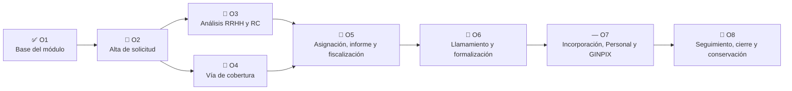
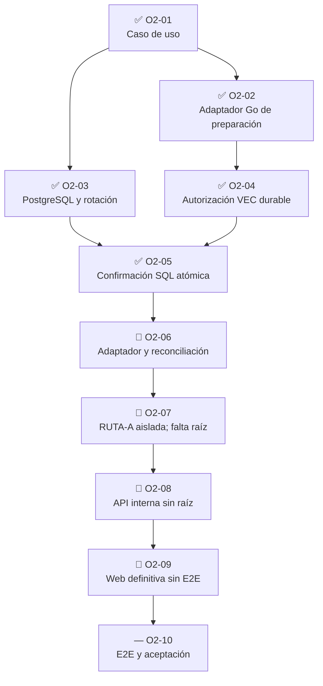

# Mapa de objetivos, tareas y paralelización

Última actualización: 31 de agosto de 2026.

Vista de dirección para revisar el avance del procedimiento de contratación
temporal. El detalle verificable de cada tarea está en el
[tablero de tareas](tablero_tareas_contratacion_temporal_2026-07-23.md).

Este checkpoint parte del producto publicado
`3a8550eac9324168594bc1e36378015922ec5c4b`. Sus métricas sustituyen las
afirmaciones vigentes de cortes anteriores; las genealogías técnicas que se
conservan más abajo son historia y no contadores actuales.

## Lectura rápida

| Indicador | Estado actual |
| --- | --- |
| Objetivo activo | `O2-06` — adaptador y reconciliación; `R3A` está integrado, pero no existe aún implementador productivo. |
| Camino crítico | `R3B` permanece como producción candidata separada y no integrada. El siguiente checkpoint sobre `R3B`/`R3C` solo se documentará cuando ambos estén integrados. |
| Primera vertical | `5/10` (`50 %`); `O2-06` continúa activa. |
| Cierre formal previo | `19/46` (`41,3 %`). |
| Cierre formal tras el checkpoint | `20/46` (`43,5 %`), solo después de integrar y publicar este corte y únicamente por `O6-02`. |
| Cierre técnico conservador | `22/46` (`47,8 %`). |
| Verticales E2E productivas | `0`. |
| Último producto publicado | `3a8550eac9324168594bc1e36378015922ec5c4b`; no se atribuye una CI no preservada. |
| Trabajo no contabilizado | `R3A`, `O5-rutas`, `O4C-P0` y `RUTA-A` son subcortes: no cierran `O2-06`, `O5-01`, `O4C-P1` ni `O2-07`/`O2-08`. |
| Bloqueos conservados | `O5-01` carece de raíz, persistencia y web; `O4C-P1` está bloqueado; `RUTA-A` está aislada sin raíz. |
| Aplicación arrancable | `NO`. |
| Producción | `NO-GO`; no se usarán datos reales. |

La primera vertical cuenta diez tareas O2. La cifra de 46 mide el procedimiento
temporal completo; ninguna representa por sí sola el porcentaje de todo VEP.
Las tareas no tienen un peso homogéneo: el formal previo `19/46` solo pasa a
`20/46` tras integrar y publicar este checkpoint. El cierre técnico `22/46`
no sustituye esa cuenta formal ni estima esfuerzo o tiempo restante.

La cadena que permite cerrar documentalmente `O6-02` consta de
`433df1f8`, `908e7907`, `02221b47`, `fc8ab461` y el candidato final
`d72254e`, integrado en `ca719021`. Es la única subida contable de este corte;
`O6-03` permanece abierto.

`R3A`, candidato `1babd86`, está integrado en `2b96b646`; fija una candidatura
técnica opaca, no un implementador productivo, y `O2-06` sigue en curso. Las
rutas de `O5-01`, candidato `ffc0717` integrado en `de2c9be8`, tampoco
acreditan raíz, persistencia o web. `O4C-P0`, candidato `5555885` con doble
`GO`, está integrado y publicado en `7945de3968c118633e3a15ba5a97145939050ffb`,
pero `O4C-P1` permanece bloqueado. `RUTA-A`, candidato `8bb15bcc` con `GO`,
está integrada y publicada en `3a8550eac9324168594bc1e36378015922ec5c4b`
sin composición raíz y no cierra `O2-07` ni `O2-08`.

### Contexto técnico histórico conservado

El desglose F0 y los hitos O4-05 que siguen pertenecen al corte histórico del
9 de agosto. Se mantienen para trazabilidad, pero no alteran las métricas ni el
orden vigente de este checkpoint.

O3-04 se contabiliza tras el corrector `2834783` y su
[GO independiente](revisiones/o3_04_revision_independiente_final_2026-07-24.md).
Sus incrementos anteriores permanecen trazados, incluido el `NO-GO` del
candidato `88d3250`; no se ha reescrito la historia para obtener el cierre.

O4-03 se contabiliza tras `f5f5f5a` y su `GO` independiente. Este cierre
acredita el orquestador nominal, no persistencia, `COMMIT`, consumo durable de
C1/C2 ni revocación viva; esas garantías corresponden a O4-04.

O4-04 se contabiliza tras `faa5a5f` y `5954c29`, la matriz completa sobre
PostgreSQL 18.4 y dos revisiones independientes finales. El cierre acredita
persistencia, autorización, auditoría, outbox, recibo y reconciliación; no
acredita todavía la composición HTTP ni el E2E visual, que pertenecen a
O4-05.

## Mapa de objetivos



O3 y O4 pueden desarrollarse en paralelo una vez estabilizado el patrón
durable de O2. O5 necesita ambos resultados. El contrato de integración de
Bolsa de O6 y el modelo canónico GINPIX de O7 pueden adelantarse sin activar
sus efectos.

## Mapa del camino crítico O2



O2-02, O2-03, O2-04 y O2-05 ya superaron revisión independiente. O2-03 demostró en
tres ejecuciones PostgreSQL reales la convivencia HMAC v1→v2, el replay
exacto, la concurrencia, las ACL y los límites de sentencia e inactividad.
O2-04 demostró que esa preparación solo puede ejecutarse tras una concesión
V3 durable, ligada al par HMAC activo exacto y sin autoridad reconstruida
desde el cliente.

`R3A` está integrado en `2b96b646`, pero solo fija la candidatura técnica
opaca. `R3B` no está integrado y O2-06 conserva su estado en curso. La
declaración `RUTA-A` publicada en `3a8550e` no compone la raíz y, por tanto,
no cierra O2-07 ni hace alcanzable O2-08.

## Olas de trabajo paralelo — planificación histórica

Las olas siguientes conservan el plan de construcción original. No sustituyen
el objetivo activo ni el orden de reanudación fijados en la lectura rápida.

### Ola 0 — cierre actual

| Carril | Tarea | Archivos principales | Dependencia | Integración |
| --- | --- | --- | --- | --- |
| Dirección | O1-04 | documentación de objetivos, tareas y relevo | O1-03 | Commit documental aislado. |
| Adaptador | O2-02 | `internal/modules/contrataciontemporal/adapters/postgres` y puerto de infraestructura | O2-01 | Unitarias, carrera y vet. |
| Base de datos | O2-03 | `deploy/postgresql/contratacion_temporal` | Contrato O2-01 | PostgreSQL real efímero, ACL y down protegido. |

Estos tres carriles no deben modificar los mismos ficheros salvo README,
estado y relevo, que actualiza únicamente el integrador.

### Ola 1 — tras publicar la ola 0

| Carril | Tarea | Puede avanzar junto a | Condición de entrega |
| --- | --- | --- | --- |
| Seguridad | O2-04 | O3-01, O4-01, O6-01 | Capacidad durable común de VEC; sin segunda autoridad local. |
| Dominio RRHH | O3-01 | O2-04, O4-01, O6-01 | Análisis/RC completo y probado, sin adaptadores. |
| Catálogos | O4-01 | O2-04, O3-01, O6-01 | Vías/comprobaciones versionadas sin recompilar. |
| Integración Bolsa | O6-01 | O2-04, O3-01, O4-01 | Solo contrato y eventos; sin tablas cruzadas. |

Cada carril usa un worktree propio. Seguridad no comparte ficheros con dominio
funcional. El integrador revisa y aplica los commits uno por uno.

### Ola 2 — contrato de autorización estabilizado

| Carril | Tarea | Dependencia |
| --- | --- | --- |
| PostgreSQL de efectos | O2-05 | O2-03 + O2-04 |
| Diseño de interfaz | parte visual de O2-09 | contrato de entrada/salida O2-01; no se simula autoridad |
| Conectores RRHH | O3-03 | O3-01 |
| Consultas de cobertura | O4-02 | O4-01 + O6-01 |
| Modelo GINPIX | O7-03 | especificación RRHH; sin activar envío |

La interfaz puede avanzar como presentación del mismo modelo, pero no se marca
conectada hasta O2-08. Los adaptadores DEMO permanecen en una composición
separada y no entran en la ruta real.

### Ola 3 — primer efecto durable

| Carril | Tarea | Dependencia |
| --- | --- | --- |
| Aplicación/PostgreSQL | O2-06 | O2-05 |
| Análisis RRHH | O3-02 | O3-01 |
| Cobertura | O4-03 | O4-01 + O4-02 |
| Firma documental | O5-02/O5-03, solo contrato inicial | conectores comunes ya existentes |

### Ola 4 — integración de la primera vertical

```text
O2-07 composición
      ↓
O2-08 API ─── revisión de seguridad
      ↓
O2-09 web ─── revisión visual y accesibilidad
      ↓
O2-10 E2E ─── aceptación RRHH
```

La secuencia final es deliberadamente lineal: evita que una pantalla o una API
oculten una composición aún falsa.

## Regla productor–revisor–integrador

Cada tarea admite hasta tres trabajos distintos:

| Función | Puede modificar | No puede hacer |
| --- | --- | --- |
| Productor | Solo el alcance declarado de la tarea y sus pruebas. | Integrar su propio trabajo en la rama de convergencia. |
| Revisor | Pruebas adicionales, informe y correcciones en commit separado si se autorizan. | Rebajar requisitos o declarar aceptación funcional. |
| Integrador | Documentación transversal, resolución de conflictos y commit/merge final. | Omitir una puerta fallida por ganar tiempo. |

El revisor debe ser distinto del productor para seguridad, PostgreSQL,
autorización, documentos/firma y fronteras HTTP.

## Ficha mínima visible por tarea

Cada fila del tablero se actualizará con:

```text
ID:
objetivo:
estado:
responsable/productor:
revisor:
dependencias:
resultado:
pruebas:
commit:
incidencias:
siguiente tarea desbloqueada:
```

El campo responsable identifica el trabajo, no concede un rol de aplicación.

## Cómo calcular el avance

Se publican tres planos que no se sustituyen entre sí:

1. **Cierre formal:** exige integración, publicación y autoridades aplicables.
2. **Cierre técnico:** reconoce capacidades verificadas dentro de su alcance,
   sin convertirlas automáticamente en cierres formales.
3. **Verticales E2E productivas:** solo cuenta recorridos completos con raíz y
   dependencias reales. El progreso `5/10` de la primera vertical se informa
   aparte y no equivale a una vertical productiva.

Estado del checkpoint:

| Medida | Avance | Qué significa |
| --- | --- | --- |
| Primera vertical O2 | `5/10` (`50 %`) | O2-06 sigue activa; R3A no es un implementador productivo. |
| Formal previo | `19/46` (`41,3 %`) | Autoridad contable anterior a este checkpoint. |
| Formal tras checkpoint | `20/46` (`43,5 %`) | Solo tras integrar y publicar este corte; el único incremento es O6-02. |
| Técnico conservador | `22/46` (`47,8 %`) | Incluye capacidades técnicas verificadas sin convertir subcortes en cierres formales. |
| Verticales E2E productivas | `0` | No hay recorrido productivo completo ni aplicación arrancable. |

Como historia del corte del 9 de agosto, O4-05 conservaba tres de cinco hitos
oficiales. Su trabajo interno acreditado incluía:

```text
  oficiales: adaptador, HTTP, cliente, registro modular, proyecciones
  protegidas de cuadro/detalle, contrato y consumidores nominales VEC-AD-3,
  registro durable de accesos, publicación global estable, infraestructura de
  cursor, composición visual gobernada, registrador v2 CT 000039 y contrato
  tipado CT 000040, cánones Go, Recibo V2, vocabulario de seis estados de CT
  000041, cánones SQL 000042, prueba durable 000043, corrector 000043A, motor
  privado 000044, fachadas nominales 000045 y adaptador Go 000046 están
  verdes; HTTP cuadro/detalle también está cerrado y revisado, pero
  C1, el rol mínimo C2.1a y la fachada C2.1b también están cerrados y
  revisados; S0.1, S0.2, organización y vínculo de C2.2 están cerrados e
  integrados; el contrato C2.3-D0 está cerrado, mientras su implementación
  F0/R0/M5–M7, selección/recibo C2.4, fachada/reconciliación C2.5, PDP, raíz,
  TLS y E2E siguen abiertos
Web RRHH: revisión visual local superada; O2-09 sigue abierta por O2-07/O2-10
```

En ese corte histórico, el contador técnico F0 contenía exactamente 23
minitareas: H0, H0a, H0b, V0,
A1, A2, A3, A4, B1, B2, C1, C2, C3, R1, R2a, R2b, T1, T2, P0, Q1, Q2, Q3 e I0.
Las diez primeras cerradas son H0, H0a, V0, A1, A2, A3, A4, B1, B2 y C1.
La estructura aislada de H0b y la activación C4a no añaden una undécima: el
flujo exterior ya está activo, pero H0b sigue abierto hasta cerrar C4b–C4d.
Solo dirección incrementa este contador después de integrar una minitarea
funcional completa con revisión independiente.

El experimento de catálogo operativo CONFIG-CAT-01 quedó
[rechazado y aislado](revisiones/revision_config_cat_01_2026-08-02.md). No
modifica estas métricas ni la rama estable.

Una tarea local no cuenta como cerrada hasta que el commit esté publicado y el
tablero contenga su evidencia.

## Actualización obligatoria

Al cerrar cualquier tarea, el integrador actualiza en el mismo corte:

1. estado de la tarea;
2. hash del commit;
3. prueba ejecutada;
4. tareas desbloqueadas;
5. indicador de puertas si realmente cambia;
6. relevo para el siguiente agente.
