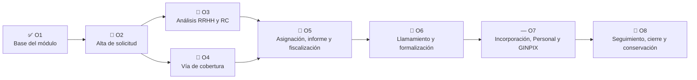
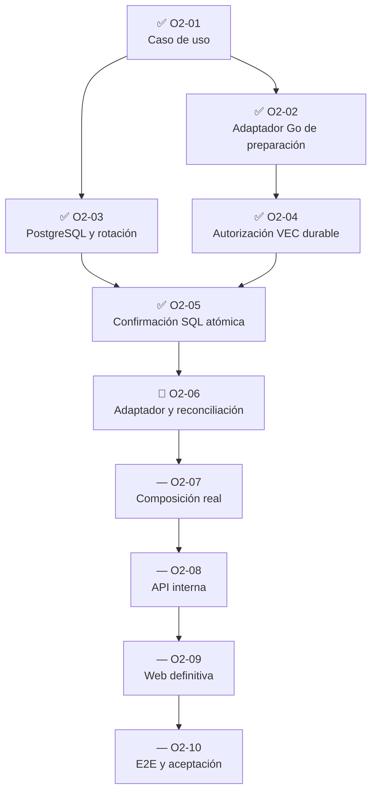

# Mapa de objetivos, tareas y paralelización

Última actualización: 26 de julio de 2026.

Vista de dirección para revisar el avance del procedimiento de contratación
temporal. El detalle verificable de cada tarea está en el
[tablero de tareas](tablero_tareas_contratacion_temporal_2026-07-23.md).

## Lectura rápida

| Indicador | Estado actual |
| --- | --- |
| Objetivo activo | O4-05 — composición, API, web y E2E de la decisión de cobertura |
| Camino crítico | O4-05 composición raíz con dependencias reales → proyecciones protegidas → E2E; O5-01 PostgreSQL puede avanzar en paralelo |
| Primera vertical | 5 de 10 tareas cerradas (50 %); O2-06 es el siguiente cierre |
| Procedimiento completo | 19 de 46 tareas cerradas (41 %); O4-04 tiene doble `GO` independiente |
| Último commit verificado | `4714088` — composición visual y catálogos RRHH gobernados con `GO` independiente |
| Trabajo local en revisión | La acreditación por conexión del lector PostgreSQL está en corrección tras un `NO-GO` técnico por sustitución de función y ventana TOCTOU; composición de dependencias y E2E HTTP permanecen abiertos. |
| Bloqueo externo actual | Ninguno para programar; producción sigue sujeta a las conformidades formales |
| Producción | No autorizada; no se usarán datos reales |

La primera cifra mide las diez tareas de O2. La segunda mide las 46 tareas del
procedimiento temporal completo; ninguna representa por sí sola el porcentaje
de todo VEP.

O3-04 se contabiliza tras el corrector `2834783` y su
[GO independiente](revisiones/o3_04_revision_independiente_final_2026-07-24.md).
Sus incrementos anteriores permanecen trazados, incluido el `NO-GO` del
candidato `88d3250`; no se ha reescrito la historia para obtener el cierre.

O4-03 se contabiliza tras `f5f5f5a` y su `GO` independiente. Este cierre
acredita el orquestador nominal, no persistencia, `COMMIT`, consumo durable de
C1/C2 ni revocación viva; esas garantías corresponden a O4-04.

O4-04 se contabiliza tras `faa5a5f` y `5954c29`, la matriz completa sobre
PostgreSQL 18.4 y dos revisiones independientes finales. El cierre acredita
persistencia, autorización, auditoría, outbox, recibo y reconciliación; no
acredita todavía la composición HTTP ni el E2E visual, que pertenecen a
O4-05.

## Mapa de objetivos



O3 y O4 pueden desarrollarse en paralelo una vez estabilizado el patrón
durable de O2. O5 necesita ambos resultados. El contrato de integración de
Bolsa de O6 y el modelo canónico GINPIX de O7 pueden adelantarse sin activar
sus efectos.

## Mapa del camino crítico O2



O2-02, O2-03, O2-04 y O2-05 ya superaron revisión independiente. O2-03 demostró en
tres ejecuciones PostgreSQL reales la convivencia HMAC v1→v2, el replay
exacto, la concurrencia, las ACL y los límites de sentencia e inactividad.
O2-04 demostró que esa preparación solo puede ejecutarse tras una concesión
V3 durable, ligada al par HMAC activo exacto y sin autoridad reconstruida
desde el cliente.

## Olas de trabajo paralelo

### Ola 0 — cierre actual

| Carril | Tarea | Archivos principales | Dependencia | Integración |
| --- | --- | --- | --- | --- |
| Dirección | O1-04 | documentación de objetivos, tareas y relevo | O1-03 | Commit documental aislado. |
| Adaptador | O2-02 | `internal/modules/contrataciontemporal/adapters/postgres` y puerto de infraestructura | O2-01 | Unitarias, carrera y vet. |
| Base de datos | O2-03 | `deploy/postgresql/contratacion_temporal` | Contrato O2-01 | PostgreSQL real efímero, ACL y down protegido. |

Estos tres carriles no deben modificar los mismos ficheros salvo README,
estado y relevo, que actualiza únicamente el integrador.

### Ola 1 — tras publicar la ola 0

| Carril | Tarea | Puede avanzar junto a | Condición de entrega |
| --- | --- | --- | --- |
| Seguridad | O2-04 | O3-01, O4-01, O6-01 | Capacidad durable común de VEC; sin segunda autoridad local. |
| Dominio RRHH | O3-01 | O2-04, O4-01, O6-01 | Análisis/RC completo y probado, sin adaptadores. |
| Catálogos | O4-01 | O2-04, O3-01, O6-01 | Vías/comprobaciones versionadas sin recompilar. |
| Integración Bolsa | O6-01 | O2-04, O3-01, O4-01 | Solo contrato y eventos; sin tablas cruzadas. |

Cada carril usa un worktree propio. Seguridad no comparte ficheros con dominio
funcional. El integrador revisa y aplica los commits uno por uno.

### Ola 2 — contrato de autorización estabilizado

| Carril | Tarea | Dependencia |
| --- | --- | --- |
| PostgreSQL de efectos | O2-05 | O2-03 + O2-04 |
| Diseño de interfaz | parte visual de O2-09 | contrato de entrada/salida O2-01; no se simula autoridad |
| Conectores RRHH | O3-03 | O3-01 |
| Consultas de cobertura | O4-02 | O4-01 + O6-01 |
| Modelo GINPIX | O7-03 | especificación RRHH; sin activar envío |

La interfaz puede avanzar como presentación del mismo modelo, pero no se marca
conectada hasta O2-08. Los adaptadores DEMO permanecen en una composición
separada y no entran en la ruta real.

### Ola 3 — primer efecto durable

| Carril | Tarea | Dependencia |
| --- | --- | --- |
| Aplicación/PostgreSQL | O2-06 | O2-05 |
| Análisis RRHH | O3-02 | O3-01 |
| Cobertura | O4-03 | O4-01 + O4-02 |
| Firma documental | O5-02/O5-03, solo contrato inicial | conectores comunes ya existentes |

### Ola 4 — integración de la primera vertical

```text
O2-07 composición
      ↓
O2-08 API ─── revisión de seguridad
      ↓
O2-09 web ─── revisión visual y accesibilidad
      ↓
O2-10 E2E ─── aceptación RRHH
```

La secuencia final es deliberadamente lineal: evita que una pantalla o una API
oculten una composición aún falsa.

## Regla productor–revisor–integrador

Cada tarea admite hasta tres trabajos distintos:

| Función | Puede modificar | No puede hacer |
| --- | --- | --- |
| Productor | Solo el alcance declarado de la tarea y sus pruebas. | Integrar su propio trabajo en la rama de convergencia. |
| Revisor | Pruebas adicionales, informe y correcciones en commit separado si se autorizan. | Rebajar requisitos o declarar aceptación funcional. |
| Integrador | Documentación transversal, resolución de conflictos y commit/merge final. | Omitir una puerta fallida por ganar tiempo. |

El revisor debe ser distinto del productor para seguridad, PostgreSQL,
autorización, documentos/firma y fronteras HTTP.

## Ficha mínima visible por tarea

Cada fila del tablero se actualizará con:

```text
ID:
objetivo:
estado:
responsable/productor:
revisor:
dependencias:
resultado:
pruebas:
commit:
incidencias:
siguiente tarea desbloqueada:
```

El campo responsable identifica el trabajo, no concede un rol de aplicación.

## Cómo calcular el avance

Se publican dos métricas:

1. **Puertas funcionales:** porcentaje principal. Solo avanza cuando existe una
   pieza completa del recorrido.
2. **Tareas verificadas:** indicador operativo. Sirve para saber carga y
   paralelización, pero no se presenta como porcentaje de producto.

Estado actual:

```text
O2: 3/7 puertas funcionales publicadas = 43 %
Tareas verificadas del procedimiento: 19/46 = 41 %
Tareas locales en revisión: candidatas O2-06/O5-01; O4-05 conserva 3/5 hitos
  oficiales: adaptador, HTTP, cliente, registro modular, proyecciones
  protegidas de cuadro/detalle, contrato y consumidores nominales VEC-AD-3,
  registro durable de accesos, publicación global estable y composición
  visual gobernada están verdes de forma aislada, pero cursor, funciones
  exteriores, raíz productiva, adaptadores reales y E2E siguen abiertos
Web RRHH: revisión visual local superada; O2-09 sigue abierta por O2-07/O2-10
```

Una tarea local no cuenta como cerrada hasta que el commit esté publicado y el
tablero contenga su evidencia.

## Actualización obligatoria

Al cerrar cualquier tarea, el integrador actualiza en el mismo corte:

1. estado de la tarea;
2. hash del commit;
3. prueba ejecutada;
4. tareas desbloqueadas;
5. indicador de puertas si realmente cambia;
6. relevo para el siguiente agente.
